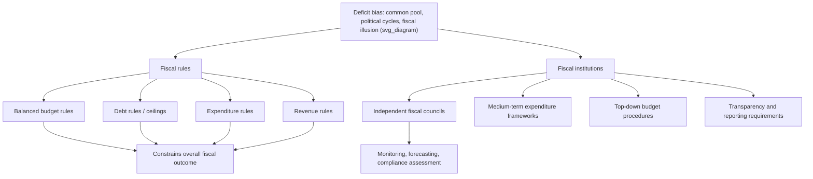

## Fiscal Rules and Fiscal Institutions

### Definition and Core Purpose

**Fiscal rules** are numerical, legally or constitutionally binding constraints on key fiscal aggregates — typically the budget balance, debt level, expenditure growth, or revenue — designed to impose durable discipline on fiscal policymakers and counteract the systematic deficit bias that arises from political-economy incentives. **Fiscal institutions** are the broader set of procedural, organizational, and analytical bodies (independent fiscal councils, budget offices, medium-term expenditure frameworks) that support, monitor, and enforce these rules, or that structure the budget process itself to improve fiscal outcomes even absent a hard numerical rule.

Together, fiscal rules and institutions constitute a country's **fiscal governance framework** — the rules-based and institutional architecture governing how budgetary decisions are made, constrained, and monitored over time.

### Rationale: The Deficit Bias Problem

Fiscal rules exist primarily as a response to well-documented political-economy mechanisms that generate a systematic bias toward excessive deficits and debt accumulation relative to the social optimum:

- **Common pool problem**: When multiple political actors (ministries, coalition partners, legislators representing different constituencies) draw on a shared general revenue pool, each internalizes the full benefit of "their" spending but only a fraction of the aggregate tax cost, leading to over-spending relative to the collectively optimal level (Weingast, Shepsle, and Johnsen, 1981; von Hagen and Harden, 1995).
- **Intergenerational externality**: Current voters and politicians do not fully internalize the cost borne by future, non-voting generations, creating an incentive to shift fiscal burdens forward via debt financing (related to, but distinct from, the failure of Ricardian Equivalence).
- **Electoral/political budget cycles**: Incumbents facing elections have incentives to loosen fiscal policy before elections to boost short-run economic conditions and re-election prospects (Rogoff, 1990; Alesina and Roubini, 1992), even where this is fiscally suboptimal over the cycle.
- **Fiscal illusion**: Voters may systematically underestimate the true cost of debt-financed spending relative to visible, current taxation, weakening the political discipline that would otherwise restrain deficit spending.
- **Strategic debt accumulation**: Incumbent governments uncertain about retaining power may strategically over-borrow to constrain the policy choices available to a potential successor government of a different political orientation (Alesina and Tabellini, 1990; Persson and Svensson, 1989).

### Diagram: Fiscal Governance Architecture

### Taxonomy of Fiscal Rules

**1. Budget Balance Rules**

Constrain the overall, primary, or structural fiscal balance, either requiring balance or capping the deficit as a share of GDP.

- *Example*: The EU's Stability and Growth Pact (SGP) historically required euro-area member states to keep the headline deficit below 3% of GDP and debt below 60% of GDP (the "Maastricht criteria"), later supplemented by the Fiscal Compact's structural balance rule.
- **Cyclically adjusted (structural) balance rules** target the balance net of automatic stabilizer effects (see the Automatic Stabilizers topic), avoiding forced pro-cyclical tightening during downturns.

**2. Debt Rules**

Set an explicit ceiling or target path for the public debt-to-GDP ratio.

- *Example*: The 60% of GDP debt ceiling under the EU's Maastricht framework; various U.S. state constitutional debt limits.

**3. Expenditure Rules**

Cap the growth rate or level of government spending (sometimes total, sometimes excluding certain categories like interest payments or specific mandated programs), independent of revenue fluctuations.

- *Example*: The Netherlands' multi-year expenditure ceilings; Sweden's central government expenditure ceiling system.
- [Inference] Expenditure rules are often considered by fiscal-institution researchers to be relatively easier to monitor and enforce in real time than balance rules, since spending is more directly observable and controllable in-year than revenue, which fluctuates with the business cycle.

**4. Revenue Rules**

Constrain the use of revenue windfalls (e.g., requiring that above-forecast revenue be saved or used for debt reduction rather than new spending), often paired with balanced-budget or debt rules to prevent circumvention during boom periods.

**5. Debt Brakes (Hybrid Structural Rules)**

Combine elements of structural balance and debt targeting into a single formula-driven constraint.

- *Example*: Germany's **Schuldenbremse** (debt brake), constitutionally enshrined in 2009, limits the federal structural deficit to 0.35% of GDP (with an escape clause for exceptional circumstances such as natural disasters or severe recessions, subject to legislative approval and a repayment schedule); Switzerland's debt brake, in place since 2003, requires that cyclically adjusted expenditure not exceed cyclically adjusted revenue over the cycle.

### Second-Generation and Country-Specific Rule Examples

- **Chile's Structural Balance Rule**: Targets a structural fiscal balance calculated using independently estimated long-run copper price and trend GDP assumptions (reviewed by independent expert panels), widely cited as a model for insulating fiscal policy from commodity price volatility in resource-dependent economies.
- **United Kingdom**: Has cycled through several fiscal rule frameworks since the late 1990s (the "Golden Rule" limiting borrowing to capital investment over the cycle, followed by various debt-falling and deficit-target rules under subsequent governments), illustrating the frequent revision and political contestability of specific rule designs even where the underlying commitment to some rule persists.
- **U.S. State Balanced-Budget Requirements**: Nearly all U.S. states have constitutional or statutory balanced-budget requirements for their general/operating funds (though these often exclude capital budgets and vary considerably in strictness and enforcement mechanism), a long-standing and heavily studied feature of U.S. subnational fiscal federalism.

### Design Trade-offs: Rigidity versus Flexibility

| Design Dimension | Rigid/Simple Rules | Flexible/Sophisticated Rules |
| --- | --- | --- |
| Example | Fixed nominal balanced-budget requirement | Cyclically adjusted structural balance target |
| Advantage | Easy to monitor, hard to circumvent, high credibility | Avoids forcing pro-cyclical tightening in recessions |
| Disadvantage | Can force damaging pro-cyclical austerity during downturns | Requires uncertain output-gap estimation; easier to manipulate/game |
| Escape clauses | Typically absent or very narrow | Often include explicit escape clauses for emergencies |
| Enforcement | Simple compliance check | Requires independent, credible institutional verification |

[Inference] A central and recurring finding in the fiscal rules literature is that the credibility and durability of a rule depends heavily on this rigidity-flexibility trade-off: rules that are too rigid invite crisis-driven suspension or non-compliance, while rules that are too flexible (with wide escape clauses or manipulable adjustment methodologies) can be circumvented and lose disciplining power.

### Fiscal Institutions: Independent Fiscal Councils

**Independent Fiscal Institutions (IFIs)**, sometimes called Fiscal Councils, are non-partisan public bodies tasked with providing independent analysis, forecasts, and/or compliance monitoring of fiscal policy, distinct from both the executive budget office and partisan legislative bodies.

**Core functions typically include:**

- Producing independent macroeconomic and fiscal forecasts (removing incentive for governments to use optimistic forecasts to justify looser policy — the "rosy scenario" problem)
- Assessing compliance with fiscal rules and providing public reporting
- Costing new policy proposals (e.g., legislation, budget proposals) on a nonpartisan basis
- Conducting long-term fiscal sustainability analysis

**Prominent examples:**

- **U.S. Congressional Budget Office (CBO)**: Established 1974, provides nonpartisan budget and economic analysis, cost estimates ("scores") for legislation, and long-term fiscal projections for the U.S. Congress.
- **UK Office for Budget Responsibility (OBR)**: Established 2010, provides independent economic and fiscal forecasts underlying UK budget decisions and formally assesses the government's performance against its fiscal targets.
- **EU Member State Independent Fiscal Institutions**: The EU's "Two-Pack" and "Six-Pack" legislative reforms (post-2011 euro crisis) mandated that member states establish independent fiscal councils to monitor compliance with EU and national fiscal rules.
- **Sweden's Fiscal Policy Council**, **Netherlands' Bureau for Economic Policy Analysis (CPB)**: Long-standing independent fiscal/economic analysis bodies frequently cited as institutional models.

### Medium-Term Expenditure Frameworks (MTEFs)

MTEFs extend the budget planning horizon beyond a single fiscal year (typically 3–5 years), embedding multi-year expenditure ceilings, macroeconomic projections, and policy costing into the budget process. This is intended to:

- Improve predictability for spending ministries and reduce short-termism
- Make explicit the multi-year fiscal implications of current policy decisions
- Provide a structural anchor against which annual budgets are assessed for consistency

### Top-Down versus Bottom-Up Budget Procedures

A key procedural (non-numerical-rule) fiscal institution design choice, studied extensively in the political-economy budget literature (von Hagen, Hallerberg):

- **Bottom-up procedures**: Individual line ministries independently propose their spending needs, which are then aggregated, often resulting in an initial aggregate that exceeds any fiscally sustainable total and requires subsequent, politically costly, top-down cuts.
- **Top-down procedures**: An aggregate spending ceiling (often informed by a finance ministry or fiscal council) is set first, and only then is that fixed envelope allocated across ministries/programs, embedding a hard aggregate constraint at the earliest stage of the process. [Inference] Top-down procedures are generally found in the fiscal-institutions literature to be more effective at containing deficit bias, since they resolve the "common pool" collective-action problem structurally, by design, rather than relying on ex-post political negotiation.

### Enforcement Mechanisms and Compliance

The effectiveness of any fiscal rule depends critically on its enforcement architecture, not merely its numerical specification:

- **Legal/constitutional status**: Constitutionally enshrined rules (e.g., Germany's debt brake) are generally harder to circumvent than simple statutory rules subject to ordinary legislative amendment.
- **Correction mechanisms**: Automatic or quasi-automatic triggers requiring corrective action when a rule is breached (e.g., mandated deficit-reduction plans).
- **Sanctions**: Financial penalties (as under the EU's Excessive Deficit Procedure) or reputational/market-based consequences (higher sovereign borrowing costs) for non-compliance.
- **Escape clauses**: Formal provisions allowing temporary suspension of the rule under defined exceptional circumstances (severe recessions, natural disasters, pandemics), balancing credibility against the need for flexibility during genuine crises — the COVID-19 pandemic triggered escape-clause activation in numerous jurisdictions including the EU's SGP general escape clause (activated 2020).

### Empirical Evidence on Fiscal Rule Effectiveness

- Cross-country panel studies (IMF, European Commission, academic literature) generally find that the presence of numerical fiscal rules is associated with **lower deficits and slower debt accumulation**, though the magnitude and robustness of this relationship [Unverified: estimates vary substantially by study, sample period, and methodology] depends heavily on rule design quality, enforcement strength, and the presence of supporting independent fiscal institutions rather than the mere existence of a rule on paper.
- **Compliance rates** with rules such as the EU's SGP have historically been mixed, with the framework revised multiple times (2005, 2011 "Six-Pack," 2013 "Two-Pack," and a substantial 2024 reform) partly in response to observed compliance and flexibility shortcomings — illustrating that fiscal rules are typically iteratively refined institutions rather than static, permanently fixed constraints.
- [Inference] A recurring theme in the empirical literature is that fiscal rules are most effective when combined with strong independent monitoring institutions and genuine political ownership/commitment, rather than functioning as a substitute for underlying political will to achieve fiscal discipline.

### Criticisms and Limitations of Fiscal Rules

**Pro-cyclicality risk**: Rigid, unadjusted balance rules can force damaging spending cuts or tax increases precisely during recessions (when automatic stabilizers are widening the deficit), amplifying rather than dampening the business cycle — a major criticism leveled at the original, insufficiently cyclically-adjusted SGP framework, particularly during the 2010–2013 Eurozone crisis period.

**Gaming and circumvention**: Governments facing binding rules have historically employed creative accounting (off-budget vehicles, one-off/temporary measures classified as structural improvements, asset sales counted as revenue, public-private partnerships structured to keep liabilities off the official balance sheet) to nominally comply with rules while not genuinely improving underlying fiscal sustainability.

**Excessive rigidity versus insufficient credibility trade-off**: As noted above, rules flexible enough to accommodate legitimate shocks are often also flexible enough to be circumvented for purely political reasons, while rules rigid enough to resist circumvention often lack the flexibility needed during genuine emergencies.

**One-size-fits-all critique**: Uniform numerical thresholds (e.g., a flat 3%-of-GDP deficit limit or 60%-of-GDP debt ceiling applied across heterogeneous economies, as under the original Maastricht framework) may be poorly calibrated to the different growth rates, debt-servicing costs, and fiscal capacities of diverse member states or subnational units.

**Investment bias distortion**: Balance rules that do not distinguish between current and capital expenditure may create an incentive to under-invest in productive long-term public capital in order to meet a short-run balance target — part of the rationale behind "golden rule" designs that exempt capital investment from the constraint.

### Fiscal Rules and Debt Sustainability Analysis

Fiscal rules are typically calibrated with reference to formal debt sustainability analysis, using the debt dynamics equation:

$$b_t = b_{t-1} \cdot \frac{1+r}{1+g} - s_t$$

where $b_t$ is the debt-to-GDP ratio, $r$ is the effective interest rate on debt, $g$ is the nominal GDP growth rate, and $s_t$ is the primary surplus-to-GDP ratio. Fiscal rules aim to constrain policy such that this dynamic remains stable or converges to a sustainable target debt ratio, particularly important when $r > g$, a condition under which debt accumulates automatically absent sufficient primary surpluses.

### Conclusion

Fiscal rules and fiscal institutions constitute the architecture through which governments attempt to durably counteract the well-documented political-economy forces generating systematic deficit bias — common pool problems, political budget cycles, fiscal illusion, and strategic debt accumulation. Effective fiscal governance typically combines a well-designed numerical rule (balanced against the competing demands of rigidity for credibility and flexibility for legitimate cyclical/emergency accommodation) with supporting institutions such as independent fiscal councils, medium-term expenditure frameworks, and top-down budget procedures. Empirical evidence broadly supports the disciplining effect of well-enforced rules, while also highlighting persistent challenges around pro-cyclicality, circumvention, and the difficulty of designing rules that are simultaneously credible, flexible, and appropriately tailored to heterogeneous economic circumstances.

### Related Topics

- Automatic Stabilizers and Countercyclical Fiscal Policy
- Cyclically Adjusted (Structural) Budget Balance Methodology
- Debt Sustainability Analysis and the $r > g$ Condition
- Common Pool Problem and Political Economy of Deficit Bias
- Political Budget Cycles (Rogoff, Alesina-Roubini)
- EU Stability and Growth Pact and Excessive Deficit Procedure
- Independent Fiscal Councils (CBO, OBR, EU Fiscal Boards)
- Golden Rule of Public Finance (Capital vs. Current Expenditure)
- Medium-Term Expenditure Frameworks and Top-Down Budgeting
- Deficit Financing versus Tax Financing