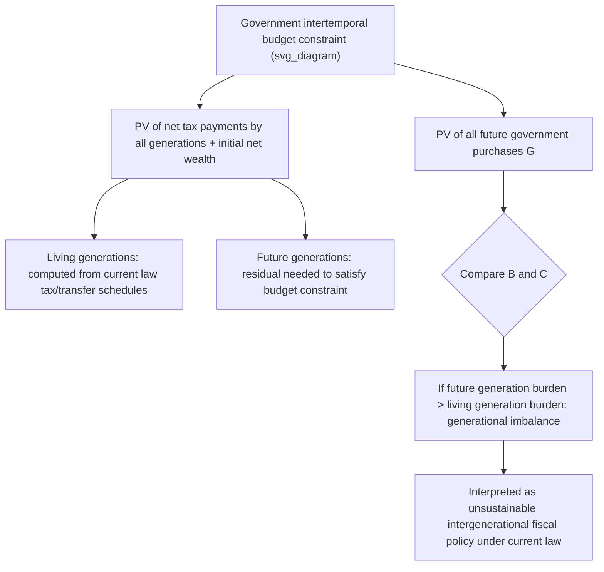

## Generational Accounting

### Definition and Core Concept

**Generational accounting** is a methodology for measuring the fiscal burden that current government policy imposes on different generations, both living and future, by calculating each generation's **net fiscal liability** — the present value of taxes it will pay to government over its remaining lifetime minus the present value of transfers/benefits it will receive. Developed primarily as an alternative and complement to the conventional deficit and debt-to-GDP ratio, generational accounting was designed to reveal the intergenerational distributional implications of fiscal policy that standard flow-based budget measures obscure.

The methodology was pioneered by **Alan Auerbach, Jagadeesh Gokhale, and Laurence Kotlikoff** in a series of papers beginning in the early 1990s (Auerbach, Gokhale, and Kotlikoff, 1991, 1994), motivated by the observation that the conventional budget deficit is an essentially arbitrary accounting construct that can be manipulated by relabeling transactions (e.g., calling a tax a "loan" or a borrowing a "contribution") without changing the underlying economics — a critique closely related to, but distinct from, the logic of Ricardian Equivalence.

### Motivation: Limitations of Conventional Deficit Accounting

- **Labeling arbitrariness**: Auerbach, Gokhale, and Kotlikoff argued that the conventional deficit depends on essentially arbitrary accounting labels (e.g., whether a payment is called a "tax" versus a "loan repayment," or a receipt is called a "transfer" versus a "user fee") that do not affect real economic behavior but do affect the measured deficit — meaning the deficit itself is not a well-defined economic concept.
- **No forward-looking dimension**: The conventional deficit is a backward- and current-looking flow measure; it does not capture the present value of unfunded future obligations embedded in current law, such as Social Security, Medicare, or public pension promises to specific age cohorts.
- **Ignores implicit liabilities**: Programs that are pay-as-you-go (PAYGO) financed, such as most public pension systems, generate substantial implicit future liabilities that do not appear on the government's conventional balance sheet or in the deficit figure, even though they represent real, largely binding future fiscal commitments.

### Formal Methodology

**Step 1: Define the generational account**

For a generation born in year $k$, its generational account $N_k$ is the present value, as of a base year, of all net taxes (taxes paid minus transfers received) that members of that generation will pay over their remaining lifetime:

$$N_{k,t} = \sum_{s=t}^{k+D} T_{k,s} \cdot P_{k,s} \cdot \frac{1}{(1+r)^{s-t}}$$

where $T_{k,s}$ is the average net tax paid per surviving member of generation $k$ in year $s$, $P_{k,s}$ is the number of surviving members of generation $k$ in year $s$, $D$ is the maximum lifespan, $r$ is the discount rate, and $t$ is the base year.

**Step 2: Impose the government's intertemporal budget constraint**

Generational accounting requires that the present value of all current and future generations' net tax payments, plus initial government net wealth, equal the present value of all future government purchases:

$$\sum_{k=-D}^{t} N_{k,t} + \sum_{k=t+1}^{\infty} N_{k,t} + W_t = \sum_{s=t}^{\infty} \frac{G_s}{(1+r)^{s-t}}$$

where $W_t$ is government net wealth in the base year and $G_s$ is government purchases (consumption plus investment) in year $s$. This is the same underlying government intertemporal budget constraint discussed in the Deficit Financing versus Tax Financing topic, but generational accounting decomposes the revenue side by generation rather than treating it as an aggregate.

**Step 3: Compute the "residual" burden on future generations**

Generational accounts for living generations are calculated directly from current tax and transfer schedules projected forward under current law. The residual — whatever present-value fiscal gap remains after accounting for all living generations' projected net payments — is then assigned to **future generations** (those not yet born as of the base year), typically expressed as the payment they would need to make, growing at the economy's growth rate, to satisfy the government's budget constraint.

### Diagram: Generational Accounting Logic

### The Generational Imbalance Measure

A central output of generational accounting exercises is the comparison between the **net tax rate** (or lifetime net burden) facing a representative member of a current generation (e.g., those born in the base year) and the imputed net tax rate facing future generations under the residual calculation. A finding that future generations face a **substantially higher** implied net tax burden than current newborns is interpreted as evidence of **generational imbalance** — current policy is fiscally unsustainable and implies either future tax increases, future benefit cuts, or ongoing debt accumulation that further compounds the burden shifted forward.

### Key Applications and Historical Findings

**United States**

Early generational accounting studies by Auerbach, Gokhale, and Kotlikoff, and subsequent extensions (including periodic exercises by the U.S. Office of Management and Budget in the 1990s Analytical Perspectives volumes, before the methodology was later discontinued from official OMB publications), generally found substantial generational imbalances driven primarily by unfunded Medicare and Social Security obligations, suggesting future generations faced significantly higher net tax burdens than then-current generations under unchanged policy. [Inference] The precise magnitude of estimated imbalances varies considerably across studies depending on discount rate assumptions, demographic projections, and the specific vintage of the underlying fiscal projections, so headline figures should be read as illustrative of the direction and rough scale of imbalance rather than precise point estimates.

**International Applications**

Generational accounting exercises have been conducted for numerous countries including Germany, Italy, Japan, Norway, and others, generally as part of an internationally coordinated research effort in the 1990s (a series of country studies compiled in Auerbach, Kotlikoff, and Leibfritz, 1999, *Generational Accounting Around the World*). Findings across countries varied considerably depending on demographic structure (particularly population aging trajectories) and the generosity/financing structure of public pension and health systems.

### Related and Successor Concept: The Fiscal Gap

Because generational accounting proved methodologically complex and somewhat opaque to communicate, a simplified, closely related summary statistic — the **fiscal gap** — became more commonly used in subsequent long-term fiscal sustainability analysis (notably by Kotlikoff and Gokhale in later independent work, and conceptually related to the "75-year actuarial imbalance" figures regularly published by the Social Security and Medicare Trustees). The fiscal gap is defined as the immediate and permanent increase in taxes (or reduction in spending), expressed as a constant share of GDP, that would be required to satisfy the government's intertemporal budget constraint given projected demographic and policy trends:

$$FiscalGap = \frac{PV(G) - PV(T) - W_t}{PV(GDP)}$$

This single-number summary avoids some of the complexity of full generation-by-generation accounting while preserving the essential forward-looking, present-value logic.

### Relationship to Ricardian Equivalence

Generational accounting and Ricardian Equivalence are related but analytically distinct frameworks addressing similar underlying questions about intergenerational fiscal burden:

- **Ricardian Equivalence** asks whether the *timing* of taxation (debt versus current taxes) affects real economic behavior, under the assumption that altruistic bequest motives link generations into an effectively single decision-making unit.
- **Generational accounting** does not assume operative Ricardian altruism; rather, it explicitly measures the *distributional* incidence of the burden across distinct generations as an accounting/descriptive exercise, remaining agnostic about whether households will behaviorally offset the measured imbalance through private saving or bequest adjustments.
- [Inference] If Ricardian Equivalence held perfectly with fully operative intergenerational altruism, the welfare implications of a measured generational imbalance would be substantially mitigated, since parents would voluntarily transfer resources to offset the burden facing their descendants; generational accounting's policy relevance is therefore generally considered strongest precisely in the more empirically realistic scenarios where Ricardian offsetting is partial or absent.

### Key Points: Strengths of the Methodology

- **Forward-looking and comprehensive**: Captures implicit unfunded liabilities (pension and health entitlement promises) that conventional deficit/debt figures omit entirely.
- **Label-invariant**: Because it is built from the underlying intertemporal government budget constraint rather than period-by-period accounting flows, it is largely immune to the labeling manipulations that can distort conventional deficit figures.
- **Explicit intergenerational focus**: Directly quantifies which generations bear the burden of current policy, information not readily extractable from aggregate debt or deficit statistics.
- **Policy diagnostic value**: Highlights the scale of adjustment (tax increases or spending cuts) required for long-run fiscal sustainability, informing debates over entitlement reform, retirement age changes, and tax policy design.

### Limitations and Critiques

**Sensitivity to discount rate and growth assumptions**

[Inference] Generational account calculations are highly sensitive to the assumed discount rate $r$ and projected GDP/wage growth rate, given the very long (often 75+ year or infinite-horizon) projection periods involved; modest changes in these assumptions can produce large swings in calculated generational imbalances, a frequently cited methodological vulnerability.

**Demographic and policy projection uncertainty**

Long-horizon projections of fertility, mortality, immigration, healthcare cost growth, and productivity are inherently uncertain, and errors compound substantially over multi-decade or infinite-horizon projection windows.

**"Current law" baseline assumption**

The methodology typically projects forward under an assumption that current law (tax schedules, benefit formulas) remains unchanged indefinitely — an assumption that, [Inference] by the logic of the exercise itself, is almost certainly counterfactual (since the entire point is that current law is fiscally unsustainable and must eventually change), which creates a degree of internal tension in interpreting the precise numerical results as literal forecasts rather than illustrative sustainability indicators.

**Treatment of government purchases**

The standard methodology typically holds government purchases $G$ fixed in the projection or grows them with GDP, but the choice of how to project $G$ materially affects results and is somewhat arbitrary, since future government consumption/investment choices are themselves subject to policy discretion.

**Behavioral response omission**

As an accounting exercise built on current-law projections, generational accounting generally does not incorporate the general-equilibrium behavioral responses (labor supply, saving, fertility) that households and firms might exhibit in response to the projected future policy adjustments, potentially overstating or understating the true welfare burden depending on the direction of these omitted responses.

**Decline in official use**

[Inference] Generational accounting saw more prominent official government use (e.g., in U.S. OMB publications) in the 1990s than in more recent decades, with related but distinct summary metrics (such as the Social Security and Medicare Trustees' 75-year actuarial balance, and CBO's long-term budget outlook fiscal gap estimates) becoming more common vehicles for communicating similar long-run sustainability information in current policy discourse.

### Numerical Illustration (Stylized)

Suppose a stylized economy has:

- PV of all future government purchases: $50 trillion
- PV of net taxes projected to be paid by all currently living generations under current law: $35 trillion
- Initial government net wealth: −$5 trillion (i.e., $5 trillion in net debt)

The residual burden that must fall on future (not-yet-born) generations, in present value, is:

$$PV(\text{future generations}) = 50 - 35 - (-5) = \$20 \text{ trillion}$$

If the PV of net taxes paid by a representative newborn in the base year, per capita, implies a lifetime net tax rate of, say, 25% of lifetime labor income, and the residual burden on future generations translates into an imputed net tax rate of 40% of lifetime labor income for a representative future-born individual (holding demographic and wage-growth assumptions fixed), this 15-percentage-point gap is the headline "generational imbalance" finding — future generations face a materially higher lifetime net tax burden than current newborns under unchanged policy. [Inference] These figures are illustrative only; actual generational accounting studies rely on detailed age-specific, program-specific tax and transfer profiles projected using national demographic and fiscal data.

### Policy Relevance and Contemporary Use

Generational accounting-style thinking continues to inform contemporary debates on:

- **Social Security and Medicare reform** in the United States, where trustees' reports regularly publish long-run actuarial imbalance figures conceptually descended from this framework.
- **Pension reform debates** in aging societies (Japan, much of Europe), where demographic-driven generational imbalance concerns motivate parametric reforms (retirement age increases, benefit formula adjustments, contribution rate changes).
- **Climate and environmental fiscal policy**, where the underlying intergenerational-equity logic of generational accounting has been extended conceptually (though not always with the identical formal methodology) to analyze the intergenerational distribution of costs from climate change mitigation versus inaction.

### Conclusion

Generational accounting offers a forward-looking, present-value-based alternative to conventional deficit and debt statistics, explicitly measuring how the fiscal burden of current government policy is distributed across current and future generations. By anchoring its calculations in the government's underlying intertemporal budget constraint rather than arbitrary period-by-period accounting labels, the methodology captures the substantial implicit liabilities embedded in unfunded pension and health entitlement programs that conventional deficit measures omit. While subject to significant sensitivity around discount rate, demographic, and policy-continuation assumptions, generational accounting's core diagnostic insight — that unchanged current policy in many advanced economies implies a substantially higher fiscal burden on future generations than on those currently living — has remained influential in shaping long-run fiscal sustainability analysis and entitlement reform debates.

### Related Topics

- Ricardian Equivalence and the Barro-Ricardo Neutrality Proposition
- Deficit Financing versus Tax Financing
- Debt Sustainability Analysis and the $r > g$ Condition
- Fiscal Gap and Long-Term Budget Outlook Methodology
- Social Security and Medicare Actuarial Balance (75-Year Horizon)
- Pay-As-You-Go (PAYGO) versus Funded Pension Systems
- Fiscal Rules and Fiscal Institutions
- Demographic Transition and Population Aging Effects on Public Finance
- Government Intertemporal Budget Constraint
- Implicit versus Explicit Government Liabilities