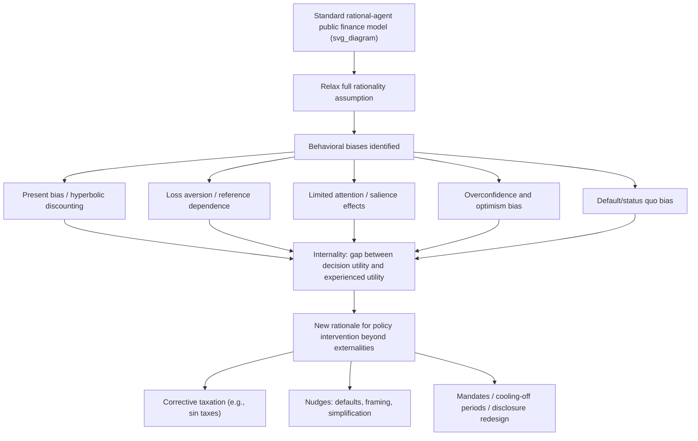

## Behavioral Biases Relevant to Public Policy

### Definition and Core Concept

Behavioral public economics integrates insights from psychology and behavioral economics into the standard neoclassical public finance framework, relaxing the assumption that individuals are fully rational, unboundedly self-interested, and possess unlimited computational and willpower resources. Rather than treating deviations from the standard rational-agent model as mere noise, behavioral public economics treats systematic **behavioral biases** as first-order determinants of how individuals respond to taxes, transfers, and regulations — with direct implications for optimal policy design, welfare measurement, and the justification for government intervention.

This reframing matters because the standard welfare-economic case for government intervention rests heavily on market failures (externalities, public goods, information asymmetries, market power). Behavioral public economics identifies an additional class of justification: **internalities** and **decision-making failures**, where individuals' own choices systematically fail to maximize their own well-being, even absent any externality or informational asymmetry in the conventional sense.

### Key Points: Why Behavioral Biases Matter for Policy

- **Alters incidence and behavioral response predictions**: Standard tax incidence and elasticity models assume optimizing agents; if agents are subject to systematic biases, predicted behavioral responses to taxes/subsidies (and thus welfare and revenue estimates) can differ substantially from neoclassical benchmarks.
- **Creates a new welfare-theoretic rationale for intervention**: Biases can justify paternalistic or corrective policy independent of externalities — the policy problem becomes correcting a wedge between an individual's decision utility (what drives their choice) and their experienced/true utility (what actually makes them better off).
- **Complicates welfare measurement**: If revealed preference (choices) no longer reliably reveals true welfare-relevant preferences, the foundational tool of neoclassical welfare economics is compromised, requiring alternative methods to infer what policy would actually improve wellbeing.
- **Opens new policy instruments**: Behavioral insights motivate "nudge"-based interventions (default options, framing, simplification) as a lower-cost or less-intrusive alternative or complement to traditional price-based (taxes/subsidies) or command-and-control regulatory tools.

### Diagram: Behavioral Public Economics Framework

### Major Behavioral Biases and Their Policy Relevance

**1. Present Bias and Hyperbolic (Quasi-Hyperbolic) Discounting**

Individuals exhibit **time-inconsistent preferences**, placing disproportionately high weight on immediate costs/benefits relative to future ones, formalized in the **quasi-hyperbolic ($\beta$-$\delta$) discounting model** (Laibson, 1997; O'Donoghue and Rabin, 1999):

$$U_t = u_t + \beta \sum_{s=t+1}^{\infty} \delta^{s-t} u_s, \quad 0 < \beta < 1$$

where $\beta$ captures the present-bias parameter (additional discounting applied specifically to the future relative to today) and $\delta$ is the standard long-run discount factor. When $\beta < 1$, individuals systematically undervalue future consequences of current choices from the perspective of their own long-run preferences, leading to under-saving for retirement, procrastination on health-promoting behaviors, under-investment in education, and over-consumption of immediately gratifying but long-run harmful goods (tobacco, unhealthy food, addictive substances).

- **Policy relevance**: Justifies retirement savings defaults (automatic enrollment in pension plans), "sin taxes" on cigarettes/sugary beverages/alcohol calibrated to internalize the self-control problem (not merely an externality), and commitment device policies.
- **Sophistication versus naivety distinction**: O'Donoghue and Rabin distinguish "sophisticated" present-biased agents (who correctly anticipate their own future self-control problems) from "naive" agents (who mistakenly believe their future self will behave patiently), with naive agents generating additional welfare losses from failing to use available commitment devices — a distinction with significant implications for optimal policy design.

**2. Loss Aversion and Reference Dependence**

Under **prospect theory** (Kahneman and Tversky, 1979), individuals evaluate outcomes relative to a reference point (rather than in terms of absolute final wealth states as in expected utility theory), and losses relative to that reference point loom larger than equivalent gains — commonly estimated loss-aversion coefficients suggest losses are weighted roughly 2 to 2.5 times as heavily as equivalent gains, though [Inference] precise magnitude estimates vary considerably across studies, contexts, and elicitation methods.

$$v(x) = \begin{cases} x^{\alpha} & x \geq 0 \\ -\lambda(-x)^{\alpha} & x < 0 \end{cases}, \quad \lambda > 1$$

where $\lambda$ is the loss-aversion coefficient.

- **Policy relevance**: Framing a policy as avoiding a loss rather than achieving an equivalent gain can substantially affect compliance and support (e.g., framing energy-efficiency programs in terms of losses from inefficiency rather than gains from efficiency); reference-dependence also helps explain resistance to tax reforms perceived as losses even when they are Pareto-improving in expected-value terms, and informs design of default/opt-out program architecture.

**3. Limited Attention and Salience**

Individuals do not process all available information with equal weight; attention is a scarce cognitive resource, and less **salient** features of a decision (e.g., taxes not included in a posted price, small print in a contract) receive systematically less behavioral weight than salient features, even when economically equivalent.

- **Key empirical finding (Chetty, Looney, and Kroft, 2009)**: Posting tax-inclusive prices (making sales tax salient at the point of decision, rather than added only at checkout) produces measurably larger reductions in demand than the same tax rate applied non-salient (added later), demonstrating that tax salience — not just the statutory tax rate — affects behavioral response and thus the excess burden and effectiveness of a given tax.
- **Policy relevance**: Justifies mandatory tax-inclusive pricing disclosure, simplified fee/cost disclosure requirements (e.g., simplified mortgage and credit card disclosure rules), and informs the design of "sin taxes" to maximize their behavioral (health-improving) effect via salience at the point of purchase.

**4. Overconfidence and Optimism Bias**

Individuals systematically overestimate their own abilities, the precision of their knowledge, and the likelihood of favorable personal outcomes relative to objective base rates (e.g., underestimating personal probability of unemployment, disability, or health shocks).

- **Policy relevance**: Provides a rationale for mandatory social insurance (unemployment insurance, disability insurance, mandatory health insurance minimums) beyond the standard adverse-selection/moral-hazard rationale, since individuals may systematically under-insure voluntarily due to optimism bias about their own risk exposure, not merely due to asymmetric information or externalities.

**5. Default and Status Quo Bias**

Individuals disproportionately stick with a pre-set default option rather than actively opting into an alternative, even when the alternative is objectively preferable and switching costs are minimal — a robust empirical finding across numerous domains.

- **Landmark empirical evidence (Madrian and Shea, 2001)**: Switching a 401(k) retirement savings plan from opt-in to automatic enrollment with an opt-out default dramatically increased participation rates, with effects far exceeding what standard rational-choice models (where switching costs are trivial) would predict.
- **Policy relevance**: Underlies the widespread adoption of automatic enrollment in retirement savings plans, organ donation "opt-out" (presumed consent) systems in several countries, and default green-energy enrollment programs — the "nudge" toolkit associated with Thaler and Sunstein's *Nudge* (2008) and the concept of **libertarian paternalism**.

**6. Mental Accounting**

Individuals treat money as imperfectly fungible, mentally partitioning funds into separate "accounts" (e.g., treating a tax refund differently from equivalent regular income, or treating "found money" differently from earned income) rather than as a single fungible budget constraint, contrary to standard economic theory.

- **Policy relevance**: Affects predicted marginal propensity to consume out of one-time versus recurring transfers/tax changes (relevant to stimulus/rebate design), and informs "earmarking" or labeling strategies in benefit program design intended to nudge behavior (e.g., labeling a transfer as being "for children's education").

**7. Inattention to Complexity and Information Overload**

Complex program rules, eligibility criteria, and application procedures impose cognitive and time costs ("**ordeal costs**" or "hassle costs," related to Nichols and Zeckhauser's classic 1982 framework on transfer program targeting) that can suppress take-up of beneficial programs even among fully eligible individuals — a friction distinct from, but interacting with, behavioral biases.

- **Empirical evidence**: Substantial documented **incomplete take-up** of welfare and social insurance programs (e.g., EITC, SNAP, unemployment insurance) even among eligible populations is partly attributable to application complexity, information gaps, and stigma, alongside genuine behavioral inattention.
- **Policy relevance**: Motivates simplification of benefit application processes, pre-filled tax forms, automatic/default enrollment where administratively feasible, and targeted informational interventions to increase take-up.

### Key Distinction: Internalities versus Externalities

| Dimension | Externality | Internality |
| --- | --- | --- |
| Who bears the uninternalized cost | Third parties not involved in the transaction | The decision-maker's own future/true self |
| Standard example | Pollution from a factory affecting nearby residents | Smoking's harm to the smoker's own future health |
| Standard corrective tool | Pigouvian tax set equal to marginal external damage | Corrective ("sin") tax set to internalize self-control gap, or non-tax debiasing tools |
| Rationality assumption required | Fully rational agents can still generate externalities | Requires relaxing full rationality/self-control assumption |
| Welfare benchmark | Social marginal cost vs. private marginal cost | Decision utility vs. experienced/long-run utility of the same individual |

[Inference] A methodologically important and still actively debated question in the behavioral public economics literature is how to empirically distinguish a genuine internality (a true self-control/bias-driven welfare loss) from a rational but simply unobserved preference (e.g., someone who rationally values immediate gratification and accepts long-run health costs) — since both can generate observationally similar consumption patterns, but imply very different optimal policy responses.

### Corrective (Sin) Taxation Under Behavioral Biases

Standard Pigouvian tax theory sets a corrective tax equal to marginal external damage. **Behavioral corrective (sin) taxation** extends this logic (O'Donoghue and Rabin, 2006) to internalize the *internal* welfare loss from present-biased or otherwise biased consumption of goods like tobacco, sugar-sweetened beverages, and alcohol:

$$\tau^* = MED + MID$$

where $MED$ is the standard marginal external damage (e.g., secondhand smoke, healthcare cost externalities) and $MID$ is the marginal *internal* damage — the present-value harm the consumer imposes on their own future self that they fail to fully weight due to present bias, appropriately weighted by the degree of the bias (e.g., proportional to $(1-\beta)$ in a quasi-hyperbolic framework).

- **Policy application**: This framework has directly informed the economic case for sugar-sweetened beverage taxes, tobacco taxation calibrated above pure external-cost benchmarks, and similar "sin tax" policy design in numerous jurisdictions.
- [Inference] Because $MID$ requires estimating both the degree of individual self-control bias and its monetary welfare consequence, calibrating the behaviorally optimal corrective tax rate in practice involves substantially more empirical and normative uncertainty than calibrating a standard Pigouvian externality tax.

### Nudges and Libertarian Paternalism

Thaler and Sunstein's concept of **libertarian paternalism** proposes using **nudges** — nonintrusive interventions that alter the "choice architecture" (default options, framing, ordering, simplification) to steer behavior toward welfare-improving choices while preserving formal freedom of choice (opt-out remains available).

**Design principles for effective nudges:**

- Set defaults to the option that best serves most people's own interests (given evidence of systematic bias away from that option)
- Simplify choice environments to reduce cognitive burden and decision-making errors
- Use salience and framing to highlight welfare-relevant information that would otherwise be under-weighted
- Preserve meaningful ability to opt out, distinguishing nudges from mandates

**Empirical applications:**

- Automatic enrollment in retirement savings plans (401(k) auto-enrollment, and behaviorally-informed reforms such as the UK's NEST auto-enrollment pension reform)
- Organ donation opt-out ("presumed consent") systems, associated with substantially higher donation registration rates in several countries relative to opt-in systems
- Simplified tax filing and pre-populated return systems
- Behaviorally redesigned energy bills with social comparison information (e.g., programs modeled on Opower-style home energy reports)

### Critiques and Debates in Behavioral Public Economics

**Paternalism concerns**

Critics argue that behavioral corrective policy, even when framed as "libertarian," risks substituting policymakers' judgments about what constitutes an individual's "true" welfare-maximizing choice for the individual's own revealed preferences, raising normative concerns about who determines the correct reference point/welfare benchmark and the risk of policymaker error or capture.

**Heterogeneity in bias magnitude**

Behavioral biases are not uniformly distributed across the population; a policy calibrated for the average degree of present bias or loss aversion may be poorly targeted (too restrictive for largely rational individuals, insufficiently corrective for the most biased individuals) — a design challenge without a straightforward general solution, since biases are typically not directly observable at the individual level for targeting purposes.

**Manipulation and "sludge" risk**

The same choice-architecture tools that enable welfare-improving nudges can equally be used by firms or malicious actors to exploit behavioral biases for their own benefit against the consumer's interest (sometimes termed "sludge" — friction deliberately added to discourage a welfare-improving action, such as complex cancellation procedures for subscriptions) — highlighting that the choice-architecture toolkit is normatively neutral and depends entirely on the intentions and incentives of whoever designs it.

**Measurement and identification challenges**

Robustly identifying and quantifying specific behavioral biases (versus rational heterogeneous preferences) typically requires well-identified quasi-experimental or experimental variation, and [Inference] findings from one context/population/domain do not always generalize reliably to different policy settings, a recurring caveat in applying laboratory or narrow-context behavioral findings to broad policy design.

### Empirical Methods in Behavioral Public Economics

- **Natural experiments and policy discontinuities**: Exploiting sudden changes in default rules, tax salience, or program design (e.g., the Madrian-Shea 401(k) default change; Chetty-Looney-Kroft tax salience experiment) to identify causal behavioral responses.
- **Randomized controlled trials (RCTs)**: Increasingly used by governments (e.g., the UK's former Behavioural Insights Team, "the Nudge Unit," and analogous units established in numerous other countries) to test specific choice-architecture interventions before broad rollout.
- **Structural estimation of behavioral parameters**: Estimating present-bias ($\beta$) or loss-aversion ($\lambda$) parameters directly from observed choice data using structural behavioral models, enabling counterfactual welfare and policy simulations.

### Conclusion

Behavioral biases — present bias, loss aversion, limited attention/salience, overconfidence, default/status quo bias, and mental accounting chief among them — provide public economics with an additional, psychologically grounded justification for government intervention distinct from classical market-failure rationales: the **internality**, where an individual's own decision-making systematically diverges from their own long-run welfare. This reframing has generated both a new corrective-taxation logic (behaviorally augmented Pigouvian/sin taxation) and an entirely new policy toolkit (nudges and choice-architecture redesign under libertarian paternalism), while simultaneously raising significant normative and empirical challenges around paternalism, bias heterogeneity, and the risk that the same behavioral tools can be misused. Understanding these biases has become central to modern optimal tax and transfer program design, particularly in domains such as retirement savings, health-related "sin" goods, and social insurance take-up.

### Related Topics

- Present Bias, Time Inconsistency, and Quasi-Hyperbolic Discounting
- Corrective (Pigouvian and Sin) Taxation under Behavioral Biases
- Nudges, Choice Architecture, and Libertarian Paternalism
- Default Effects and Automatic Enrollment in Retirement Savings
- Tax Salience and the Chetty-Looney-Kroft Framework
- Incomplete Take-Up of Social Insurance and Transfer Programs
- Prospect Theory, Loss Aversion, and Reference Dependence
- Optimal Sin Taxes on Tobacco, Alcohol, and Sugar-Sweetened Beverages
- Behavioral Welfare Economics and the Decision Utility/Experienced Utility Distinction
- Randomized Controlled Trials in Public Policy Design