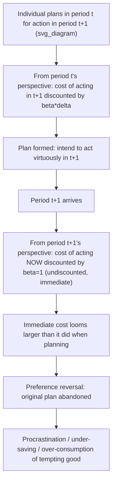

## Present Bias and Commitment Devices

### Definition and Core Concept

**Present bias** is the systematic tendency of individuals to overweight immediate costs and benefits relative to future ones, in a manner inconsistent with standard exponential discounting and generating **time-inconsistent** preferences — plans made in advance are not followed through when the moment for action actually arrives. **Commitment devices** are mechanisms, either self-imposed or policy-provided, that individuals or institutions use to constrain future choice sets in advance, precisely to counteract the predictable failure of future intentions caused by present bias. Together, these concepts form a core pillar of behavioral public economics, directly motivating both private commitment contracting and public policy interventions ranging from retirement-savings defaults to sin taxation.

### Formal Model: Quasi-Hyperbolic ($\beta$-$\delta$) Discounting

The standard formalization, developed by Phelps and Pollak (1968) and popularized in economics by Laibson (1997) and O'Donoghue and Rabin (1999), represents lifetime utility as evaluated from the perspective of period $t$ as:

$$U_t = u_t + \beta \sum_{s=t+1}^{T} \delta^{s-t} u_s, \qquad 0 < \beta \leq 1, \ 0 < \delta \leq 1$$

- $\delta$ is the standard **long-run discount factor**, capturing patience between any two future periods.
- $\beta$ is the **present-bias parameter**, applying an *additional* discount specifically to all future periods relative to the present. When $\beta = 1$, the model collapses to standard exponential discounting (time-consistent). When $\beta < 1$, the individual discounts the very next period disproportionately relative to how they discount two future periods relative to each other — generating a discontinuity in the discount function between "now" and "later" that does not exist between any two future dates.

This produces the hallmark feature of hyperbolic discounting: implied discount rates are **high in the short run** but **decline as the horizon lengthens**, unlike the constant discount rate implied by standard exponential discounting.

### Diagram: Time-Inconsistency Mechanism

### Sophistication versus Naivety

A critical distinction in the O'Donoghue and Rabin (1999, 2001) framework is whether present-biased individuals correctly anticipate their own future self-control problems:

- **Sophisticated agents** correctly forecast that their future self will also be present-biased (i.e., they know their period-$t+1$ self will apply $\beta < 1$ to period $t+2$ costs), and therefore anticipate their own future preference reversals. Sophisticated agents will rationally demand and use commitment devices, since they understand that without commitment, their stated plans will not be carried out.
- **Naive agents** incorrectly believe their future self will behave as if $\beta = 1$ (patiently, as currently planned), and thus fail to anticipate their own future preference reversal. Naive agents systematically underestimate their need for commitment devices and are the population for whom the welfare losses from present bias are typically largest, since they repeatedly form plans they do not follow through on and do not take corrective action.
- **Partial naivety**: A middle case, formalized with a parameter $\hat{\beta} \in (\beta, 1)$ representing the individual's *belief* about their own future $\beta$, allows for intermediate degrees of self-awareness — most empirical calibrations find real populations exhibit partial rather than full naivety or full sophistication.

[Inference] This sophistication/naivety distinction has major implications for policy design: naive agents cannot be relied upon to self-select into voluntary commitment devices even when such devices would improve their welfare, which is a key argument for default-based (rather than purely opt-in) policy interventions.

### Empirical Evidence for Present Bias

- **Laboratory experiments**: Numerous studies eliciting individuals' time preferences over monetary rewards find a robust pattern of **present-biased** or "now-vs-later" discount rate discontinuities — subjects show much higher implied discount rates between "today" and "tomorrow" than between "30 days from now" and "31 days from now," consistent with quasi-hyperbolic rather than exponential discounting. [Inference] Effect sizes and robustness vary somewhat depending on elicitation method (e.g., monetary choice tasks versus real-effort tasks), and some later replication work has questioned the magnitude of present bias found in certain classic experimental designs, so exact parameter estimates should be treated as method-sensitive.
- **Field evidence — gym attendance (DellaVigna and Malmendier, 2006)**: Individuals who purchase monthly gym memberships with a flat fee attend far less often than would justify the membership cost relative to pay-per-visit pricing, and continue paying long after ceasing to attend regularly — consistent with naive present bias about future gym-going intentions (rather than, for example, pure convenience motives).
- **Field evidence — retirement savings under-contribution**: Widespread empirical documentation that many workers report intending to save more for retirement than they actually do, and increase savings substantially when default contribution rates are raised, consistent with present-biased procrastination in the presence of a saving decision requiring active effort.
- **Field evidence — procrastination on beneficial one-time tasks**: Delayed completion of tasks with small effort costs but valuable eventual payoffs (e.g., redeeming rebate checks, completing financial aid applications, medical screening appointments) shows systematic present-biased-consistent delay patterns beyond what standard search/effort-cost models alone would predict.

### Commitment Devices: Taxonomy

**1. Self-Imposed (Private) Commitment Devices**

Individuals themselves construct binding or costly-to-violate constraints on their own future choices, absent any government involvement:

- **Illiquid savings vehicles**: Voluntarily locking savings into accounts with early-withdrawal penalties (Christmas club accounts, certain retirement accounts, or informal savings groups such as ROSCAs — rotating savings and credit associations common in many developing-country contexts) to prevent present-biased dis-saving.
- **Deposit contracts tied to goal completion**: Programs such as "CARES" (Commitment to Attend and Remain Employed/Sober) or smoking-cessation deposit contracts (e.g., experimental designs following Giné, Karlan, and Zinman, 2010, on smoking cessation) where individuals deposit their own money, forfeited if they fail to meet a self-set behavioral goal (e.g., a biochemically verified smoking-cessation target).
- **Social commitment**: Publicly announcing a goal to friends/family to leverage reputational costs of failure as an additional, non-monetary commitment mechanism.
- **Physical/environmental commitment**: Removing tempting options from one's immediate environment (e.g., not keeping unhealthy food in the house) to avoid confronting the temptation at the moment of highest present-bias-driven vulnerability.

**2. Market-Provided Commitment Products**

Firms design and sell products explicitly structured to help present-biased consumers commit:

- Commercial commitment-savings products (e.g., the "SEED" commitment savings account studied by Ashraf, Karlan, and Yin, 2006, in the Philippines, which restricted withdrawal until a self-set savings goal or date was reached, and produced significant increases in savings for participants relative to a control group)
- Structured annuities and illiquid long-term investment products that impose a commitment-like structure relative to fully liquid alternatives
- [Inference] The theoretical existence of demand for costly commitment products (individuals willingly paying to restrict their own future choice set) is itself considered strong indirect evidence of sophisticated present bias, since a fully time-consistent agent would never pay to reduce their own future option set.

**3. Policy-Provided (Public) Commitment Mechanisms**

Governments can design institutions and defaults that function as commitment devices at a population scale, particularly valuable given that naive agents will not voluntarily seek out private commitment products:

- **Automatic enrollment ("auto-enrollment") in retirement savings**: Default enrollment into employer-sponsored retirement plans (with an opt-out rather than opt-in requirement) functions as a policy-level commitment mechanism, since inertia (itself partly a manifestation of present bias toward the effort of opting in/out) then works in favor of higher savings rather than against it.
- **Mandatory public pension/social insurance systems**: Compulsory contribution to systems such as Social Security can be understood partly as a societal-level commitment device compensating for anticipated under-saving driven by present bias (in addition to its role addressing adverse selection and poverty-prevention rationales).
- **"Sin taxes" as external commitment support**: Taxes on tobacco, alcohol, and sugar-sweetened beverages raise the immediate price of a tempting good, partially substituting for the missing internal commitment mechanism of a naive present-biased consumer (this is the corrective/behavioral taxation logic discussed under Behavioral Biases Relevant to Public Policy).
- **Cooling-off periods and mandatory waiting periods**: Legally mandated delays before certain high-stakes, hard-to-reverse decisions become effective (e.g., cooling-off periods for door-to-door sales contracts, certain loan products, or major purchases) function as a form of externally imposed commitment against impulsive, present-biased decision-making, allowing the "patient" future self more deliberation time.

### Welfare Analysis of Commitment Devices

Standard revealed-preference welfare analysis breaks down under present bias, since an individual's period-$t$ choice may not reflect what would actually maximize their long-run ("true" or $\delta$-only-discounted) welfare. Behavioral welfare economics typically evaluates commitment devices against the **long-run ($\delta$-discounted, $\beta$-free) utility criterion** — the utility function the individual would use to evaluate outcomes absent the present-bias distortion — as the normatively relevant welfare benchmark, rather than the period-by-period ($\beta$-$\delta$-discounted) decision utility that actually drives observed choices.

Under this welfare criterion:

- A commitment device that binds a sophisticated agent to their own stated long-run-optimal plan is **unambiguously welfare-improving** by construction, since it eliminates the wedge between the period-$t$ plan and period-$t+1$ time-inconsistent deviation.
- For naive agents, welfare gains from externally imposed (rather than self-chosen) commitment devices can be even larger, since naive agents would not voluntarily select an available private commitment device.
- **Caveat — false-positive risk**: If what appears to be a "present-biased" choice pattern is in fact a rational, stable preference for immediate gratification (i.e., genuinely low long-run patience rather than a within-person preference-reversal problem), imposing a commitment device or corrective policy calibrated for present bias would reduce rather than improve welfare — reinforcing the identification challenge noted in behavioral public economics generally.

### Numerical Illustration: Present-Biased Retirement Saving Decision

Consider a simplified two-period model where an individual chooses in period $t$ how much to save for period $t+1$ retirement consumption, facing $\beta = 0.7$, $\delta = 0.95$.

- From period $t$'s perspective, the perceived cost of saving $100 today (foregone consumption) versus the discounted benefit of $105 in retirement (a 5% real return) is evaluated as:

  $$\text{Perceived net value} = -100 + \beta \delta (105) = -100 + (0.7)(0.95)(105) \approx -100 + 69.8 = -30.2$$

  This suggests the individual, from a forward-planning perspective made even further in advance, undervalues the future retirement benefit relative to its true long-run ($\delta$-only) value of $-100 + 0.95(105) = -0.25$ (roughly break-even under pure exponential discounting), illustrating why present-biased individuals systematically under-save relative to what their own long-run preferences would recommend.
- If a default automatic-enrollment policy commits the individual to the $100 contribution unless they actively opt out, the "cost" of the present-biased under-saving decision (requiring active effortful choice to deviate) is shifted onto the inertia/present-bias tendency itself, reversing its effect from working against saving to working in favor of it — the essential mechanism underlying the empirical success of auto-enrollment policies. [Inference] This is a stylized numerical illustration for pedagogical purposes; actual calibrated present-bias parameters and their precise translation into savings-behavior predictions vary across empirical studies and populations.

### Policy Design Implications

**Key Points**

- **Default architecture matters more than pure information provision**: Because present bias operates at the moment of decision (not at the moment of information receipt), simply informing individuals about optimal savings/health behavior is typically less effective than changing the default they would need to actively opt out of.
- **Commitment devices work best when they are low-friction to adopt but costly/effortful to reverse**: The asymmetry between easy adoption and effortful reversal is precisely what allows a commitment device to bind a present-biased individual's future self.
- **Sophistication should inform targeting**: Policies relying on voluntary opt-in commitment products will systematically fail to reach naive present-biased individuals — the population with the largest welfare stakes — reinforcing the case for default-based rather than purely opt-in policy design in many domains.
- **Partial commitment/flexibility trade-off**: Fully rigid commitment devices (e.g., an irrevocable long-term illiquid savings lock) provide maximal protection against present-biased reversal but impose costs in states of the world where liquidity is genuinely needed (emergencies); optimal commitment device design in the literature often incorporates graduated or partial flexibility (e.g., moderate early-withdrawal penalties rather than absolute prohibition) to balance commitment value against legitimate flexibility needs.

### Critiques and Open Questions

**Identification of true present bias versus rational heterogeneous preferences**

As noted above, distinguishing genuine present-bias-driven time inconsistency from stable, rational low patience remains empirically and conceptually challenging, and [Inference] is one of the most actively debated methodological issues in the behavioral public economics literature, since the two can generate similar cross-sectional consumption/savings patterns but imply very different normative conclusions about whether intervention improves welfare.

**Magnitude and external validity of laboratory estimates**

[Unverified: findings vary by study design] Some experimental estimates of present bias, particularly those derived from monetary-choice tasks with relatively small stakes, may not generalize reliably to higher-stakes, real-world domains such as retirement savings or health behavior, an ongoing concern in translating laboratory-calibrated $\beta$ parameters into real-world policy calibration.

**Paternalism and autonomy concerns**

As with behavioral corrective policy generally, mandatory or strongly default-driven commitment mechanisms raise normative questions about individual autonomy, particularly for the subset of the population whose apparently present-biased behavior in fact reflects genuine, rational preference rather than a self-control failure — a population that may be made worse off by policies calibrated to the population-average degree of bias.

### Conclusion

Present bias — formalized through the quasi-hyperbolic ($\beta$-$\delta$) discounting model — provides a rigorous behavioral-economic foundation for understanding why individuals systematically fail to follow through on future-oriented plans involving saving, health behavior, and other domains with delayed rewards. The sophistication/naivety distinction is central to both positive prediction (whether individuals will demand commitment devices) and normative policy design (naive individuals require externally imposed, default-based commitment mechanisms rather than relying on voluntary market-provided commitment products). This framework directly underpins major real-world policy interventions, including retirement-savings auto-enrollment, sin taxation, and mandatory social insurance, while also generating ongoing debates about the identification of genuine present bias, the external validity of laboratory-derived bias estimates, and the appropriate balance between paternalistic protection and individual autonomy.

### Related Topics

- Behavioral Biases Relevant to Public Policy
- Quasi-Hyperbolic ($\beta$-$\delta$) Discounting and Time Inconsistency
- Corrective (Sin) Taxation under Behavioral Biases
- Automatic Enrollment and Default Effects in Retirement Savings
- Libertarian Paternalism and Choice Architecture (Nudges)
- Sophistication versus Naivety in Behavioral Contract Design
- Commitment Savings Products and Microfinance (Ashraf-Karlan-Yin)
- Behavioral Welfare Economics: Decision Utility versus Experienced Utility
- Mandatory Social Insurance as a Commitment Mechanism
- Cooling-Off Periods and Consumer Protection Regulation