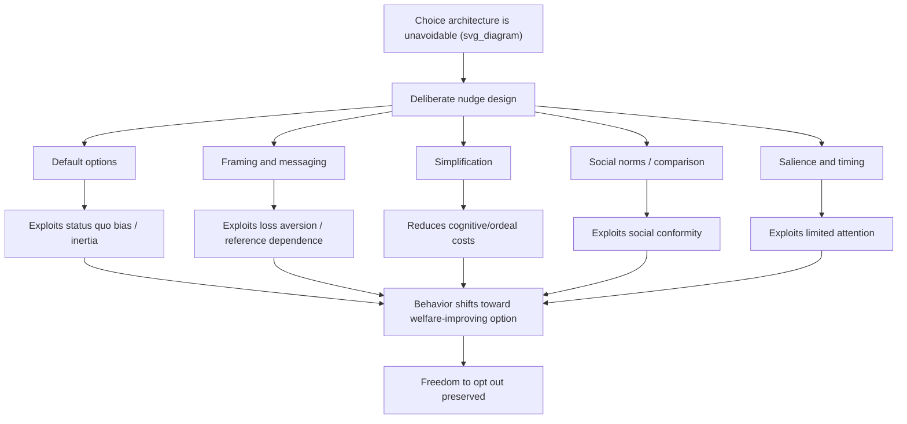

## Nudges, Defaults, and Libertarian Paternalism

### Definition and Core Concept

A **nudge**, as defined by Richard Thaler and Cass Sunstein in *Nudge: Improving Decisions About Health, Wealth, and Happiness* (2008), is any aspect of **choice architecture** that alters people's behavior in a predictable way without forbidding any options or significantly changing their economic incentives. **Choice architecture** refers to the way choices are presented — the organization, framing, ordering, and default settings of a decision environment — which behavioral economics demonstrates is never neutral: some way of presenting choices always exists, and the specific way chosen systematically influences the decisions people make. **Default options** are the outcome that occurs if a decision-maker does nothing — the single most empirically robust and widely applied nudge instrument. **Libertarian paternalism** is the normative philosophy justifying the deliberate use of nudges: it is "paternalistic" in that choice architects intentionally steer people toward choices believed to improve their own welfare, but "libertarian" in that it preserves freedom of choice — no option is banned, and opting out remains available, typically at low cost.

### Theoretical Foundations

Nudges derive their theoretical justification from the behavioral biases discussed in the broader behavioral public economics literature — present bias, limited attention, status quo bias, loss aversion, and bounded rationality generally. Because choice architecture is unavoidable (some default, framing, or ordering must exist in any real decision environment), Thaler and Sunstein argue that policymakers and institutional designers face an inescapable choice: architect choices arbitrarily or unconsciously, or architect them deliberately to improve outcomes according to people's own long-run interests, while preserving the formal freedom to choose otherwise.

### Diagram: Nudge Taxonomy and Mechanism

### Default Options: The Canonical Nudge

**Mechanism**

Default options function as nudges because status quo bias, procrastination (often present-bias-driven), and the implicit endorsement effect (perceiving the default as an implied recommendation) combine to produce far higher rates of default retention than rational, frictionless choice models would predict.

**Landmark evidence**

- **Madrian and Shea (2001)**: Switching a 401(k) retirement savings plan from opt-in enrollment to automatic enrollment with an opt-out default dramatically raised participation rates among new employees, a foundational empirical result in the default-effects literature.
- **Organ donation registries**: Countries using "presumed consent" (opt-out) organ donation systems exhibit substantially higher donor registration/consent rates than comparable countries using explicit opt-in consent systems (Johnson and Goldstein, 2003), though [Inference] the relationship between registration defaults and actual transplantation rates is more complex, depending also on family override provisions, healthcare system infrastructure, and public trust — so registration-rate differences should not be read as directly proportional to differences in actual organ availability.
- **Automatic escalation ("Save More Tomorrow")**: The Thaler and Benartzi (2004) "Save More Tomorrow" program design, which defaults employees into automatically increasing their retirement savings contribution rate with each future pay raise, substantially raised long-run savings rates in participating firms by aligning the commitment mechanism with present-biased psychology (committing to save more only in the future, when the sacrifice feels less immediate).

**Why defaults work: proposed mechanisms**

1. **Effort/friction cost**: Active opt-out requires time and cognitive effort that a fraction of individuals will not expend even when they would prefer the alternative.
2. **Implied endorsement/anchoring**: Individuals may interpret the default as an implicit recommendation from a knowledgeable choice architect (employer, government), especially in complex domains like retirement investing.
3. **Present bias/procrastination**: Actively opting out requires immediate effortful action for a benefit realized later, subject to the same present-bias dynamics discussed in the commitment-devices literature.
4. **Loss aversion relative to the default reference point**: Once a default is set, deviating from it may be psychologically coded as a "loss" relative to that reference point, even when the deviation is objectively beneficial.

### Framing Effects

How logically equivalent information is presented materially affects choice, contrary to the standard economic assumption of description invariance:

- **Gain/loss framing**: Presenting a policy outcome as avoiding a loss (e.g., "you will lose $X in benefits if you don't enroll") tends to generate stronger behavioral response than the logically equivalent gain frame ("you will gain $X in benefits if you enroll"), consistent with prospect-theory loss aversion.
- **Tax-inclusive salience**: As discussed in Chetty, Looney, and Kroft (2009), displaying tax-inclusive prices at the point of purchase (rather than adding tax only at checkout) increases the behavioral responsiveness to the tax, since increased salience raises the effective weight consumers place on the tax component of the total price.
- **Social norm framing**: Communicating that most peers engage in a desired behavior (e.g., "90% of your neighbors pay their taxes on time," or comparative home energy usage reports) leverages social conformity motives to shift behavior — the mechanism underlying Opower-style behaviorally redesigned energy bills, which several field studies found meaningfully reduced household energy consumption through social-comparison messaging alone.

### Simplification

Reducing the cognitive/administrative burden ("**ordeal costs**," in the Nichols-Zeckhauser 1982 framework) of accessing a program or making a decision is itself a nudge-like intervention, since complexity systematically suppresses take-up even among individuals who would benefit and are formally eligible.

- **Simplified financial aid applications**: Randomized interventions that pre-filled or simplified FAFSA (U.S. federal student aid) applications during tax preparation significantly increased college enrollment among low-income families relative to providing the same eligibility information without the simplification (Bettinger, Long, Oreopoulos, and Sanbonmatsu, 2012).
- **Simplified tax filing**: Pre-populated tax returns (used in several countries, e.g., Scandinavian "no-return" or pre-filled return systems) reduce filing complexity and errors relative to systems requiring individuals to compile all information themselves.
- **Simplified enrollment for social benefits**: Streamlined, shorter application forms and reduced documentation requirements for programs like SNAP or Medicaid have been shown in various evaluations to raise take-up among eligible non-participants.

### The Nudge Toolkit: EAST and Other Frameworks

The UK's Behavioural Insights Team (informally "the Nudge Unit," established 2010, the first government unit of its kind) popularized the **EAST framework** for applying behavioral insights to policy design:

- **Easy**: Reduce the effort/friction required to take the desired action
- **Attractive**: Use attention-grabbing framing, incentives, or personalization
- **Social**: Leverage social norms and networks
- **Timely**: Prompt action at the moment individuals are most receptive/able to act

[Inference] This and similar frameworks have been widely adapted internationally, with dozens of governments now operating dedicated behavioral insights or "nudge" units, reflecting substantial (though not universal) institutional adoption of the approach in practice since the mid-2010s.

### Normative Framework: Libertarian Paternalism

Thaler and Sunstein's justification for libertarian paternalism rests on several claims:

1. **Choice architecture is unavoidable**: Since some default, ordering, or framing must always exist, "doing nothing" is not a neutral option — it merely defers the choice-architecture decision to whoever or whatever set the status quo default (which may itself be arbitrary, historically contingent, or set by an interested third party such as a firm).
2. **Asymmetric paternalism**: Nudges are designed to help those most susceptible to the relevant bias (e.g., naive present-biased savers) while imposing minimal cost on those who are already fully rational and would have chosen the "nudged" option anyway or can easily opt out (a concept closely related to **asymmetric paternalism**, Camerer, Issacharoff, Loewenstein, O'Donoghue, and Rabin, 2003).
3. **Preservation of choice**: Unlike mandates, nudges by design preserve the formal ability to choose the non-default/non-recommended option, distinguishing the approach from traditional command-and-control regulation.

### Key Points: Nudges versus Traditional Policy Instruments

| Dimension | Traditional Mandate/Ban | Price Instrument (Tax/Subsidy) | Nudge |
| --- | --- | --- | --- |
| Restricts choice set | Yes | No (changes relative price only) | No |
| Requires legislative/regulatory cost | Often high | Moderate to high | Often low (administrative) |
| Effectiveness depends on | Enforcement | Price elasticity of demand | Degree of relevant behavioral bias |
| Distributional/regressivity concern | Varies | Often regressive (e.g., sin taxes) | Generally minimal direct cost imposed |
| Reversibility | Politically costly to reverse | Politically costly to reverse | Often easy to reverse/adjust |
| Effectiveness on fully rational agents | Fully binding | Fully effective (standard elasticity) | Minimal effect (rational agents unaffected) |

### Critiques and Debates

**Effect size and durability concerns**

[Unverified: findings vary by study and domain] A body of more recent meta-analyses and large-scale replication studies (including large multi-site nudge trials published in the 2020s) has found that average nudge effect sizes across many published studies are meaningfully smaller than the effect sizes reported in early, often smaller and less representative, foundational studies — a pattern consistent with publication bias in the earlier literature and raising questions about the generalizability of headline nudge results to full-scale, heterogeneous policy rollouts. This has prompted increased emphasis within the behavioral policy field on rigorous, adequately powered pre-registered trials before broad policy adoption.

**Manipulation and "sludge" risk**

The same choice-architecture techniques (defaults, framing, friction) that enable welfare-improving nudges are equally available to firms seeking to exploit consumer biases against their own interest — Thaler himself later coined the term "**sludge**" for friction deliberately introduced to discourage a welfare-improving action (e.g., complex, multi-step subscription cancellation processes, or defaults set to auto-renewal that benefit the firm rather than the consumer). This symmetry means choice architecture is a normatively neutral toolkit whose welfare implications depend entirely on the designer's incentives, motivating consumer-protection regulation targeting deceptive or exploitative "dark patterns" in digital interfaces.

**Paternalism and autonomy objections**

Critics (e.g., various law and philosophy scholars responding to Thaler and Sunstein) argue that even "libertarian" paternalism embeds a substantive judgment by the choice architect about what constitutes an individual's true welfare-maximizing choice, which risks error, technocratic overreach, or capture by interests other than the nudged individual's — particularly problematic given that opt-out costs, while formally low, are not literally zero, meaning nudges do exert genuine behavioral influence rather than being fully "neutral" with respect to autonomy.

**Heterogeneity and mistargeting**

As with behavioral corrective taxation generally, a single default or framing calibrated to the population-average bias may be poorly suited to individuals at either tail of the bias distribution — potentially nudging some individuals away from their own genuinely well-considered preferences while under-correcting others with more severe self-control problems.

**Transparency concerns**

Some critics argue that nudges' effectiveness partly depends on the target's lack of awareness of the manipulation, raising a tension with values of transparency and informed consent in public policy; proponents respond (and some empirical work supports) that many nudges, including defaults, retain effectiveness even when their behavioral mechanism is disclosed to participants ("nudges that we know are nudges" retaining efficacy), partially addressing this concern. [Inference] The extent to which transparency fully preserves nudge effectiveness likely varies by nudge type and context, and is an active area of ongoing research rather than a fully settled empirical question.

### Applications Across Public Policy Domains

- **Retirement savings**: Automatic enrollment and automatic escalation defaults in employer-sponsored pension plans (401(k)s in the U.S., NEST auto-enrollment pensions in the UK).
- **Tax compliance**: Behaviorally informed reminder letters using social-norm messaging (e.g., "9 out of 10 people in your area pay their taxes on time") have been tested and adopted by several national tax authorities to improve voluntary compliance and reduce costly enforcement action.
- **Energy conservation**: Home energy reports with social comparison and normative messaging (Opower-style programs) reducing household electricity consumption.
- **Organ donation**: Opt-out donor registration defaults.
- **Health behavior**: Cafeteria/food environment redesign (placing healthier options at eye level or in more accessible positions — sometimes termed "nudging" school lunch choices), automated appointment reminder systems for preventive screenings.
- **Consumer financial protection**: Simplified, standardized disclosure formats for credit card terms, mortgage costs, and other complex financial products, designed to counteract limited-attention and complexity-driven decision errors.

### Conclusion

Nudges, defaults, and the underlying philosophy of libertarian paternalism represent a distinctive policy toolkit within behavioral public economics: rather than restricting choice (as mandates do) or altering relative prices (as taxes and subsidies do), nudges deliberately redesign the choice architecture — defaults, framing, simplification, social-norm messaging, and timing — to counteract well-documented behavioral biases while formally preserving freedom of choice. Default options, particularly in retirement savings and organ donation, represent the most empirically robust and widely adopted application. While the approach offers a lower-cost, less-intrusive complement or alternative to traditional regulatory and price-based instruments, it faces legitimate and actively debated critiques regarding effect-size overstatement in early literature, the symmetric risk of "sludge" and manipulative choice architecture, paternalism/autonomy concerns, and the challenge of appropriately targeting heterogeneous populations with a single default or frame.

### Related Topics

- Behavioral Biases Relevant to Public Policy
- Present Bias and Commitment Devices
- Default Effects and Automatic Enrollment in Retirement Savings
- Corrective (Sin) Taxation under Behavioral Biases
- Tax Salience and the Chetty-Looney-Kroft Framework
- Asymmetric Paternalism (Camerer, Issacharoff, Loewenstein, O'Donoghue, Rabin)
- Sludge and Dark Patterns in Consumer Choice Architecture
- Randomized Controlled Trials in Public Policy Design
- Incomplete Take-Up of Social Insurance and Transfer Programs
- Behavioral Welfare Economics and the Decision Utility/Experienced Utility Distinction