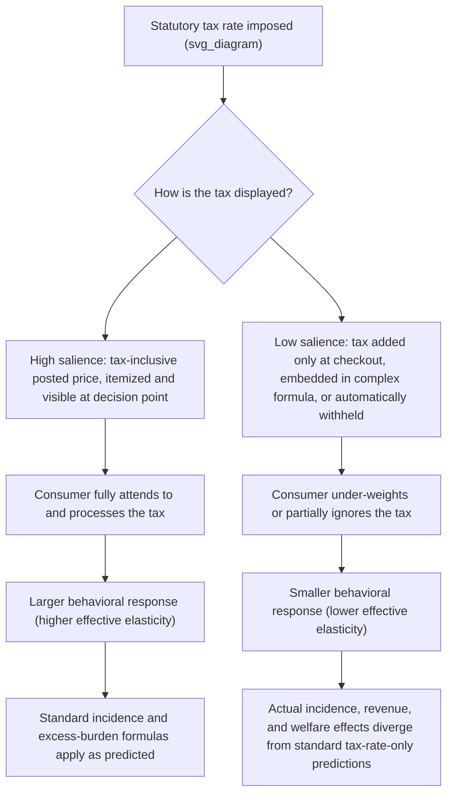

## Tax Salience and Framing Effects

### Definition and Core Concept

**Tax salience** refers to the degree to which a tax is cognitively visible or attention-grabbing to the taxpayer at the moment of the relevant economic decision. Standard neoclassical tax theory assumes that only the effective marginal tax rate matters for behavior — a tax's economic incidence and behavioral response should depend solely on its magnitude, not on how conspicuously it is displayed or labeled. Tax salience research overturns this assumption: taxes that are less visible (e.g., added at checkout rather than included in the posted price, withheld automatically from a paycheck rather than paid as a visible lump sum, or embedded in a complex formula) generate **systematically smaller behavioral responses** than economically equivalent taxes that are more salient, even when the statutory tax rate is identical. **Framing effects** are the closely related broader phenomenon whereby the presentation format of tax (or transfer) information — how it is labeled, described, or contextualized — independently affects behavior, compliance, and perceived welfare, holding the underlying economic substance fixed.

### Theoretical Motivation: Why Salience Should Not Matter (Under Standard Theory) But Does

Under the standard model of a fully rational, unboundedly attentive consumer, the total after-tax price is all that matters for the consumption decision; the decomposition between pre-tax price and tax amount, or the manner of its disclosure, is economically irrelevant "framing" that a rational agent should see through. Tax salience research, drawing on the limited-attention and rational inattention literatures in behavioral economics, demonstrates empirically that this prediction fails: taxpayers do not costlessly and fully process all price/tax information, particularly when a tax is a small component of a larger transaction, is applied only at a later stage of the purchase process, or is bundled into a complex, hard-to-parse formula.

### Diagram: Tax Salience Mechanism

### Landmark Empirical Evidence

**Chetty, Looney, and Kroft (2009) — "Salience and Taxation: Theory and Evidence"**

The foundational empirical paper in this literature conducted a field experiment in grocery stores, posting tax-inclusive price tags (showing the final price including sales tax) alongside the standard practice of adding tax only at the register. The tax-inclusive tags produced a measurable reduction in demand for the affected products relative to products with standard (tax-exclusive, less salient) tags, despite the statutory tax rate being identical in both cases. A complementary analysis of state-level alcohol excise tax changes found that more salient **excise taxes** (levied on producers and typically built into the shelf price observed by consumers) generated substantially larger reductions in alcohol consumption than equivalent-magnitude, less salient **sales taxes** (added at the register, not included in the shelf price) — providing quasi-experimental corroboration of the lab/field-experiment finding using real-world policy variation.

**Finkelstein (2009) — Highway toll salience**

Analysis of the introduction of **electronic toll collection (ETC)** systems (E-ZPass and similar) found that tolls became substantially less salient once automated, since drivers no longer had to hand over cash and directly observe the payment at the moment of the transaction. This reduced salience was associated with less price-sensitive behavior and, correspondingly, with toll authorities raising toll rates by more than they would have under the more salient cash-payment system — evidence that reduced tax/fee salience not only changes consumer behavior but also changes the political economy of rate-setting, since less visible costs face less voter/consumer resistance.

**Feldman and Ruffle, and related lab evidence on tax-inclusive versus tax-exclusive pricing**

Complementary laboratory studies have found that consumers systematically under-react to taxes that must be mentally calculated and added by the consumer (tax-exclusive posted prices) relative to taxes already included in the displayed price, consistent with a limited-attention/computation-cost explanation for the salience effect.

### Formal Framework: Incidence and Elasticity Under Imperfect Salience

Chetty, Looney, and Kroft formalize tax salience by introducing a parameter $\theta \in [0,1]$ representing the degree to which consumers "attend to" or correctly perceive a tax, modifying the standard demand response:

$$\frac{\partial q}{\partial \tau} = \theta \cdot \left(\frac{\partial q}{\partial \tau}\right)_{full\ salience}$$

When $\theta = 1$, the tax is fully salient and the standard, fully rational demand response applies. When $\theta < 1$, the observed behavioral response is dampened proportionally, implying:

- **Lower effective elasticity of demand with respect to less salient taxes**, meaning conventional tax-incidence formulas (which implicitly assume $\theta = 1$) will misstate the actual behavioral and welfare effects of a given tax if salience is not accounted for.
- **Excess burden (deadweight loss) implications**: Because deadweight loss depends on the *behavioral* response to a tax, a less salient tax that generates a smaller behavioral distortion also generates **smaller excess burden**, for a given statutory rate — a genuinely important normative implication, since it suggests low-salience taxes may in some sense be more "efficient" (lower deadweight loss per dollar raised) purely because taxpayers respond to them less.
- **Revenue and incidence implications**: A less salient tax, precisely because it generates a smaller demand response, will typically be borne more by consumers (relative to producers) than an equivalent statutory tax that is fully salient, since standard tax-incidence theory ties the split of the burden to relative elasticities, and salience effectively lowers the *perceived* elasticity of the taxed side of the market.

### The Efficiency-versus-Transparency/Fiscal-Illusion Tension

This salience-driven "efficiency gain" from lower deadweight loss creates a significant normative tension central to the tax salience literature:

- **Efficiency argument for low salience**: If the sole objective is minimizing the distortionary cost (excess burden) of raising a given amount of revenue, deliberately designing taxes to be less salient (e.g., withholding taxes, exclusive-of-tax posted prices) could be framed as reducing the deadweight loss of taxation, since taxpayers respond less to the tax.
- **Fiscal illusion / democratic accountability counter-argument**: This same mechanism means voters and taxpayers systematically **underestimate the true size of their tax burden**, which many public finance and political economy scholars (going back to earlier "fiscal illusion" literature predating the modern salience work) view as normatively troubling, since it weakens democratic accountability over the size of government and can enable governments to raise more revenue, or raise rates further, than would be politically sustainable under full transparency (directly related to the Finkelstein toll-salience finding on rate-setting behavior).
- [Inference] This tension means the policy implications of tax salience research are genuinely contested rather than straightforwardly prescriptive: whether policymakers should exploit low salience to minimize measured deadweight loss, or instead mandate high salience (e.g., tax-inclusive pricing requirements) to preserve fiscal transparency and democratic accountability, involves a value judgment about the relative importance of these two objectives, not a purely technical efficiency calculation.

### Related Framing Effects in Taxation

**Withholding and default over/under-payment**

Payroll tax withholding, structured so that most taxpayers receive a refund at year-end rather than owing an additional payment, exploits both salience (monthly withholding is less noticeable than an annual lump-sum tax bill) and framing (a refund is coded as a "gain" while a balance due is coded as a "loss," subject to loss aversion) — potentially affecting both compliance behavior and taxpayers' perceived overall tax burden relative to its true economic magnitude.

**Bonus/rebate versus tax-cut framing**

Behavioral public finance research (related to the broader mental-accounting literature) finds that fiscal stimulus delivered as a one-time, separately labeled "rebate" or "bonus" payment can generate different spending responses than an economically equivalent reduction in ongoing withholding rates spread across many paychecks, since these differently framed transfers are processed through different mental accounts, with associated differences in marginal propensity to consume. [Inference] The direction and magnitude of this framing effect on stimulus effectiveness has been debated across different studies of actual U.S. tax rebate and withholding-change episodes (e.g., 2001 and 2008 rebate programs versus 2009 Making Work Pay withholding changes), and precise estimates are sensitive to methodology and the specific episode studied.

**Tax versus fee/price labeling**

Identically structured payments can generate different compliance or acceptance responses depending on whether they are labeled a "tax," a "fee," a "contribution," or a "surcharge" — a framing effect with direct relevance to political feasibility and public acceptance of new revenue measures, independent of the payment's underlying economic structure.

**Benefit program framing and stigma**

On the transfer side, framing a means-tested benefit as an "earned" tax credit (e.g., the Earned Income Tax Credit, which is administratively processed through the tax system and often perceived/labeled as a "refund") versus framing it as "welfare" appears to affect both political support for the program and individual take-up/stigma-related non-participation, illustrating that framing effects operate on the transfer side of public finance as well as the tax side.

### Numerical Illustration

Suppose the true, fully-salient price elasticity of demand for a taxed good is $\varepsilon = -1.2$. Under Chetty-Looney-Kroft's salience-adjusted framework, if a particular tax implementation has an attention parameter $\theta = 0.35$ (i.e., consumers effectively perceive only 35% of the tax's true magnitude in their purchase decision), the **observed** behavioral elasticity with respect to that specific tax implementation would be:

$$\varepsilon_{observed} = \theta \cdot \varepsilon_{full} = 0.35 \times (-1.2) = -0.42$$

This implies that a policy analyst using the naive, full-salience elasticity of $-1.2$ to forecast the revenue and behavioral effects of this low-salience tax would substantially **overestimate** the actual demand reduction and **underestimate** the actual revenue raised, since real consumers respond much less strongly than the standard elasticity would predict. [Inference] This is a stylized numerical illustration of the theoretical mechanism; actual $\theta$ parameters are empirically estimated and vary by tax type, product category, and disclosure format, as in the original Chetty-Looney-Kroft alcohol-tax and grocery-tag studies.

### Key Points: Policy Applications

- **Tax-inclusive pricing mandates**: Several jurisdictions require or have debated requiring tax-inclusive price display (as is standard practice in many countries' value-added tax systems, in contrast to the U.S. norm of exclusive-of-tax posted retail prices), directly informed by the salience literature's finding that this raises both consumer attentiveness and effective behavioral response to the tax.
- **Sin tax design**: Because salience affects the health-behavior-changing power of "sin taxes" (tobacco, alcohol, sugar-sweetened beverages), policymakers seeking to maximize the public-health behavioral effect of a given tax rate have strong reason to prefer highly salient implementation (e.g., excise taxes reflected directly in shelf price) over less salient implementations (e.g., taxes added only at final checkout).
- **Transparent versus embedded fee design in consumer finance**: The salience framework directly informed subsequent consumer-protection regulatory emphasis (e.g., simplified, standardized disclosure requirements for credit cards, mortgages, and other financial products) on making true, all-in costs more salient at the point of decision, paralleling the tax-salience logic in a non-tax regulatory domain.
- **Electronic and automated payment systems**: The Finkelstein toll-salience finding has broader relevance to any policy area transitioning from cash/manual payment to automated/electronic payment (parking meters, transit fares, some proposed automated tax remittance systems), since automation systematically reduces the payer's cognitive engagement with the cost at the moment of payment.

### Critiques and Open Questions

**Measurement and identification of $\theta$**

[Inference] Precisely estimating the attention/salience parameter $\theta$ for a given real-world tax implementation generally requires well-identified quasi-experimental variation (as in the original grocery-store field experiment or the alcohol-tax cross-state comparison), and estimates are not necessarily stable across different tax types, product categories, income groups, or over time as consumer familiarity with a given tax format evolves — meaning $\theta$ should generally be treated as context-specific rather than a single universal behavioral parameter.

**Learning and habituation effects**

[Inference] Some evidence and theoretical discussion in the literature suggests that salience effects may partially attenuate as consumers become more familiar with a given tax format over repeated exposure (learning effects), raising questions about whether initial salience-driven behavioral responses persist in the long run at the same magnitude found in shorter-duration studies or natural experiments.

**Normative ambiguity**

As discussed above, the efficiency-versus-transparency tension means tax salience findings do not translate into a single, uncontroversial policy prescription; reasonable policymakers and scholars can weigh the deadweight-loss-minimization implication differently against the democratic-accountability/fiscal-illusion implication depending on their normative priorities.

### Conclusion

Tax salience research fundamentally challenges the standard public finance assumption that only the statutory magnitude of a tax determines its economic effects, demonstrating instead that the manner of a tax's presentation — whether included in posted prices, added at checkout, automatically withheld, or embedded in complex formulas — independently and substantially affects behavioral response, incidence, and measured deadweight loss. The Chetty-Looney-Kroft framework formalizes this through an attention parameter $\theta$ that scales the standard behavioral elasticity, with direct empirical support from grocery-tag field experiments, cross-state excise-versus-sales-tax comparisons, and electronic toll-collection studies. These findings generate both practical applications (informing the salience design of sin taxes and disclosure regulation) and a genuine normative tension between the apparent efficiency gains of low-salience taxation and its cost to fiscal transparency and democratic accountability — a tension the literature identifies clearly but does not resolve with a single universally applicable policy prescription.

### Related Topics

- Behavioral Biases Relevant to Public Policy
- Nudges, Defaults, and Libertarian Paternalism
- Corrective (Sin) Taxation under Behavioral Biases
- Tax Incidence and the Standard Elasticity-Based Framework
- Excess Burden (Deadweight Loss) of Taxation
- Fiscal Illusion and Political Economy of Revenue Visibility
- Value-Added Tax Design: Inclusive versus Exclusive Pricing
- Mental Accounting and Framing in Fiscal Stimulus Design
- Earned Income Tax Credit: Labeling, Stigma, and Take-Up
- Consumer Financial Protection Disclosure Regulation