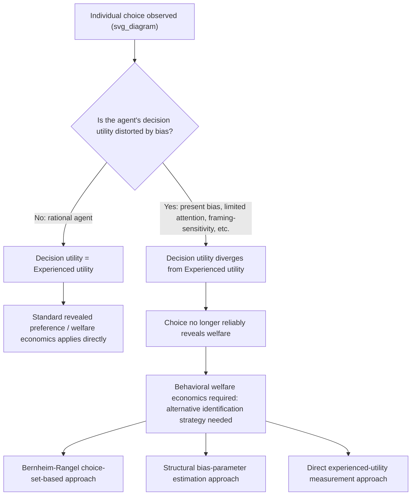

## Behavioral Welfare Economics

### Definition and Core Concept

**Behavioral welfare economics** is the subfield that extends and modifies standard neoclassical welfare economics to account for the possibility that individual choices do not reliably reveal individual welfare, once agents are subject to systematic behavioral biases (present bias, loss aversion, limited attention, and related deviations from full rationality). Standard welfare economics rests on the **revealed preference** principle: an agent's choices directly and reliably reveal their preferences, and their preferences are, by assumption, the correct normative standard for evaluating their own welfare — "the agent knows best." Behavioral welfare economics relaxes this foundational identification, asking: if choices can be systematically distorted by psychological biases, what should replace revealed preference as the welfare-relevant standard, and how should policy be evaluated when the very concept of a well-defined, choice-revealing preference ordering is called into question?

This is not a peripheral technical refinement — it strikes at the methodological core of applied welfare economics, since essentially all standard tools (consumer surplus, compensating/equivalent variation, cost-benefit analysis using willingness-to-pay) implicitly assume that observed choices are the correct input for welfare calculations.

### The Core Problem: Decision Utility versus Experienced (True) Utility

The foundational conceptual distinction in behavioral welfare economics, developed extensively by Kahneman and collaborators and formalized for public economics primarily by O'Donoghue and Rabin, Bernheim and Rangel, and others, separates:

- **Decision utility**: The utility function that actually generates and explains an individual's observed choices — what standard revealed-preference theory recovers from behavior.
- **Experienced (or "true," or long-run) utility**: The utility function that captures what actually makes the individual better or worse off, from the perspective the individual would themselves endorse upon full reflection or in the absence of the relevant bias.

Under standard rational-choice theory, these two coincide by assumption — choices reveal true preferences, full stop. Behavioral welfare economics is premised on the empirical and theoretical claim that, for biased agents, these can **diverge**: a present-biased individual's period-$t$ decision utility may lead them to under-save, even though their own experienced/long-run utility (the utility they would report or endorse when evaluating outcomes without present-bias distortion) would have preferred more saving.

### Diagram: The Behavioral Welfare Identification Problem

### The Bernheim-Rangel "Choice-Theoretic" Approach

Douglas Bernheim and Antonio Rangel (2007, 2009) developed an influential framework attempting to preserve as much of the discipline and rigor of revealed-preference welfare economics as possible while accommodating behavioral inconsistency, without requiring the analyst to take a stand on which specific psychological bias is operating or to directly measure a separate "experienced utility."

**Core method:**

1. Observe choices across multiple different **"ancillary conditions"** — decision environments/contexts (e.g., different framings, different levels of temptation exposure, different default settings) that a fully rational agent's preferences should be invariant to, but that may actually shift a biased agent's observed choice.
2. If an individual's choice is **consistent** across all relevant ancillary conditions (i.e., they always choose option A over B regardless of framing/context), this choice pattern is classified as revealing a genuine, welfare-relevant preference — standard welfare economics applies to it directly.
3. If choice is **inconsistent** across ancillary conditions (e.g., choosing A over B under one framing but B over A under another, logically equivalent framing), the analyst cannot use revealed preference alone to make a welfare judgment for this decision; some choices are excluded from the individual's classified true "welfare-relevant preference relation," and the analyst must either remain agnostic or bring in an explicit external welfare criterion to adjudicate.

**Strengths and limitations of this approach**

- **Strength**: Minimizes the analyst's need to impose an unverifiable external judgment about "what the person really wants," staying closer to the methodological discipline of standard revealed-preference economics, and explicitly formalizes when revealed-preference welfare analysis remains valid versus when it breaks down.
- **Limitation**: [Inference] By design, this approach is often silent or agnostic exactly where the policy questions are most pressing — for genuinely bias-affected choices with framing-dependent inconsistency, the framework identifies the *problem* rigorously but does not by itself prescribe a specific welfare-maximizing policy response, requiring supplementary judgment or an additional welfare criterion to move from diagnosis to prescription.

### Alternative Approach: Structural Behavioral Parameter Estimation

A second major methodological approach, closely associated with the quasi-hyperbolic discounting and related structural behavioral modeling literature (Laibson, O'Donoghue and Rabin), takes the position that the source of bias can be identified and structurally modeled (e.g., a specific $\beta$ present-bias parameter, a specific loss-aversion coefficient $\lambda$), and welfare is then evaluated using the **bias-free component of the estimated utility function** as the normative benchmark — for quasi-hyperbolic discounting, this typically means using the $\delta$-only (long-run) discounted utility, stripping out the $\beta$ present-bias distortion, as the welfare criterion.

**Strengths and limitations**

- **Strength**: Provides a specific, quantifiable welfare criterion that can be used directly for concrete policy counterfactual analysis (e.g., calculating the exact optimal corrective "sin tax" rate under a specified present-bias parameter, as in the O'Donoghue-Rabin behavioral optimal taxation framework).
- **Limitation**: [Inference] Requires the analyst to take a strong, potentially contestable stand on both the specific functional form of the bias and its estimated magnitude, and is vulnerable to misspecification — if the true source of divergent behavior is not actually the modeled bias (e.g., it is instead rational heterogeneous preference, or a different unmodeled bias), the resulting welfare calculation and policy prescription could be systematically wrong.

### Applications to Optimal Tax and Policy Design

**Behaviorally augmented optimal taxation**

As introduced in the corrective (sin) taxation framework, behavioral welfare economics directly enables formal optimal-tax calculations incorporating an **internality** correction term alongside the standard externality correction:

$$\tau^* = MED + MID$$

where $MID$, the marginal internal damage, is only a coherent, calculable object once a specific behavioral welfare criterion (e.g., the $\delta$-only long-run utility benchmark under quasi-hyperbolic discounting) has been adopted to define the gap between what the biased agent actually chooses and what maximizes their own true welfare.

**Behavioral cost-benefit analysis**

Standard cost-benefit analysis using observed willingness-to-pay (WTP) as a stand-in for welfare becomes problematic once WTP itself may be shaped by the biases under study (e.g., a present-biased individual's WTP for a retirement product may understate its true long-run value to them) — behavioral welfare economics has motivated proposed adjustments to standard cost-benefit practice, though [Inference] the specific adjustment methodology remains an active area of applied and methodological research without full professional consensus on a single standard approach.

**Optimal default and nudge design**

Evaluating whether a specific default or nudge is welfare-improving requires, at root, a behavioral welfare judgment about which of the potentially multiple observed choice patterns (under the default versus various alternative choice architectures) most closely reflects the individual's true welfare-relevant preference — directly operationalizing the Bernheim-Rangel or structural-parameter approaches in applied nudge evaluation.

### Key Debates and Critiques

**The "asymmetric information about preferences" objection**

A significant critique, raised by economists skeptical of extensive behavioral welfare reasoning, holds that policymakers/analysts are rarely in a genuinely better epistemic position than the individual to determine that individual's own true welfare, and that confidently overriding revealed choice risks substituting the analyst's own value judgments (or susceptibility to their own biases) for the individual's, particularly given the identification challenges noted throughout this framework (distinguishing genuine bias from rational heterogeneous preference).

**Political economy and "behavioral paternalism creep" concern**

[Inference] Some critics argue that once the principle is established that revealed choice can be overridden on behavioral welfare grounds in some cases, there is a risk of this reasoning being extended opportunistically to justify a much broader range of paternalistic interventions than the original behavioral evidence would strictly support — a "slippery slope" concern about the scope and limits of behavioral welfare-economic reasoning in practice, though this remains a normative/political-economy concern rather than a technical flaw in the behavioral welfare framework itself.

**Measurement of experienced utility**

Kahneman's own parallel research program (distinct from, but related to, the decision-utility/experienced-utility distinction as applied in economics) attempted to directly measure experienced utility via methods like the "day reconstruction method" and other subjective well-being surveys, offering a third potential empirical route to a welfare benchmark independent of both revealed choice and structural bias-parameter inference — though [Unverified: methodology remains actively debated] the reliability, comparability, and policy-usability of subjective well-being measures as a primary welfare metric remains a genuinely contested methodological question across economics, psychology, and philosophy.

**Heterogeneity across individuals**

As with behavioral corrective taxation and nudge design generally, any population-level behavioral welfare criterion (e.g., a single assumed $\beta$ parameter used to calibrate a national sin-tax rate) necessarily averages over what is empirically substantial individual heterogeneity in the true degree of bias, meaning the welfare criterion applied is, at best, an approximation appropriate on average rather than individually accurate for every affected person.

### Comparative Summary of Approaches

| Approach | Welfare Benchmark | Key Strength | Key Limitation |
| --- | --- | --- | --- |
| Standard revealed preference | Observed choice directly | Minimal external assumptions; standard rigor | Breaks down entirely if choice is bias-distorted |
| Bernheim-Rangel choice-theoretic | Choices consistent across ancillary conditions | Disciplined, minimizes unverifiable judgment calls | Often agnostic precisely where policy stakes are highest |
| Structural behavioral parameter | Bias-free component of estimated utility function (e.g., $\delta$-only utility) | Enables concrete, quantifiable policy counterfactuals | Requires strong, contestable assumptions about bias source/magnitude |
| Subjective well-being / experienced utility measurement | Directly measured hedonic/experienced reports | Independent of both choice and structural-model assumptions | Measurement reliability and policy-usability remain contested |

### Numerical Illustration: Welfare Evaluation Divergence

Consider a present-biased individual choosing whether to enroll in an automatic retirement-savings default, with $\beta = 0.7$, $\delta = 0.95$, as in the earlier present-bias numerical example. Suppose:

- **Decision-utility-based (revealed choice) welfare assessment**: If the individual, absent any default, would actively opt out of saving (their period-$t$ decision utility, discounted at $\beta\delta$, favors immediate consumption), standard revealed-preference welfare analysis would conclude that opting out is welfare-maximizing for this individual, since that is their observed choice.
- **Experienced/long-run-utility-based (behavioral) welfare assessment**: Evaluated instead using the $\delta$-only (bias-free) long-run utility criterion, the same individual's true welfare may in fact be maximized by the higher savings rate implied by remaining in the default enrollment — directly reversing the normative conclusion reached under the standard revealed-preference approach.

This divergence is the central, practically consequential feature that behavioral welfare economics exists to formalize and resolve: **the choice of welfare criterion is not a minor technical footnote but can flip the normative policy conclusion entirely**, which is precisely why the methodological debate over which criterion to adopt (Bernheim-Rangel, structural parameter estimation, or direct experienced-utility measurement) carries substantial real-world policy weight. [Inference] This is a stylized illustration of the conceptual mechanism; the specific welfare conclusion in any real policy application depends on the empirically estimated bias parameters and the chosen welfare criterion, both of which are subject to the identification and measurement challenges discussed above.

### Conclusion

Behavioral welfare economics addresses the foundational methodological challenge created once behavioral biases are taken seriously in public economics: if choices can be systematically distorted by present bias, framing, limited attention, or other psychological factors, the standard revealed-preference link between observed choice and individual welfare breaks down, and an alternative basis for welfare evaluation is required. The field has developed several complementary approaches — the disciplined but sometimes agnostic Bernheim-Rangel choice-theoretic framework, structural behavioral-parameter estimation using bias-free utility benchmarks, and direct experienced-utility/subjective-well-being measurement — each offering a different balance between methodological rigor, practical applicability to concrete policy questions, and vulnerability to misspecification or contestable normative assumptions. This is not a settled or fully resolved area: the choice of welfare criterion can materially reverse policy conclusions (as in the retirement-savings-default illustration), making behavioral welfare economics both methodologically foundational to, and one of the most actively debated frontiers within, modern behavioral public economics.

### Related Topics

- Behavioral Biases Relevant to Public Policy
- Present Bias and Commitment Devices
- Nudges, Defaults, and Libertarian Paternalism
- Corrective (Sin) Taxation under Behavioral Biases
- Bernheim-Rangel Choice-Theoretic Welfare Framework
- Decision Utility versus Experienced Utility (Kahneman)
- Subjective Well-Being Measurement and Policy Application
- Optimal Taxation with Internalities
- Asymmetric Paternalism and the Limits of Nudge-Based Policy
- Standard (Neoclassical) Welfare Economics and Revealed Preference Theory