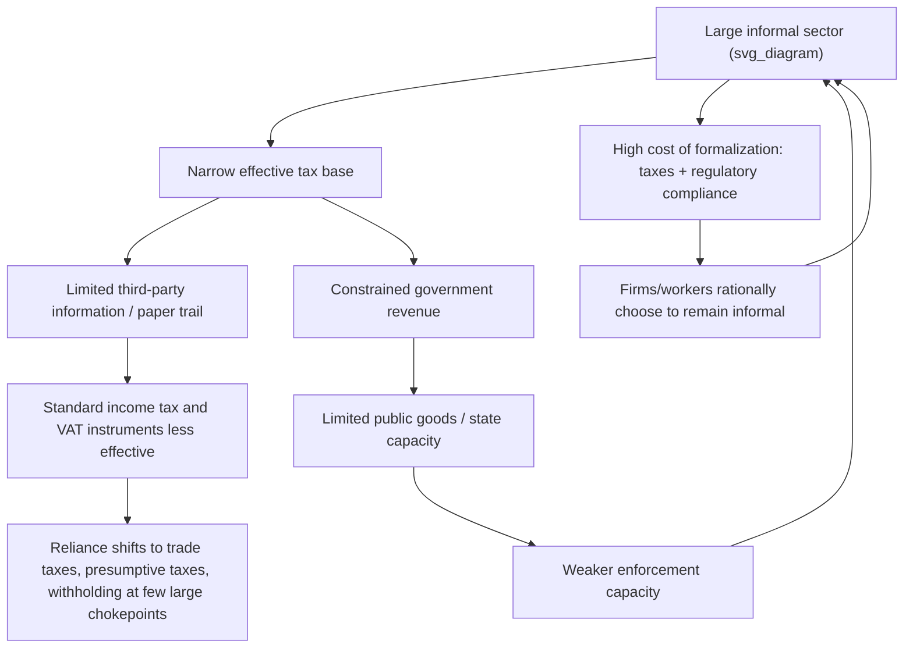

## Taxation and the Informal Sector

### Definition and Core Concept

The **informal sector** encompasses economic activity — production, employment, and transactions — that occurs outside the direct purview, regulation, and taxation of the state: unregistered firms, undeclared employment relationships, cash-based transactions without formal records, and self-employment activity that goes unreported to tax authorities. **Informality** is distinct from, though closely related to, tax evasion: informal firms and workers are typically entirely outside the formal tax net (not filing, not registered), whereas evasion often refers to formally registered taxpayers underreporting liability. Taxation of the informal sector represents one of the central and most distinctive challenges in **public economics in developing countries**, where informal economic activity often constitutes a substantial share — in many low- and middle-income countries, frequently estimated at roughly 30-70% of total employment or GDP depending on country and measurement methodology [Unverified: estimates vary substantially by country, measurement method, and year] — of total economic activity, fundamentally constraining the tax base, the design of feasible tax instruments, and the administrative capacity required for effective revenue collection.

### Key Points: Why Informality Matters for Public Finance

- **Narrow effective tax base**: A large informal sector means the income, consumption, and value-added tax bases actually accessible to the tax authority are much smaller than aggregate GDP would suggest, constraining revenue-raising capacity relative to what formal-sector-only tax rates might predict.
- **Limits on tax instrument choice**: Modern tax instruments that rely on third-party reporting, withholding, and paper/electronic trails (payroll income tax withholding, VAT invoice-matching) are far less effective against activity that leaves no formal paper trail, pushing developing-country tax systems toward instruments less reliant on self-reported formal records.
- **Equity and horizontal-equity concerns**: Formal-sector firms and workers bear the full statutory tax burden while informal-sector counterparts largely escape it, creating horizontal inequity between similarly situated economic actors and potential resentment/non-compliance spillovers into the formal sector.
- **Distortion of firm size and formalization decisions**: Because formalization typically triggers tax and regulatory obligations, firms may deliberately remain small or informal to avoid crossing formalization thresholds — a behavioral margin with first-order implications for aggregate productivity, since informal firms are frequently found to be less productive on average than comparable formal firms (in part because informality itself limits access to credit, larger markets, and formal contracting).

### Diagram: The Informality-Taxation Feedback Loop

### Why Informality Persists: Theoretical Perspectives

**1. Rational cost-benefit / exit view (de Soto tradition)**

Hernando de Soto's influential framework (*The Other Path*, 1989) frames informality as a rational response to excessive bureaucratic costs of formalization (registration fees, licensing requirements, minimum-wage and labor regulations, tax compliance costs) relative to the perceived benefits of formal status, particularly for small firms with limited need for formal credit access, government contracts, or large-scale formal customers.

**2. Dualistic/exclusion view**

An alternative tradition views informality less as a voluntary choice and more as a structural feature of labor markets with insufficient formal-sector job creation, where informal work is a residual absorption mechanism for workers unable to access limited formal employment opportunities — implying different policy prescriptions (formal job creation and labor demand policies rather than purely deregulation-focused formalization incentives).

**3. Heterogeneous informal sector view**

[Inference] A substantial and increasingly influential body of more recent research (e.g., drawing on firm-level census and survey data across multiple developing countries) suggests the informal sector is highly heterogeneous, comprising both a large mass of very low-productivity "survivalist" informal activity unlikely to formalize under almost any policy change, and a smaller subset of higher-productivity informal firms genuinely on the margin of the formalization decision — a distinction with significant implications for the design and expected yield of formalization-promoting tax and regulatory reforms, since a policy well-targeted to the marginal formalizable firms may have limited effect on the much larger survivalist segment.

### Standard Tax Instruments and Their Limitations in High-Informality Settings

**Personal and corporate income tax**

Income tax relies heavily on self-reporting and third-party information reporting (employer withholding, bank/financial institution reporting) to be enforceable; informal workers and firms, by definition, are largely outside these information-reporting networks, making income tax collection from the informal sector extremely difficult in practice, and explaining why personal income tax typically raises a much smaller share of GDP in developing countries with large informal sectors than in advanced economies.

**Value-Added Tax (VAT)**

VAT's self-enforcing structure — relying on the "invoice-credit" mechanism in which each formal-sector firm has an incentive to obtain documented purchase invoices to claim input credits — works well for formal, registered firms transacting with other formal firms, but breaks down at the boundary with the informal sector: informal firms neither charge nor remit VAT, and formal firms purchasing inputs informally lack invoices to support credit claims (or may under-report sales made to informal/final consumers who don't require a receipt), creating a leakage point at the formal-informal interface that limits VAT's effective revenue yield in economies with substantial informality.

**Trade taxes (tariffs)**

[Inference] Historically, many developing countries relied disproportionately on trade taxes (tariffs, import duties) precisely because imports pass through a small number of easily monitored chokepoints (ports, border crossings), making them far easier to tax than diffuse domestic informal activity — a major reason trade tax revenue has historically constituted a larger share of total tax revenue in many developing countries than in advanced economies, though this reliance has generally declined over recent decades amid trade liberalization and tariff reduction commitments under WTO and regional trade agreements.

**Presumptive taxation**

Given the difficulty of directly taxing actual informal-sector income or turnover, many developing countries employ **presumptive tax regimes** — simplified tax schedules that estimate tax liability based on observable proxies (business size, location, number of employees, estimated turnover bands, or fixed license fees) rather than requiring detailed, auditable financial records. Presumptive taxes trade off precision/equity (the estimated liability may not closely track actual profit or ability to pay) against administrative feasibility (they can be assessed and collected without the accounting infrastructure required for standard income or VAT compliance).

### Formalization Thresholds and Bunching

A well-documented empirical phenomenon in developing-country tax administration is **bunching** at formalization or tax-regime thresholds: firms' size (measured by turnover, employment, or other threshold criteria) exhibits an excess mass ("bunching") just below the threshold that triggers a discrete jump in tax or regulatory obligation (e.g., the threshold for mandatory VAT registration, or the threshold distinguishing a "micro" presumptive-tax regime from standard corporate taxation).

- **Mechanism**: Firms near the threshold face a strong incentive to deliberately under-report turnover, restrict genuine growth, or split into multiple smaller formal/informal units to remain just below the threshold and avoid the discrete increase in tax/compliance burden.
- **Policy implication**: The existence and magnitude of bunching provides direct empirical evidence of the real behavioral distortion created by threshold-based tax design, and has motivated research and policy debate on **notch versus kink** threshold design (a sharp discrete jump in liability at a "notch" generates much larger bunching and distortion than a smoothly graduated "kink" in the marginal rate schedule), directly relevant to designing VAT registration thresholds and presumptive-tax regime boundaries to minimize this margin of distortion.

### Formalization Incentive Policies

Beyond the direct tax-design choices above, a range of policy interventions have been studied and implemented to encourage voluntary formalization:

- **Simplified registration procedures**: Reducing the bureaucratic cost/time of formal registration (e.g., Brazil's SIMPLES/MEI simplified micro-entrepreneur regime, and various "one-stop-shop" business registration reforms studied across multiple countries) to lower the direct cost side of the formalization cost-benefit calculation.
- **Reduced/simplified tax rates for newly formalized firms**: Offering lower presumptive or simplified tax rates specifically to firms transitioning from informal to formal status, sometimes with temporary "tax holiday" periods, to improve the near-term net benefit of formalizing.
- **Linking formalization to tangible benefits**: Conditioning access to formal credit, government contracts, or social insurance/pension benefits on formal registration status, to increase the perceived benefit side of the formalization decision (directly relevant to debates on how strongly social insurance access should be tied to formal-sector labor market status in developing-country welfare-state design).
- **Enforcement and detection technology**: Investments in tax administration capacity — third-party data matching (e.g., using utility bills, bank records, or e-commerce/digital payment data as indirect signals of otherwise-unreported informal activity), risk-based audit targeting, and increasingly, use of satellite imagery, mobile-money transaction data, and other digital footprints to identify unregistered economic activity.

### Digital Payments and Mobile Money as an Emerging Formalization Channel

[Inference] The rapid expansion of mobile money and digital payment systems in many developing countries (e.g., M-Pesa-style mobile money platforms across parts of Sub-Saharan Africa, and broader growth of digital payment infrastructure elsewhere) has generated substantial research and policy interest as a potential channel for expanding the tax net, since digital transactions inherently generate an electronic record that can, in principle, be leveraged for tax administration purposes in a way that pure cash transactions cannot — though the actual revenue-raising potential of this channel depends heavily on the specific legal/administrative framework governing access to and use of such transaction data for tax purposes, and on the continued prevalence of cash alongside digital payment growth, both of which vary considerably by country and are subject to ongoing policy and technological evolution.

### Numerical/Conceptual Illustration: The Formalization Decision

Consider a small firm deciding whether to formalize, facing a simplified cost-benefit comparison:

**Costs of formalizing:**

- Registration and compliance costs (time, fees): $C_{reg}$
- Ongoing tax liability under the applicable formal-sector regime: $\tau \cdot \Pi$ (tax rate times profit)
- Ongoing regulatory compliance costs (labor law, licensing, reporting): $C_{comp}$

**Benefits of formalizing:**

- Access to formal credit markets, typically at lower interest rates than informal credit: $\Delta r \cdot K$ (interest-rate savings on capital $K$)
- Access to formal contracts, government procurement, or larger formal-sector customers: $\Delta \Pi_{market\ access}$
- Legal protection and reduced harassment/bribe payments to informal-sector-targeting enforcement: $\Delta Bribes$

A firm formalizes when:

$$\Delta r \cdot K + \Delta \Pi_{market\ access} + \Delta Bribes > C_{reg} + \tau \cdot \Pi + C_{comp}$$

[Inference] This is a stylized conceptual framework rather than a precisely calibrated empirical model; the relative magnitude of each term varies enormously by country, sector, and firm size, and is the subject of substantial ongoing empirical research (including randomized formalization-incentive field experiments in several developing countries) attempting to identify which specific cost-reduction or benefit-enhancement interventions most effectively shift firms across this threshold in practice.

### Empirical Evidence on Formalization Interventions

- Randomized and quasi-experimental studies of simplified-registration and reduced-tax-rate interventions across multiple developing-country contexts have generally found that **reducing registration costs alone** produces only modest formalization responses, since for many informal firms — particularly the lowest-productivity "survivalist" segment — the tax and regulatory compliance burden itself, not merely the one-time registration hurdle, is the binding constraint, or formalization offers genuinely limited benefit given the firm's small scale and customer base. [Inference] This finding pattern, while not universal across every study and context, has been influential in shifting policy and research emphasis away from purely deregulation/simplification-focused formalization strategies toward more targeted approaches recognizing the heterogeneity of the informal sector.
- Studies of Brazil's SIMPLES program and related simplified micro-enterprise tax regimes found some positive formalization response to reduced and simplified tax burdens, though with debated conclusions regarding the net fiscal cost-effectiveness and whether formalized firms achieved meaningfully higher productivity/growth post-formalization relative to their informal counterparts.

### Political Economy and State Capacity Dimensions

- **Tax morale and reciprocity**: Willingness to formalize and comply with tax obligations is linked in the literature to perceived quality of public goods and services received in return (a "fiscal contract" or reciprocity view of tax compliance), suggesting that low state capacity to deliver visible public benefits can itself perpetuate low formalization/compliance even holding formal tax rates and registration costs constant.
- **Administrative capacity constraints**: Developing-country tax authorities often face severe capacity constraints (limited auditors, weak inter-agency data-sharing, limited digital infrastructure) that independently limit enforcement against informality regardless of the formal legal tax design, reinforcing that taxation of the informal sector is as much an administrative/state-capacity challenge as a tax-policy-design challenge.
- **Corruption interaction**: In contexts with significant corruption or informal payments to officials/inspectors, the effective "tax" burden facing an informal firm may include substantial bribe payments that do not appear in official statistics but materially affect the true formalization cost-benefit calculation, complicating both measurement of informality's fiscal cost and the design of effective formalization incentives.

### Conclusion

Taxation of the informal sector represents a defining structural challenge for public finance in developing countries: large informal sectors narrow the effective tax base, undermine the third-party-reporting mechanisms that make modern income tax and VAT instruments effective, and create equity and firm-size distortions at the formal-informal boundary. Standard responses — presumptive taxation, simplified registration, formalization incentive programs, and expanding use of digital transaction data — each offer partial solutions but face significant limitations, particularly given growing recognition that the informal sector is highly heterogeneous, ranging from low-productivity survivalist activity largely unresponsive to formalization incentives to a smaller genuinely marginal segment where targeted policy can meaningfully shift formalization decisions. Effective policy in this domain typically requires combining tax-design adjustments (threshold and notch design to limit bunching distortions, presumptive regime calibration) with broader administrative capacity investment and attention to the reciprocal "fiscal contract" between the state's tax demands and its delivery of public goods and services.

### Related Topics

- Presumptive Taxation and Simplified Tax Regimes
- Value-Added Tax Design and the Invoice-Credit Mechanism
- Bunching Estimation and Notch versus Kink Threshold Design
- Trade Taxes and Tariff Reliance in Developing-Country Revenue Systems
- Tax Morale, Fiscal Contract, and Reciprocity-Based Compliance
- State Capacity and Tax Administration in Low-Income Countries
- Mobile Money, Digital Payments, and Tax Base Expansion
- Firm Formalization Incentives and Randomized Policy Evaluation
- Horizontal Equity Between Formal and Informal Economic Actors
- Social Insurance Design and Labor Market Informality