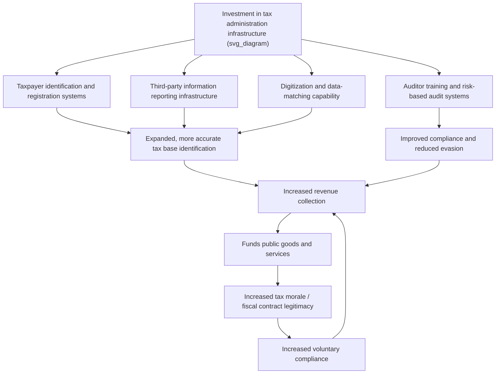

## Building State Tax Capacity

### Definition and Core Concept

**State tax capacity** (also termed fiscal capacity or tax administration capacity) refers to a government's institutional, technological, and organizational ability to identify taxpayers, assess tax liability accurately, collect revenue efficiently, and enforce compliance at reasonable administrative cost. Unlike the standard optimal-tax framework in advanced-economy public finance — which typically treats the tax administration technology as a fixed, unproblematic background assumption and focuses primarily on optimal *rates* and *bases* given full enforceability — public economics in developing-country contexts treats tax capacity itself as an **endogenous, investable state asset** that must be deliberately built over time, and that fundamentally constrains which tax instruments are administratively feasible at any given stage of institutional development.

### Why Tax Capacity Is a Distinct Analytical Object

**Key Points**

- **Enforcement is not free or automatic**: Unlike the standard textbook assumption that a tax, once legislated, is straightforwardly collected at the statutory rate, real tax collection requires costly investment in taxpayer identification (registries, unique identifiers), information infrastructure (third-party reporting systems, cross-matching databases), auditing capability, and legal/judicial enforcement mechanisms — investments that many developing-country states have historically lacked the resources or institutional history to build.
- **Tax capacity is path-dependent and cumulative**: Modern information-intensive tax systems (VAT with invoice matching, income tax with employer withholding and bank reporting) rely on administrative infrastructure — reliable taxpayer identification numbers, digitized records, inter-agency data sharing — that itself requires years or decades of cumulative investment, meaning tax capacity cannot be instantly legislated into existence even where political will exists.
- **Tax capacity shapes feasible tax design, not just revenue yield**: Given limited administrative capacity, a government must choose tax instruments matched to its actual enforcement capability, not merely to abstract efficiency criteria — explaining, for instance, historical developing-country reliance on trade taxes (collected at a small number of easily monitored border chokepoints) over broad-based income taxation requiring extensive taxpayer-level information infrastructure.
- **State capacity and legitimacy interact bidirectionally**: Building tax capacity is not purely a technical/administrative exercise; it interacts with political legitimacy, since citizens' willingness to comply and provide accurate information depends partly on trust in the state's use of revenue (the "fiscal contract" concept), while effective revenue collection in turn funds the public goods and services that build that trust — a reinforcing (or, if broken, self-undermining) cycle.

### Diagram: The Tax Capacity Building Cycle

### Historical and Comparative Perspective: The State-Building Literature

A substantial political-economy and economic-history literature (drawing on work by Besley and Persson, among others) situates tax capacity building within the broader process of **state capacity development**, historically linked in many advanced economies to:

- **War and external conflict**: The classical "bellicist" thesis in political science and economic history (associated with Charles Tilly's work, and formalized economically by Besley and Persson, 2009, 2011) argues that historical fiscal capacity development in now-advanced economies was substantially driven by the revenue demands of interstate warfare, which forced early states to build tax collection infrastructure they might not otherwise have prioritized — a historical pathway largely unavailable or differently structured for many contemporary developing states.
- **Legal and property rights infrastructure**: Complementary investment in formal property registries, contract enforcement, and legal identity systems (birth registration, national ID systems) is frequently identified in the literature as a necessary complementary investment alongside narrowly defined tax administration infrastructure, since much of modern taxation (property tax, income tax) fundamentally depends on reliable underlying legal/identification infrastructure.
- **Complementarity between fiscal and legal capacity**: Besley and Persson's formal framework emphasizes that investments in fiscal capacity (tax collection infrastructure) and legal capacity (contract enforcement, property rights) are often complementary, with countries that under-invest in one frequently under-investing in the other, generating a joint "capacity trap" that can be self-reinforcing absent a strong enough exogenous shock or sustained deliberate investment to escape.

### Core Components of Tax Administration Capacity Building

**1. Taxpayer identification and registration systems**

Establishing reliable, unique taxpayer identifiers (Tax Identification Numbers, TINs) linked where possible to broader national identity systems, enabling the tax authority to actually know who potential taxpayers are — a foundational prerequisite absent which virtually no other administrative capacity-building investment can function effectively.

**2. Third-party information reporting and data matching**

Building systems that require employers, banks, and other institutions to report income, transaction, and asset information directly to the tax authority (rather than relying solely on self-reported taxpayer information), and building the technical (often increasingly digital/database) capacity to cross-match this third-party data against taxpayer filings to detect discrepancies — the single most consistently identified driver of effective income tax and VAT enforcement in the empirical tax administration literature, given the well-documented finding that self-reported income subject to little or no third-party verification exhibits dramatically higher rates of underreporting than third-party-verified income (a pattern robustly documented, including in foundational work using randomized audit studies such as Kleven, Knudsen, Kreiner, Pedersen, and Saez, 2011, in Denmark, with broadly consistent qualitative patterns found in developing-country contexts as well).

**3. Risk-based audit selection and enforcement**

Moving from resource-intensive universal or random auditing toward data-driven, risk-based targeting of audit resources at taxpayers/transactions most likely to involve substantial non-compliance, requiring both the underlying data infrastructure (point 2) and analytical/statistical capacity to build effective risk-scoring models.

**4. Simplification of tax design matched to administrative capacity**

Deliberately choosing simpler tax instruments (presumptive taxes, simplified turnover-based regimes for small firms, fewer tax brackets/rates) calibrated to actual enforcement capacity rather than theoretically optimal but administratively infeasible complex tax schedules — recognizing, per the broader "tax administration matters" literature (closely associated with Richard Bird and others), that a simpler, imperfectly targeted tax that can actually be enforced often dominates a theoretically superior but practically unenforceable alternative.

**5. Digitization and technology adoption**

Electronic filing systems, digital invoicing/e-invoicing mandates for VAT (increasingly adopted across Latin America and elsewhere), mobile-money and digital-payment transaction data integration, and government-to-government data-sharing platforms, all lowering the marginal cost of both compliance (for taxpayers) and enforcement (for the tax authority) relative to paper-based systems.

**6. Institutional and organizational reform**

Establishment of semi-autonomous revenue authorities (a widely adopted reform model across numerous developing countries since the 1990s, separating tax administration from the broader, often more politically constrained and lower-capacity civil service, with adjusted compensation and staffing flexibility intended to attract and retain more capable administrative staff), professionalization of the tax auditor/collector workforce, and anti-corruption measures within the tax administration itself.

### Empirical Evidence on Tax Capacity-Building Interventions

- **Semi-autonomous revenue authorities (SARAs)**: Numerous developing countries (across Sub-Saharan Africa, Latin America, and elsewhere) established semi-autonomous revenue authorities beginning in the 1990s, with [Inference] mixed and context-dependent empirical findings regarding their revenue-yield effectiveness — some studies find meaningful revenue gains associated with SARA establishment, particularly in the years immediately following reform, while others find effects that fade over time or vary substantially depending on the broader political and institutional context, so SARA reform should not be viewed as a uniformly and permanently effective intervention independent of complementary institutional factors.
- **Third-party reporting and data-matching interventions**: Randomized and quasi-experimental studies in multiple developing-country contexts (including studies on VAT invoice/e-invoicing systems, cross-matching of firm-to-firm transaction data, and property tax administration reforms using satellite-imagery-based property identification) have generally found that expanding third-party verifiable information significantly improves compliance and revenue collection relative to self-reported-only tax bases, reinforcing the third-party-reporting mechanism as a central, empirically well-supported capacity-building lever.
- **Property tax administration reforms**: Studies of property tax reforms in various developing-country municipal contexts (e.g., using satellite imagery or systematic property surveys to build more complete and accurate property registries as a base for property taxation) have found substantial revenue gains from simply improving the underlying information base used to assess an existing tax, independent of any change in the statutory tax rate — illustrating that administrative/informational capacity building can itself be a first-order revenue-raising lever, separate from rate-setting policy.

### The Tax Capacity and Development Relationship

A substantial cross-country empirical literature documents a strong positive correlation between tax revenue as a share of GDP and per-capita income/development level across countries — advanced economies typically collect tax revenue equivalent to a considerably higher share of GDP than low-income developing countries. [Inference] While this correlation is robust and widely documented, the underlying causal direction and mechanism remain actively debated in the literature: higher tax capacity may partly be a *consequence* of development (richer economies naturally generate more easily taxable formal-sector activity), a *cause* of development (via funding public goods, infrastructure, and human capital investment), or both, operating through the kind of reinforcing cycle depicted in the diagram above — meaning simple cross-country correlations should not be interpreted as establishing a straightforward, one-directional causal policy prescription.

### Trade-offs and Debates in Capacity-Building Strategy

**Sequencing debate: broad-based versus targeted capacity investment**

[Inference] A recurring practical policy debate concerns whether limited administrative capacity-building resources are better allocated toward broadening the *overall* taxpayer base (registering and administratively capturing many small, low-yield taxpayers) versus concentrating scarce administrative capacity on effectively taxing a smaller number of large taxpayers (often already identified via a "Large Taxpayer Unit" or LTU approach, a widely adopted institutional model that concentrates administrative attention on the relatively small number of large firms that typically account for a disproportionate share of total tax revenue) — with the latter often argued to offer a higher near-term revenue return on scarce administrative capacity, though at the cost of leaving the (potentially large) informal and small-taxpayer segment largely untaxed in the interim.

**Donor-supported capacity building and conditionality**

Substantial technical and financial assistance for tax administration capacity building has historically been provided by international financial institutions (IMF technical assistance programs, World Bank tax administration projects) and bilateral donors, sometimes linked to broader fiscal conditionality in lending programs; [Inference] the effectiveness and sustainability of externally supported capacity-building programs, versus domestically driven and owned reform processes, is a subject of ongoing debate in the development-finance and public-administration literature, with concerns raised in some studies about the durability of capacity gains once external technical assistance support is withdrawn.

**Technology adoption pace and complementary capacity**

[Inference] Rapid digitization/technology adoption (e-filing, e-invoicing, biometric identification systems) can generate substantial capacity gains, but the literature also documents cases where technology investments outpaced complementary human-capital and organizational capacity (e.g., systems implemented without adequately trained staff to use the resulting data effectively, or without adequate legal/institutional frameworks for data use), suggesting that technology investment alone, absent complementary organizational and human-capital investment, may yield limited returns.

### Illustrative Framework: Tax Capacity as a State Investment Decision

A stylized way to conceptualize the tax-capacity-building decision, drawing on the Besley-Persson framework, treats fiscal capacity $\kappa_t$ as a state capital stock that evolves according to:

$$\kappa_{t+1} = \kappa_t (1-\delta) + I_t(\kappa_t, \text{political incentives}_t)$$

where $\delta$ is a depreciation rate (capacity can atrophy without maintenance) and $I_t$ is capacity-building investment, itself a function of both existing capacity (capacity may be complementary/cumulative — easier to build more capacity where some already exists) and prevailing political incentives (e.g., political stability, external conflict, or governing coalition interests that determine how much a given government prioritizes long-run capacity investment over short-run alternative uses of resources). [Inference] This is a conceptual/illustrative formalization rather than a single universally estimated empirical model; the Besley-Persson research program and subsequent extensions have developed and calibrated various specific versions of this general logic across different country and historical contexts.

### Conclusion

Building state tax capacity is a foundational, first-order challenge in developing-country public economics, distinct from — and in practice often prior to — the standard optimal-tax-rate-and-base design questions that dominate advanced-economy public finance. Effective capacity building requires coordinated investment across taxpayer identification systems, third-party information reporting and data-matching infrastructure, risk-based enforcement capability, institutional reform (including semi-autonomous revenue authority models), and technology adoption, all calibrated to and complementary with a country's broader legal and state-capacity development trajectory. The empirical and historical literature — spanning the bellicist state-formation thesis, semi-autonomous revenue authority evaluations, and randomized third-party-reporting interventions — broadly supports the centrality of information infrastructure and third-party verification as the most robust lever for capacity building, while also highlighting genuine debates around sequencing (broad-base versus large-taxpayer-focused strategies), the durability of externally supported reform, and the risk of technology investment outpacing complementary organizational capacity.

### Related Topics

- Taxation and the Informal Sector
- Semi-Autonomous Revenue Authorities and Institutional Reform
- Third-Party Information Reporting and Tax Compliance (Kleven et al.)
- Besley-Persson Fiscal and Legal Capacity Framework
- Bellicist State-Formation Thesis and Historical Tax Capacity Development
- Large Taxpayer Units and Administrative Resource Allocation
- Tax Morale, Fiscal Contract, and Reciprocity-Based Compliance
- Property Tax Administration and Satellite-Imagery-Based Assessment
- Digitization and E-Invoicing in VAT Administration
- Presumptive Taxation and Simplified Tax Regimes