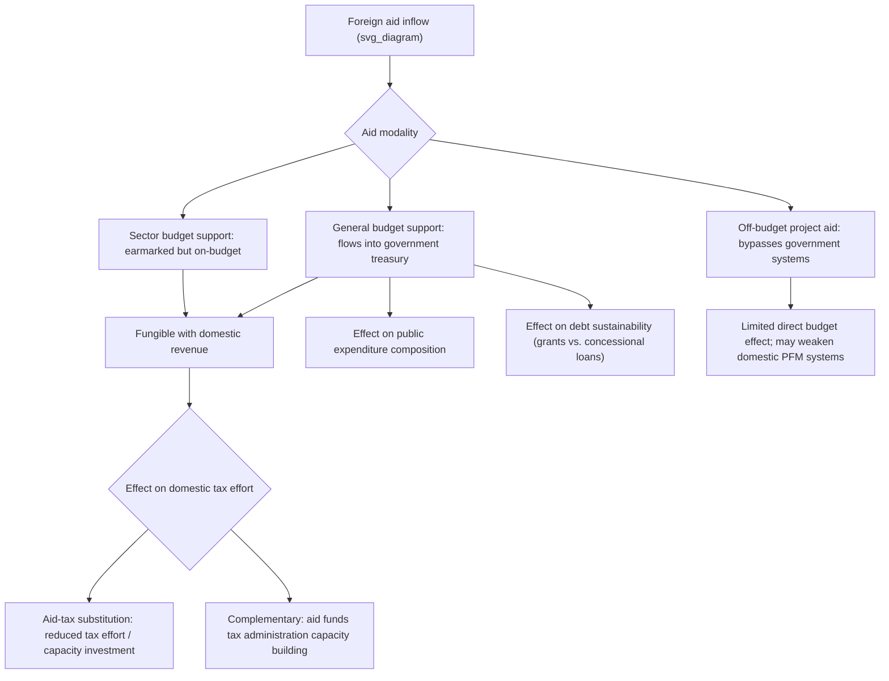

## Foreign Aid and Public Finance

### Definition and Core Concept

Foreign aid — encompassing bilateral official development assistance (ODA), multilateral grants and concessional loans (from institutions such as the World Bank and regional development banks), and humanitarian assistance — interacts with recipient-country public finance in ways that extend well beyond simply adding to available government resources. Because aid flows typically pass through or directly substitute for domestic fiscal instruments (government budgets, tax collection, borrowing), the public economics literature on foreign aid focuses substantially on how aid affects recipient-government **fiscal behavior**: domestic revenue mobilization effort, public expenditure composition, debt sustainability, and the broader institutional incentives facing recipient governments — questions largely distinct from, though related to, the separate macroeconomic and growth-effectiveness literature on aid's impact on GDP growth.

### Key Points: Why Aid Is a Public Finance Question, Not Just a Growth Question

- **Aid enters directly through the government budget constraint**: Unlike most other external resource flows (FDI, remittances, which primarily flow to private actors), a substantial share of foreign aid — particularly budget support and sector-specific grants — flows directly to or through recipient governments, making it a direct substitute or complement to domestic tax revenue and borrowing within the government's own intertemporal budget constraint.
- **Aid can alter the incentives facing tax authorities and political leaders**: Because aid provides an alternative revenue source not requiring the same domestic political costs (voter/taxpayer resistance) as raising taxes, its presence can theoretically weaken the political and administrative effort a government devotes to building domestic tax capacity — the central concern of the **aid-tax substitution** or "fiscal displacement" literature.
- **Aid interacts with the "fiscal contract" and accountability**: A parallel political-economy literature argues that government accountability to citizens is partly grounded in the state's dependence on citizen-paid tax revenue (a "no taxation without representation, no representation without taxation" logic); heavy reliance on foreign aid rather than domestic taxation may, in this view, weaken the domestic political accountability relationship between citizens and government, since the government's resource base becomes less dependent on domestic taxpayer consent.
- **Aid modality matters greatly**: The fiscal implications of aid differ substantially depending on whether it is delivered as **general budget support** (fungible cash flowing directly into the government's general treasury), **sector budget support** (earmarked for a specific sector but still flowing through government systems), or **off-budget project aid/parallel implementation** (bypassing government budget systems entirely, often via NGOs or direct donor-managed project implementation) — each modality has distinct implications for fungibility, government ownership, and effects on domestic public financial management systems.

### Diagram: Aid's Channels of Influence on Recipient Public Finance

### The Aid-Tax Substitution ("Fiscal Displacement") Hypothesis

**Theoretical mechanism**

The core hypothesis, developed across a substantial empirical public finance and political economy literature, is that foreign aid — being a source of government revenue that does not require the same domestic political costs, tax-collection administrative investment, or accountability relationship as raising taxes — may lead recipient governments to substitute aid for domestic tax effort, either by:

1. Directly reducing statutory tax rates or relaxing enforcement given the availability of alternative aid revenue, or
2. Under-investing in the costly, politically difficult process of building domestic tax administration capacity, since aid provides an easier near-term alternative revenue source.

**Empirical evidence**

[Unverified: findings are genuinely mixed and sensitive to methodology, time period, and aid type] The empirical literature testing aid-tax substitution has produced results that vary considerably by study, country sample, time period, and — critically — by the type of aid examined:

- Some cross-country panel studies have found a negative association between aid inflows (particularly grant-based general budget support) and domestic tax revenue as a share of GDP, consistent with the substitution hypothesis.
- Other studies, particularly those examining aid specifically targeted at tax administration capacity building (technical assistance for revenue authorities, as discussed in the Building State Tax Capacity topic), find aid can be **complementary** to domestic revenue mobilization rather than substitutive, directly funding the administrative infrastructure investments that raise long-run tax capacity.
- [Inference] A reasonable synthesis of this mixed evidence, consistent with much of the more recent literature, is that the aid-tax relationship is highly dependent on aid *composition* and *conditionality design* — aid delivered with strong domestic-revenue-mobilization conditionality or specifically earmarked for tax administration capacity building appears more likely to be complementary, while unconditional general budget support in weak-institutional-accountability contexts appears more consistent with the substitution concern — rather than a single universal relationship holding across all aid types and contexts.

### Aid, Debt Sustainability, and the Grant-Loan Distinction

Foreign aid flows to government take two principal financial forms with distinct fiscal implications:

- **Grants**: Non-repayable transfers, directly increasing government resources without any future repayment obligation — the most straightforwardly beneficial form from a pure debt-sustainability perspective.
- **Concessional loans**: Below-market-rate lending (often through multilateral development banks or bilateral development finance institutions) that, while more favorable than commercial borrowing, still creates a genuine future repayment obligation and contributes to the recipient government's outstanding debt stock, subject to the same debt sustainability analysis (the $b_t = b_{t-1}\frac{1+r}{1+g} - s_t$ debt dynamics framework discussed in the Deficit Financing versus Tax Financing and Fiscal Rules topics) as any other government borrowing.

**Debt sustainability framework application**

Multilateral institutions (IMF and World Bank jointly) apply a formal **Debt Sustainability Framework (DSF)** for low-income countries, assessing projected debt trajectories against country-specific thresholds (varying by assessed debt-carrying capacity) to classify countries' risk of debt distress and to guide the appropriate grant-versus-loan mix and overall borrowing envelope for new aid/financing commitments — directly linking foreign aid financing decisions to the broader public-finance debt-sustainability analytical apparatus.

**Debt relief episodes**

Large-scale multilateral debt relief initiatives — notably the **Heavily Indebted Poor Countries (HIPC) Initiative** (launched 1996, enhanced 1999) and the subsequent **Multilateral Debt Relief Initiative (MDRI)** (2005) — represent major historical episodes in which accumulated concessional-loan-based aid debt was substantially forgiven for eligible low-income countries meeting specified poverty-reduction and governance conditionality criteria, illustrating the practical fiscal-sustainability tensions that can arise even from nominally "concessional" aid-related borrowing over an extended period.

### Aid Volatility and Fiscal Management

A distinctive and heavily studied feature of aid as a public finance resource is its **volatility and unpredictability** relative to domestic tax revenue:

- **Pro-cyclicality and unpredictability concerns**: Aid disbursements are frequently found in the empirical literature to be more volatile, and in some contexts more pro-cyclical (falling precisely when recipient-country economic conditions or donor-country political/budgetary conditions are weak), than domestic tax revenue, creating fiscal planning and budget-execution challenges for recipient governments relying substantially on aid financing.
- **Within-year disbursement unpredictability**: Beyond year-to-year volatility, aid disbursements often arrive with substantial within-fiscal-year timing unpredictability relative to donor commitments and recipient budget calendars, complicating cash management and potentially forcing suboptimal within-year expenditure adjustments.
- **Policy implications**: This volatility has motivated policy emphasis on aid predictability commitments (part of the broader 2005 Paris Declaration on Aid Effectiveness and subsequent aid-effectiveness agenda focused on alignment with recipient budget cycles and systems), and has been cited as a rationale for recipient governments maintaining fiscal buffers or diversified revenue sources rather than budgeting on the assumption of fully reliable aid disbursement.

### Fungibility and Expenditure Composition Effects

**The fungibility problem**

Because money is fungible within a government budget, aid explicitly earmarked for a specific purpose (e.g., a health sector program) may in practice simply free up an equivalent amount of the government's own domestic resources that would otherwise have been spent on that sector, which the government then reallocates to other spending priorities (or tax relief) — meaning the observed sectoral allocation of aid disbursement does not necessarily reflect the true marginal effect of aid on that sector's actual funding level.

**Empirical evidence on fungibility**

[Inference] A body of empirical work examining whether sector-specific aid actually translates into higher total (aid-plus-domestic) spending in the targeted sector, versus simply displacing domestic resources that are reallocated elsewhere, generally finds evidence of at least partial fungibility (sector-earmarked aid does not translate one-for-one into equivalent increases in total sectoral spending), though the degree of fungibility found varies across studies, sectors, and country contexts, and full fungibility is also not universally found — some studies find aid does shift the marginal composition of spending toward the targeted sector, at least partially, particularly where strong conditionality or monitoring accompanies the aid.

### Aid Conditionality and Public Financial Management Reform

Multilateral and bilateral aid has frequently been linked to explicit **conditionality** requiring recipient-government policy reforms, historically including:

- **Structural adjustment conditionality** (particularly associated with IMF and World Bank lending from the 1980s through the 1990s): Often including fiscal conditionality around deficit reduction, subsidy removal, and public sector reform, subject to substantial and ongoing debate regarding both economic effectiveness and social/distributional impact, particularly in earlier structural adjustment program design.
- **Public Financial Management (PFM) reform conditionality**: More recent aid-effectiveness-era conditionality has increasingly emphasized strengthening recipient-country budget systems, procurement processes, and financial reporting/audit institutions directly, both as a precondition for expanded use of general budget support modalities (since donors require confidence in recipient PFM systems before channeling aid directly through them) and as a capacity-building objective in its own right.
- **Governance and domestic revenue mobilization conditionality**: Increasing donor emphasis (reflected in various bilateral and multilateral aid program designs) on linking aid disbursement to demonstrated recipient-government progress on domestic revenue mobilization indicators, directly intended to counteract the aid-tax substitution concern discussed above.

### The Aid Effectiveness Agenda and Institutional Reform

The **Paris Declaration on Aid Effectiveness (2005)** and subsequent follow-up agreements (Accra Agenda for Action 2008, Busan Partnership 2011) established internationally endorsed principles intended to improve aid's fiscal integration and effectiveness, including:

- **Ownership**: Recipient countries should lead their own development strategies rather than having priorities set externally by donors.
- **Alignment**: Donors should align aid disbursement with recipient-country budget cycles, systems, and priorities rather than imposing parallel, donor-specific project management structures.
- **Harmonization**: Donors should coordinate among themselves to reduce the administrative burden on recipient governments from managing numerous separate donor relationships and reporting requirements.
- **Managing for results and mutual accountability**: Shifting emphasis toward measurable development outcomes and reciprocal donor-recipient accountability.

[Inference] The degree to which these principles have been fully implemented in practice varies substantially across donors and recipient countries, and assessment of the aid-effectiveness agenda's actual impact on aid's fiscal integration and effectiveness remains a genuinely contested area in the development-policy literature, with continued documented instances of off-budget, poorly coordinated, or parallel-system aid delivery notwithstanding the formal international commitments.

### Numerical Illustration: Aid's Effect on the Government Budget Constraint

Recall the government's basic period budget identity (as in Deficit Financing versus Tax Financing):

$$G_t = T_t + \Delta B_t + A_t$$

where $A_t$ represents net foreign aid inflows to government (grants plus net new concessional borrowing). If a government receiving $500 million in general budget support aid ($A_t = 500$) simultaneously reduces planned domestic tax effort by $200 million relative to its counterfactual no-aid tax path (a stylized illustration of partial aid-tax substitution), then:

- **Naive assumption (full additionality)**: Aid should increase total available government resources by the full $500 million.
- **Actual effect under partial substitution**: Net resource increase is only $500M − $200M = $300 million, since domestic tax effort fell by $200 million rather than remaining at its counterfactual level.

This illustrates why simply summing reported aid disbursements can overstate the true net fiscal resource impact of aid if any degree of aid-tax substitution or expenditure fungibility is present — a central methodological concern in empirically evaluating aid's true fiscal and developmental impact. [Inference] This is a stylized numerical illustration; actual substitution magnitudes are empirically estimated and, per the discussion above, vary substantially and are genuinely contested across studies.

### Conclusion

Foreign aid's interaction with recipient-country public finance extends well beyond simply supplementing government resources: it raises substantive questions about its effect on domestic tax effort and capacity-building incentives (the aid-tax substitution hypothesis, with genuinely mixed empirical evidence depending on aid composition and conditionality), its implications for debt sustainability (particularly for the concessional-loan component, subject to formal IMF/World Bank debt sustainability frameworks and historically significant debt-relief episodes such as HIPC/MDRI), its characteristic volatility relative to domestic revenue (creating distinct fiscal planning challenges), and its fungibility with domestic budget allocations (complicating straightforward interpretation of aid's sectoral targeting). The aid-effectiveness agenda, emphasizing recipient ownership, budget-system alignment, and donor harmonization, represents an internationally endorsed but unevenly implemented attempt to better integrate aid into sound recipient public financial management, directly connecting the foreign-aid literature to the broader state-tax-capacity-building themes central to public economics in developing countries.

### Related Topics

- Building State Tax Capacity
- Taxation and the Informal Sector
- Aid-Tax Substitution and Domestic Revenue Mobilization
- Debt Sustainability Analysis and the IMF-World Bank Debt Sustainability Framework
- HIPC Initiative and Multilateral Debt Relief (MDRI)
- Fungibility of Earmarked Aid and Sectoral Expenditure Composition
- Paris Declaration on Aid Effectiveness and Aid Modality Design
- Tax Morale, Fiscal Contract, and Reciprocity-Based Compliance
- Structural Adjustment Programs and Conditionality
- Government Intertemporal Budget Constraint