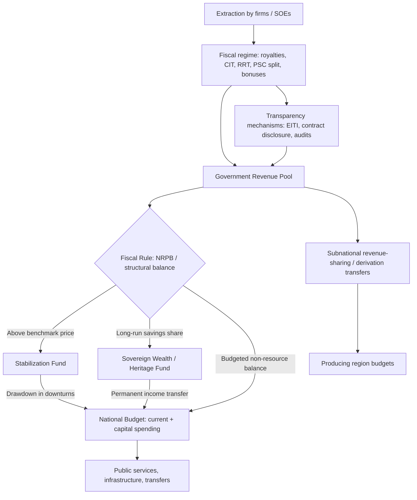

## Natural Resource Revenue Management

### Conceptual Foundations

Natural resource revenue management refers to the set of fiscal institutions, rules, and policies governing how governments collect, save, invest, and spend income derived from the extraction of exhaustible natural resources — oil, natural gas, minerals, and metals. The subject sits at the intersection of public economics, macroeconomics, and public finance because resource revenues differ from conventional tax revenue in several structurally important ways:

- **Exhaustibility**: The resource stock is finite, so current extraction reduces future extraction possibilities. This raises intergenerational equity concerns absent from renewable tax bases like labor or consumption.
- **Volatility**: Commodity prices are highly volatile, making resource revenue streams unstable relative to broad-based taxes.
- **Rent-based nature**: A large share of resource revenue constitutes economic rent (payment above the minimum needed to induce extraction), which in principle can be taxed at high rates without distorting extraction decisions, unlike labor or capital income.
- **Point-source origin**: Revenue is geographically concentrated and often extracted by a small number of large firms (frequently multinational or state-owned), creating distinct political economy dynamics around bargaining, transparency, and rent capture.

### The Resource Curse and Why Management Matters

The empirical and theoretical literature on the "resource curse" documents that resource-abundant developing countries frequently underperform resource-poor peers on growth, governance, and diversification. Channels commonly identified include:

- **Dutch disease**: Resource booms appreciate the real exchange rate, crowding out tradable non-resource sectors (manufacturing, agriculture) and impeding diversification.
- **Revenue volatility and pro-cyclical fiscal policy**: Governments tend to expand spending during price booms and cut sharply during busts, amplifying macroeconomic instability.
- **Weak institutions and rent-seeking**: Concentrated, easily capturable rents can fuel corruption, weaken accountability (since governments rely less on broad taxation of citizens, the "no taxation, no representation" dynamic), and finance conflict.
- **Volatility-induced investment inefficiency**: Boom-driven public investment often suffers from poor project selection and absorptive capacity constraints, generating low-return infrastructure ("white elephants").

[Inference] Whether the resource curse manifests is heavily conditional on pre-existing institutional quality — countries with strong governance (e.g., Norway, Botswana) have converted resource wealth into sustained development, while others have not; this is a matter of ongoing empirical debate rather than a settled universal law.

### Revenue Capture: Fiscal Regime Design

Before revenue can be "managed," it must be efficiently captured from extractive firms. Key instruments:

**Royalties**

- Levied on the volume or value of output, collected regardless of profitability.
- **Key Points**: Administratively simple and provide early, stable revenue, but distort extraction decisions at the margin (can render marginal deposits uneconomic) and do not adjust to profitability.

**Corporate income tax (CIT)**

- Standard profit tax applied to extractive firms, often with resource-specific adjustments (e.g., ring-fencing rules preventing losses in one project from offsetting profits in another).

**Resource rent taxes (RRT) / excess profits taxes**

- Designed to tax pure economic rent above a normal rate of return, using a hurdle rate mechanism (tax triggers only after the firm has recovered costs plus a specified return).
- In principle, a correctly designed RRT is neutral with respect to investment decisions, since it only taxes returns above the required rate.

**Production sharing contracts (PSCs)**

- Common in oil and gas, especially where the state retains resource ownership. The contractor recovers costs from "cost oil/gas," and remaining "profit oil/gas" is split between the state and contractor according to a negotiated formula, often sliding with production levels or profitability (R-factor mechanisms).

**State equity participation and state-owned enterprises (SOEs)**

- Governments may hold direct equity stakes (carried interest) or manage extraction entirely through national resource companies (e.g., Saudi Aramco, Petrobras, national mining companies). This raises governance questions about SOE transparency, quasi-fiscal activities, and the blending of commercial and fiscal objectives.

**Bonuses and license fees**

- Signature bonuses (upfront payments for contract award) and area-based license fees provide early revenue independent of production.

$$\text{Total Government Take} = \text{Royalties} + \text{CIT} + \text{RRT} + \text{State's share of profit oil/gas} + \text{Dividends from equity} + \text{Bonuses}$$

A central design metric is the **government take** — the government's share of the net cash flow generated by a project over its life — which must balance revenue maximization against maintaining investment attractiveness relative to competing jurisdictions.

### Revenue Volatility and Macro-Fiscal Management

**Fiscal rules for resource revenue**

Because resource revenue is volatile and exhaustible, many countries adopt explicit fiscal rules to delink government spending from short-run price fluctuations:

- **Non-resource primary balance (NRPB) rule**: Targets the fiscal balance excluding resource revenue, making the underlying fiscal stance transparent and price-independent. Widely recommended by the IMF for resource-dependent economies.
- **Structural/price-based rules**: Spending is based on a smoothed or long-run reference commodity price (e.g., Chile's structural balance rule referencing a long-run copper price and trend GDP), with revenue above/below the reference price saved or drawn from a stabilization fund.
- **Debt anchors and expenditure ceilings**: Used to cap the pace at which resource wealth is converted into current spending.

**Permanent Income Hypothesis (PIH) approach to sovereign wealth**

A benchmark normative framework treats resource wealth as a finite endowment to be converted into a permanent income stream:

$$PI_t = r \cdot \left( W_t + \sum_{s=t}^{T} \frac{R_s}{(1+r)^{s-t}} \right)$$

where $W_t$ is current financial wealth, $R_s$ is projected resource revenue in year $s$, $r$ is the discount/return rate, and $T$ is the extraction horizon. The government spends only the permanent income $PI_t$ each period, saving the rest, so that resource wealth is converted into a sustainable annuity rather than being consumed as a one-off windfall.

[Inference] In practice, few countries adhere strictly to the PIH benchmark; most adopt hybrid rules balancing intergenerational saving against pressing current development and infrastructure needs, particularly where capital scarcity is severe (the "investing to invest" argument for front-loading spending in low-income, capital-scarce economies).

### Sovereign Wealth Funds and Stabilization Funds

**Stabilization funds**

- Purpose: smooth government spending against short-term price volatility.
- Mechanics: revenue above a reference/benchmark price is deposited; revenue shortfalls below the benchmark are financed by withdrawals.
- Examples: Chile's Economic and Social Stabilization Fund (ESSF), Mexico's oil stabilization fund.

**Savings/heritage funds**

- Purpose: convert non-renewable wealth into a permanent financial asset for future generations.
- Examples: Norway's Government Pension Fund Global (GPFG) — invests virtually all oil revenue abroad in diversified financial assets, delinking domestic spending from oil income via a fiscal rule (historically capping annual transfers to the budget at the expected real return, around 3–4%); Kuwait's Reserve Fund for Future Generations; Timor-Leste's Petroleum Fund.

**Development/strategic funds**

- Purpose: finance domestic infrastructure and diversification investments directly from resource revenue, often used in capital-scarce low-income settings, but carrying higher risk of low-quality, politically directed spending.

**Design features that determine fund effectiveness**:

- **Clear deposit/withdrawal rules** tied to a fiscal rule (not discretionary transfers).
- **Integration with the budget** — funds should not operate as parallel, unaccountable pools; withdrawals should be reflected in the budget process.
- **Investment mandate** — degree of foreign vs. domestic asset allocation, risk tolerance, and governance of the asset manager.
- **Transparency and independent oversight** — public reporting, external audits, parliamentary scrutiny (e.g., Norway's fund is fully transparent and subject to ethical investment guidelines and public reporting).
- **Legal insulation from ad hoc political withdrawal**, which is frequently the weakest link in practice.

[Inference] Cross-country evidence suggests that the existence of a sovereign wealth fund alone does not guarantee prudent management — the quality of the surrounding fiscal institutions and rule enforcement is the binding constraint, and several funds in weaker-governance settings have been raided or bypassed during fiscal stress.

### Institutional and Governance Architecture

**Revenue transparency**

- **Extractive Industries Transparency Initiative (EITI)**: A global standard requiring disclosure of payments by companies and revenues received by governments, reconciled by an independent administrator, alongside beneficial ownership and contract transparency requirements.
- **Contract transparency**: Public disclosure of extraction contracts and fiscal terms reduces information asymmetries and renegotiation risk.

**Revenue-sharing with subnational governments**

- Many resource-producing countries allocate a share of resource revenue to producing regions/states to address local externalities (environmental damage, infrastructure demands) and reduce secessionist or distributive tensions (e.g., Nigeria's derivation principle, Indonesia's revenue-sharing to resource-producing provinces, Bolivia's departmental hydrocarbon transfers).
- **Key Points**: Subnational revenue-sharing formulas must balance equity (redistributing to non-producing regions) against efficiency and political legitimacy (compensating producing regions for local costs); poorly designed formulas can exacerbate regional inequality or elite capture at the local level.

**Public financial management (PFM) integration**

- Resource revenue should ideally flow through the single treasury account and standard budget process rather than extra-budgetary funds, to preserve fiscal discipline, comprehensiveness, and parliamentary oversight.

**Anti-corruption and rent-seeking safeguards**

- Given the concentrated, often opaque nature of resource rents, safeguards include competitive/transparent licensing (auctions vs. discretionary allocation), asset-declaration requirements for officials, and independent audit institutions.

### Diagram: Resource Revenue Flow and Institutional Architecture

### Illustrative Example: Norway vs. a Hypothetical Low-Capacity Producer

**Example**

- **Norway**: Oil revenue is transferred almost entirely to the GPFG; the fiscal rule limits the non-oil structural deficit to roughly the fund's expected real return, insulating the domestic budget from oil price swings; strong pre-existing institutions (rule of law, low corruption, independent central bank) enabled credible commitment to the rule over decades.
- **Hypothetical low-capacity producer**: A new oil producer with weak PFM systems and immature institutions faces the same theoretical toolkit (rules, funds, EITI) but typically confronts a sequencing problem — building credible fiscal institutions, revenue forecasting capacity, and parliamentary oversight before or alongside the onset of production is difficult. [Inference] The sequencing challenge, rather than the absence of technical knowledge about "best practice" instruments, is often identified as the binding constraint in newer low-income producers (e.g., discussions around Ghana's, Uganda's, and Mozambique's oil and gas sectors).

### Diversification and the "Resource-to-Development" Transition

Revenue management is only one leg of a broader strategy; converting resource wealth into diversified, sustainable development typically also requires:

- **Investing in human and physical capital** rather than only financial assets, particularly where capital scarcity is acute (an argument for "investing to invest," building absorptive capacity and public investment management systems before scaling up spending).
- **Exchange rate and competitiveness management** to mitigate Dutch disease effects on tradable sectors.
- **Local content policies** (with caution — poorly designed local content requirements can raise costs and reduce project viability without building genuine domestic capability).
- **Environmental and social safeguards**, including fiscal provisioning for decommissioning and environmental remediation liabilities, and management of the transition risk as global demand for fossil fuels shifts (a first-order consideration for oil and coal producers under global decarbonization).

### Policy Trade-offs Summary

**Key Points**

- Higher government take vs. investment attractiveness: aggressive fiscal terms raise near-term revenue but may deter exploration and investment, especially in a competitive global capital market for extractive projects.
- Saving vs. spending now: intergenerational equity and macro stability favor saving/smoothing, but capital-scarce economies face a legitimate case for front-loaded development spending.
- Centralized vs. subnational allocation: national pooling supports risk-sharing and equity, while derivation-based sharing addresses local legitimacy and compensates for local externalities.
- Rule-based vs. discretionary management: rules improve credibility and reduce pro-cyclicality but can be too rigid for large, unanticipated shocks unless well-designed escape clauses exist.
- Transparency vs. political economy resistance: transparency reforms (EITI, contract disclosure) improve accountability but are often resisted by rent-seeking elites benefiting from opacity.

**Related Topics**

- Dutch disease and real exchange rate management
- Fiscal rules and fiscal responsibility legislation in developing economies
- Sovereign wealth fund governance (Santiago Principles)
- Extractive Industries Transparency Initiative (EITI) in depth
- Public investment management and absorptive capacity constraints
- Intergovernmental fiscal transfers and derivation-based revenue-sharing
- Taxation of multinational extractive firms and transfer pricing risks
- Debt sustainability in resource-dependent economies
- Environmental fiscal policy: carbon pricing, decommissioning liabilities, and the energy transition
- Political economy of the resource curse and institutional quality