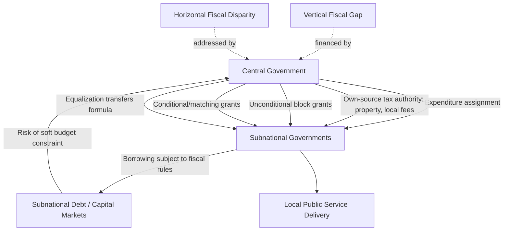

## Decentralization in Developing Economies

### Conceptual Foundations

Fiscal and administrative decentralization refers to the transfer of authority, resources, and responsibility for public functions from central to subnational governments (states/provinces, regions, municipalities). In public economics, decentralization is typically analyzed along three interrelated dimensions:

- **Political decentralization**: Transfer of political authority and accountability, often via elected subnational governments.
- **Administrative decentralization**: Transfer of responsibility for delivering public services (deconcentration to field offices, delegation to semi-autonomous agencies, or full devolution to subnational governments).
- **Fiscal decentralization**: Transfer of taxing powers, expenditure responsibilities, and intergovernmental transfer arrangements — the primary focus of public economics analysis.

### Theoretical Rationale

**The Decentralization Theorem (Oates, 1972)**

The classical efficiency argument holds that, absent significant economies of scale or interjurisdictional externalities, welfare is maximized when public goods are provided by the lowest level of government capable of internalizing the relevant costs and benefits, because local governments possess superior information about heterogeneous local preferences.

$$W^{D} \geq W^{C} \quad \text{when preferences are heterogeneous and spillovers are limited}$$

where $W^D$ is welfare under decentralized provision (each jurisdiction supplies its locally optimal quantity) and $W^C$ is welfare under uniform central provision.

**Tiebout sorting**

A complementary mechanism argues that if households are mobile across jurisdictions and jurisdictions offer differentiated tax-service bundles, households "vote with their feet," sorting into jurisdictions matching their preferences and revealing demand for local public goods — though this mechanism is empirically weaker in developing countries due to limited residential mobility, information asymmetries, and land/housing market frictions.

**Fiscal federalism's "first-generation" vs. "second-generation" theory**

- **First-generation fiscal federalism (FGFF)**: Assumes benevolent governments at all levels; focuses on the normative assignment of functions (Musgrave's allocation, distribution, stabilization framework) and correcting market failures.
- **Second-generation fiscal federalism (SGFF)**: Incorporates political economy and incentive considerations — how decentralization affects incentives for fiscal discipline, corruption, and accountability, given self-interested politicians and asymmetric information between voters and officials. SGFF is particularly relevant to developing-country contexts where weak accountability institutions and informational constraints are pervasive.

### Expenditure Assignment

The normative "subsidiarity principle" assigns functions based on the geographic scope of their benefits and costs:

| Function type | Recommended level | Rationale |
| --- | --- | --- |
| National defense, monetary policy, macro stabilization | Central | National public goods, no meaningful local benefit differentiation, and stabilization requires borrowing capacity concentrated centrally |
| Income redistribution | Central (or coordinated) | Local redistribution induces migration of beneficiaries/taxpayers (Tiebout-driven adverse sorting), undermining local redistributive capacity |
| Primary/secondary education, primary health, local infrastructure, water/sanitation, waste management | Subnational | Benefits are geographically bounded; local governments can better match provision to local preferences and conditions |
| Higher education, tertiary hospitals, interregional infrastructure | Central or shared | Significant spillovers and scale economies |

**Key Points**: In practice, developing countries frequently decentralize expenditure responsibilities faster than administrative capacity or revenue authority, creating implementation gaps between de jure assignment and de facto service delivery.

### Revenue Assignment

Optimal tax assignment principles (following Musgrave and subsequent public finance literature) suggest:

- **Central government** should control taxes on mobile bases (corporate income tax, taxes exploitable via interjurisdictional competition), progressive/redistributive taxes (personal income tax), and taxes with unevenly distributed bases (natural resource taxes) — to avoid a race-to-the-bottom and preserve macro-stabilization tools.
- **Subnational governments** are better suited to taxes on relatively immobile bases: property taxes (widely considered the classic "ideal" local tax due to immobility and benefit-tax correspondence with local services), vehicle taxes, and user fees/charges for local services.

**The "vertical fiscal gap" problem**

In most developing countries, subnational expenditure responsibilities substantially exceed subnational own-revenue capacity, creating a structural fiscal gap financed by intergovernmental transfers.

$$\text{Vertical Fiscal Gap} = \text{Subnational Expenditure} - \text{Subnational Own Revenue}$$

[Inference] This gap is often wider in developing countries than in advanced economies because local tax administration capacity (particularly property tax cadastres and valuation systems) is typically underdeveloped, and politically it is often easier for central governments to retain buoyant tax bases.

### Intergovernmental Transfers

Transfers are the primary financing mechanism for the vertical fiscal gap and for addressing horizontal fiscal disparities across jurisdictions.

**Types of transfers**:

- **Unconditional (general-purpose) transfers/block grants**: Given with no spending restrictions, preserving subnational autonomy and local allocative efficiency, but weaker for steering national priorities.
- **Conditional (specific-purpose) grants**: Earmarked for particular sectors (education, health), often used to ensure minimum national service standards or address externalities (a jurisdiction underinvesting in, e.g., vaccination generates spillovers, justifying matching grants).
- **Matching grants**: Require subnational co-financing, incentivizing local revenue mobilization but potentially regressive if poorer jurisdictions cannot match.
- **Equalization transfers**: Explicitly designed to offset differences in fiscal capacity (tax base per capita) and/or expenditure needs (e.g., population, poverty rate, geographic dispersion) across jurisdictions, promoting horizontal equity.

**Common allocation formula structure**:

$$T_i = \alpha \cdot \left(\frac{P_i}{\sum P_i}\right) + \beta \cdot \left(\frac{1}{FC_i}\right) + \gamma \cdot N_i$$

where $T_i$ is the transfer to jurisdiction $i$, $P_i$ is population, $FC_i$ is a fiscal capacity index (lower fiscal capacity implies larger transfer share), $N_i$ captures expenditure need indicators (poverty, land area, demographic structure), and $\alpha, \beta, \gamma$ are formula weights set by policy.

**Key Points**: Formula-based, transparent transfer systems (as opposed to discretionary/ad hoc transfers) are widely recommended to reduce political capture, improve subnational fiscal planning, and depoliticize resource allocation — though formula design itself remains a politically contested process.

### Soft Budget Constraints and Fiscal Discipline Risks

A central second-generation concern is that decentralization can weaken aggregate fiscal discipline if subnational governments anticipate central government bailouts of excessive deficits or debt — the **soft budget constraint** problem.

- **Mechanisms enabling soft budget constraints**: expectation of ex post bailouts, lack of credible no-bailout commitment, subnational access to (formal or informal) central bank financing, opaque subnational accounting hiding true fiscal positions.
- **Hardening mechanisms**: hard numerical borrowing limits/fiscal rules on subnational debt, transparent and rules-based transfer systems (reducing discretionary bailout channels), subnational credit ratings and market discipline (where capital markets are sufficiently developed), and legal frameworks establishing no-bailout credibility (with historical exceptions, e.g., Brazil's state debt crises and subsequent Fiscal Responsibility Law reforms in the late 1990s/2000).

[Inference] The empirical record on decentralization and macro-fiscal stability is mixed and highly institution-dependent: several Latin American decentralization episodes in the 1980s–1990s coincided with subnational fiscal crises, generally attributed less to decentralization per se than to the absence of accompanying hard budget constraints and credible transfer rules.

### Diagram: Fiscal Decentralization Architecture

### Accountability, Corruption, and Elite Capture

Decentralization's accountability effects run in two theoretically opposing directions relevant to developing-country governance debates:

- **Accountability-enhancing view**: Proximity between citizens and local officials improves monitoring, information flow, and electoral accountability, reducing corruption ("closer to the people" argument).
- **Elite capture / local corruption view**: In settings with weak civil society, limited press freedom, low literacy, or entrenched local elites, decentralization can shift rent-seeking opportunities downward without improving accountability, since local elites may be less subject to national scrutiny mechanisms (audit institutions, national media) than central officials.

[Inference] Empirical findings across developing countries are heterogeneous and appear to depend on complementary institutions — such as local electoral competitiveness, community monitoring mechanisms (participatory budgeting, social audits), and information transparency — rather than decentralization status alone; this remains an active area of empirical public economics research without a settled consensus.

### Illustrative Example: Contrasting Decentralization Models

**Example**

- **Indonesia (post-1999 "Big Bang" decentralization)**: Rapid, large-scale devolution of expenditure responsibilities (health, education, infrastructure) to districts, financed heavily by a general allocation fund (DAU) formula and a revenue-sharing fund (DBH) for natural resources; implementation challenges included substantial capacity gaps at newly empowered district levels and initial weak expenditure tracking.
- **Uganda (1990s–2000s)**: Extensive decentralization combined with conditional grants tied to sectoral service delivery targets (education, health), alongside efforts at community-level public expenditure tracking surveys (PETS) to monitor leakage of transfers between central disbursement and frontline facilities — a widely cited example in the public economics literature on tracking transfer leakage.
- **South Africa**: A more centralized-revenue, transfer-heavy model where provinces have limited own-revenue authority (mainly rely on the national equitable share formula and conditional grants), reflecting a deliberate policy choice favoring national equalization over subnational tax autonomy given large interregional income disparities inherited from apartheid-era spatial inequality.

### Sequencing and Implementation Challenges in Developing-Country Contexts

**Key Points**

- **Capacity-expenditure mismatch**: Rapid decentralization of spending responsibility often outpaces subnational administrative and technical capacity to plan, procure, and deliver services effectively.
- **Data and PFM system gaps**: Weak subnational public financial management (budgeting, accounting, audit systems) undermines both transparency and the credibility of formula-based transfers.
- **Political economy of reform**: Decentralization reforms are frequently driven by political settlement dynamics (post-conflict power-sharing, ethnic/regional autonomy demands) rather than purely efficiency considerations, which can shape design choices in ways that depart from normative fiscal federalism principles.
- **Asymmetric decentralization**: Some countries adopt differentiated arrangements granting greater autonomy to specific regions (special autonomy status, e.g., Aceh and Papua in Indonesia; devolved regions in the Philippines) to accommodate political or ethnic heterogeneity, complicating uniform formula design.

**Next Steps**

- Property tax administration and cadastral system design in developing countries
- Intergovernmental transfer formula design and equalization mechanisms in depth
- Public expenditure tracking surveys (PETS) and leakage measurement methodologies
- Subnational fiscal rules and debt sustainability frameworks
- Political economy of decentralization reform and elite capture
- Local government own-source revenue mobilization strategies
- Metropolitan/urban governance and city finance in developing economies
- Participatory budgeting and community-based accountability mechanisms
- Comparative case studies: Indonesia, Uganda, Brazil, South Africa, Philippines decentralization experiences