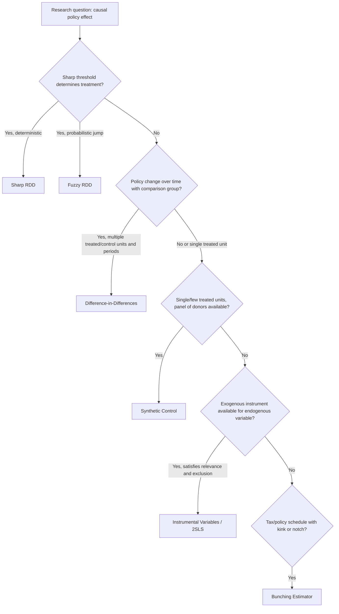

## Natural Experiments and Quasi-Experimental Design

### Conceptual Foundations

Quasi-experimental methods are the primary empirical toolkit in modern public economics for estimating causal effects of policies, taxes, and public programs when randomized controlled trials are infeasible, unethical, or politically impossible. A **natural experiment** exploits an event or policy change that assigns individuals, firms, or jurisdictions to "treatment" and "control" status as if by randomization, even though the assignment was not deliberately designed by the researcher. The identification problem these methods address is the fundamental counterfactual problem: for any treated unit, the outcome under non-treatment is never observed.

$$\tau_{ATE} = E[Y_i(1) - Y_i(0)]$$

where $Y_i(1)$ and $Y_i(0)$ are potential outcomes under treatment and control, and the central empirical challenge is that only one of the two is observed for each unit $i$.

### The Selection Bias Problem

Naive comparison of treated and untreated units confounds the treatment effect with pre-existing differences between groups (selection bias):

$$E[Y_i \mid D_i=1] - E[Y_i \mid D_i=0] = \underbrace{E[Y_i(1) - Y_i(0) \mid D_i=1]}_{\text{ATT}} + \underbrace{E[Y_i(0) \mid D_i=1] - E[Y_i(0) \mid D_i=0]}_{\text{selection bias}}$$

Quasi-experimental designs are strategies for eliminating or credibly bounding the selection bias term without relying on randomization.

### Difference-in-Differences (DiD)

**Core logic**: Compares the change in outcomes over time between a treated group and a comparable untreated (control) group, differencing out both time-invariant group differences and common time trends.

$$\hat{\tau}_{DiD} = (\bar{Y}_{treat,post} - \bar{Y}_{treat,pre}) - (\bar{Y}_{control,post} - \bar{Y}_{control,pre})$$

Equivalently estimated via the regression:

$$Y_{it} = \alpha + \beta \cdot \text{Treat}_i + \gamma \cdot \text{Post}_t + \delta \cdot (\text{Treat}_i \times \text{Post}_t) + \varepsilon_{it}$$

where $\delta$ is the DiD estimator of the treatment effect.

**Key Points**

- **Identifying assumption — parallel trends**: Absent treatment, treated and control groups would have followed the same trajectory over time. This is untestable in the post-period but is typically assessed via pre-trend checks (event-study plots showing no differential pre-treatment trends).
- **Canonical public economics application**: Card and Krueger's (1994) study of the New Jersey minimum wage increase, comparing employment changes in New Jersey fast-food restaurants against neighboring Pennsylvania (no minimum wage change) — a foundational example in labor/public economics of DiD applied to a policy-induced natural experiment.
- **Staggered adoption and modern DiD econometrics**: When different units adopt treatment at different times (e.g., states raising taxes in different years), the classic two-way fixed effects (TWFE) estimator can be biased due to negative weighting of already-treated units used as controls for later-treated units. [Unverified — evolving methodological literature] Recent estimators (Callaway and Sant'Anna; Sun and Abraham; de Chaisemartin and D'Haultfœuille; Goodman-Bacon decomposition) were developed specifically to address this bias in staggered-adoption settings, and remain an active area of methodological refinement.

**Event-study specification** (used to visualize dynamic treatment effects and test pre-trends):

$$Y_{it} = \alpha_i + \lambda_t + \sum_{k \neq -1} \beta_k \cdot \mathbb{1}[t - T_i^* = k] + \varepsilon_{it}$$

where $T_i^*$ is the unit-specific treatment timing and $k=-1$ is the omitted reference period.

### Regression Discontinuity Design (RDD)

**Core logic**: Exploits a sharp, arbitrary threshold (running/forcing variable) that determines treatment assignment, comparing outcomes for units just above and just below the cutoff, who are assumed to be nearly identical in all respects except treatment status.

$$\tau_{RDD} = \lim_{x \to c^+} E[Y_i \mid X_i = x] - \lim_{x \to c^-} E[Y_i \mid X_i = x]$$

where $X_i$ is the running variable and $c$ is the threshold.

**Sharp vs. fuzzy RDD**:

- **Sharp RDD**: Treatment is a deterministic function of crossing the threshold (probability of treatment jumps from 0 to 1).
- **Fuzzy RDD**: Crossing the threshold changes the *probability* of treatment (not deterministically), requiring an instrumental-variables-style local Wald estimator:

$$\tau_{Fuzzy} = \frac{\lim_{x\to c^+}E[Y|X=x] - \lim_{x\to c^-}E[Y|X=x]}{\lim_{x\to c^+}E[D|X=x] - \lim_{x\to c^-}E[D|X=x]}$$

**Key Points**

- **Identifying assumption**: Units cannot precisely manipulate their position around the threshold (no sorting/bunching), and all other determinants of the outcome vary smoothly through the cutoff.
- **Manipulation testing**: The McCrary density test checks for discontinuities in the density of the running variable at the cutoff — a spike just above or below the threshold suggests manipulation and threatens identification.
- **Bandwidth and functional form**: Local linear or local polynomial regression is estimated within a bandwidth around the cutoff; results should be checked for robustness across bandwidth choices and polynomial order, since RDD estimates can be sensitive to these specification choices.
- **Public economics applications**: Eligibility cutoffs for social programs (income thresholds for means-tested transfers), close elections (vote-share thresholds determining which party controls a jurisdiction, used to study effects of political party control on fiscal policy), and administrative thresholds (firm-size cutoffs triggering regulatory or tax obligations, e.g., studies of VAT registration thresholds and firm bunching behavior).

### Instrumental Variables (IV)

**Core logic**: Uses a variable (the instrument) that affects the endogenous treatment variable but has no direct effect on the outcome except through treatment, isolating exogenous variation in treatment.

**Two-stage least squares (2SLS)**:

$$\text{First stage: } D_i = \pi_0 + \pi_1 Z_i + \nu_i$$

$$\text{Second stage: } Y_i = \beta_0 + \beta_1 \hat{D}_i + \varepsilon_i$$

**Key Points**

- **Relevance condition**: $\text{Cov}(Z_i, D_i) \neq 0$ — the instrument must meaningfully predict the endogenous variable (testable via first-stage F-statistic; weak instruments, conventionally F < 10, generate biased and unreliable 2SLS estimates).
- **Exclusion restriction**: $\text{Cov}(Z_i, \varepsilon_i) = 0$ — the instrument affects the outcome only through the treatment channel. This is fundamentally untestable and must be justified on institutional/theoretical grounds.
- **LATE interpretation**: With heterogeneous treatment effects, 2SLS identifies the Local Average Treatment Effect (LATE) — the effect for "compliers" (units whose treatment status is actually changed by the instrument) — not necessarily the population average treatment effect.
- **Public economics applications**: Draft lottery numbers as an instrument for military service (used in studies of the fiscal/labor market effects of veteran status); judge/examiner leniency instruments (random case assignment to judges with varying sentencing/decision tendencies, used to study effects of incarceration, disability award, or bankruptcy protection); rainfall/weather shocks as instruments for income in agricultural economies.

### Bunching Estimators

**Core logic**: A public-economics-specific quasi-experimental method exploiting excess mass ("bunching") in the distribution of an outcome variable at a kink or notch in a tax or policy schedule, used to estimate behavioral elasticities.

- **Kink**: The marginal incentive changes discontinuously at a threshold (e.g., marginal tax rate jumps at a tax bracket boundary) — agents bunch at the kink if their elasticity of response is positive.
- **Notch**: The *average* (not just marginal) incentive changes discontinuously (e.g., eligibility for a transfer program is entirely lost above an income threshold) — notches can generate bunching below the threshold and a "missing mass" (hole) just above it, and can rationalize dominated regions of the choice set.

$$e = \frac{\Delta z / z^*}{\Delta t / (1-t^*)}$$

where $e$ is the elasticity of the outcome (e.g., taxable income) with respect to the net-of-tax rate, estimated from the excess bunching mass $\Delta z$ around the kink/notch location $z^*$.

[Inference] Bunching estimation, pioneered in the taxable income elasticity literature (Saez, 2010), has become a standard applied public economics tool for studying behavioral responses to notches and kinks in tax schedules, transfer program eligibility rules, and regulatory thresholds, though estimates are sensitive to the choice of counterfactual (smooth) density and bandwidth around the threshold.

### Synthetic Control Method

**Core logic**: Used when there is a single (or very few) treated unit(s) (e.g., one state or country adopts a policy) and no single natural comparison unit is obviously appropriate. Constructs a weighted combination of untreated "donor pool" units that best reproduces the treated unit's pre-treatment outcome trajectory, then uses this synthetic control's post-treatment path as the counterfactual.

$$\hat{Y}_{1t}^{N} = \sum_{j=2}^{J+1} w_j^{*} Y_{jt}, \quad \text{where } w_j^{*} \text{ minimizes pre-treatment fit}$$

**Key Points**: Particularly suited to state/country-level policy evaluations common in public economics (e.g., California's tobacco tax adoption, evaluated in Abadie and Gardeazabal-style synthetic control applications); inference is typically conducted via placebo tests (applying the same procedure to untreated donor units to construct a permutation-based distribution of placebo effects).

### Diagram: Quasi-Experimental Method Selection Logic

### Threats to Validity and Robustness Practices

**Key Points**

- **Internal validity threats**: Manipulation/sorting around thresholds (RDD), violation of parallel trends (DiD), weak or invalid instruments (IV), poor pre-treatment fit (synthetic control).
- **External validity**: RDD and IV estimates are inherently *local* (LATE, local to the cutoff) and may not generalize to units far from the threshold or to non-compliers — a standard caveat when extrapolating quasi-experimental findings to broader policy contexts.
- **Standard robustness checks**: Placebo/falsification tests (applying the design where no effect should exist), sensitivity to bandwidth/functional form (RDD), pre-trend event-study plots (DiD), overidentification tests when multiple instruments are available (IV), and leave-one-out donor pool checks (synthetic control).
- Behavior of these estimators in finite samples and under specific data-generating processes can vary; robustness findings from one empirical setting should not be assumed to generalize automatically to a new context without re-verification.

### Illustrative Example: Combining Methods in a Single Study

**Example**

A study evaluating the effect of a conditional cash transfer eligibility threshold on household consumption might: (1) use **RDD** around the means-tested income eligibility cutoff to estimate a local treatment effect near the threshold; (2) use **DiD** comparing eligible vs. ineligible regions before and after a phased national rollout to estimate effects for the broader eligible population; and (3) cross-validate using **bunching** analysis if households can manipulate reported income near the cutoff, which would simultaneously indicate manipulation (threatening the RDD) and provide an independent elasticity estimate of income-underreporting behavior.

**Related Topics**

- Difference-in-differences with staggered treatment timing (Callaway-Sant'Anna, Goodman-Bacon)
- Regression discontinuity design: bandwidth selection and manipulation testing
- Instrumental variables: weak instrument diagnostics and LATE interpretation
- Bunching estimators and taxable income elasticity (Saez 2010 framework)
- Synthetic control method and placebo inference
- Randomized controlled trials in public economics and program evaluation
- Panel data fixed-effects and clustered standard error inference
- External validity and generalizability of local treatment effect estimates