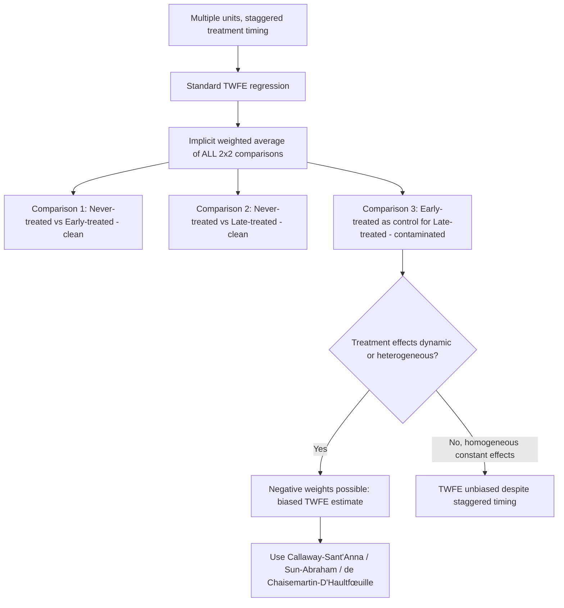

## Difference-in-Differences Estimation

### Conceptual Foundations

Difference-in-differences (DiD) is one of the most widely used empirical strategies in public economics for estimating the causal effect of a policy or program by comparing the change in outcomes over time between a group exposed to the policy (treatment group) and a group not exposed (control group). Its core appeal is that it does not require the treatment and control groups to be identical in levels prior to treatment — only that they would have evolved similarly *over time* absent treatment.

### Canonical 2×2 Setup

Consider two groups (treatment $T$, control $C$) observed in two periods (pre $t=0$, post $t=1$):

$$\hat{\tau}_{DiD} = (\bar{Y}_{T,1} - \bar{Y}_{T,0}) - (\bar{Y}_{C,1} - \bar{Y}_{C,0})$$

This can be equivalently obtained from the regression:

$$Y_{it} = \alpha + \beta \cdot \text{Treat}_i + \gamma \cdot \text{Post}_t + \delta \cdot (\text{Treat}_i \times \text{Post}_t) + \varepsilon_{it}$$

**Key Points**

- $\alpha$: baseline outcome level for the control group in the pre-period.
- $\beta$: pre-existing level difference between treatment and control groups (does not need to be zero).
- $\gamma$: common time trend affecting both groups.
- $\delta$: the DiD estimator — the causal effect of treatment, interpreted as the additional change in outcomes for the treated group beyond what the control group experienced.

### Identifying Assumption: Parallel Trends

The validity of DiD rests entirely on the **parallel trends assumption**: in the absence of treatment, the treatment and control groups would have followed the same trajectory over time.

$$E[Y_{T,1}(0) - Y_{T,0}(0)] = E[Y_{C,1}(0) - Y_{C,0}(0)]$$

where $Y(0)$ denotes the untreated potential outcome. This assumption is fundamentally untestable in the post-treatment period (since $Y_{T,1}(0)$ is never observed for the treated group), but is commonly assessed indirectly through:

- **Pre-trend analysis**: Examining whether treatment and control groups exhibited parallel outcome trends in *multiple* pre-treatment periods (not just the single period immediately preceding treatment). Divergent pre-trends are strong evidence against the assumption's plausibility.
- **Placebo/falsification tests**: Applying the DiD estimator to an outcome that should not be affected by treatment, or to a fake treatment date before the actual policy change, to check for spurious effects.
- **Institutional/qualitative justification**: Because pre-trend similarity does not guarantee post-treatment parallel trends, researchers typically supplement statistical checks with a substantive argument for why the two groups would have continued evolving similarly absent the policy.

### Event-Study Specification

To visualize dynamic treatment effects and formally test pre-trends, the standard practice extends the 2×2 design into an event-study regression with period-specific treatment interactions:

$$Y_{it} = \alpha_i + \lambda_t + \sum_{k \neq -1} \beta_k \cdot \mathbb{1}[t - T_i^{*} = k] + \varepsilon_{it}$$

where $\alpha_i$ are unit fixed effects, $\lambda_t$ are time fixed effects, $T_i^{*}$ is the treatment timing, and $k=-1$ (the period immediately before treatment) is the omitted reference category. The coefficients $\beta_k$ for $k < 0$ should be statistically indistinguishable from zero if parallel pre-trends hold; the coefficients for $k \geq 0$ trace out the dynamic path of the treatment effect over time.

### Two-Way Fixed Effects (TWFE) Generalization

With multiple units and multiple time periods, DiD is commonly implemented as a panel regression with unit and time fixed effects:

$$Y_{it} = \alpha_i + \lambda_t + \delta \cdot D_{it} + \varepsilon_{it}$$

where $\alpha_i$ absorbs all time-invariant unit characteristics and $\lambda_t$ absorbs common shocks affecting all units in a given period, leaving $\delta$ to capture the treatment effect net of both.

### The Staggered Adoption Problem

**Key Points**

When treatment timing varies across units (e.g., different states adopt a policy in different years — the modern norm in public economics applications), the standard TWFE estimator can be severely biased.

- **Goodman-Bacon decomposition**: Shows that the TWFE DiD coefficient is a weighted average of *all possible* 2×2 DiD comparisons between pairs of groups (early-treated vs. late-treated, treated vs. never-treated, etc.), including problematic comparisons where **already-treated units serve as controls for later-treated units**.
- **Negative weighting problem**: When treatment effects are dynamic (e.g., grow over time) or heterogeneous across cohorts, these "forbidden comparisons" can receive negative weights, potentially biasing the overall TWFE estimate — even producing a sign reversal relative to the true average effect in extreme cases.
- [Unverified — active and evolving methodological literature] This is a well-documented finding in the econometrics literature of the late 2010s/2020s, but the practical magnitude of bias in any given application depends on the specific pattern of treatment timing and effect heterogeneity, and should be assessed case by case rather than assumed.

**Modern estimators addressing staggered adoption**:

- **Callaway and Sant'Anna (2021)**: Estimates group-time average treatment effects $ATT(g,t)$ for each treatment cohort $g$ and time period $t$, using only "clean" comparisons (typically never-treated or not-yet-treated units as controls), then aggregates into interpretable summary parameters.
- **Sun and Abraham (2021)**: Proposes an interaction-weighted event-study estimator that avoids contamination from already-treated units in the estimation of dynamic treatment effect paths.
- **de Chaisemartin and D'Haultfœuille (2020)**: Develops an alternative estimator robust to heterogeneous and dynamic treatment effects, explicitly diagnosing the extent of negative-weighting problems in a given TWFE specification.
- **Callaway, Goodman-Bacon, Sant'Anna and related "diagnostic" tools**: Bacon decomposition itself is often used diagnostically (not as an estimator per se) to reveal how much of a TWFE estimate derives from potentially contaminated comparisons.

### Diagram: Staggered DiD Bias Mechanism

### Standard Errors and Inference

**Key Points**

- **Clustering**: Standard errors should generally be clustered at the level of treatment assignment (e.g., state, if the policy varies at the state level), since outcomes within a cluster are likely serially correlated over time — failing to cluster appropriately can severely understate standard errors (a well-documented issue following Bertrand, Duflo, and Mullainathan's analysis of serial correlation in DiD applications).
- **Few clusters**: When the number of treated clusters is small, conventional cluster-robust standard errors can be unreliable; wild cluster bootstrap methods or randomization inference are commonly used alternatives.
- **Multiple hypothesis testing**: Event-study specifications with many period-specific coefficients raise multiple-comparison concerns when assessing pre-trends; researchers should be cautious about over-interpreting any single marginally significant pre-period coefficient.

### Canonical Public Economics Applications

**Example**

- **Card and Krueger (1994)**: New Jersey's minimum wage increase compared against neighboring Pennsylvania (no change), using fast-food restaurant employment as the outcome — a foundational DiD application demonstrating no discernible negative employment effect, contrary to standard competitive labor market predictions.
- **Tax policy studies**: State-level corporate or personal income tax changes evaluated using DiD against states with unchanged tax policy, to estimate elasticities of taxable income, business location, or migration responses.
- **Program eligibility rollouts**: Phased geographic rollout of social programs (e.g., staggered introduction of a conditional cash transfer or health insurance expansion across regions) analyzed with staggered-adoption-robust DiD estimators to estimate impacts on health, education, or labor market outcomes.
- **Natural disaster and shock studies**: Using unanticipated shocks (e.g., a regional economic shock or policy shock affecting only some jurisdictions) as the "treatment" in a DiD framework to study fiscal or behavioral responses.

### Practical Implementation Checklist

**Next Steps**

1. Verify the plausibility of parallel trends via multi-period pre-trend event-study plots, not just a single pre-period comparison.
2. Determine whether treatment timing is staggered across units; if so, avoid naive TWFE and use a staggered-adoption-robust estimator (Callaway-Sant'Anna, Sun-Abraham, or de Chaisemartin-D'Haultfœuille).
3. Run a Goodman-Bacon decomposition diagnostically to assess how much of a TWFE estimate derives from potentially contaminated (already-treated-as-control) comparisons.
4. Cluster standard errors at the level of treatment assignment; consider wild cluster bootstrap if the number of clusters is small.
5. Conduct placebo tests (fake treatment timing, unaffected outcomes) to probe robustness.
6. Explicitly state and justify the parallel trends assumption on institutional grounds, since it cannot be directly tested in the post-treatment period.

**Related Topics**

- Regression discontinuity design and manipulation testing
- Instrumental variables and the Local Average Treatment Effect (LATE)
- Synthetic control method for single-treated-unit settings
- Bertrand-Duflo-Mullainathan serial correlation and clustering in DiD
- Two-way fixed effects and the Goodman-Bacon decomposition in depth
- Triple-differences (DiDiD) designs for additional robustness
- Panel data econometrics and fixed-effects estimation
- Randomization inference and wild cluster bootstrap methods