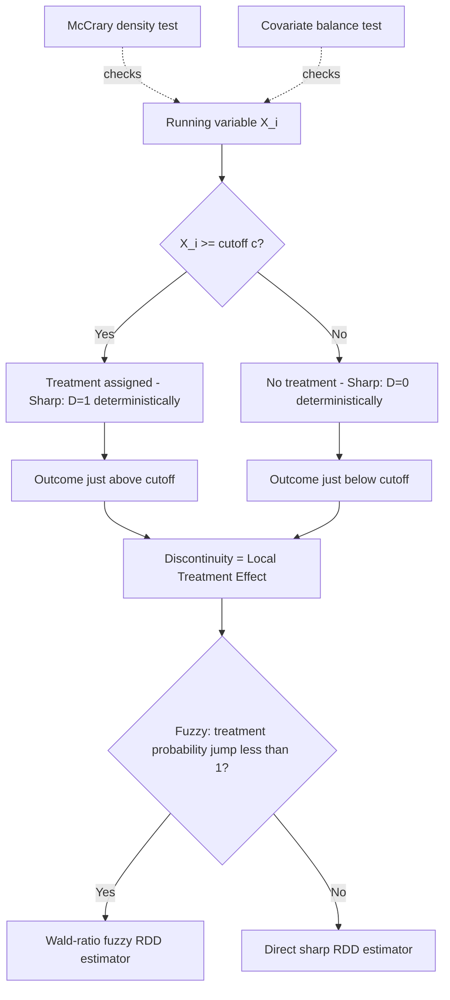

## Regression Discontinuity Design

### Conceptual Foundations

Regression discontinuity design (RDD) is a quasi-experimental method that exploits a known, precise rule assigning treatment based on whether a continuously measured variable crosses a fixed threshold. When such a rule exists, units just above and just below the cutoff are assumed to be nearly identical in all relevant characteristics except treatment status, so the discontinuous jump in outcomes at the threshold identifies a local causal treatment effect. RDD is particularly prevalent in public economics because many public programs (transfers, tax obligations, regulatory requirements, education/health interventions) are administratively assigned via explicit eligibility thresholds.

### Formal Setup

Let $X_i$ be the running (forcing) variable and $c$ the threshold determining treatment $D_i$:

$$D_i = \mathbb{1}[X_i \geq c]$$

The RDD estimand is the difference in the limits of the conditional expectation of the outcome as the running variable approaches the cutoff from above and below:

$$\tau_{RDD} = \lim_{x \to c^+} E[Y_i \mid X_i = x] - \lim_{x \to c^-} E[Y_i \mid X_i = x]$$

### Sharp vs. Fuzzy RDD

**Sharp RDD**

- Treatment status is a deterministic, exact function of the running variable: everyone above the cutoff is treated, everyone below is not (probability of treatment jumps from 0 to 1 exactly at $c$).
- Interpreted directly as a local average treatment effect (LATE) at the threshold.

**Fuzzy RDD**

- Crossing the threshold changes the *probability* of treatment but does not perfectly determine it (e.g., eligibility at the threshold increases take-up but some eligible units don't enroll, and some ineligible units gain access through other channels).
- Requires an instrumental-variables-style estimator, using threshold-crossing as an instrument for actual treatment receipt:

$$\tau_{Fuzzy} = \frac{\lim_{x\to c^+}E[Y|X=x] - \lim_{x\to c^-}E[Y|X=x]}{\lim_{x\to c^+}E[D|X=x] - \lim_{x\to c^-}E[D|X=x]}$$

**Key Points**: The fuzzy RDD estimator is a ratio of two discontinuities (the "reduced-form" jump in outcomes divided by the "first-stage" jump in treatment probability), directly analogous to a Wald IV estimator, and identifies the LATE for "compliers" — units whose treatment status is actually changed by crossing the threshold.

### Identifying Assumption: Continuity/No Manipulation

The core identifying assumption is that, absent the discontinuous treatment rule, the conditional expectation function $E[Y_i(0) \mid X_i = x]$ and $E[Y_i(1) \mid X_i = x]$ would be continuous through the cutoff — i.e., all other determinants of the outcome vary smoothly across $c$, and units cannot precisely manipulate their position relative to the threshold to select into or out of treatment.

**McCrary density test**: Formally checks for a discontinuity in the density of the running variable at the cutoff. A statistically significant jump in density just above or below $c$ suggests manipulation (e.g., self-reported income being systematically adjusted to qualify for a benefit), which threatens the continuity assumption and hence identification.

$$H_0: \lim_{x \to c^+} f(x) = \lim_{x \to c^-} f(x)$$

where $f(x)$ is the density of the running variable. Rejection of $H_0$ is evidence against the validity of the design.

**Covariate balance tests**: Pre-determined covariates (measured prior to or unaffected by treatment) should also show no discontinuity at the cutoff — analogous to a balance check in a randomized experiment, since near the threshold treatment assignment should behave "as if" random.

### Estimation: Local Polynomial Regression

RDD is estimated using observations within a bandwidth $h$ around the cutoff, typically via local linear or local polynomial regression on each side of the threshold separately:

$$Y_i = \alpha + \beta_1 (X_i - c) + \tau D_i + \beta_2 D_i (X_i - c) + \varepsilon_i, \quad \text{for } X_i \in [c-h, c+h]$$

**Key Points**

- **Local linear regression** is the standard default (higher-order global polynomials across the full range of $X_i$ are now generally discouraged in the methodological literature, since they can produce spurious results driven by data far from the cutoff — a finding associated with Gelman and Imbens's critique of high-order polynomial RDD specifications).
- **Bandwidth selection**: A fundamental bias-variance trade-off — a narrower bandwidth reduces bias (better approximates the local nature of the estimand) but increases variance (fewer observations). Data-driven optimal bandwidth selectors (e.g., Imbens-Kalyanaraman, Calonico-Cattaneo-Titiunik) are standard practice, and results should be checked for robustness across a range of bandwidths.
- **Kernel weighting**: Observations closer to the cutoff are typically weighted more heavily (e.g., triangular kernel), reflecting their greater relevance to the local estimand.
- **Robust bias-corrected inference**: Calonico, Cattaneo, and Titiunik (CCT) developed bias-corrected confidence intervals that account for the bias introduced by local polynomial estimation, now a standard component of modern RDD practice (implemented in the widely used `rdrobust` software package).

### Graphical Presentation

**Key Points**: RDD results are conventionally presented visually via a binned scatterplot of the outcome against the running variable, with separate fitted regression lines/curves on each side of the cutoff, making the discontinuity (or its absence) visually transparent. Bin width selection itself follows data-driven procedures analogous to bandwidth selection to avoid manipulating visual impressions.

### Diagram: RDD Identification Structure

### External Validity Limitations

**Key Points**

- RDD identifies a treatment effect that is inherently **local** to the neighborhood of the cutoff — the LATE at $X_i = c$ — and does not directly identify effects for units far from the threshold.
- Extrapolating RDD estimates to the full eligible population (or to a different threshold level, e.g., if policymakers consider changing the cutoff) requires additional assumptions about effect homogeneity across the running variable's range, which are generally untestable within the design itself.
- [Inference] This local-effect limitation is widely regarded as RDD's principal trade-off against its strong internal validity, and is a standard caveat when using RDD estimates to inform policy decisions that would apply to units away from the existing cutoff.

### Public Economics Applications

**Example**

- **Means-tested transfer eligibility**: Income or asset thresholds determining eligibility for cash transfers, subsidized health insurance, or in-kind benefits — RDD estimates the local effect of program access on outcomes like consumption, health, or labor supply just around the eligibility line.
- **Close elections**: Vote-share thresholds (50%) determining which party or candidate wins control of a jurisdiction, used extensively in political economy/public economics to study causal effects of party control on fiscal policy, public spending composition, or corruption outcomes — narrow-margin elections approximate random assignment of political control.
- **Tax and regulatory thresholds**: Firm-size or revenue cutoffs triggering different tax regimes, audit probabilities, or regulatory burdens (e.g., VAT registration thresholds), used to study firm bunching behavior and the real economic costs of discontinuous regulatory treatment.
- **Educational program cutoffs**: Test-score thresholds determining admission to remedial programs, scholarships, or selective schools, used to estimate causal effects on subsequent educational or labor market outcomes.
- **Age-based eligibility**: Age thresholds for pension eligibility, healthcare program access (e.g., age-based insurance eligibility), or compulsory schooling laws, exploited as a running variable in RDD designs.

### Common Threats and Robustness Practices

**Next Steps**

1. Test for manipulation of the running variable using the McCrary density test (or its more recent refinements).
2. Check covariate balance for pre-determined characteristics across the threshold.
3. Report results across multiple bandwidths and polynomial specifications to assess sensitivity.
4. Use robust bias-corrected confidence intervals (Calonico-Cattaneo-Titiunik) rather than naive local linear standard errors.
5. Conduct placebo tests at artificial "fake" cutoffs away from the true threshold, where no discontinuity should be found.
6. Explicitly discuss the local nature of the estimated effect and the limits of extrapolation beyond the neighborhood of the cutoff.

**Related Topics**

- Fuzzy RDD and instrumental variables (LATE interpretation)
- McCrary density test and manipulation diagnostics
- Bandwidth selection methods (Imbens-Kalyanaraman, Calonico-Cattaneo-Titiunik)
- Bunching estimators as a complementary/diagnostic technique
- Difference-in-differences and parallel trends assumption
- Close-election designs in political economy
- Multi-cutoff and multi-dimensional RDD extensions
- Kink-based identification (regression kink design)