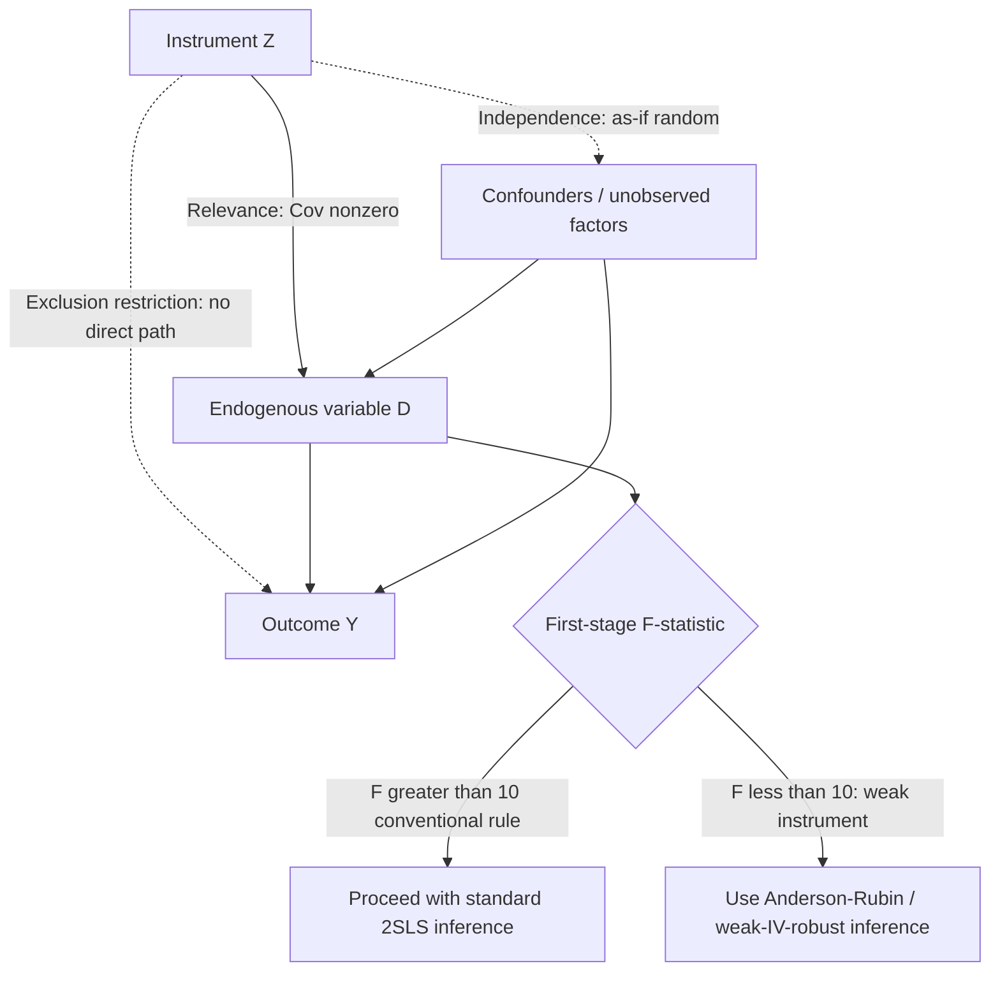

## Instrumental Variables Applications

### Conceptual Foundations

Instrumental variables (IV) estimation addresses endogeneity — situations where the explanatory variable of interest is correlated with the error term due to omitted variables, reverse causality, or measurement error — by finding a third variable (the instrument) that induces variation in the endogenous regressor while having no direct effect on the outcome. In public economics, IV is central to estimating causal effects of variables that are rarely randomly assigned (income, education, program participation, incarceration, political control) using sources of variation that mimic random assignment.

### Formal Setup and Two-Stage Least Squares (2SLS)

Consider a structural equation with an endogenous regressor $D_i$:

$$Y_i = \beta_0 + \beta_1 D_i + \varepsilon_i, \quad \text{where } \text{Cov}(D_i, \varepsilon_i) \neq 0$$

Given a valid instrument $Z_i$, 2SLS proceeds in two stages:

$$\text{First stage: } D_i = \pi_0 + \pi_1 Z_i + X_i'\gamma + \nu_i$$

$$\text{Second stage: } Y_i = \beta_0 + \beta_1 \hat{D}_i + X_i'\delta + \varepsilon_i$$

where $\hat{D}_i$ is the fitted value from the first stage and $X_i$ are exogenous control variables included in both stages.

### Identifying Assumptions

**Relevance condition**

$$\text{Cov}(Z_i, D_i) \neq 0$$

The instrument must meaningfully predict variation in the endogenous variable. This is directly testable via the first-stage F-statistic.

**Exclusion restriction**

$$\text{Cov}(Z_i, \varepsilon_i) = 0$$

The instrument must affect the outcome *only* through its effect on the endogenous variable, with no direct pathway. This assumption is fundamentally untestable and must be justified through institutional knowledge, theory, and (where available) placebo/falsification exercises.

**Independence/as-if-random assignment**

The instrument should be as good as randomly assigned with respect to potential outcomes, conditional on included controls — analogous to treatment assignment in an experiment.

**Monotonicity** (for heterogeneous treatment effects)

$$D_i(Z_i=1) \geq D_i(Z_i=0) \text{ for all } i \text{ (no "defiers")}$$

Required for the 2SLS estimand to have a well-defined LATE interpretation when treatment effects vary across the population.

### Local Average Treatment Effect (LATE) Interpretation

**Key Points**

When treatment effects are heterogeneous across individuals, the IV/2SLS estimator identifies the **Local Average Treatment Effect** — the average treatment effect specifically among "compliers," the subpopulation whose treatment status is actually changed by variation in the instrument:

$$\tau_{LATE} = E[Y_i(1) - Y_i(0) \mid \text{complier}]$$

This is a narrower and more instrument-specific parameter than the population Average Treatment Effect (ATE), and different valid instruments for the same treatment can identify different LATEs (corresponding to different complier populations) — a key interpretive caveat in applied IV work, since results are not necessarily comparable across studies using different instruments for nominally the same treatment.

### Weak Instrument Diagnostics

**Key Points**

- **First-stage F-statistic**: The conventional (though increasingly scrutinized) rule of thumb requires F > 10 for the instrument to be considered sufficiently strong to avoid severe finite-sample bias and size distortions in 2SLS inference.
- **Weak instrument consequences**: Even instruments satisfying the exclusion restriction can produce badly biased and unreliable 2SLS estimates if the first-stage relationship is weak — the 2SLS estimator is biased toward the OLS estimate in finite samples with weak instruments, and standard confidence intervals can have severely distorted coverage.
- **Modern weak-instrument-robust inference**: Anderson-Rubin confidence sets and related procedures (e.g., the Montiel Olea-Pflueger effective F-statistic for the case of multiple/clustered instruments) provide inference that remains valid even when instruments are weak, and are increasingly recommended over naive reliance on the F > 10 threshold. [Unverified — evolving methodological literature] The precise conditions under which the traditional F > 10 rule remains adequate (e.g., under heteroskedasticity or clustering) have been refined in the recent econometrics literature.

### Canonical Public Economics Applications

**Example**

**Judge/examiner leniency instruments**

- **Mechanism**: Cases (criminal defendants, disability applicants, bankruptcy filers) are quasi-randomly assigned to decision-makers (judges, examiners) who differ systematically in their leniency/strictness, independent of case characteristics.
- **Instrument**: A measure of judge/examiner leniency (e.g., that judge's historical approval/incarceration rate, leave-one-out).
- **Application**: Used extensively to study causal effects of incarceration on recidivism and labor market outcomes, effects of disability insurance award on subsequent labor supply, and effects of bankruptcy protection on financial and health outcomes — since actual approval/sentencing decisions are endogenous to case severity, but assignment to a lenient vs. strict decision-maker is plausibly as-if random within court administrative rules.

**Draft lottery instruments**

- **Mechanism**: Vietnam-era U.S. draft eligibility was determined by randomly drawn birth-date lottery numbers.
- **Instrument**: Lottery-based draft eligibility, used as an instrument for actual military service (since not all draft-eligible men served, and some non-eligible men volunteered).
- **Application**: A foundational instrument in labor/public economics (Angrist's work) for studying the causal effect of military service on subsequent earnings, and more broadly a textbook illustration of a "natural" randomization device.

**Weather and rainfall instruments**

- **Mechanism**: Rainfall shocks affect agricultural income in economies where farming is a major livelihood source, plausibly independent of other determinants of the outcome of interest (conditional on location and season fixed effects).
- **Application**: Used as an instrument for household or regional income in studies of the relationship between income shocks and conflict, health investments, or educational outcomes in developing-country public economics contexts. [Inference] Applications of weather instruments require careful justification of the exclusion restriction, since rainfall can plausibly affect outcomes through channels other than income (e.g., direct health effects of flooding), a concern frequently raised in the identification literature.

**Compulsory schooling laws / quarter of birth**

- **Mechanism**: Compulsory schooling and age-at-school-entry laws interact with quarter of birth to generate variation in years of completed education unrelated to individual ability or family background.
- **Application**: Angrist and Krueger's use of quarter-of-birth as an instrument for years of schooling to estimate the causal return to education on earnings — a canonical example in the IV literature, though later subjected to weak-instrument critiques (Bound, Jaeger, and Baker) given the small first-stage relationship between quarter of birth and schooling.

**Tax policy discontinuities as instruments**

- Changes in tax rules affecting specific subpopulations (e.g., a tax reform affecting only certain income brackets or filing statuses) used as instruments for behavioral variables such as labor supply or reported income, isolating policy-induced variation from confounded observational variation.

### Diagram: IV Identification Structure

### Overidentification and Specification Tests

**Key Points**

- **Overidentification test (Sargan/Hansen J-test)**: When more instruments are available than endogenous regressors, this test checks whether the overidentifying restrictions are jointly consistent with the data — a rejection suggests at least one instrument may violate the exclusion restriction, though the test cannot identify *which* instrument is invalid, and passing the test does not prove validity (it has no power against exclusion violations shared symmetrically across instruments).
- **Hausman test**: Compares OLS and 2SLS estimates to test whether the regressor is indeed endogenous (statistically significant differences suggest OLS is inconsistent), though this test presupposes that the IV estimate itself is the valid benchmark.

### Practical Implementation Checklist

**Next Steps**

1. Establish institutional/theoretical justification for the exclusion restriction — this cannot be tested statistically and requires domain knowledge of the assignment mechanism.
2. Report and assess the first-stage F-statistic; consider weak-instrument-robust inference (Anderson-Rubin) if F is low or borderline.
3. Interpret 2SLS estimates as LATE — be explicit about the complier population the instrument identifies, and avoid conflating LATE with the population ATE.
4. If multiple instruments are available, conduct overidentification tests, while recognizing their limited diagnostic power.
5. Where possible, present reduced-form results (direct regression of outcome on instrument) alongside 2SLS estimates, since the reduced form does not require dividing by a potentially noisy first stage.
6. Consider falsification tests using pre-determined covariates or placebo outcomes that should not respond to the instrument if the exclusion restriction holds.

**Related Topics**

- Local Average Treatment Effect (LATE) and complier populations
- Weak instrument diagnostics: Anderson-Rubin and effective F-statistics
- Judge/examiner leniency designs in applied microeconomics
- Regression discontinuity design as a special case of local IV
- Natural experiments and instrument construction strategies
- Overidentification testing and instrument validity
- Angrist-Krueger quarter-of-birth instrument and subsequent critiques
- Difference-in-differences vs. IV: complementary identification strategies