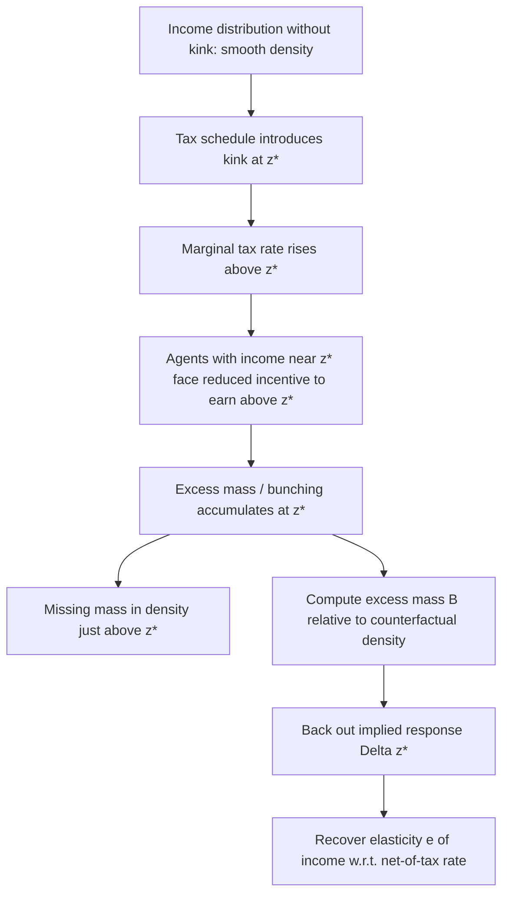
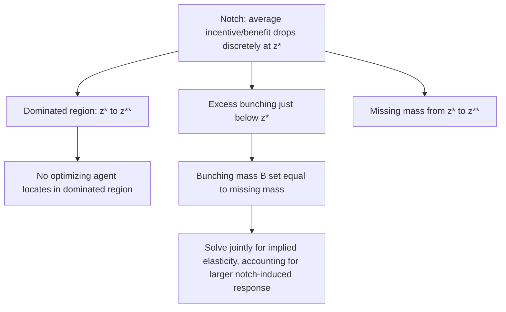

## Bunching Estimation

### Conceptual Foundations

Bunching estimation is a quasi-experimental method distinctive to public economics that exploits "excess mass" in the empirical distribution of an economic outcome around a point where a tax or policy schedule creates a discontinuous change in incentives. Unlike RDD, which uses a threshold to compare *outcomes* above and below a cutoff, bunching estimation uses the threshold to study how agents *endogenously sort* their own choice variable (e.g., reported income) around the threshold, and uses the resulting excess density to recover a structural behavioral elasticity.

### Kinks vs. Notches

**Kink**

- The **marginal** incentive (e.g., the marginal tax rate) changes discontinuously at a threshold, while the **average** incentive remains continuous.
- Example: Progressive income tax brackets — the marginal tax rate jumps at each bracket threshold, but total tax liability remains a continuous function of income.
- Under a convex kink (marginal tax rate rising), utility-maximizing agents with a positive elasticity of the choice variable with respect to the net-of-tax rate will bunch exactly at the kink, since the kink creates a range of ability/preference types for whom the kink point is optimal.

**Notch**

- The **average** incentive changes discontinuously at the threshold — total tax liability or benefit amount jumps discretely.
- Example: An income-eligibility threshold for a means-tested transfer, where crossing the threshold causes total loss of an entire benefit rather than a marginal phase-out.
- Notches can create a **dominated region** — a range of the choice variable just above the threshold that no optimizing agent would ever choose, since a marginal increase in the choice variable produces a large discrete loss with no compensating benefit — generating not only excess bunching below the threshold but also a "missing mass" or hole in the density just above it.

### Formal Bunching Estimator (Saez 2010 Framework)

**Key Points**

Consider a kink in a tax schedule at income $z^*$, where the net-of-tax rate falls from $(1-t_1)$ below the kink to $(1-t_2)$ above it. In the absence of the kink, the counterfactual density of income $h_0(z)$ would be smooth through $z^*$. The kink induces excess bunching:

$$B = \int_{z^*}^{z^*+\Delta z^*} h_0(z)\, dz \approx h_0(z^*) \cdot \Delta z^*$$

where $B$ is the excess mass (observed density minus counterfactual smooth density, integrated over the bunching region) and $\Delta z^*$ is the width of income response — i.e., how far the marginal buncher would have located above $z^*$ absent the kink.

The elasticity of the choice variable with respect to the net-of-tax rate is recovered from:

$$e = \frac{\Delta z^{*} / z^{*}}{\Delta t / (1-t_1)}, \quad \text{where } \Delta t = t_2 - t_1$$

**Estimation procedure**:

1. Estimate the counterfactual density $h_0(z)$ by fitting a flexible polynomial to the observed income distribution, excluding a bandwidth around the kink/notch.
2. Compute the excess mass $B$ as the difference between the observed density and the counterfactual fitted density within the excluded bunching window.
3. Convert $B$ into an implied marginal buncher location $z^* + \Delta z^*$ by equating excess mass to the counterfactual density integrated over the response region.
4. Back out the elasticity $e$ using the tax rate change and the implied behavioral response $\Delta z^*/z^*$.

### Notch-Specific Extensions

For notches, the bunching methodology (following Kleven and Waseem, 2013) additionally requires accounting for the missing mass above the threshold:

$$B = \int_{z^*}^{z^*+\Delta z^{*}} h_0(z)\, dz = \int_{z^{*}}^{z^{**}} h_0(z)\, dz \quad \text{(bunching mass equals missing mass)}$$

where $z^{**}$ marks the upper end of the dominated region. Because notches can generate large, discrete losses, they typically produce substantially larger observed bunching than an equivalently sized kink would for the same underlying elasticity — meaning notch-based bunching alone can overstate the "true" frictionless elasticity if optimization frictions or adjustment costs are not accounted for.

### Optimization Frictions

**Key Points**

A significant complication in bunching estimation is that observed bunching is frequently far smaller than what a frictionless optimization model would predict given plausible elasticities — attributed to **optimization frictions**: adjustment costs, inattention, information gaps, or institutional constraints (e.g., inability to finely adjust hours worked) that prevent agents from precisely optimizing at the kink/notch.

- Because of this, many applied bunching studies interpret estimated "elasticities" cautiously as *lower bounds* on the true structural elasticity, since frictions dampen observed bunching relative to the frictionless benchmark.
- [Inference] This friction-driven attenuation is widely acknowledged in the bunching literature as a central interpretive caveat, and various extensions attempt to explicitly model or bound the role of frictions (e.g., using bunching at multiple, differently sized kinks to separate elasticity from friction magnitude), though this remains a methodologically active area without a single settled solution.

### Diagram: Bunching at a Convex Kink

### Diagram: Bunching at a Notch with Dominated Region

### Public Economics Applications

**Example**

- **Taxable income elasticity (Saez 2010)**: The foundational application, using U.S. federal income tax kinks to estimate the elasticity of taxable income with respect to the net-of-tax rate — a central parameter for optimal income tax design, since it directly enters formulas for revenue-maximizing top tax rates.
- **Self-employment vs. wage-earner bunching**: Saez (2010) documented markedly sharper bunching among self-employed filers than wage earners at the same kinks, interpreted as evidence that self-employed individuals face lower adjustment frictions (greater control over reported income) — a widely cited illustration of the friction-elasticity interaction.
- **Notches in transfer program eligibility**: Kleven and Waseem (2013) applied notch-based bunching to Pakistani income tax notches, documenting substantial frictions (much smaller bunching than frictionless predictions) and providing a method to separately identify the elasticity and the extent of frictions.
- **Retirement and pension eligibility**: Bunching in retirement timing at pension eligibility ages or benefit-formula kinks, used to estimate labor supply responses to retirement incentives.
- **VAT and firm-size regulatory thresholds**: Bunching of firm revenue just below VAT registration thresholds or other size-based regulatory cutoffs (employment protection laws, audit thresholds), used to estimate the real economic costs of size-dependent regulation and firm growth distortions — an application especially prominent in public economics research on developing and emerging economies, where such thresholds can meaningfully suppress firm growth.
- **Charitable giving and tax deduction kinks**: Bunching around kinks in itemized deduction schedules or charitable-giving matching thresholds, used to estimate the price elasticity of charitable giving.

### Relationship to Other Quasi-Experimental Methods

**Key Points**

- Bunching estimation is complementary to and sometimes used diagnostically alongside RDD: excess bunching in the running variable's density at an RDD threshold (detected by, e.g., the McCrary test) simultaneously signals a manipulation threat to RDD validity *and* can itself be analyzed as a bunching estimator to recover a behavioral elasticity of the running variable with respect to the incentive created by the threshold.
- Unlike DiD or IV, bunching typically requires only a single cross-section of data at one point in time (though panel extensions exist), making it attractive when policy variation over time or across comparable jurisdictions is unavailable, but a sharp kink/notch in a single schedule is present.

### Practical Implementation Checklist

**Next Steps**

1. Identify a clean kink or notch in a tax, benefit, or regulatory schedule with high-quality microdata on the relevant choice variable near the threshold.
2. Fit a flexible polynomial to the observed density excluding a bandwidth around the threshold to construct the counterfactual smooth density.
3. Compute excess mass and solve for the implied marginal buncher location, accounting for whether the threshold is a kink or a notch (notches require equating bunching mass to missing mass in the dominated region).
4. Interpret the resulting elasticity as potentially attenuated by optimization frictions; consider it a lower bound rather than a definitive structural parameter unless frictions are explicitly modeled.
5. Conduct robustness checks across different bandwidth and polynomial order choices for the counterfactual density estimation.
6. Where relevant, cross-check for manipulation-driven bunching that might threaten a companion RDD analysis using the same threshold.

**Related Topics**

- Taxable income elasticity and optimal top tax rate formulas (Saez 2010)
- Notch-based identification and dominated regions (Kleven and Waseem 2013)
- Regression discontinuity design and manipulation testing (McCrary test)
- Optimization frictions and adjustment costs in behavioral responses
- Firm-size regulatory thresholds and bunching in developing economies
- Elasticity of taxable income (ETI) literature and policy applications
- Retirement timing and pension eligibility bunching studies