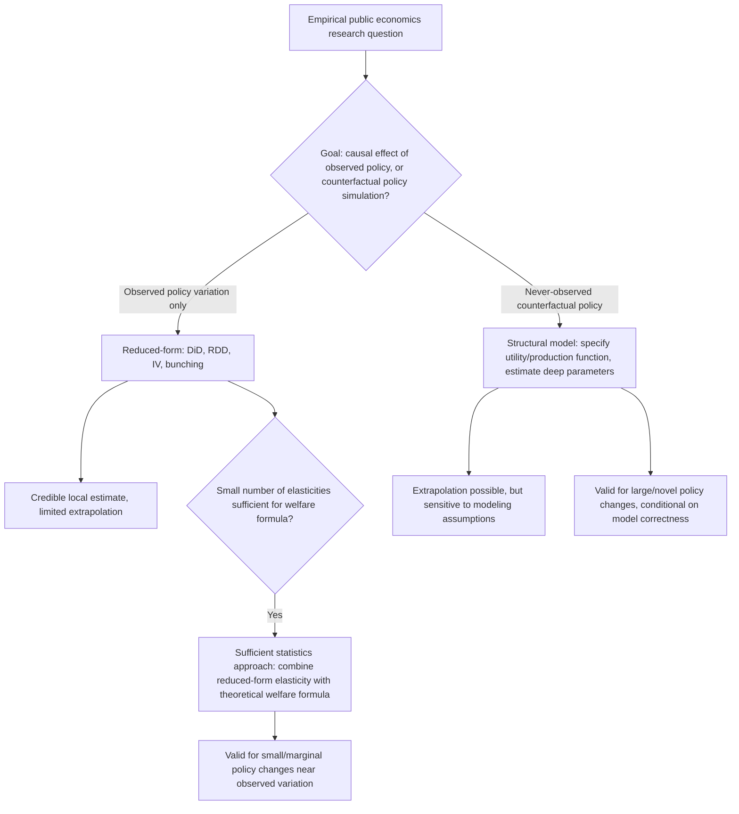

## Structural versus Reduced-Form Modeling

### Conceptual Foundations

The distinction between structural and reduced-form modeling represents a fundamental methodological divide in empirical public economics, concerning how researchers translate economic theory into estimable models and what kinds of questions their estimates can answer. The distinction is not a strict dichotomy but a spectrum, and modern applied public economics increasingly uses hybrid approaches that combine elements of both.

### Reduced-Form Modeling

**Definition**: Reduced-form methods estimate the direct statistical relationship between a treatment/policy variable and an outcome, typically using quasi-experimental identification strategies (DiD, RDD, IV, bunching) without explicitly specifying or estimating the underlying behavioral model (utility function, production function, or optimization problem) that generates the relationship.

$$Y_i = \alpha + \beta D_i + \varepsilon_i$$

where $\beta$ is estimated to have a credible causal interpretation via a specific identification strategy, without modeling *why* $D_i$ affects $Y_i$ through specific behavioral parameters.

**Key Points**

- **Strengths**: Requires minimal assumptions about functional form and behavioral mechanisms; identification typically rests on a small number of transparent, often testable (or at least discussable) assumptions (parallel trends, exclusion restrictions, continuity at a threshold); results are generally viewed as more robust and credible for the *specific policy variation studied*.
- **Weaknesses**: Estimates are typically local to the specific policy change, population, and context studied (e.g., a LATE from a specific instrument, or a treatment effect from a specific historical reform) and often cannot be used directly to predict effects of *different* counterfactual policies that were never observed in the data (the "external validity" or "policy extrapolation" problem).
- **Canonical toolkit**: DiD, RDD, IV/2SLS, bunching estimation, synthetic control — the core "credibility revolution" methods associated with applied microeconomics since the 1990s.

### Structural Modeling

**Definition**: Structural methods explicitly specify a theoretical model of individual or firm behavior (a utility function, production function, or dynamic optimization problem) with a set of "deep" behavioral parameters, then estimate those parameters using observed data — often via maximum likelihood, generalized method of moments (GMM), or simulation-based methods.

$$\max_{c} \, U(c; \theta) \quad \text{subject to budget/behavioral constraints}$$

where $\theta$ represents structural parameters (e.g., risk aversion, labor supply elasticity, discount rate) to be estimated from data on observed choices $c$.

**Key Points**

- **Strengths**: Because the estimated parameters are meant to represent stable "deep" preferences or technology rather than a policy-specific reduced-form relationship, structural models can in principle be used for **counterfactual policy simulation** — predicting the effects of policies that have never been observed or implemented (e.g., simulating an entirely new tax schedule using an estimated labor supply model).
- **Weaknesses**: Requires strong, often untestable assumptions about functional forms, the structure of uncertainty, and the completeness of the specified model; results can be sensitive to these modeling choices in ways that are difficult for outside readers to fully assess; identification of structural parameters often relies on the same kinds of exogenous variation used in reduced-form work (structural and reduced-form approaches are not mutually exclusive in their data requirements).
- **Canonical toolkit**: Discrete choice models of labor supply, dynamic structural models of retirement/savings behavior, general equilibrium tax incidence models, models of optimal taxation calibrated with estimated behavioral elasticities.

### The Sufficient Statistics Approach: A Middle Ground

**Key Points**

A methodological bridge developed prominently in modern public economics (associated with Chetty, 2009, and others) is the **sufficient statistics** approach, which seeks to derive welfare and policy conclusions using only a small number of reduced-form, quasi-experimentally identified elasticities — without requiring a fully specified structural model.

$$\frac{dW}{d\tau} = f(\text{elasticity of taxable income}, \text{current tax rate}, \text{income distribution})$$

The insight is that for many policy questions (e.g., the welfare cost of taxation, optimal unemployment insurance benefit levels), the key parameters needed for a first-order welfare analysis are a small set of estimable elasticities (like the elasticity of taxable income with respect to the net-of-tax rate), rather than the full set of deep structural parameters governing individual behavior. This allows researchers to combine the *credibility* of reduced-form identification with some of the *policy-relevance* of structural approaches, though the resulting welfare formulas are generally valid only for small, local policy changes near the observed variation (a "first-order" or marginal analysis), not for evaluating large, non-marginal policy reforms.

### Diagram: Structural vs. Reduced-Form vs. Sufficient Statistics

### Illustrative Example: Optimal Unemployment Insurance

**Example**

- **Reduced-form approach**: Estimate the causal effect of unemployment insurance (UI) benefit generosity on unemployment duration using a quasi-experimental design (e.g., a discontinuity in benefit formulas, or a policy reform affecting only some states/regions). This produces a credible elasticity of unemployment duration with respect to benefits, but does not by itself say what the *optimal* benefit level is.
- **Sufficient statistics approach**: Combine the reduced-form moral hazard elasticity (duration response to benefits) with a formula from optimal UI theory (Baily-Chetty formula) relating the optimal benefit level to this elasticity, the consumption-smoothing value of insurance, and risk aversion — yielding a policy-relevant welfare conclusion without fully specifying or estimating a dynamic structural job-search model.
- **Structural approach**: Estimate a full dynamic structural model of job search (reservation wage behavior, arrival rate of job offers, precise timing of the UI benefit exhaustion effect) that can simulate outcomes under entirely different, previously unobserved UI benefit schedules (e.g., benefits that decline continuously over the unemployment spell, a policy design never actually implemented).

### Illustrative Example: Tax Reform Evaluation

**Example**

- **Reduced-form**: A DiD or bunching estimate of the taxable income elasticity following an *actual historical* tax reform, credible for evaluating the revenue and behavioral effects of a similarly sized future change to that same tax parameter.
- **Structural/general equilibrium**: A computable general equilibrium (CGE) or structural tax incidence model that simulates the effects of a fundamentally different tax system (e.g., replacing an income tax with a consumption tax) that has never been observed in the available data, relying on estimated or calibrated behavioral parameters (labor supply elasticities, elasticities of substitution) drawn partly from prior reduced-form studies.

### Trade-offs Summary

**Key Points**

- **Credibility vs. scope**: Reduced-form methods offer higher confidence in the *sign and approximate magnitude* of an effect for the specific variation studied; structural methods offer broader *scope* of applicability (novel counterfactuals) at the cost of additional, harder-to-verify assumptions.
- **Local vs. global validity**: Reduced-form and sufficient-statistics approaches are generally most reliable for small/marginal policy changes near the historically observed variation; structural models are designed to speak to large, non-marginal, or entirely novel policy changes, but their reliability for such extrapolation depends critically on whether the specified model correctly captures the relevant behavioral margins.
- **Complementarity in practice**: Modern applied public economics frequently uses reduced-form/quasi-experimental estimates *as inputs* into structural or sufficient-statistics welfare calculations, rather than treating the two approaches as competitors — a structural model's key behavioral elasticities are often themselves estimated using DiD, RDD, or IV strategies applied to real policy variation.
- [Inference] There is no universal methodological consensus on which approach is preferable in general; the appropriate choice is widely regarded in the applied public economics literature as depending on the specific policy question, particularly whether it concerns evaluating an already-observed policy or simulating an unprecedented one.

**Related Topics**

- Sufficient statistics approach to optimal taxation (Chetty 2009 framework)
- Baily-Chetty optimal unemployment insurance formula
- Discrete choice structural labor supply models
- Computable general equilibrium (CGE) tax incidence modeling
- Dynamic structural models of savings and retirement behavior
- External validity and policy extrapolation in applied microeconomics
- Elasticity of taxable income and its role in optimal tax formulas
- Simulation methods for structural model estimation (GMM, maximum likelihood, indirect inference)