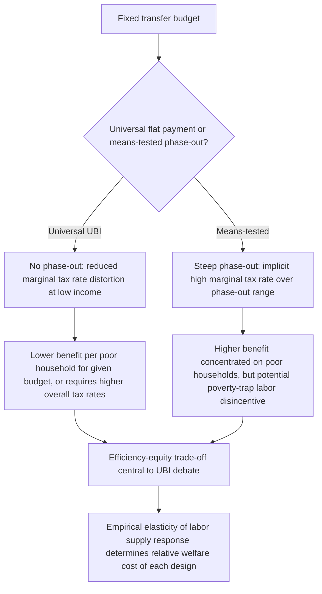

## Universal Basic Income Debates

### Conceptual Foundations

Universal Basic Income (UBI) refers to a proposed transfer program with three defining features that distinguish it from conventional social assistance: **universality** (paid to all individuals/residents regardless of income or employment status), **unconditionality** (no work requirements, means-testing, or behavioral conditions), and **individuality** (paid to individuals rather than households). UBI sits at the center of contemporary public economics debates because it directly confronts the classic equity-efficiency trade-off in transfer design, and because it has been proposed as a response to concerns about automation-driven labor market disruption, the administrative complexity of targeted welfare systems, and gaps in existing safety nets.

### Theoretical Framing: The Optimal Transfer Design Problem

**Key Points**

The classical optimal income taxation/transfer literature (Mirrlees, 1971, and subsequent work) frames the transfer design problem as balancing:

$$\max_{T(\cdot)} \; SWF = \int W(u_i) \, dF(i) \quad \text{subject to government budget constraint and behavioral (incentive) responses}$$

where $T(\cdot)$ is the tax-and-transfer schedule, $W(\cdot)$ is a social welfare weighting function, and behavioral responses to the schedule (labor supply, reported income) are governed by estimated elasticities.

**UBI vs. means-tested transfers within this framework**:

- **Means-tested transfers** (phased out as income rises) concentrate transfer spending on lower-income households for a given budget, but the phase-out itself creates an implicit high marginal tax rate over the phase-out range — a form of "notch" or steep "kink" that can discourage labor supply precisely among low-income beneficiaries (the classic "welfare trap" or "poverty trap" critique).
- **UBI** eliminates this implicit marginal tax rate concentration by providing the same transfer regardless of income, removing the phase-out-induced labor supply disincentive at low income levels — but for a fixed budget, a universal (non-targeted) transfer necessarily provides a smaller benefit to the poorest households than a means-tested program could, or requires substantially higher overall tax rates/revenue to achieve an equivalent transfer to low-income households (the central efficiency-equity trade-off in the UBI debate).

### The Central Trade-off: Targeting Efficiency vs. Marginal Tax Rate Distortion

$$\text{Fiscal cost of UBI} = N \times B$$

where $N$ is the total population and $B$ is the flat benefit level — illustrating that UBI's cost scales with the *entire* population rather than only the target (low-income) population, in contrast to a means-tested program whose cost scales with the eligible (typically much smaller) population.

**Key Points**

- For any fixed government budget, a UBI paid to the entire population implies either (a) a much smaller benefit per person than a targeted transfer could provide to the poor, or (b) substantially higher tax rates on the broader population to fund an adequately generous universal benefit.
- This tension is sometimes summarized as UBI facing an inherent trade-off between the "universality/no phase-out" advantage (reducing marginal tax rate distortions at low incomes) and the "targeting efficiency" advantage of means-tested programs (concentrating a fixed budget on those most in need) — a formalization closely related to the theoretical literature on optimal tapering/phase-out rates in transfer design.
- [Inference] This trade-off is broadly agreed upon as a matter of transfer-design arithmetic; what remains genuinely contested in the literature and policy debate is the *empirical magnitude* of behavioral responses to phase-outs (how large is the actual poverty-trap disincentive in practice) and the *relative social welfare weight* placed on universality/simplicity versus targeting efficiency.

### Labor Supply Effects: Theoretical Predictions and Empirical Evidence

**Standard labor-leisure model prediction**: An unconditional cash transfer generates a pure income effect (no substitution effect on the margin, since there is no phase-out reducing the net wage), which standard theory predicts should modestly *reduce* labor supply (assuming leisure is a normal good), but by less than an equivalent means-tested transfer with a steep phase-out (which combines the income effect with an additional negative substitution effect from the implicit marginal tax).

**Empirical evidence from pilots and experiments**:

**Example**

- **Finland's Basic Income Experiment (2017–2018)**: A randomized trial providing unconditional monthly payments to a sample of unemployed individuals. [Unverified — findings specific to this trial's design and population] Reported employment effects were modest and generally not distinguishable from the control group in the first year, though self-reported wellbeing measures showed improvement; the trial's design (targeted at unemployed individuals rather than the general population, and not truly "universal") limits direct generalization to full-population UBI proposals.
- **U.S. negative income tax experiments (1968–1982)**: A series of earlier randomized experiments (New Jersey, Seattle/Denver, Gary, Rural Income Maintenance) testing negative income tax designs, which found modest reductions in labor supply, somewhat larger for secondary earners than primary earners — often cited as historical precedent in the UBI empirical literature, though methodological critiques (particularly of the Seattle/Denver results) have been raised regarding attrition and analysis choices.
- **GiveDirectly and developing-country cash transfer studies**: Large-scale unconditional cash transfer studies in Kenya and elsewhere have generally found limited or no negative labor supply effects, and some studies find positive effects on local economic activity via general equilibrium/multiplier channels — though these study transfers to poor populations in developing-country contexts with different labor market structures than advanced-economy UBI proposals, limiting direct extrapolation.
- **Stockton (California) SEED pilot**: A guaranteed income pilot providing unconditional payments to a sample of residents. [Unverified] Reported outcomes included improvements in measures such as full-time employment and self-reported financial stability relative to a comparison group, though the pilot's small scale, non-general-population sample, and short duration limit the strength of causal claims that can be drawn for full-scale UBI.

[Inference] Across this literature, a recurring methodological caveat is that pilot programs — being small-scale, time-limited, and non-universal — cannot fully capture the general equilibrium effects (labor market, price, and behavioral adjustment effects) that a genuinely economy-wide, permanent UBI might generate; this is widely acknowledged as a fundamental limitation of extrapolating from existing UBI pilots to full-scale national implementation.

### Financing Mechanisms and Fiscal Feasibility

**Key Points**

Major financing approaches debated in the public economics literature include:

- **Flat/proportional income tax funding**: A "negative income tax" or "flat tax plus UBI" design, where the combined system replicates some progressivity through the net effect of a flat tax rate and a universal transfer, requiring careful calibration of the tax rate and benefit level to be fiscally sustainable.
- **Replacing existing means-tested programs**: Some UBI proposals suggest funding via consolidation/replacement of existing targeted welfare programs, raising distributional concerns since existing programs are often more generous to the poorest than an equivalently-costed universal flat payment would be — a frequently raised critique that consolidation-funded UBI could make the poorest households worse off despite an apparent overall program simplification.
- **New revenue sources**: Carbon taxes with dividend rebates ("carbon dividend" or "fee-and-dividend" schemes), value-added taxes, wealth taxes, sovereign wealth fund returns (analogous to the Alaska Permanent Fund dividend model), or taxation of automation/capital income, proposed partly to address concerns about a shrinking labor income tax base under automation.
- **Automation and the future tax base**: Some UBI advocacy specifically links the proposal to anticipated declines in labor's share of income due to automation, though [Inference] the empirical magnitude and timing of automation-driven labor market disruption remains a genuinely contested and actively debated empirical question in labor economics, not a settled premise.

### Diagram: UBI vs. Means-Tested Transfer Design Trade-off

### Alternative and Hybrid Proposals

**Key Points**

- **Negative Income Tax (NIT)**: Milton Friedman's proposal — a smoothly phased-out transfer integrated with the tax system, mathematically similar to a UBI combined with a flat tax, but historically framed as a replacement for (rather than addition to) categorical welfare programs.
- **Universal Basic Services (UBS)**: An alternative framework emphasizing universal provision of in-kind services (healthcare, education, housing, transport) rather than unconditional cash, motivated by different assumptions about paternalism, market failures in specific service sectors, and preferences for consumption smoothing over specific goods.
- **Earned Income Tax Credit (EITC) as a contrasting model**: The EITC explicitly conditions transfers on labor market participation (with a phase-in region), representing the opposite design philosophy from UBI — using conditionality specifically to *encourage* labor supply among low-income workers, and is frequently invoked in the UBI debate as evidence that targeted/conditional transfers can be effective and popular tools with strong empirical support for increasing labor force participation among single parents.
- **Universal Child Benefits / Categorical UBI**: Narrower "partial universality" proposals restricting unconditional payments to specific demographic categories (children, the elderly) rather than the entire population, often framed as more fiscally feasible intermediate steps.

### Political Economy and Public Support Considerations

**Key Points**

- **Simplicity and take-up advantages**: Because UBI requires no means-testing or verification, it avoids the incomplete take-up problem that affects many means-tested programs (eligible non-participation due to stigma, administrative burden, or lack of awareness) — an efficiency argument sometimes raised in UBI's favor independent of the core equity-efficiency trade-off.
- **Political durability arguments**: Some proponents argue universal programs (paying benefits to middle- and higher-income households as well as the poor) generate broader political coalitions and durability, analogous to arguments made about universal programs like Social Security in the U.S., though this is a political economy hypothesis rather than a public-economics efficiency argument per se.
- **Stigma reduction**: Removing means-testing may reduce psychological and social stigma associated with receiving targeted welfare benefits, a consideration increasingly incorporated into behavioral public economics analyses of transfer design.

### Summary of Contested Empirical and Normative Questions

**Key Points**

- **Empirical**: The magnitude of labor supply responses to unconditional transfers at full population scale and permanent duration (as opposed to small-scale, time-limited pilots) remains genuinely unresolved.
- **Normative**: The appropriate social welfare weight on universality/simplicity/dignity considerations versus strict targeting efficiency is a value judgment not resolved by economic analysis alone.
- **Fiscal**: Whether a fiscally sustainable UBI can be designed at a benefit level considered "adequate" without either large tax increases or reductions in support for the poorest (relative to existing targeted programs) remains a live design and modeling question, highly sensitive to a country's specific tax capacity and existing welfare architecture.

**Related Topics**

- Optimal income taxation and the Mirrlees framework
- Negative income tax and historical U.S. experiments
- Earned Income Tax Credit (EITC) design and labor supply effects
- Poverty traps and effective marginal tax rates in means-tested systems
- Automation, the future of work, and the tax base
- Carbon dividend and sovereign wealth fund-financed transfer models
- Universal Basic Services as an alternative policy framework
- Behavioral responses to unconditional cash transfers in developing countries