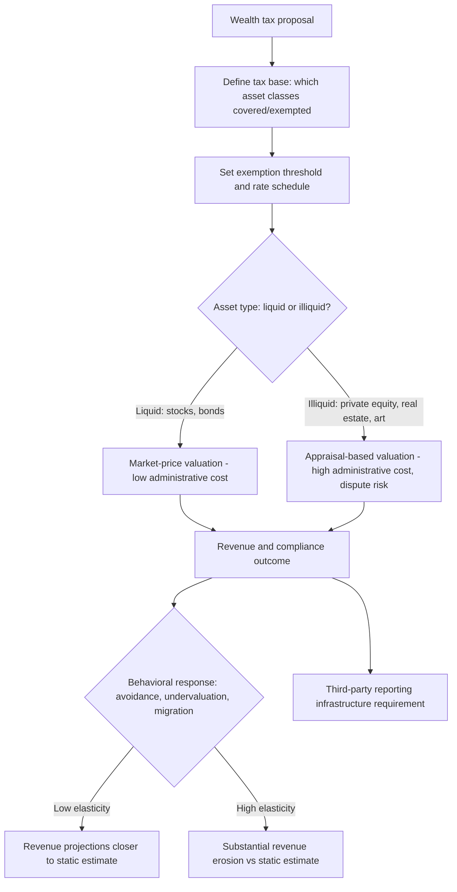

## Wealth Tax Proposals and Design

### Conceptual Foundations

A wealth tax is a recurring levy on the net stock of an individual's (or household's) assets — typically above an exemption threshold — as distinct from taxes on income flows (labor or capital income tax) or one-time transfer taxes (estate/inheritance tax). Wealth tax proposals have become a prominent contemporary public economics debate, driven by rising wealth concentration in many advanced economies, concerns about the erosion of capital income tax bases through avoidance and preferential treatment, and renewed interest in using tax policy to address inequality directly at the stock level rather than only the income-flow level.

### Base Definition and Design Parameters

$$T_i = \tau \times \max(0, W_i - E)$$

where $W_i$ is an individual's net wealth (assets minus liabilities), $E$ is an exemption threshold, and $\tau$ is the tax rate applied to wealth above the threshold — often designed with multiple brackets/rates rising with wealth level, analogous to a progressive income tax rate schedule.

**Key design parameters**:

- **Base coverage**: Whether the tax applies to all asset classes (financial assets, real estate, business equity, illiquid assets) or exempts certain categories (primary residence, pension wealth, small business assets) — base exemptions significantly affect both revenue yield and avoidance incentives (exempted asset classes become natural vehicles for wealth-shifting).
- **Valuation methodology**: Publicly traded assets (stocks, bonds) can be valued using observable market prices, but privately held businesses, real estate, art, and other illiquid assets require appraisal-based valuation, which is administratively costly and subject to manipulation/dispute — a first-order implementation challenge repeatedly emphasized in the wealth tax design literature.
- **Threshold and rate structure**: Most contemporary proposals target only very high wealth levels (e.g., top 0.1% or ultra-high-net-worth individuals) with correspondingly high exemption thresholds, distinguishing them from broader-based wealth taxes historically implemented in some European countries at lower thresholds.
- **Residence/citizenship basis**: Whether the tax applies based on residency, citizenship, or both, which interacts directly with international avoidance/migration concerns.

### Economic Rationale: Wealth Tax vs. Capital Income Tax

**Key Points**

A capital income tax and a wealth tax are related but not equivalent, because a wealth tax implicitly taxes the *return* on wealth at a rate that depends on the realized rate of return:

$$\text{Implicit tax rate on capital income} = \frac{\tau}{r}$$

where $r$ is the (potentially asset-specific) rate of return on wealth. This has an important implication: a wealth tax imposes a *higher effective tax rate on low-return assets* and a *lower effective rate on high-return assets*, relative to an equivalent-revenue capital income tax, which taxes actual realized returns proportionally regardless of the underlying rate of return.

- **Argument for this feature**: Some public economics analyses (e.g., work by Guvenen and colleagues on wealth taxation and misallocation) argue this property could improve capital allocation efficiency, since it implicitly taxes low-return (potentially poorly managed or complacently held) capital more heavily than high-return, more productively deployed capital — potentially incentivizing reallocation of capital toward higher-return uses.
- **Argument against**: Others (e.g., critiques associated with Scheuer and Slemrod's survey work) note this same feature penalizes risk-taking asymmetrically ex post (an entrepreneur whose investment happens to yield low realized returns pays a higher effective rate than one who succeeds, even if both took identical ex ante risks), potentially discouraging productive risk-taking. [Inference] This remains a genuinely contested theoretical point in the literature without a clear consensus resolution, turning on assumptions about the correlation between low returns and misallocation versus low returns and legitimate risk realization.

### Revenue Estimation and the Central Empirical Controversy

**Key Points**

A defining feature of the contemporary U.S. wealth tax debate (particularly around proposals associated with Senators Warren and Sanders in the 2019–2020 policy cycle) has been sharp disagreement among economists over projected revenue yield, driven almost entirely by differing assumptions about the **elasticity of reported wealth with respect to the tax rate** — i.e., how much wealth would be sheltered, undervalued, or shifted offshore in response to the tax, versus how much represents a genuine reduction in wealth accumulation.

$$\text{Revenue} = \tau \times (W - E) \times (1 - e_w \times \tau)$$

where $e_w$ is the behavioral elasticity of the taxable wealth base with respect to the tax rate (schematic representation) — small differences in the assumed value of $e_w$, given the concentration of wealth among a small number of taxpayers, can produce very large differences in projected revenue.

[Unverified — genuinely disputed in the empirical literature] Initial high-profile revenue estimates for prominent U.S. wealth tax proposals differed substantially between different economist teams, with the disagreement traced explicitly to differing assumptions about avoidance/evasion elasticities and administrative feasibility, rather than disagreement about the underlying wealth distribution data — this dispute is frequently cited as a central illustration of how sensitive wealth tax revenue projections are to behavioral response assumptions that are themselves difficult to estimate with confidence given limited historical experience with similarly designed taxes.

### International Experience

**Example**

- **France**: Operated a wealth tax (ISF, later replaced) for several decades before largely repealing the broad wealth tax in 2017–2018 (converting it into a real-estate-only wealth tax, IFI), a policy reversal frequently cited in the debate. [Inference] The repeal is commonly attributed by proponents of repeal to concerns about capital flight and reduced entrepreneurial investment, while critics of the repeal point to revenue and distributional considerations; the underlying empirical magnitude of capital flight attributable specifically to the wealth tax (versus other contemporaneous factors) is a matter of some dispute in the literature evaluating this episode.
- **Nordic countries (Sweden, Denmark, Finland, Norway)**: Several Nordic countries implemented and later substantially scaled back or repealed broad-based wealth taxes over recent decades, with Norway and Switzerland (a notable exception) retaining wealth taxes into the present, generally at broader thresholds and lower rates than proposed contemporary U.S. versions.
- **Switzerland**: Maintains a longstanding (cantonal-level, rate-varying) wealth tax applied at relatively broad thresholds and low rates, often cited in the literature as an example of a wealth tax that has persisted with less documented large-scale avoidance than in some other country experiences — [Unverified] though cross-country comparisons of avoidance behavior are complicated by substantial differences in tax rate levels, base design, and enforcement capacity that limit direct extrapolation of the Swiss experience to differently designed proposals elsewhere.

### Administrative and Enforcement Challenges

**Key Points**

- **Valuation of illiquid assets**: Private business equity, real estate, art, and collectibles lack observable market prices, requiring costly and contestable appraisal processes; this is widely regarded as one of the most significant practical implementation obstacles to a broad-based wealth tax.
- **Liquidity constraints**: Wealth-rich but cash-poor individuals (e.g., founders holding large illiquid equity stakes, farmers holding valuable but illiquid land) may face difficulty paying a wealth tax liability without selling assets, raising design questions about payment deferral, in-kind payment, or asset-specific exemptions.
- **International capital mobility and avoidance**: High-net-worth individuals have historically demonstrated some capacity for cross-border wealth and residency relocation in response to tax changes, though [Inference] the empirically estimated magnitude of migration responses specifically to wealth taxes (as opposed to income or other taxes) varies across studies and remains an area of active empirical research, sensitive to the availability of comparably attractive lower-tax jurisdictions.
- **Third-party reporting and information infrastructure**: Effective enforcement generally requires robust third-party reporting of asset holdings (financial institution reporting, real estate registries, business ownership registries) — countries or proposals lacking this infrastructure face substantially higher evasion risk.

### Diagram: Wealth Tax Design and Implementation Considerations

### Alternative and Complementary Policy Instruments

**Key Points**

Given the administrative challenges of a comprehensive wealth tax, several alternative or complementary instruments are frequently discussed in the same policy debate:

- **Mark-to-market capital gains taxation**: Taxing unrealized capital gains annually (particularly for publicly traded assets with observable prices) as an alternative or complement to a wealth tax, addressing some of the "stepped-up basis" and deferral advantages of the current realization-based capital gains system without requiring full wealth valuation of illiquid assets.
- **Strengthened estate and inheritance taxation**: Enhancing existing wealth-transfer taxes (which apply only at death or gift, rather than annually) as a less administratively demanding alternative for taxing wealth concentration, though with correspondingly less frequent and more avoidance-prone points of taxation.
- **Enhanced capital income taxation and closing preferential treatment**: Raising rates on capital gains, dividends, and carried interest, or eliminating stepped-up basis at death, as alternatives that work within the existing income tax framework rather than creating a new wealth tax base and administrative apparatus.
- **Financial transaction taxes**: A smaller levy on the volume of financial transactions, sometimes proposed alongside or as an alternative revenue source in the broader debate about taxing capital and wealth-related activity.

### Distributional and Revenue Context

**Key Points**

- Wealth tax proposals are typically motivated by documented increases in wealth concentration (the share of aggregate wealth held by the top 1% or top 0.1%) in several advanced economies over recent decades, drawing on wealth distribution estimates from sources such as the World Inequality Database and related academic wealth-concentration research.
- Advocates frame wealth taxation as addressing a base that has grown particularly rapidly at the very top of the distribution and that may be under-taxed relative to labor income under many existing tax systems (given preferential capital gains rates, stepped-up basis, and other capital-income tax provisions).
- Critics emphasize the administrative and behavioral response challenges outlined above, and in some cases argue that strengthening existing capital income tax instruments (rather than introducing an entirely new wealth tax base) would achieve similar distributional goals with lower administrative cost and avoidance risk.

**Related Topics**

- Optimal capital income taxation theory (Chamley-Judd and subsequent critiques)
- Mark-to-market taxation of unrealized capital gains
- Estate and inheritance tax design and avoidance
- International tax competition and high-net-worth individual mobility
- Wealth concentration measurement and the World Inequality Database
- Elasticity of taxable wealth and revenue estimation methodology
- Comparative wealth tax experience: France, Nordic countries, Switzerland
- Carried interest and preferential capital gains tax treatment