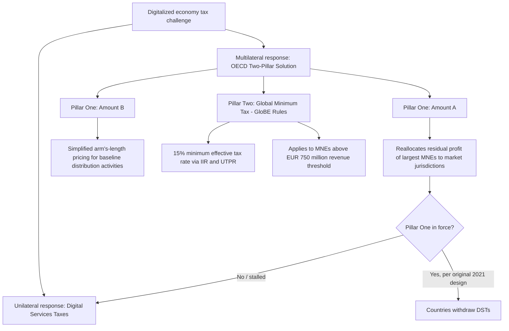

## Taxation of the Digital Economy

### Conceptual Foundations

The taxation of the digital economy addresses a fundamental mismatch between traditional international tax rules — designed around physical presence — and business models that generate substantial value and profit in a jurisdiction without any local physical operations. Digital platforms (search, social media, e-commerce, streaming, cloud services) can serve millions of users and derive substantial advertising or transaction revenue from a "market jurisdiction" while booking profits in low-tax jurisdictions where intangible assets or headquarters are formally located, exploiting the traditional **permanent establishment (PE)** requirement that has historically governed when a country may tax a foreign firm's business profits.

### The Core Public Economics Problem

**Key Points**

- **Value creation vs. taxing rights mismatch**: Traditional international tax rules allocate taxing rights based on where production factors (labor, capital, physical assets) are located, but digital business models often derive substantial value from user data, network effects, and market-jurisdiction user bases that generate no taxable physical presence under existing treaty rules.
- **Profit shifting via intangibles**: Digital firms' value is disproportionately embodied in intangible assets (algorithms, brand, user data, software) that are highly mobile for tax purposes — easily located in low-tax jurisdictions through licensing and transfer-pricing arrangements — making digital business models a leading edge of the broader base erosion and profit shifting (BEPS) problem central to international public economics.
- **Formulary apportionment vs. arm's-length pricing**: The digital tax debate reflects a deeper tension in international tax theory between the traditional arm's-length transfer-pricing standard (pricing intra-firm transactions as if between unrelated parties) and formulary apportionment approaches (allocating global profit across jurisdictions using an observable formula, e.g., based on sales, employment, or assets) — digital economy proposals have pushed the international consensus meaningfully toward formulary elements.

### Digital Services Taxes (DSTs): Unilateral Measures

**Definition**: A DST is a gross-revenue (not profit) tax levied on defined categories of digital revenue (targeted advertising, digital intermediation/marketplace services, and/or data monetization) earned from users located in the taxing country, typically applying to firms above specified global and in-country revenue thresholds.

$$\text{DST liability} = \tau_{DST} \times \text{In-country digital revenue}$$

where $\tau_{DST}$ is typically in the 1.5%–7.5% range across implementing countries, and the base is revenue rather than profit — a deliberate design choice enabling taxation even when a firm reports low or no profit in the taxing jurisdiction under existing transfer-pricing arrangements.

**Key Points**

- **Rationale**: DSTs were adopted unilaterally by numerous countries (France, UK, Italy, Spain, Austria, India, and others) beginning around 2018–2020, motivated by frustration with the slow pace of multilateral OECD negotiations and a desire to capture revenue from large digital multinationals perceived as under-taxed relative to their in-country user base and revenue.
- **Economic critique — gross revenue basis**: Because DSTs tax revenue rather than profit, they can impose a disproportionately heavy burden on lower-margin firms or loss-making entrants, and are generally regarded in the public economics literature as a cruder, less efficient instrument than profit-based taxation, since they do not scale with actual profitability.
- **Incidence concerns**: As with other revenue-based levies, economic analyses widely note that DSTs may be partially passed through to advertisers, merchants, or consumers via higher platform fees, rather than being borne entirely by the shareholders of the taxed digital firms — an empirical incidence question with mixed and context-dependent findings.
- **Trade friction and retaliation**: Because these taxes mainly impact US companies and are thus perceived as discriminatory, the United States responded with retaliatory tariff threats, urging countries to abandon their DSTs. This dynamic has made DSTs a recurring point of transatlantic and broader international trade tension. [Tax Foundation](https://taxfoundation.org/data/all/eu/digital-services-taxes-europe/)

### The OECD Two-Pillar Solution: Background and Design

In response to the proliferation of unilateral DSTs, the OECD/G20 Inclusive Framework developed a multilateral "Two-Pillar" solution intended to replace unilateral digital taxes with a coordinated international framework.

**Pillar One (Amount A): Reallocation of taxing rights**

- **Original scope**: Initially targeted specifically at highly digitalized businesses lacking physical presence in market jurisdictions.
- **Evolved scope**: In 2021, the final Pillar One proposal abandoned the focus on digital firms entirely and now applies to all firms, except financial and extractive businesses. [Tax Foundation](https://taxfoundation.org/research/all/global/digital-taxation/)
- **Mechanism**: Pillar One, Amount A changes the rules for where companies pay taxes. It uses a formula to reallocate a portion of the largest, most profitable multinationals' residual profit to market jurisdictions where sales occur, regardless of physical presence — a partial, targeted move toward formulary apportionment for a defined set of very large firms. According to the OECD, taxing rights on about $200 billion in profits would be shifted to jurisdictions different from where the profits are currently being taxed. [Tax Foundation](https://taxfoundation.org/research/all/global/digital-taxation/)[Tax Foundation](https://taxfoundation.org/testimony/pillar-one-digital-services-taxes/)
- **Amount B**: A complementary, simplified framework applying the arm's-length principle to standardize pricing of baseline marketing and distribution activities, reducing transfer-pricing disputes for routine functions.
- **Intended trade-off**: A key part of Pillar One is the removal of DSTs and other unilateral measures, since Amount A was designed as the multilateral alternative that would render unilateral DSTs unnecessary. [Oecdpillars](https://oecdpillars.com/pillar_one/pillar-one-digital-service-taxes-2/)

**Pillar Two: Global minimum tax**

- **Mechanism**: The OECD's Pillar Two framework introduces a global minimum tax regime designed to ensure that multinational enterprises (MNEs) with consolidated annual revenues exceeding EUR 750 million are subject to a minimum effective tax rate of 15% in each jurisdiction in which they operate. Where the effective tax rate (ETR) in a jurisdiction falls below this threshold, a top-up tax may arise to bring the overall taxation of those profits up to the minimum level. [BDO](https://www.bdo.global/en-gb/insights/tax/international-tax/pillar-two-updates-status-of-implementation-around-the-world)
- **Rule structure**: Implemented via the Income Inclusion Rule (IIR, allowing a parent jurisdiction to collect top-up tax on low-taxed foreign income) and the Undertaxed Profits Rule (UTPR, a backstop mechanism), collectively known as the GloBE (Global Anti-Base Erosion) rules.
- **Distinction from Pillar One**: While Pillar Two applies broadly to large multinationals generally (not specifically digital firms), it is closely linked to the digital taxation debate because it addresses the same underlying concern — profit-shifting to low-tax jurisdictions — that digital business models' intangible-asset mobility made especially acute.

### Diagram: Two-Pillar Framework Structure

### Current Status and Implementation Divergence (as of 2026)

**Key Points**

- **Pillar One stalled**: As of May 2026, Pillar One remains unimplemented. Negotiations over the multilateral convention to implement Amount A have not concluded, and while the OECD hasn't completely dropped Pillar One, the negotiations have failed to result in an agreement that would eliminate DSTs. [Whtcalculator](https://whtcalculator.com/blog-digital-services-tax-2026)[Tax Foundation](https://taxfoundation.org/data/all/eu/digital-services-taxes-europe/)
- **DST landscape fragmenting rather than converging**: Canada's DST is repealed, Belgium's arrives in 2027, the EU debates a bloc levy, and the US Section 899 retaliatory tool reshapes the global DST map. Canada repealed its retroactive DST under US trade pressure, Belgium is introducing a new levy in 2027, the EU debates a unified digital bloc tax, and the US OBBBA's Section 899 retaliatory tool hangs over any jurisdiction that targets American digital companies. [Whtcalculator](https://whtcalculator.com/blog-digital-services-tax-2026)[Whtcalculator](https://whtcalculator.com/blog-digital-services-tax-2026)
- **Ongoing political tension**: Tensions continue to simmer over digital services taxes and OECD's Pillar One, with European officials warning that agreement must be reached or digital services taxes will proliferate. [Sullivan & Cromwell](https://www.sullcrom.com/insights/memo/2026/March/Tax-Policy-Memo-March-23)[Sullivan & Cromwell](https://www.sullcrom.com/insights/memo/2026/March/Tax-Policy-Memo-March-23)
- **Pillar Two proceeding but with modifications**: Unlike Pillar One, Pillar Two has seen substantial jurisdictional adoption. Under the OECD Inclusive Framework, over 140 nations have committed to a two-pillar approach tackling issues from the digital economy's expansion, and Pillar Two implementation tracking shows widespread (though uneven) country-level legislative adoption. However, implementation has been adjusted to accommodate US non-participation: effective January 1, 2026, [a Side-by-Side Safe Harbor] eliminates any top-up tax under the income inclusion rule for U.S.-parented groups that elect the new SbS Safe Harbor, and the undertaxed profits rule is deemed zero for those groups' controlled domestic and foreign operations. In June [2025], the US administration reached an agreement with other members of the G7 to exclude US parented groups from the Income Inclusion Rule and Undertaxed Profits Rule under Pillar Two, effectively permitting the US system for taxing globally low-taxed income to coexist alongside Pillar Two. [Pillar Two Country Tracker | PwC +2](https://www.pwc.com/gx/en/services/tax/pillar-two-readiness/country-tracker.html)
- [Inference] The divergent trajectories of the two pillars — Pillar Two advancing with US-accommodating carve-outs while Pillar One remains stalled — illustrate a broader pattern in which the global minimum tax component of international tax reform has proven more politically tractable than the profit-reallocation component specifically targeting large, often US-headquartered digital and consumer-facing firms; this divergence is an evolving, actively contested situation rather than a settled outcome.

### Public Economics Analysis of Trade-offs

**Key Points**

- **Tax competition and race-to-the-bottom concerns**: Pillar Two's minimum tax is explicitly designed to limit international tax competition on corporate rates for large multinationals, addressing a classic public economics concern that uncoordinated national tax-setting under capital mobility leads to inefficiently low equilibrium corporate tax rates (a race to the bottom).
- **Sovereignty vs. coordination trade-off**: Unilateral DSTs preserve full national fiscal sovereignty and can be implemented quickly and independently, but at the cost of double-taxation risk, retaliatory trade measures, and a fragmented, inconsistent global compliance landscape for multinational firms — the fragmentation costs are a standard efficiency argument in favor of multilateral coordination, even though multilateral processes are slower and subject to holdout/veto dynamics.
- **Revenue and administrative complexity trade-off**: Formulary/Amount A-style reallocation requires complex international agreement on formula design (what share of profit is "residual," what allocation key to use) and imposes a large one-time and ongoing administrative and compliance burden on both tax authorities and firms — a cost weighed against the benefit of a more stable, treaty-based long-run resolution relative to a patchwork of unilateral measures.
- **Incidence and pass-through**: Both DSTs and reallocated Pillar One-style taxes raise standard tax-incidence questions about the extent to which the economic burden falls on shareholders of digital firms, or is instead passed through to advertisers, third-party sellers on platforms, or end consumers — an empirical question relevant to assessing the actual distributional and efficiency effects of either approach.

### Illustrative Example: Diverging National Approaches

**Example**

- **France**: An early DST adopter (2019), applying a revenue-based levy on digital advertising and intermediation revenue from large digital firms, repeatedly a flashpoint in US-France trade tension.
- **India**: Implemented an "equalization levy" as an early, broader-based digital tax mechanism, illustrating a developing-country approach to capturing revenue from foreign digital platforms serving large domestic user bases without local physical presence.
- **Canada**: Adopted then repealed its DST under direct US trade pressure, illustrating the practical vulnerability of unilateral digital tax measures to retaliatory action from the jurisdiction whose firms are primarily affected.
- **Belgium and the EU**: Belgium's planned 2027 DST and ongoing EU-level discussion of a bloc-wide digital levy illustrate that, notwithstanding Pillar One's stall, some jurisdictions continue to view unilateral or regional digital taxation as a live policy option rather than a fully abandoned approach.

### Developing-Country Considerations

**Key Points**

- Developing countries have a particular stake in the digital taxation debate because they are overwhelmingly "market jurisdictions" (large user bases) rather than headquarters jurisdictions for major digital platforms, making the allocation-key design of any Pillar One-style formula highly consequential for their potential revenue gains.
- Simpler unilateral instruments (DSTs, equalization levies) have been particularly attractive to lower-capacity tax administrations because they avoid the complex transfer-pricing and profit-attribution analysis required under both the traditional arm's-length system and Pillar One's Amount A formula.
- [Inference] Given Pillar One's stalled status, several developing and emerging economies are likely to continue relying on unilateral revenue-based digital tax instruments in the near term rather than a multilateral profit-reallocation mechanism, though the durability of this approach depends on evolving trade-policy responses from major digital-exporting countries; this is a fast-moving area where current reporting should be checked for the latest developments given how quickly country-level positions have shifted through 2025–2026.

**Related Topics**

- Base erosion and profit shifting (BEPS) and transfer pricing
- Global minimum tax (Pillar Two) mechanics: IIR, UTPR, and QDMTT
- Formulary apportionment vs. arm's-length pricing in international taxation
- Tax incidence of gross-revenue-based levies
- International tax competition and corporate tax race-to-the-bottom models
- VAT/GST treatment of cross-border digital services
- Permanent establishment doctrine and its erosion in a digital economy
- Developing-country revenue mobilization from multinational digital platforms