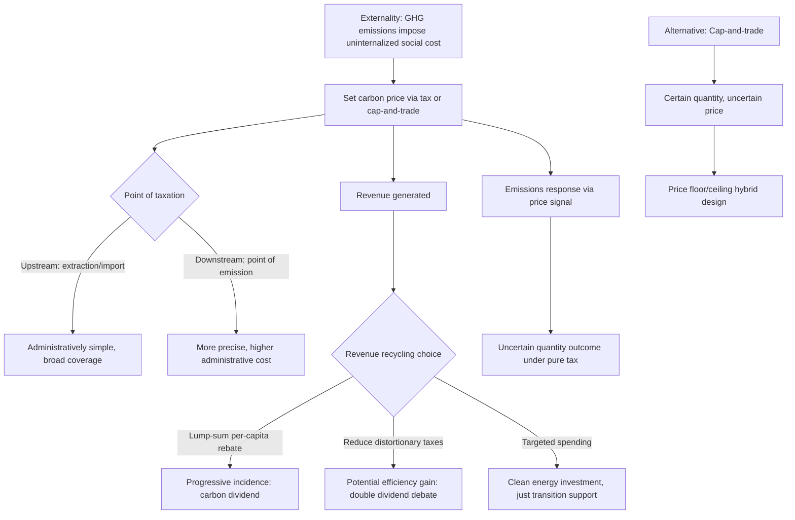

## Climate Policy and Carbon Taxation Design

### Conceptual Foundations

Climate policy and carbon taxation sit within the classic public economics framework of correcting a **negative externality**: greenhouse gas (GHG) emissions impose costs on third parties (current and future generations globally) that are not reflected in the private market price of carbon-intensive goods and activities. The foundational theoretical tool is Pigouvian taxation — setting a per-unit tax equal to the marginal external damage of the activity, so that private decision-makers internalize the full social cost of their emissions.

$$\tau^{*} = MD(Q^{*})$$

where $\tau^{*}$ is the optimal Pigouvian carbon tax and $MD(Q^{*})$ is the marginal external damage (marginal social cost of carbon) evaluated at the socially efficient emissions quantity $Q^{*}$.

### The Social Cost of Carbon (SCC)

**Key Points**

The Social Cost of Carbon (SCC) is the monetized estimate of the present-value damage caused by emitting one additional ton of CO2, integrating projected damages across time and geography, discounted back to the present:

$$SCC = \int_{t_0}^{\infty} \frac{D(t)}{(1+\rho)^{t-t_0}} \, dt$$

where $D(t)$ represents the marginal damage flow in period $t$ from the additional ton of emissions, and $\rho$ is the social discount rate.

- **Integrated Assessment Models (IAMs)**: SCC estimates are typically derived from IAMs (e.g., DICE, FUND, PAGE) that combine simplified climate physics (how emissions translate into temperature change) with economic damage functions (how temperature change translates into economic loss).
- **Discount rate sensitivity**: SCC estimates are famously highly sensitive to the assumed discount rate $\rho$, since climate damages are realized far in the future — lower discount rates produce dramatically higher SCC estimates, and the choice of discount rate embeds a normative judgment about intergenerational equity that is a longstanding and unresolved debate in environmental and public economics (associated with the Stern Review's low-discount-rate approach versus higher-discount-rate critiques from economists such as Nordhaus).
- [Inference] Given persistent disagreement over discount rates, damage function specification, and tail-risk treatment of catastrophic outcomes, published SCC estimates vary substantially across models and studies; policymakers using a specific SCC value are implicitly adopting a particular set of ethical and modeling assumptions rather than applying an objectively settled number.

### Carbon Tax Design

**Base and point of taxation**

$$T = \tau \times E$$

where $E$ is the quantity of carbon (or CO2-equivalent) emissions and $\tau$ is the per-unit tax rate. A central design choice is **where in the supply chain** the tax is levied:

- **Upstream taxation** (at the point of fossil fuel extraction or import): Administratively simple, requiring monitoring of a relatively small number of extraction points/importers, and automatically captures the full carbon content of fuel regardless of downstream use.
- **Downstream taxation** (at the point of final emission, e.g., at industrial smokestacks): More administratively demanding (many more emission points to monitor) but can be combined with more precise measurement of actual emissions (accounting for capture technologies) rather than assumed carbon content of inputs.
- **Key Points**: Most implemented carbon tax systems favor upstream or near-upstream taxation for administrative simplicity, given that the number of fuel producers/importers is vastly smaller than the number of final emission sources.

**Rate-setting approaches**

- **Marginal damage approach**: Set $\tau$ equal to an estimated SCC, directly implementing the Pigouvian principle.
- **Target-consistent approach**: Set $\tau$ (or a rising trajectory of $\tau$ over time) to be consistent with achieving a specific quantitative emissions reduction target (e.g., net-zero by a target year), backward-derived from an emissions pathway rather than directly from damage estimation — increasingly the practical approach used in jurisdictions with binding legislated climate targets.

### Carbon Tax vs. Cap-and-Trade (Emissions Trading)

**Key Points**

The two dominant market-based carbon pricing instruments differ in which variable they fix directly:

| Feature | Carbon tax | Cap-and-trade |
| --- | --- | --- |
| Fixed variable | Price (tax rate) | Quantity (total emissions cap) |
| Emissions outcome | Uncertain (depends on behavioral response to price) | Certain (bounded by the cap), absent banking/borrowing complications |
| Price outcome | Certain (set by policy) | Uncertain (determined by market for allowances) |
| Revenue | Direct tax revenue to government (if not rebated) | Auction revenue (if allowances are auctioned) or none (if freely allocated) |
| Administrative complexity | Relatively simple | Requires allowance market infrastructure, monitoring, and enforcement of trading |

**Weitzman's "Prices vs. Quantities" framework**: The classical result (Weitzman, 1974) shows that the relative efficiency of price instruments (taxes) versus quantity instruments (caps) under uncertainty about abatement costs depends on the relative slopes of the marginal benefit (damage) and marginal cost (abatement cost) curves:

$$\text{Price instrument preferred when: } \quad \text{marginal damage curve is relatively flat compared to marginal abatement cost curve}$$

$$\text{Quantity instrument preferred when: } \quad \text{marginal damage curve is relatively steep compared to marginal abatement cost curve}$$

[Inference] Because climate change damages are widely modeled as accumulating gradually from the global stock of atmospheric carbon (rather than being highly sensitive to the exact emissions level in any single year), the marginal damage curve for a single year's emissions is often characterized as relatively flat in this framework, which is frequently cited as a theoretical argument favoring carbon taxes (or price-based hybrid instruments) over pure quantity caps for climate policy specifically — though this remains a modeling-dependent conclusion rather than a universally accepted prescription, and many implemented systems (e.g., the EU Emissions Trading System) use cap-and-trade regardless.

**Hybrid instruments**: Cap-and-trade systems with a **price floor** (minimum auction reserve price) and/or **price ceiling** (cost containment reserve, releasing additional allowances if prices exceed a threshold) combine features of both instruments, bounding price volatility while retaining a quantity guarantee — an increasingly common practical design compromise.

### Revenue Recycling and Distributional Design

**Key Points**

A carbon tax generates substantial revenue, and how that revenue is used ("recycled") is a first-order policy design choice with significant efficiency and distributional implications:

- **Lump-sum rebates ("carbon dividends")**: Returning revenue equally per capita to households, which tends to be progressive in incidence (lower-income households typically have lower absolute carbon footprints, so an equal per-capita rebate exceeds their tax payment on average) — the model underlying proposals like the Climate Leadership Council's carbon dividend plan and Canada's federal carbon pricing rebate structure.
- **Tax-shifting ("revenue-neutral" recycling)**: Using carbon tax revenue to reduce existing distortionary taxes (labor income tax, payroll tax, corporate tax), motivated by the "double dividend" hypothesis — the idea that a carbon tax could simultaneously correct the environmental externality *and* improve overall economic efficiency by allowing reductions in pre-existing distortionary taxes.
- **The double dividend debate**: [Inference] The theoretical and empirical literature on the double dividend hypothesis is genuinely contested; a "weak" form (recycling revenue via tax cuts is more efficient than lump-sum rebates or general spending) is relatively uncontroversial, but the "strong" form (a revenue-neutral carbon tax swap generates a net efficiency gain even ignoring environmental benefits) is more disputed, since pre-existing tax interactions (the carbon tax interacting with existing labor tax distortions in the "tax interaction effect") can offset or even reverse the efficiency gains from revenue recycling under certain parameter assumptions.
- **Targeted spending**: Directing revenue toward clean energy investment, climate adaptation, or transition assistance for affected workers and communities (e.g., in fossil-fuel-dependent regions), trading off some potential efficiency gains from tax-shifting against political feasibility and distributional/just-transition objectives.

### Regressivity Concerns and Distributional Analysis

**Key Points**

- **Direct incidence**: Carbon taxes on household energy consumption (heating fuel, gasoline, electricity) can be regressive in isolation, since energy expenditure typically constitutes a larger *share* of income for lower-income households, even though absolute carbon footprints often rise with income.
- **Rebate design as the primary corrective tool**: The regressivity concern is the central motivation for lump-sum/equal per-capita rebate designs, which can more than offset the regressive direct incidence for a majority of lower-income households, converting the overall policy (tax plus rebate) into a net progressive transfer for most of the income distribution.
- **Regional and sectoral distributional effects**: Beyond household income distribution, carbon taxes also have geographically concentrated effects on regions/workers dependent on carbon-intensive industries (coal mining, oil and gas extraction), raising distinct "just transition" policy design questions separate from the household-level regressivity issue.

### Diagram: Carbon Tax Policy Design Architecture

### Border Carbon Adjustments and Competitiveness

**Key Points**

- **Carbon leakage problem**: A unilateral carbon tax raises production costs for domestic carbon-intensive industries relative to foreign competitors in jurisdictions without comparable carbon pricing, potentially shifting production (and associated emissions) abroad rather than reducing global emissions — a concern of particular relevance to trade-exposed, energy-intensive sectors (steel, cement, chemicals).
- **Border Carbon Adjustments (BCAs)**: Tariffs applied to imports based on their embedded carbon content (and/or rebates for exports), designed to level the competitive playing field and preserve the emissions-reduction incentive without simply relocating (rather than reducing) global emissions. The EU's Carbon Border Adjustment Mechanism (CBAM) is the most prominent implemented example, applying to imports of specified carbon-intensive goods.
- **Design and WTO-compatibility challenges**: BCA design must navigate complex measurement challenges (accurately assessing the embedded carbon content of imported goods, particularly from countries with different production technologies and emissions data availability) and international trade law compatibility questions regarding non-discriminatory treatment of trading partners, an active area of ongoing legal and economic analysis.

### Complementary and Alternative Instruments

**Key Points**

- **Command-and-control regulation**: Direct standards (fuel efficiency mandates, renewable portfolio standards, appliance efficiency standards) can be politically more feasible than pricing instruments and may address specific market failures (e.g., principal-agent problems in energy efficiency investment, such as landlord-tenant splits) that a uniform carbon price alone does not fully resolve, though they are generally regarded as less cost-effective than price instruments for achieving a given aggregate abatement target across heterogeneous emission sources.
- **Green subsidies and innovation policy**: Subsidies for clean technology R&D and deployment address a *distinct* market failure — knowledge spillovers from innovation — that a carbon price alone does not fully correct, since private innovators cannot capture the full social value of spillover benefits to other firms and future innovators; this provides a public economics rationale for using subsidies and carbon pricing as complementary (not substitute) instruments.
- **Fossil fuel subsidy removal**: Many countries subsidize fossil fuel consumption or production, effectively creating a negative carbon price; removing these subsidies is frequently identified as a highly cost-effective complementary climate policy step, though politically difficult given the concentrated distributional losses to current subsidy beneficiaries.

### Political Economy of Carbon Pricing

**Key Points**

- **Salience and visibility**: Carbon taxes are highly visible to consumers (a specific, identifiable price increase), which can generate stronger political resistance than less visible but economically comparable measures such as regulatory standards, even when the carbon tax may be more cost-effective — a behavioral/political economy consideration increasingly incorporated into climate policy design discussions.
- **Concentrated losses, diffuse gains**: The costs of carbon pricing are concentrated on identifiable carbon-intensive industries and their workers, while the climate benefits are diffuse (spread across the global population and future generations) — a classic political economy structure that tends to generate more organized opposition than support, independent of the policy's aggregate net social benefit.
- **International coordination problem**: Because climate change is a global externality (emissions anywhere affect the whole planet) but climate policy is set nationally, individual countries bear the full domestic cost of their own carbon pricing while capturing only a small share of the global climate benefit — a classic public-goods free-rider problem that helps explain both the historical slowness of unilateral climate action and the ongoing difficulty of achieving binding international climate agreements.

**Related Topics**

- Social cost of carbon estimation and integrated assessment models
- Cap-and-trade design: EU ETS and allowance allocation methods
- Border carbon adjustment mechanisms and trade law compatibility
- Double dividend hypothesis and tax interaction effects
- Just transition policy for carbon-dependent regions and workers
- Behavioral responses to energy price signals and demand elasticities
- International climate agreements and the global public goods problem
- Green innovation subsidies and knowledge spillover market failures