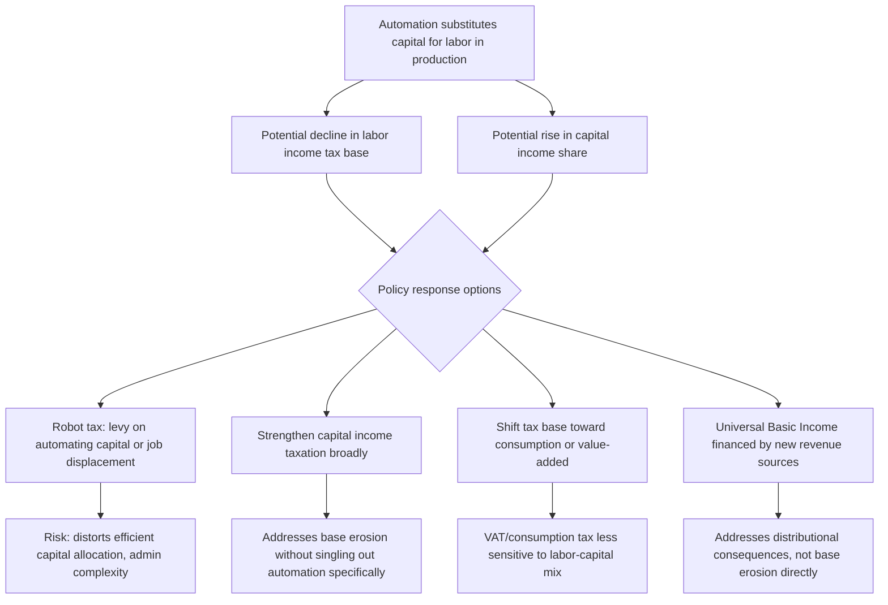

## Automation and the Future of Taxation

### Conceptual Foundations

Automation and the future of taxation examines how accelerating capital-labor substitution — through robotics, artificial intelligence, and software-based automation — challenges the structural foundations of contemporary tax systems, which rely heavily on taxing labor income (payroll taxes, personal income tax withholding) as their primary revenue base. If automation systematically shifts income from labor to capital, and if capital income is generally taxed at lower effective rates and is more mobile/avoidance-prone than labor income, the debate concerns both the long-run sustainability of existing tax bases and potential new instruments (notably the much-discussed "robot tax") to address the transition.

### The Core Public Economics Concern: Tax Base Erosion

**Key Points**

Most advanced-economy tax systems derive a large share of revenue from labor-income-based instruments:

$$\text{Labor tax revenue} = \tau_L \times L \times w$$

where $\tau_L$ is the effective labor tax rate, $L$ is labor input (hours/employment), and $w$ is the wage rate. If automation reduces $L$ (substituting capital for labor in production) without a proportional offsetting increase in capital income taxation, then for a given $\tau_L$, labor tax revenue mechanically declines even if aggregate output and income are unaffected or rising.

- **Labor share of income**: A substantial body of empirical macroeconomic research has documented declining labor shares of national income in many advanced economies over recent decades, a trend automation-focused commentators frequently cite as suggestive (though not definitively causally attributed to automation specifically, since globalization, market concentration, and other factors are also proposed explanations) of a broader capital-labor income reallocation relevant to the tax base question.
- **Capital income under-taxation relative to labor**: Many existing tax systems tax capital income (corporate profits, capital gains, dividends) at effective rates below labor income tax rates once payroll taxes, preferential capital gains treatment, and avoidance opportunities are accounted for — a longstanding public economics critique (predating the automation debate specifically) that automation-driven income reallocation would exacerbate if left unaddressed.
- [Inference] The precise empirical magnitude and timing of automation-driven labor market disruption — as distinct from other contemporaneous structural changes in labor markets — remains a genuinely and actively contested empirical question in labor and public economics; policy proposals premised on large near-term automation-driven displacement should be understood as resting on a debated forecast rather than a settled empirical finding.

### The "Robot Tax" Proposal

**Definition**: A robot tax is a proposed levy on the deployment of automating capital (robots, AI systems) or on firms that reduce human employment through automation, intended to slow the pace of automation-driven labor displacement and/or to replace lost labor tax revenue.

**Key Points — arguments in favor**:

- **Revenue replacement**: Directly targets the specific capital assets substituting for labor, aiming to preserve government revenue capacity as the underlying tax base shifts from labor to automated capital.
- **Pigouvian-style correction for negative externalities of displacement**: Some proponents frame rapid automation-driven job loss as generating negative externalities (unemployment-related social costs, adjustment costs, regional economic disruption) not fully internalized by firms making automation investment decisions, providing a Pigouvian rationale analogous to (though distinct from) environmental externality taxation.
- **Slowing the pace, not preventing automation**: Proponents (including Bill Gates in widely cited public remarks) have generally framed the tax as intended to slow the *pace* of automation-driven disruption to allow for smoother labor market and social-safety-net adjustment, rather than to prevent automation entirely.

**Key Points — arguments against**:

- **Distortion of efficient capital allocation**: Standard economic analysis (articulated prominently by economists such as Lawrence Summers) argues that taxing automation specifically would distort firms' input choices away from the efficient capital-labor mix, reducing productivity and economic growth without a clear efficiency-based justification analogous to a genuine externality (unlike, e.g., carbon emissions, labor displacement is a *pecuniary* effect operating through market prices and wages, which standard welfare economics generally does not treat as a market failure requiring correction, since the same distributional effect could equally be produced by reduced trade costs or other efficiency-enhancing changes).
- **Definitional and administrative challenges**: Distinguishing "automation-related" capital investment from ordinary capital investment or productivity-enhancing technology adoption is definitionally difficult, and any workable robot tax would need clear, administrable criteria — an unresolved design question in most concrete proposals to date.
- **International competitiveness concerns**: A unilateral robot tax could disadvantage domestic firms relative to foreign competitors not facing a similar levy, potentially shifting automation investment (and associated production) abroad rather than preserving domestic employment — an argument structurally similar to carbon leakage concerns in climate policy.
- **South Korea's experience**: Often cited (sometimes imprecisely) as an example of "robot tax" policy, though the actual 2018 South Korean measure was a reduction in existing tax incentives for automation investment (reducing a subsidy) rather than the introduction of a new, additional tax — an important distinction frequently blurred in popular discussion of the "robot tax" concept.

### Diagram: Automation and Tax Base Policy Responses

### Alternative Policy Responses to Automation-Driven Base Erosion

**Key Points**

Public economics analyses generally favor addressing the underlying structural concern — capital income under-taxation and labor market adjustment costs — through broader instruments rather than a narrowly targeted robot tax:

- **Strengthening general capital income taxation**: Raising corporate tax rates, reducing preferential treatment of capital gains and dividends, closing avoidance channels (as discussed in wealth tax and digital economy taxation debates), addressing the underlying capital-labor tax rate disparity without singling out automation-related capital specifically.
- **Shifting toward consumption-based taxation**: Value-added tax (VAT) or broader consumption tax bases are neutral with respect to the capital-labor mix of production (since they tax final consumption regardless of how it was produced), making them more automation-resilient than labor-income-based revenue instruments — though consumption taxes raise their own distinct distributional (typically regressive incidence) design challenges requiring corrective transfers or exemptions.
- **Financing safety-net expansion (UBI, wage insurance, retraining)**: Rather than taxing automation directly, using general revenue (potentially from strengthened capital taxation or new instruments like carbon dividends or wealth taxes) to fund expanded income support, wage insurance for displaced workers, or retraining programs — addressing the distributional consequences of automation-driven displacement without distorting the underlying automation investment decision itself.
- **Payroll tax base broadening or restructuring**: Some proposals suggest broadening payroll tax bases to include a wider range of compensation forms, or exploring alternative bases less tied to traditional employment relationships, as labor markets increasingly feature gig work, contracting, and non-traditional employment arrangements alongside automation trends.

### Relationship to Other Contemporary Public Economics Debates

**Key Points**

- **Connection to UBI debates**: Automation-driven labor market disruption is one of the most frequently cited motivating rationales for Universal Basic Income proposals, though [Inference] the strength of this link depends on the contested empirical premise about automation's actual displacement magnitude, and UBI proposals can be (and are) independently motivated by other considerations (administrative simplicity, poverty-trap reduction) regardless of one's view on automation's trajectory.
- **Connection to wealth and capital income taxation debates**: The automation-taxation discussion overlaps substantially with the broader wealth tax and capital income taxation debates, since both are fundamentally concerned with whether existing tax systems adequately capture returns to capital relative to labor — automation is often framed as an accelerant of a pre-existing capital-labor tax base tension rather than an entirely distinct phenomenon.
- **Connection to digital economy taxation**: Automation and AI-driven production increasingly involve the same highly mobile, intangible-asset-intensive multinational firms at the center of digital economy tax debates (profit shifting via intellectual property location), linking the automation-taxation question to ongoing international tax reform efforts (BEPS, Pillar Two) discussed in that context.

### Illustrative Example: Contrasting Policy Packages

**Example**

- **Targeted robot tax approach**: A jurisdiction imposes a specific levy on industrial robot deployment or AI-driven job displacement, aiming to directly slow automation adoption and preserve labor tax revenue — facing the distortion and administrability critiques above.
- **Broad-based capital taxation approach**: A jurisdiction instead raises general capital income tax rates, strengthens international tax coordination against profit shifting (Pillar Two-style minimum taxation), and uses the resulting revenue to fund worker retraining and strengthened unemployment/wage insurance — addressing the same underlying distributional and revenue concerns without directly distorting the automation investment margin, at the cost of not specifically targeting the mechanism (automation) most publicly associated with the disruption.
- [Inference] Public economics analysis generally favors the broad-based approach on efficiency grounds (avoiding a narrow distortion targeting a specific, difficult-to-define technology category), while proponents of targeted measures emphasize political economy advantages (visible, direct response to a specific publicly salient concern) and the specific externality framing of rapid, concentrated displacement — this remains a genuinely unresolved policy design debate without consensus resolution in the literature.

**Related Topics**

- Optimal capital income taxation and the Chamley-Judd framework
- Universal Basic Income financing and automation-driven motivations
- Wealth tax proposals and capital-labor tax rate disparities
- Value-added tax design and consumption-based tax bases
- Declining labor share of income: empirical evidence and causes
- International tax coordination and profit shifting (Pillar Two)
- Wage insurance and active labor market policy for displaced workers
- Pigouvian taxation theory and its applicability to labor market externalities