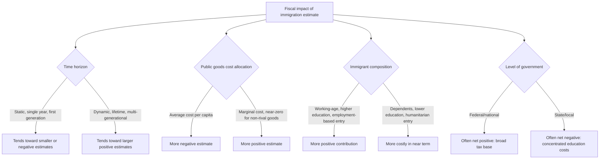

## Fiscal Impacts of Immigration

### Conceptual Foundations

The fiscal impact of immigration analysis examines the net effect of immigrant populations on government budgets — the difference between taxes and other revenue immigrants and their descendants contribute versus the public expenditures (education, health, social benefits, infrastructure, public goods) attributable to them. This is a central applied public economics question because it directly informs debates over immigration policy design, and because the answer is highly sensitive to methodological choices that are themselves subjects of ongoing technical and normative debate.

### The Basic Accounting Framework

$$NFI_i = \sum_{t} \frac{R_{i,t} - E_{i,t}}{(1+\rho)^{t}}$$

where $NFI_i$ is the net fiscal impact of immigrant (or immigrant cohort) $i$, $R_{i,t}$ represents revenue contributions (income tax, payroll tax, consumption tax, property tax) in period $t$, $E_{i,t}$ represents public expenditures attributable to that individual/cohort in period $t$, and $\rho$ is the discount rate used to compute a present value across the (potentially very long, multi-generational) time horizon.

**Key Points**

- **Static vs. dynamic (lifetime) accounting**: A **static** analysis measures the net fiscal contribution of the existing immigrant population in a single fiscal year (a snapshot), while a **dynamic/lifetime** analysis projects the full lifetime (and often intergenerational, including descendants) fiscal contributions and costs of an immigrant cohort — these two approaches can yield sharply different conclusions and are not interchangeable.
- **First-generation vs. multi-generational scope**: Static, first-generation-only analyses tend to show smaller net fiscal contributions (since immigrants often arrive at various life stages and their children's future contributions are not counted), while analyses incorporating the fiscal contributions of immigrants' descendants (second and later generations) generally show substantially more positive net fiscal impacts, since children of immigrants are typically educated in and fully integrated into the host-country economy and tax system over their working lives.

### Key Methodological Drivers of Estimated Fiscal Impact

**Key Points**

The wide range of published estimates of immigration's fiscal impact — from clearly net-negative to clearly net-positive, even within the same country — is driven primarily by methodological choices rather than disagreement about the underlying facts of immigrant tax payments or benefit receipt:

- **Age at arrival and skill/education composition**: Immigrants arriving as working-age adults with higher educational attainment tend to show substantially more positive net fiscal contributions than those arriving with lower educational attainment or as dependents (children, elderly), since the host country incurs the upfront cost of childhood education/dependency without the immigrant's own tax contributions during that period, or incurs elderly-dependency costs without a full working-life tax contribution history.
- **Public goods allocation method**: A central and contentious methodological choice is how "pure public goods" (national defense, debt service, general government administration) are allocated across the population for cost-accounting purposes.
  - **Average-cost allocation**: Assumes each additional person (native or immigrant) increases the cost of public goods proportionally, which tends to produce more negative fiscal impact estimates for immigration (and for population growth generally).
  - **Marginal-cost allocation**: Assumes pure public goods costs are largely fixed and do not rise proportionally with population (a defining feature of a public good is non-rivalry, implying the marginal cost of extending its benefit to an additional person can be very low or near zero), which tends to produce more positive fiscal impact estimates, since immigrants are assumed to consume a "free" (non-cost-increasing) share of pre-existing public goods.
  - [Inference] This choice of allocation method — average versus marginal cost for public goods — is widely recognized in the literature (e.g., discussed extensively in the U.S. National Academies of Sciences 2016 consensus report on the fiscal and economic effects of immigration) as one of the single largest drivers of variation across published fiscal impact estimates, arguably larger than variation attributable to differing assumptions about immigrant labor market outcomes themselves.
- **Time horizon and discount rate**: Longer time horizons (capturing more of immigrants' and descendants' working lives) and lower discount rates tend to show more positive net fiscal impacts, since immigration's fiscal benefits (working-age tax contributions) are realized over decades while some costs (initial settlement, childhood education) are front-loaded.
- **Treatment of immigration status and legal category**: Estimates differ substantially depending on whether the analysis covers all immigrants, only lawful permanent residents, unauthorized immigrants (who in many jurisdictions pay certain taxes such as sales and property tax, and in some cases payroll/income tax, while being ineligible for many federal benefit programs), or specific visa/entry categories (family-sponsored, employment-based, refugee/humanitarian) with systematically different age, skill, and dependency profiles.
- **Fiscal federalism/level of government**: Net fiscal impact often varies substantially by level of government — analyses frequently find that immigration's fiscal impact can be net negative at the state/local level (which bears the concentrated cost of public education for immigrants' children) while net positive at the federal level (which collects a large share of tax revenue, particularly payroll and income tax, without bearing the same concentrated education cost burden), a distributional/federalism dimension distinct from the aggregate national fiscal impact question.

### Diagram: Sources of Variation in Fiscal Impact Estimates

### Labor Market and Broader Economic Channels Affecting Fiscal Outcomes

**Key Points**

- **Labor market complementarity vs. substitution**: The fiscal impact is indirectly shaped by immigration's broader labor market effects — if immigrants are complements to native labor (filling distinct skill niches, enabling native workers to specialize in higher-value tasks), aggregate wage and employment effects (and hence the broader tax base) tend to be more positive than if immigrants are close substitutes for native workers in the same labor market segments, an empirical question addressed by a large separate labor economics literature with a range of estimated elasticities depending on skill-level comparisons and geographic/time-period scope studied.
- **Entrepreneurship and firm formation**: Some research highlights disproportionately high rates of business formation among immigrants in certain contexts, which can generate additional tax revenue and employment effects beyond the direct individual tax-contribution accounting captured in standard fiscal impact models.
- **General equilibrium effects on public benefit programs**: Immigration can affect the finances of specific programs differently than the government budget overall — for example, effects on pay-as-you-go social insurance systems (public pensions) depend heavily on the age structure of immigrant inflows, since younger working-age immigrants paying into a pension system before drawing benefits can improve the system's near-to-medium-term finances (a demographic/dependency-ratio channel distinct from general income tax contribution).

### Illustrative Example: Contrasting Study Designs

**Example**

- **A study using average-cost public goods allocation and a static, single-year, first-generation-only framework** for a population with a relatively high share of recent, lower-education immigrants would tend to produce a more negative net fiscal impact estimate.
- **A study using marginal-cost public goods allocation and a dynamic, 75-year, multi-generational framework** incorporating the fiscal contributions of immigrants' children and grandchildren would tend to produce a substantially more positive net fiscal impact estimate for the *same underlying immigrant population*, illustrating that headline differences in publicly reported "fiscal impact of immigration" figures often reflect methodological choices as much as or more than differences in the underlying immigrant population being studied.
- [Inference] Because of this sensitivity, the U.S. National Academies of Sciences 2016 report — widely regarded as an authoritative synthesis — explicitly presented a range of estimates under different assumptions rather than a single point estimate, a practice recommended more broadly in the applied public economics literature on this topic given the genuine sensitivity of results to defensible-but-competing methodological choices.

### Policy Design Implications

**Key Points**

- **Selective/points-based immigration systems**: Some countries' immigration policy design (points-based systems weighting education, age, language proficiency, or employment offers) is partly motivated by fiscal impact considerations, aiming to select for immigrant characteristics associated with more positive projected net fiscal contributions — a policy choice that raises separate normative questions (regarding humanitarian/family-reunification-based immigration categories, which are not designed around fiscal-contribution criteria) beyond the fiscal accounting itself.
- **Integration and skill-utilization policy**: Policies supporting language training, credential recognition, and labor market integration can improve immigrants' realized fiscal contributions relative to their potential (addressing "skill underutilization," where immigrants work below their qualification level), representing a policy lever distinct from immigration *admission* criteria that can improve fiscal outcomes for a given immigrant population already present.
- **State/local vs. federal fiscal federalism responses**: Given the frequently documented federal-positive/state-local-negative fiscal impact pattern (driven substantially by education costs), some policy discussions focus on intergovernmental transfer mechanisms to better align the level of government bearing immigration-related costs with the level of government capturing the associated fiscal benefits.

**Related Topics**

- National Academies of Sciences 2016 consensus report methodology
- Labor market effects of immigration: complementarity vs. substitution
- Public pension system finances and demographic dependency ratios
- Fiscal federalism and intergovernmental cost-benefit misalignment
- Points-based and skill-selective immigration system design
- Unauthorized immigration and tax/benefit eligibility interactions
- Refugee and humanitarian immigration: distinct fiscal profiles
- Second-generation immigrant integration and long-run fiscal contribution