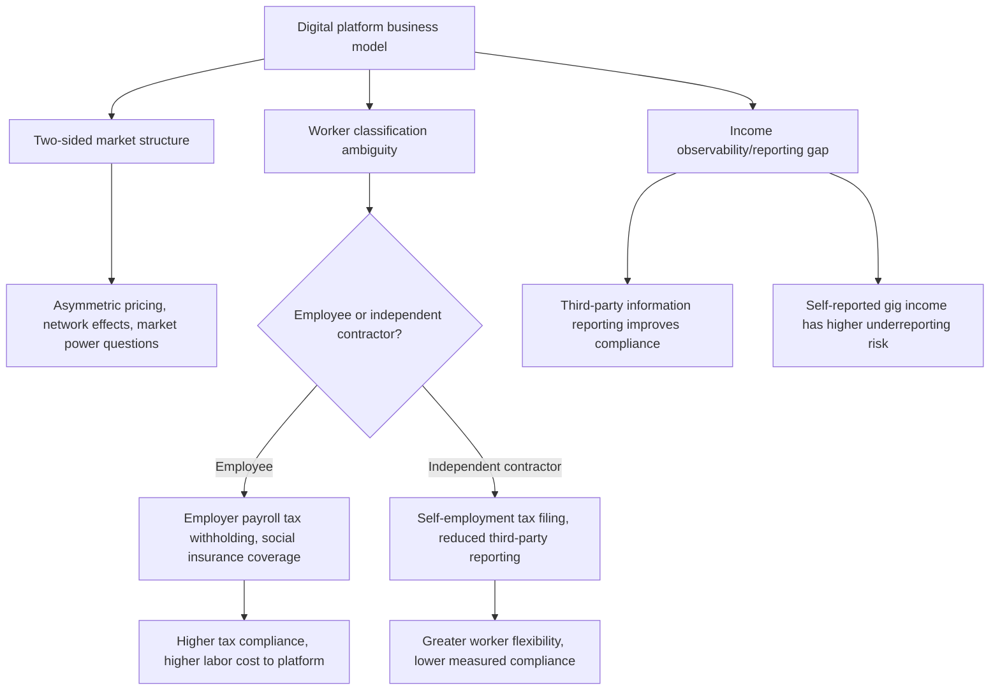

## Public Economics of the Platform Economy

### Conceptual Foundations

The platform economy — ride-hailing, food delivery, short-term rental, freelance/gig labor marketplaces, and multi-sided digital platforms more broadly — poses distinctive public economics challenges because these business models operate at the intersection of labor market regulation, tax administration, market failure correction, and traditional industry regulation, often exploiting classification ambiguities and information gaps that legacy regulatory and tax frameworks were not designed to address. The central public economics questions concern optimal regulatory and tax treatment when digital platforms fundamentally alter the boundaries of the firm, the nature of employment relationships, and the observability of economic activity.

### Two-Sided Markets and Platform Economics

**Key Points**

Digital platforms are typically **two-sided (or multi-sided) markets**, connecting distinct user groups (e.g., riders and drivers, guests and hosts, buyers and sellers) who value each other's participation, generating network externalities:

$$U_{i} = f(N_{j}), \quad \frac{\partial U_i}{\partial N_j} > 0$$

where the utility of a participant on side $i$ of the platform depends positively on the number of participants $N_j$ on the other side $j$ — a cross-side network effect that is central to platform economics and distinguishes platforms from traditional single-sided firms.

- **Pricing structure implications**: Two-sided market theory (associated with Rochet and Tirole) shows that efficient platform pricing often involves asymmetric pricing across the two sides (subsidizing the side with higher network-effect sensitivity or higher price elasticity), a structural feature relevant to how platforms are taxed and regulated, since standard single-sided market regulatory and tax frameworks may not translate directly.
- **Market power and competition policy**: Network effects can generate winner-take-most dynamics and market concentration, raising standard public economics questions about the appropriate scope of competition policy/antitrust intervention distinct from, but related to, the tax and labor classification issues discussed below.

### Worker Classification: Employee vs. Independent Contractor

**Key Points**

A central public economics and labor law issue is whether platform workers (drivers, couriers, freelancers) should be classified as **employees** (triggering employer-side payroll tax obligations, minimum wage and overtime protections, unemployment insurance contributions, and workers' compensation coverage) or **independent contractors** (generally excluded from these protections and obligations, with workers responsible for their own self-employment tax filings).

- **Fiscal implications of classification**: Employee classification shifts substantial payroll tax withholding and remittance responsibility onto the platform (employer), improving tax compliance and collection efficiency by leveraging third-party (employer) reporting rather than relying on individual worker self-reporting — a standard public finance insight that third-party information reporting significantly improves tax compliance relative to self-reported income, directly relevant to gig worker income tax compliance given that self-employment/independent-contractor income is subject to substantially higher rates of underreporting in the tax compliance literature than third-party-reported wage income.
- **Social insurance financing implications**: Independent contractor classification generally excludes workers from employer-financed unemployment insurance and workers' compensation systems, and from mandatory employer-side Social Security/payroll tax contributions (shifting the full self-employment tax burden to the worker), with implications for the long-run social insurance safety net coverage of an increasing share of the workforce if gig work continues to grow.
- **Efficiency trade-off in classification design**: Independent contractor status offers workers greater schedule flexibility (a genuine benefit many gig workers report valuing) but at the cost of reduced social insurance coverage and worker protections — a trade-off some jurisdictions have attempted to address through intermediate legal categories (e.g., a "dependent contractor" or "third category" status providing some but not full employee protections) rather than a binary employee/contractor choice, reflecting an emerging area of labor and public economics policy experimentation without a single settled model.
- [Inference] The classification question has been the subject of extensive, evolving, and jurisdiction-specific litigation and legislation (e.g., California's AB5 and subsequent ballot-measure modifications, EU platform work directive discussions) that continues to develop; specific legal statuses in any given jurisdiction should be verified against current law rather than assumed stable, given how actively contested and fast-moving this area has been.

### Diagram: Platform Economy Public Economics Issues

### Tax Compliance and Information Reporting

**Key Points**

- **The information-reporting gap**: Standard tax compliance theory (following the influential IRS/tax-gap literature associating compliance rates with the presence or absence of third-party information reporting and withholding) predicts substantially higher noncompliance for income types lacking third-party reporting — historically a concern for self-employment and small-business income generally, and directly applicable to gig platform earnings.
- **Platform-based third-party reporting as a compliance tool**: Because platforms already possess complete transaction records connecting workers to payments, they represent a natural point for third-party income reporting to tax authorities (e.g., expanded information-return reporting thresholds/requirements for payment platforms), potentially substantially narrowing the historic self-employment tax compliance gap without requiring a change to workers' underlying employee/contractor legal status — an area of active tax administration policy development in multiple jurisdictions.
- **VAT/sales tax treatment of platform transactions**: Short-term rental and marketplace platforms raise parallel indirect tax questions (occupancy/hotel taxes on short-term rentals, VAT/sales tax collection on marketplace sales), with many jurisdictions moving toward "marketplace facilitator" rules that place tax collection and remittance responsibility on the platform itself rather than on individual hosts/sellers, again leveraging the platform's superior transaction visibility and administrative capacity relative to numerous small individual sellers.

### Regulatory Arbitrage and Traditional Industry Comparisons

**Key Points**

- **Regulatory asymmetry with incumbent industries**: Platform-based services frequently entered markets with existing incumbent regulation (taxi medallion systems, hotel licensing and safety codes, employment protections in traditional service industries) designed around a different production/employment model, generating a "regulatory arbitrage" dynamic where platforms could offer similar services while avoiding costs incumbents bear — raising public economics questions about whether the original regulation reflected genuine market-failure correction (that platforms should also bear) or legacy rent-protection/barriers-to-entry (that platforms' entry usefully undermined).
- **Externality and market failure justifications for regulation, re-examined**: Traditional taxi and short-term rental regulation was partly justified on market-failure grounds (safety information asymmetries, insurance requirements, neighborhood externalities from short-term rentals) — the platform economy debate often turns on whether platforms' own reputation/rating systems and insurance products substitute adequately for traditional regulatory mechanisms addressing these same market failures, an empirical and institutional design question rather than a purely theoretical one.
- **Convergence over time**: [Inference] Many jurisdictions have moved toward hybrid regulatory frameworks specifically designed for platform-based services (ride-hailing-specific licensing regimes, short-term rental registration and taxation requirements) rather than either fully exempting platforms from traditional regulation or forcing exact equivalence with incumbent regulatory regimes, reflecting a general trend toward regulatory adaptation rather than a stable endpoint, and current requirements in any specific jurisdiction should be checked directly given continued evolution in this area.

### Social Insurance Portability and Benefit Design Innovation

**Key Points**

- **The portable benefits concept**: Given that gig/platform workers frequently work across multiple platforms and lack a single employer providing benefits, some policy proposals and pilot programs have explored "portable benefits" models — where contributions toward retirement, health insurance, or paid leave accrue to the worker (rather than being tied to a single employer) and can follow the worker across platforms and traditional jobs, potentially funded by pro-rata contributions from each platform based on hours/earnings.
- **Public economics rationale**: This model attempts to address the social insurance coverage gap created by fragmented, multi-platform gig work without necessarily requiring full employee reclassification, though design questions (funding mechanism, portability infrastructure, minimum contribution thresholds) remain areas of active policy experimentation rather than a single established standard.

### Illustrative Example: Contrasting Jurisdictional Approaches

**Example**

- **Employee-presumption approach**: A jurisdiction adopts a strict test (e.g., a broad "ABC test" for worker classification) presumptively classifying most platform workers as employees unless specific criteria are met, prioritizing worker protection and tax compliance improvements via third-party withholding, at the cost of potentially reducing platform flexibility and, per platform industry arguments, potentially reducing the number of available gig work opportunities.
- **Contractor-preservation with targeted benefits approach**: A jurisdiction preserves independent contractor status for platform workers while mandating specific minimum benefit contributions (portable benefits funds, minimum earnings guarantees) from platforms, attempting to address social insurance gaps without full reclassification — an intermediate approach adopted in some U.S. state-level ballot measures and legislative proposals.
- **Enhanced third-party reporting without reclassification**: A jurisdiction leaves worker classification unchanged but strengthens tax information-reporting requirements on payment platforms, targeting the tax compliance gap specifically without addressing the separate labor protection/social insurance coverage question, illustrating that the tax-compliance and labor-classification issues, while related, can in principle be addressed through separate policy instruments.

**Related Topics**

- Two-sided market theory and platform pricing (Rochet-Tirole framework)
- Tax compliance and the role of third-party information reporting
- Worker classification law: employee vs. independent contractor tests
- Portable benefits models for non-traditional employment
- Marketplace facilitator rules for indirect tax collection
- Regulatory arbitrage and incumbent industry regulation comparison
- Social insurance financing gaps in non-standard employment
- Digital platform competition policy and market concentration