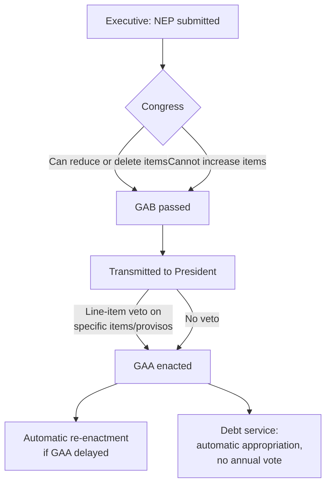

## The Legislature's Power of the Purse and Appropriations Authority

### Constitutional Foundation and the Authorization Function

The **power of the purse** is the legislature's constitutional authority to authorize, condition, and limit government spending — the counterpart to the executive's budget-preparation function described under the finance ministry's mandate. The doctrinal core is simple: no public money may be drawn from the treasury except pursuant to an **appropriation made by law**. This principle appears near-universally in presidential and Westminster systems alike, though the *mechanism* of legislative control differs sharply between them. In the Philippines, the rule is stated directly in the 1987 Constitution (Art. VI, Sec. 29(1)): "No money shall be paid out of the Treasury except in pursuance of an appropriation made by law."

An **appropriation** must be distinguished precisely from two adjacent concepts that are frequently conflated:

- **Appropriation** — legal authority to *obligate* government funds up to a specified amount, for a specified purpose, within a specified period. This is a ceiling, not a mandate to spend the full amount.
- **Revenue/taxation authority** — the power to *raise* funds, historically the more jealously guarded of the two legislative fiscal powers (the origin of "no taxation without representation") and, in most constitutions, subject to an additional procedural constraint: revenue bills must originate in the lower/popularly-elected chamber (Philippine Constitution, Art. VI, Sec. 24; mirrored in the U.S. Origination Clause).
- **Appropriation vs. allotment** — appropriation is the legislature's authorization; allotment (or apportionment) is the executive's subsequent sub-annual release of that authority to spending units, a distinct execution-stage instrument covered under the finance ministry's operational toolkit.

### Forms of Appropriation

Legislatures grant spending authority in several structurally distinct instruments, each carrying different discretion and duration properties:

1. **General Appropriations Act (GAA)** — the Philippine annual, comprehensive appropriation covering the bulk of government operations for one fiscal year. Functionally equivalent to the U.S. omnibus appropriations bills or the UK's Estimates.
2. **Continuing appropriations** — funds legally available for obligation beyond the fiscal year of enactment. Philippine law (Sec. 65, GAA general provisions, and R.A. 11517 and successors) historically allowed a **two-year validity period** for capital outlay and maintenance items (current year plus one), though the 2024 reform under the **"cash-based budgeting" system** discussed below narrowed this considerably.
3. **Continuing resolution** — a stopgap mechanism used when the annual appropriation is not enacted before the fiscal year begins, authorizing spending to continue at prior-year levels pending final passage. The Philippine Constitution (Art. VI, Sec. 25(7)) provides for automatic **re-enactment of the prior year's GAA** if a new one is not passed by the start of the fiscal year — a structural difference from the U.S., where the absence of an equivalent automatic mechanism produces government shutdowns.
4. **Special/supplemental appropriations** — authorized outside the annual cycle for specific, often emergency, purposes (calamity response, for instance), requiring a separate legislative act.
5. **Standing/permanent appropriations** — authorized once in substantive law and requiring no annual re-enactment, most commonly for debt service. In the Philippines, **automatic appropriations for debt service** are authorized under P.D. 1177 and related issuances, meaning debt payments do not compete annually against discretionary programs for legislative approval — a structural protection for creditor confidence that simultaneously constrains the fiscal space available for annual discretionary bargaining. [Inference] This is best understood as a deliberate credibility device: automatic debt-service appropriation signals to bondholders that debt payments are legally insulated from the annual political budget fight, which is one channel (among several) supporting a sovereign's borrowing terms.

### The Amendment Power and Its Limits

The legislature's ability to *reshape* the executive's budget proposal — rather than simply approve or reject it — is the single most consequential variable in comparative appropriations law, and it varies enormously by system:

- **Unconstrained amendment** (historically closer to the U.S. Congress model): the legislature can increase, decrease, add, or eliminate line items with few formal restrictions, subject only to the President's veto.
- **Constrained/balanced amendment** (common in parliamentary systems and increasingly in Latin America): the legislature may reallocate or cut, but cannot *increase* the aggregate deficit or introduce new spending without an offsetting revenue measure or cut elsewhere — a rule sometimes called a **"germaneness" or "balanced amendment" constraint**.
- **Philippine model**: Congress can *reduce or eliminate* items in the NEP but constitutionally **cannot increase the appropriation for any item** the executive proposed (Art. VI, Sec. 25(2)): "Congress may not increase the appropriations recommended by the President for the operation of the Government as specified in the budget." This is a significant structural tilt toward executive fiscal control relative to the U.S. system, and it means the annual "budget fight" in the Philippines is substantively about *reallocation within a fixed ceiling* rather than about the aggregate size of the budget — the DBCC-approved ceiling effectively survives the legislative process by constitutional design, not merely by political deference.

This constraint interacts directly with the **line-item veto**: because Congress can only cut, never add, the President's veto power (Art. VI, Sec. 27(2)) is aimed at *deletions Congress made that the President disagrees with* or, more commonly, at riders and conditions Congress attaches to appropriations ("special provisions") that the executive finds objectionable — producing a distinctive form of inter-branch conflict focused on **conditions and provisos rather than dollar amounts**.

### Riders, Provisos, and the "Power of the Purse" as Policy Leverage

Legislatures frequently use appropriations bills to attach substantive policy conditions unrelated to the spending itself — a **rider**. Because appropriations bills are often must-pass, riders let a legislature exert policy influence beyond its formal lawmaking role. The Philippine Supreme Court has periodically struck down GAA riders/special provisions on **germaneness** grounds — that a rider must relate to the appropriation item it is attached to, not function as substantive legislation smuggled into a funding bill (a principle with close analogues in the U.S. "single subject" and Byrd Rule doctrines governing budget reconciliation).

### Oversight Instruments Beyond Enactment

The power of the purse is not exhausted at enactment; legislatures typically retain three ongoing oversight tools:

- **Confirmation/hearing power** over budget officials (in presidential systems with separate confirmation processes).
- **Reporting and audit review** — legislative committees (in the Philippines, the House and Senate Committees on Appropriations/Finance) review the Commission on Audit's annual reports on GAA implementation, closing the loop from the accountability phase back into the next budget cycle's deliberations.
- **Impoundment control** — in systems where the executive can withhold appropriated funds (via the allotment mechanism discussed under executive fiscal architecture), the legislature may impose statutory limits on the executive's discretion to *not* spend what was appropriated. The Philippine Supreme Court's **2013 *Belgica v. Executive Secretary*** ruling and the earlier **2014 *Araullo v. Aquino* (Disbursement Acceleration Program)** decision are the leading domestic precedents constraining executive impoundment/realignment discretion — both held that post-enactment executive reallocation of appropriated funds without specific legal authorization for cross-branch or cross-agency augmentation violated the constitutional appropriation power.

### Comparative Table: Appropriations Authority Across Systems

| Feature | Philippines | United States | Westminster (UK) |
| --- | --- | --- | --- |
| Can legislature increase executive's proposed amounts? | No (Art. VI, Sec. 25(2)) | Yes | Practically no (Crown recommendation required for new charges) |
| Line-item veto | Yes, presidential | No (struck down, *Clinton v. City of New York*) | N/A (fused executive-legislative majority) |
| Lapse-in-appropriation default | Automatic re-enactment of prior GAA | Shutdown absent continuing resolution | Rare; confidence convention prevents standoff |
| Debt service appropriation | Automatic/standing | Subject to periodic debt-ceiling political conflict | Standing charge on Consolidated Fund |

**Key Points**

- Appropriation (spending authorization) and taxation (revenue-raising authorization) are the legislature's two constitutionally distinct fiscal powers, each with separate procedural safeguards (origination-chamber rules for revenue bills).
- The scope of legislative amendment power over the executive's budget proposal — whether the legislature may increase items, only decrease them, or must offset new spending — is the key comparative variable distinguishing "strong legislature" from "strong executive" budget systems; the Philippines constitutionally restricts Congress to reductions only.
- Standing/automatic appropriations (notably for debt service) remove specific expenditure categories from annual legislative renegotiation, a credibility device with direct implications for sovereign borrowing terms.
- Riders and special provisions attached to appropriations bills are a recurring site of inter-branch conflict, typically litigated on germaneness grounds rather than on the appropriated amount itself.
- Legislative control over the purse extends past enactment into ex-post oversight of executive impoundment and reallocation discretion, as established in Philippine jurisprudence (*Araullo*, *Belgica*).

**Related Topics**

- The line-item veto and its use as a fiscal-discipline instrument
- Automatic and standing appropriations for debt service
- The Disbursement Acceleration Program and executive reallocation litigation (*Araullo v. Aquino*)
- Continuing resolutions and re-enacted budgets as stopgap fiscal governance
- Fiscal rules and constitutional debt/deficit ceilings as constraints on appropriations
- Comparative legislative amendment power (unconstrained vs. balanced-amendment systems)