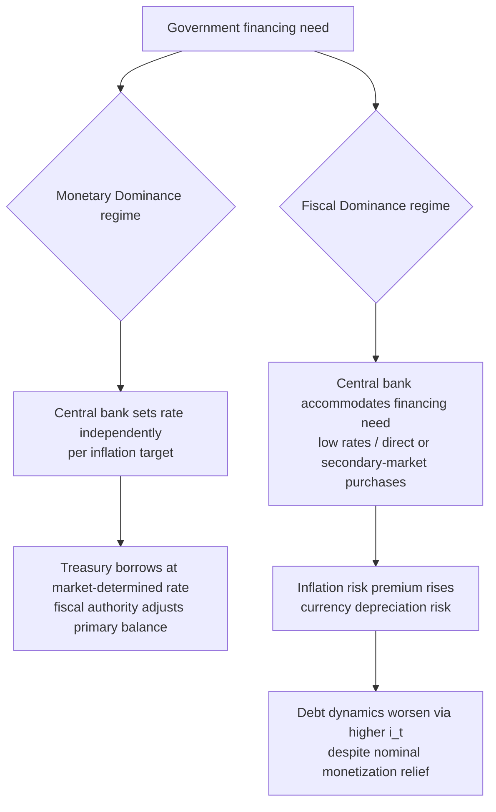

## Central Bank Independence and the Separation of Fiscal and Monetary Authority

### The Institutional Problem: Fiscal Dominance vs. Monetary Dominance

The separation of fiscal and monetary authority addresses a specific institutional hazard: a government facing a financing shortfall has an available shortcut that a private borrower does not — it can, absent legal restriction, direct or pressure the central bank to purchase its debt or extend it credit directly, effectively monetizing the deficit. This is the mechanism behind classic hyperinflation episodes (Weimar Germany, Zimbabwe in the 2000s, more recently the acute phase of Venezuela's crisis), and the policy response that emerged from mid-to-late twentieth century monetary economics — associated with the time-inconsistency literature of Kydland and Prescott (1977) and Barro and Gordon (1983) — is **central bank independence (CBI)**: a legal and operational separation ensuring the monetary authority sets policy (interest rates, money supply, exchange-rate intervention) without being obligated to accommodate the executive's financing needs.

The regime distinction that organizes this topic is between:

- **Monetary dominance** — the central bank sets its policy path (typically an inflation target) independently, and fiscal authorities must adjust taxation, spending, or borrowing to remain solvent given whatever interest-rate and inflation path the central bank chooses. This is the design intent of most modern independent-central-bank frameworks.
- **Fiscal dominance** — the fiscal authority's financing needs are large or urgent enough that the central bank is compelled, de facto or de jure, to accommodate them (via low rates, debt purchases, or exchange-rate management), subordinating price stability to debt sustainability. [Inference] Most sovereign debt crises exhibit a shift from monetary to fiscal dominance as the trigger point — the central bank's independence becomes practically constrained not by a change in law but by the sheer scale of the financing gap it would otherwise have to watch go unfunded.

### Legal and Operational Mechanisms of Separation

CBI is implemented through several concrete legal instruments, not merely an informal norm:

1. **Prohibition on direct central bank financing of government (no monetary financing / no direct advances).** The clearest and most common legal mechanism: statutory or constitutional bars on the central bank purchasing government securities directly from the treasury in the primary market. The central bank may still hold government debt purchased on the **secondary market** (from private holders, as part of normal open-market operations), which is legally and economically distinct from primary-market monetization because it does not directly expand the government's financing capacity at the point of issuance. The Philippines codified this distinction explicitly: the **Bangko Sentral ng Pilipinas (BSP)**, under its original 1993 charter (R.A. 7653), was barred from extending direct advances to the National Government except for a temporary, capped, interest-bearing provisional advance for cash-flow timing gaps (not deficit financing). During the COVID-19 shock, the **BSP's Amended Charter (R.A. 11211, 2019)** provision allowing provisional advances was invoked in 2020 to provide a temporary, statutorily-bounded advance to the Bureau of the Treasury — a case worth noting precisely because it illustrates the boundary condition: the advance was capped, short-term, and required repayment, distinguishing it from open-ended monetization.
2. **Independent policy-rate setting and a legally protected mandate.** Central bank charters typically assign a primary objective (price stability, sometimes a dual mandate including employment) and insulate the rate-setting body (a Monetary Board or equivalent) from removal or instruction by the finance ministry. The BSP's Monetary Board members serve fixed terms with cause-based removal protections, a standard institutional design feature across independent central banks (comparable to the U.S. Federal Reserve's Board of Governors or the European Central Bank's Governing Council, the latter enjoying an unusually strong form of independence since it is treaty-bound and not subject to a single national government's override at all).
3. **Central bank capital and profit-remittance rules.** A subtler channel of fiscal-monetary entanglement runs through the central bank's own balance sheet: if the treasury can compel the central bank to remit profits or cover losses in ways that affect its capital adequacy, this can indirectly pressure monetary policy (for example, discouraging rate hikes that would generate valuation losses on a large government-bond portfolio). Modern central bank charters typically specify formal capital-adequacy and profit-remittance formulas precisely to wall this channel off.
4. **Exchange-rate authority allocation.** In some systems exchange-rate policy is a shared or contested fiscal-monetary boundary, since sterilized intervention has fiscal-quasi effects (financed by central bank reserves or debt issuance) even while operationally executed by the monetary authority. The BSP holds primary authority over Philippine exchange-rate policy under a managed-float regime, distinct from the National Government's fiscal role.

### The Debt-Sustainability Interaction

Central bank independence is not merely a matter of institutional design abstracted from debt dynamics — it is a direct input into a state's **debt sustainability analysis (DSA)**, the standard methodology (used by the IMF/World Bank and by finance ministries themselves) that projects a state's debt-to-GDP path under baseline and stress scenarios. A credible, independent central bank lowers a sovereign's *risk premium* by reducing the probability that debt will be resolved via unanticipated inflation rather than primary-balance adjustment, which lowers the market interest rate on new issuance ($i$) and therefore the debt-dynamics equation directly. The standard debt-dynamics identity makes the channel explicit:

$$\Delta d_t = \frac{i_t - g_t}{1 + g_t} d_{t-1} - pb_t$$

where $d_t$ is the debt-to-GDP ratio, $i_t$ is the effective nominal interest rate on debt, $g_t$ is nominal GDP growth, and $pb_t$ is the primary balance (revenue minus non-interest expenditure) as a share of GDP. A fiscally dominant regime — one where the central bank is expected to monetize shortfalls — raises $i_t$ (via inflation risk premium) for any given $g_t$, worsening the debt trajectory even before considering the direct inflationary erosion of real debt burdens (which helps *domestic-currency* debt but does nothing for foreign-currency debt, a critical asymmetry for a state like the Philippines carrying a meaningful external-debt share).

### The Limits of Independence: Coordination Without Subordination

CBI does not mean the central bank and finance ministry operate with no coordination — pure non-coordination would itself be inefficient (fiscal and monetary policy can work at cross-purposes, e.g., simultaneous fiscal stimulus and monetary tightening). The distinction to draw precisely is between:

- **Instrument independence** — the central bank is free to choose the *tools and level* of monetary policy to hit its mandate, without executive override. This is the internationally standard, minimal form of CBI.
- **Goal independence** — the central bank also sets its own mandate/target (e.g., choosing the inflation target itself), a stronger and less common form. Most inflation-targeting central banks, including the BSP (which operates under a government-set inflation target range, currently negotiated jointly with the DBCC-adjacent macroeconomic coordination process described under Philippine fiscal institutions), have instrument independence but not full goal independence — the *target* is often set or ratified through an inter-agency process, while the *means of hitting it* is insulated from day-to-day executive interference.

This distinction matters directly for the Philippine case: the BSP Governor sits as an ex-officio member of institutions coordinating with fiscal authorities on macroeconomic assumptions (feeding into the same forecasting exercise that sets the government's expenditure ceiling), which is coordination on *information and consistency of assumptions*, not subordination of the policy instrument itself.

### Empirical Debate: Does CBI Actually Deliver Lower Inflation and Better Fiscal Outcomes?

The strongest form of the pro-CBI case, associated with Alesina and Summers (1993) and the broader central-banking consensus that hardened through the 1990s: cross-country evidence through the late twentieth century showed a negative correlation between legal central bank independence indices and average inflation, with no corresponding cost in long-run output or unemployment (the "free lunch" result), supporting CBI as an unambiguous institutional improvement with no serious credibility trade-off.

The strongest counter-case, more prominent in post-2008 and post-pandemic monetary economics: independence indices are often **de jure** measures that overstate **de facto** independence in emerging markets with weaker rule-of-law enforcement, meaning the correlation may partly reflect that *countries which achieve low inflation for other reasons (stronger institutions generally) also tend to legislate CBI*, rather than CBI causing the low inflation — a standard reverse-causality/omitted-variable critique. Additionally, the post-2020 return of inflation across advanced economies with independent central banks (the U.S. Fed, ECB) reopened debate on whether CBI's credibility benefits are as robust once large-scale quantitative easing programs have blurred the line between monetary operations and de facto deficit financing — QE purchases of government debt on the secondary market are legally distinct from primary-market monetization but functionally similar in their effect on government borrowing costs, a tension the independence framework was not originally designed to resolve cleanly. [Speculation] Whether large-scale central bank balance-sheet expansion during crises constitutes a durable erosion of the fiscal-monetary separation, or a temporary and reversible crisis tool, remains an open and actively contested question in the post-pandemic monetary economics literature.

**Key Points**

- Central bank independence is the legal/operational separation preventing the executive from compelling the monetary authority to finance government deficits directly, distinguishing monetary dominance (central bank sets policy independently) from fiscal dominance (financing needs subordinate monetary policy).
- The primary legal mechanism is a statutory bar on direct/primary-market central bank lending to government, distinct from secondary-market central bank holdings of government debt acquired through ordinary open-market operations.
- CBI feeds directly into sovereign debt sustainability analysis by lowering the inflation-risk-premium component of the effective interest rate on new debt issuance, improving the $i_t - g_t$ differential in the standard debt-dynamics identity.
- Instrument independence (control over policy tools) is the internationally standard and more limited form of CBI; goal independence (setting the mandate itself) is rarer and typically involves continued inter-agency coordination on macroeconomic targets.
- The empirical case for CBI's inflation-reducing effect faces a live reverse-causality critique, and large-scale crisis-era central bank debt purchases have reopened debate on where the monetary-fiscal boundary functionally sits.

**Related Topics**

- Debt sustainability analysis methodology and the debt-dynamics identity
- Inflation targeting frameworks and the setting of monetary policy mandates
- Sovereign risk premia and their determinants in emerging-market borrowing costs
- Quantitative easing and the blurring of monetary-fiscal boundaries in crisis response
- The BSP's provisional advances mechanism and its 2020 pandemic-era application
- Currency composition of sovereign debt and the asymmetric effects of inflation on domestic versus external debt