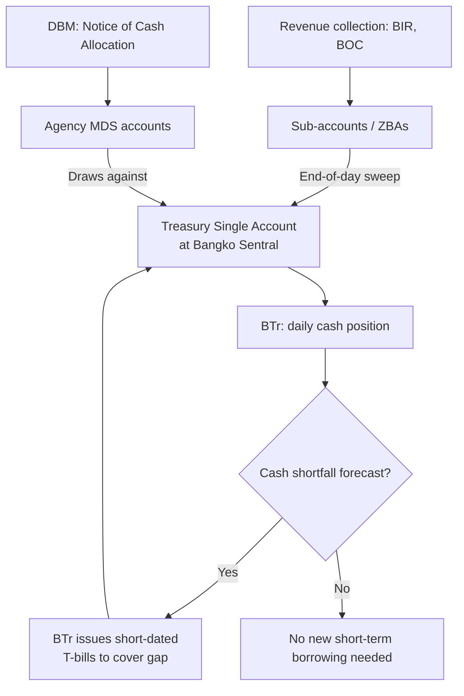

## The Treasury Single Account and Government Cash Management Architecture

### Definition and Core Rationale

A **Treasury Single Account (TSA)** is a unified structure of government bank accounts that gives the treasury or finance ministry a consolidated, real-time view and control over all government cash resources, rather than allowing agencies to hold fragmented, individually-managed bank balances scattered across commercial banks. The IMF's canonical definition (Pattanayak and Fainboim, 2010/2011 technical notes, the reference documents that standardized TSA terminology across PFM practice) frames the TSA not as a single physical bank account but as a **unified structure of linked accounts** through which the government transacts all receipts and payments, consolidated daily for cash-management purposes even where sub-accounts exist for accounting or agency-specific purposes.

The core problem a TSA solves is **cash fragmentation**: in the absence of a TSA, individual ministries and agencies hold idle balances in commercial bank accounts while the treasury simultaneously borrows (via short-term T-bills or advances) to cover cash shortfalls elsewhere in government — meaning the state pays interest to borrow money it functionally already possesses, simply held in the wrong place. This is a pure efficiency loss with no offsetting benefit, and it is the single most commonly cited justification for TSA reform in IMF and World Bank PFM diagnostic work (reflected directly in the **PEFA (Public Expenditure and Financial Accountability) framework**'s cash-management indicator).

### Structural Components

A functioning TSA architecture has three structural layers, distinguishable precisely:

1. **The main/central TSA account(s)**, held at the central bank (the standard design) or, less commonly and less preferably from a control standpoint, at a commercial bank. Holding the TSA at the central bank is the preferred design because it avoids counterparty/credit risk on government cash exposure to a commercial institution and integrates naturally with the central bank's role in government debt issuance and monetary operations (see the fiscal-monetary separation architecture, where the TSA's relationship to the central bank must respect the same no-direct-financing constraints — a TSA overdraft facility at the central bank is functionally a form of direct government financing and is typically capped or prohibited for the same reasons).
2. **Sub-accounts and zero-balance accounts (ZBAs)**, held by individual agencies or revenue-collecting units for operational purposes, but structured so that end-of-day balances **sweep automatically to the main TSA account**, leaving a zero (or near-zero) balance at the sub-account level overnight. This preserves agency-level transactional autonomy during the business day while eliminating idle balances at day's end.
3. **A cash-flow forecasting and reporting layer**, typically housed in the treasury/bureau of treasury, that aggregates real-time or near-real-time information on the consolidated cash position to inform daily/weekly borrowing decisions — the TSA's control function is only as good as the forecasting system feeding it, since consolidation without visibility does not by itself generate the borrowing-cost savings that motivate the reform.

### The Philippine Case: The Bureau of the Treasury and the Path to Full TSA Consolidation

The Philippines' cash-management architecture is centered on the **Bureau of the Treasury (BTr)**, an attached agency of the Department of Finance, which manages the government's cash position, issues government securities, and services the national debt. Historically, the Philippine government operated with substantial cash fragmentation: numerous agencies maintained deposit accounts across the Land Bank of the Philippines (LBP) and Development Bank of the Philippines (DBP), the two major government financial institutions, as well as balances tied to specific special/fiduciary funds, without full daily consolidation into a central treasury view.

The **modernization of the Philippine TSA architecture** proceeded through the **Government Integrated Financial Management Information System (GIFMIS)** reform program and complementary Department of Finance/DBM/BTr initiatives (formalized under **DOF-DBM-BTr Joint Circular guidance** issued over the 2010s), aimed at:

- Progressively sweeping idle agency deposit balances (particularly balances tied to trust receipts, revolving funds, and dormant special accounts) into the TSA at the BTr.
- Migrating the disbursement mechanism from the older system of agencies drawing checks against separately-funded Modified Disbursement System (MDS) accounts toward more centralized electronic disbursement, integrated with the DBM's Notice of Cash Allocation process discussed under executive budget execution — the NCA is, functionally, the instrument that authorizes an agency's MDS sub-account to draw down against the consolidated treasury cash position, rather than the agency holding independently-sourced cash.
- Improving the BTr's daily cash-position forecasting to reduce the government's reliance on **overdraft-equivalent short-term borrowing** to smooth timing mismatches between tax collection and expenditure obligation.

[Inference] The persistence of numerous special and trust funds with statutorily earmarked, agency-specific cash holdings has historically been one of the more significant structural obstacles to full TSA consolidation in the Philippines relative to jurisdictions with simpler fund structures, since sweeping a legally earmarked fund's balance into a general consolidated account raises questions (addressed differently across reform iterations) about whether the earmark's legal integrity is preserved when the cash itself is commingled, even if the accounting distinction is maintained.

### Cash Management as the Operational Bridge Between Budget Execution and Debt Management

The TSA is not merely an accounting-consolidation exercise; it is the operational nerve center connecting three functions that are institutionally distinct but must be continuously reconciled:

- **Budget execution** (the DBM's allotment and NCA releases, discussed under executive fiscal architecture) determines *when* agencies are authorized to draw cash.
- **Revenue collection** (BIR and Bureau of Customs remittances) determines *when* cash actually arrives.
- **Debt issuance** (BTr's T-bill and T-bond auction calendar) is the buffer variable that reconciles the mismatch between the first two, smoothing short-term timing gaps without needing to alter the underlying fiscal deficit target.

A well-functioning TSA, paired with accurate cash-flow forecasting, allows the BTr to issue **shorter-dated instruments opportunistically** to cover known timing troughs (e.g., before major tax remittance dates) rather than **over-borrowing at longer tenors as a precautionary buffer against forecast uncertainty** — the latter being a more expensive strategy in interest-cost terms and a source of unnecessary duration/interest-rate risk on the debt portfolio.

### Measuring TSA Maturity: The PEFA Framework

Cross-country PFM assessments under the **PEFA framework** score TSA/cash-management architecture along dimensions including: the degree of consolidation of cash balances (what percentage of government cash sits outside the TSA in fragmented accounts), the frequency of consolidation (daily versus weekly versus ad hoc), and the quality of cash-flow forecasting used to inform borrowing decisions. A jurisdiction can have a *legally designated* TSA on paper while scoring poorly on PEFA's cash-consolidation indicator if, in practice, large categories of special funds remain outside the sweep mechanism — a de jure/de facto gap structurally analogous to the one noted in central bank independence measurement, where formal legal architecture and operational reality can diverge.

### Distinguishing TSA Reform from Fiscal Rule Compliance

A precise scope point: a TSA is a **cash-management** architecture, not itself a fiscal-discipline mechanism. Consolidating cash into a TSA does not, by itself, reduce the deficit or alter the debt-to-GDP trajectory computed under a debt sustainability analysis — the primary balance and financing requirement are unchanged. What a TSA changes is the **cost of financing a given deficit path**: by reducing idle-balance/borrowing coexistence and improving forecasting precision, it lowers the government's average short-term borrowing cost and reduces exposure to unnecessary rollover and liquidity risk, which is a genuine but narrower benefit than fiscal consolidation itself.

**Key Points**

- A Treasury Single Account is a unified structure of linked government bank accounts enabling consolidated, typically daily, control over government cash, distinguished from a literal single physical account.
- The central rationale is eliminating the simultaneous inefficiency of idle agency cash balances and treasury short-term borrowing to cover unrelated shortfalls — a pure efficiency loss when cash is fragmented.
- In the Philippines, the Bureau of the Treasury operates the TSA function, with reform historically proceeding through GIFMIS and joint DOF-DBM-BTr sweeping mechanisms, complicated by the legal-integrity questions raised by earmarked special and trust funds.
- The TSA operationally bridges budget execution (allotment/NCA releases), revenue collection timing, and debt issuance, allowing the treasury to use short-dated borrowing opportunistically rather than over-borrowing as a precautionary buffer.
- TSA consolidation is a cash-management and financing-cost efficiency reform, not itself a fiscal-discipline or deficit-reduction mechanism — the two categories are frequently but incorrectly conflated.

**Related Topics**

- The Bureau of the Treasury's debt issuance calendar and government securities auction mechanics
- The Notice of Cash Allocation and Modified Disbursement System in budget execution
- PEFA framework indicators for public financial management assessment
- Special and trust fund architecture and its interaction with cash consolidation reform
- Short-term versus long-term government debt instrument selection and rollover risk
- Central bank-treasury account relationships and the prohibition on direct financing