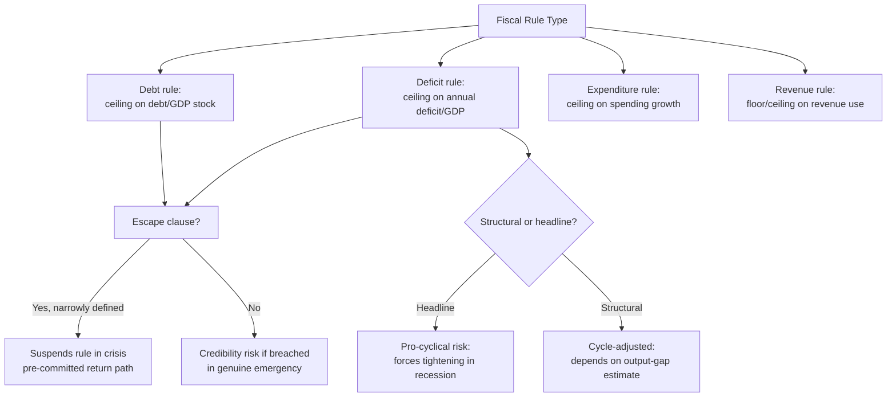

## Fiscal Rules, Fiscal Councils, and Numerical Constraints on Budget Authority

### The Time-Inconsistency Problem Fiscal Rules Address

Fiscal rules exist to solve a specific political-economy problem: elected governments face a systematic incentive to run larger deficits than are collectively optimal, because the benefits of current spending or tax cuts are concentrated and immediate (accruing to the incumbent government's electoral cycle) while the costs (higher future debt service, reduced fiscal space) are diffuse and deferred onto successor governments or future taxpayers. This is a fiscal-policy analogue of the same **time-inconsistency** problem (Kydland and Prescott, 1977) that motivates central bank independence in the monetary domain — a policymaker with full discretion cannot credibly commit to future restraint, so credibility must be manufactured through an external, binding constraint rather than relying on discretion plus good intentions. A **fiscal rule** is a numerical constraint, typically written into law or the constitution, that limits a specific fiscal aggregate — most commonly the deficit, the debt stock, an expenditure level, or the revenue-to-expenditure balance — precisely to remove that period-by-period discretion.

### Taxonomy of Fiscal Rule Types

The IMF's Fiscal Rules Dataset (a standard reference for cross-country comparison) categorizes rules along the fiscal aggregate they constrain:

1. **Debt rules** — a ceiling on the debt-to-GDP ratio, e.g., the EU's Stability and Growth Pact 60%-of-GDP reference value. Debt rules constrain the *stock* variable directly but are typically implemented with a long adjustment horizon, since a debt ratio cannot be moved sharply in a single fiscal year without extreme and politically costly primary-balance adjustment.
2. **Deficit/balanced-budget rules** — a ceiling on the annual fiscal deficit, typically expressed as a percentage of GDP (the EU's 3%-of-GDP deficit reference value is the best-known example). Deficit rules constrain the *flow* variable and are more directly actionable within a single budget cycle than debt rules, but a strict annual balanced-budget requirement is **pro-cyclical** by construction: in a recession, revenue falls and social-transfer spending rises automatically (the operation of **automatic stabilizers**), so a rigid balanced-budget rule forces additional discretionary tightening precisely when the economy needs support, worsening the downturn — the central design critique leveled against undifferentiated deficit rules.
3. **Expenditure rules** — a ceiling on the growth rate or level of government spending, often expressed independent of the revenue or growth outlook (e.g., real expenditure growth capped at estimated potential GDP growth). Expenditure rules are generally regarded in the fiscal-rules literature (see IMF, *Fiscal Rules at a Glance*, periodic editions) as easier to monitor and enforce in real time than deficit rules, because expenditure is more directly under government control than revenue (which depends on the business cycle and tax-base fluctuations outside the government's short-run control), and because expenditure ceilings do not require forecasting revenue to assess compliance.
4. **Revenue rules** — less common, setting a ceiling or floor on revenue collection or its use (e.g., requiring windfall revenue from a specific source to be saved rather than spent), typically paired with a sovereign wealth fund or stabilization fund mechanism.

A critical refinement across all four categories is the **structural vs. headline (nominal) balance** distinction: a **structural balance rule** adjusts the measured deficit for the estimated cyclical component of the economy (removing the automatic-stabilizer effect described above) and for one-off/temporary items, aiming to constrain only the *discretionary policy stance*, not the cycle. This is the design response to the pro-cyclicality critique of naive deficit rules — the EU's post-2011 "Fiscal Compact" reforms shifted emphasis toward structural-balance targets partly for this reason. The structural balance is, however, an estimated and revision-prone quantity (it depends on an unobservable output-gap estimate), which introduces a technical/political vulnerability: governments and finance ministries have a documented incentive to argue for output-gap estimates that make the current fiscal stance look more compliant than a less favorable estimate would.

### Escape Clauses and Rule Design Trade-offs

A rule that is completely rigid (no provision for exceptional circumstances) faces two failure modes: it will either be breached during a genuine crisis (undermining its credibility going forward, since a breached rule with no consequence is worse than no rule) or it will force damaging pro-cyclical tightening precisely when discretion would be valuable. The standard design solution is an **escape clause** — a pre-specified, narrowly defined set of conditions (severe recession, natural disaster, national security emergency) under which the numerical constraint is legally suspended for a bounded period, with a pre-committed path back to compliance. The EU's Stability and Growth Pact activated its general escape clause in 2020 for COVID-19 and again briefly for the 2022 energy-price shock; the design challenge each time is calibrating the escape clause narrowly enough to preserve credibility (an escape clause invocable for any inconvenient circumstance is functionally no rule at all) while still allowing genuine emergency flexibility.

### The Philippine Fiscal Rule Architecture

The Philippines does not operate under a single constitutionally entrenched numerical fiscal rule of the EU Maastricht-criteria type; its architecture instead combines statutory borrowing limits with a negotiated, DBCC-anchored medium-term fiscal framework:

- **National Government debt ceiling considerations** have historically been addressed less through a single hard constitutional number and more through the medium-term fiscal program embedded in the **Development Budget Coordination Committee (DBCC)**'s macroeconomic assumptions and the **Medium-Term Fiscal Framework (MTFF)**, which sets multi-year deficit and debt-to-GDP targets that inform, but do not bind with hard legal force in the way a constitutional debt brake would, the annual NEP/GAA ceiling described under executive budget architecture.
- **Local government unit (LGU) borrowing** is subject to more explicit statutory numerical limits under the **Local Government Code (R.A. 7160)**, which caps LGU debt-service payments at a fixed percentage of regular income — a genuine binding numerical fiscal rule at the subnational level, structurally distinct from the softer national-level framework.
- The **post-pandemic debt-to-GDP trajectory** — Philippine national government debt rose from roughly the mid-30s percent of GDP pre-pandemic to a peak near 61% in 2021–2022 — prompted renewed domestic policy discussion of formalizing a hard debt ceiling or fiscal-consolidation law, part of the broader medium-term fiscal consolidation program the DOF/DBCC articulated in the years following the peak, targeting a return toward pre-pandemic debt ratios over a multi-year horizon. [Unverified] The precise numerical debt-to-GDP target and target year in current medium-term fiscal program documents should be checked against the latest DBCC pronouncements, since these medium-term targets are revised at each DBCC cycle rather than fixed in standing law.

### Fiscal Councils: The Enforcement and Monitoring Layer

A **fiscal council** is an independent, non-partisan public body — distinct from both the finance ministry (an executive actor with an incentive to present favorable projections) and the legislature's own budget committees (which are politically interested parties) — tasked with producing independent macroeconomic and fiscal forecasts, assessing compliance with fiscal rules, and/or costing new policy proposals. The archetypal models are the **U.S. Congressional Budget Office (CBO)** (est. 1974, providing independent legislative-branch forecasting and bill costing) and the **UK Office for Budget Responsibility (OBR)** (est. 2010, providing independent official forecasts that the Treasury itself must use, a stronger form of delegation than the CBO's advisory-only role). The functional logic parallels central bank independence directly: just as monetary credibility is enhanced by delegating rate-setting away from the fiscally-interested executive, fiscal-rule credibility is enhanced by delegating the *forecasting and compliance-monitoring* function away from the fiscally-interested finance ministry, since a ministry grading its own compliance against a rule it wants to appear to meet has an obvious incentive problem — this is the same optimistic-forecasting bias noted in the finance-ministry/budget-office tension between revenue and expenditure projections, generalized to rule compliance broadly.

[Inference] The Philippines does not currently have a standalone, statutorily independent fiscal council in the CBO/OBR mold; the closest functional analogue is the DBCC itself, but the DBCC is composed of executive-branch principals (Finance, Budget, central bank, and the National Economic and Development Authority) plus congressional representation, making it an inter-agency coordinating body rather than an independent outside monitor in the strict fiscal-council sense — a structural distinction worth being precise about, since conflating the two understates how much of Philippine fiscal-rule compliance monitoring remains internal to the executive coordinating apparatus itself.

### Empirical Debate: Do Fiscal Rules Actually Constrain Behavior?

The strongest pro-rule case, drawing on IMF cross-country panel work (Fiscal Rules Dataset analyses spanning multiple decades): countries with formally adopted fiscal rules exhibit, on average, lower deficit and debt levels and reduced fiscal-policy volatility relative to matched countries without rules, particularly where the rule is paired with an independent fiscal council monitoring compliance — the combination of numerical constraint plus independent verification appears to matter more than either element alone.

The strongest counter-case: fiscal rules are frequently **circumvented rather than complied with** — through off-budget vehicles, creative accounting reclassification (moving spending below the line, using state-owned enterprises or public-private partnerships to keep liabilities off the headline government balance sheet), or outright legislative amendment/suspension of the rule itself when it becomes politically binding. [Inference] The empirical literature increasingly frames the relevant comparison not as "rule vs. no rule" but as "rule with strong independent verification and narrow escape clauses vs. rule that is nominally binding but practically unenforced," since the latter category delivers little of the credibility benefit while still constraining legitimate counter-cyclical policy in the rare periods when the rule is actually enforced — arguably capturing the worst of both designs rather than the best.

**Key Points**

- Fiscal rules are numerical constraints on a specific fiscal aggregate (debt, deficit, expenditure, or revenue) designed to solve the time-inconsistency problem of governments favoring near-term spending over long-term debt sustainability.
- Naive headline-deficit rules are pro-cyclical because automatic stabilizers move the deficit counter-cyclically; structural-balance rules attempt to correct this but introduce dependence on a contested, revision-prone output-gap estimate.
- Escape clauses are a necessary design feature to preserve both crisis flexibility and rule credibility, but must be narrowly and pre-specified to avoid becoming a de facto suspension of the rule altogether.
- The Philippines relies on a DBCC-anchored medium-term fiscal framework at the national level rather than a single hard constitutional debt/deficit ceiling, while LGU borrowing is subject to an explicit statutory debt-service cap under the Local Government Code.
- Fiscal councils (CBO, OBR models) provide independent forecasting and compliance monitoring that addresses the same self-grading incentive problem as central bank independence does for monetary policy; the Philippines' DBCC functions as an inter-agency coordinating body rather than a fully independent fiscal council in this stricter sense.

**Related Topics**

- Automatic stabilizers and the cyclically-adjusted/structural balance methodology
- Debt sustainability analysis and its interaction with medium-term fiscal frameworks
- Off-budget financing vehicles, contingent liabilities, and fiscal rule circumvention
- The Local Government Code's debt-service ceiling and subnational borrowing constraints
- Comparative independent fiscal institutions (CBO, OBR, and euro-area national fiscal councils)
- The EU Stability and Growth Pact and its escape-clause activations