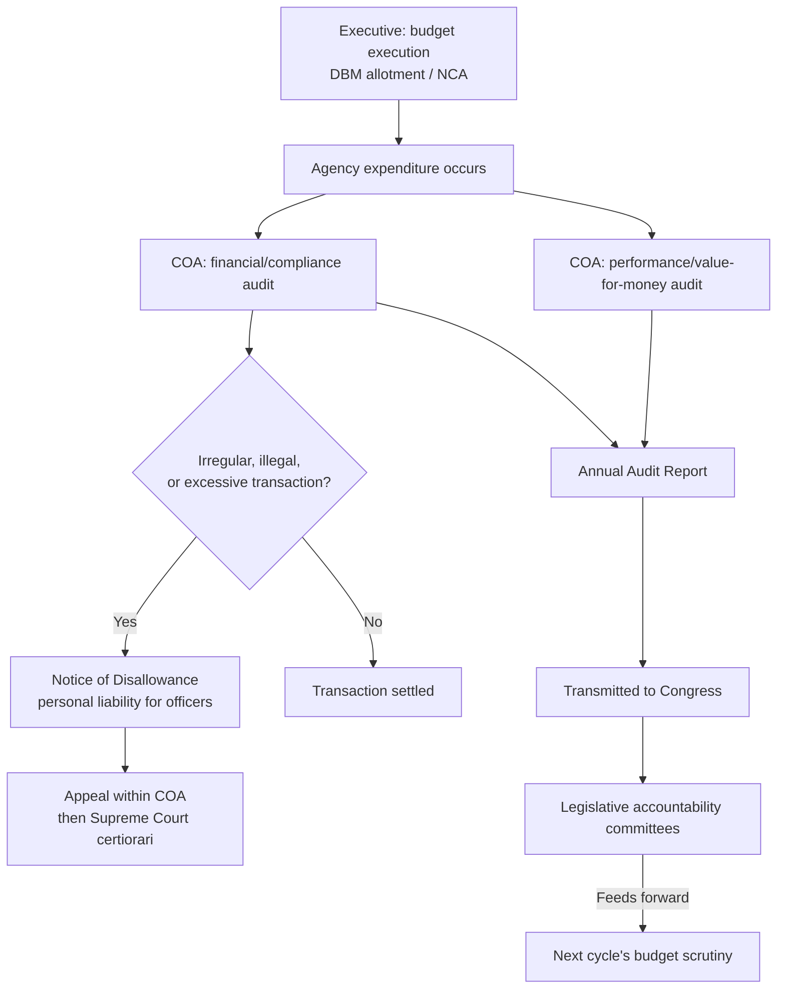

## Supreme Audit Institutions as a Fourth Branch of Fiscal Accountability

### The Accountability Gap the Institution Fills

The preceding fiscal-institutional architecture — the finance ministry/budget office's execution authority, the legislature's appropriations power, and the central bank's monetary separation — collectively governs the *ex ante* and *in-year* stages of the fiscal cycle: formulation, authorization, and execution. None of these institutions is structurally positioned to answer the accountability question that arises only *after* the fiscal year closes: **did the executive actually spend appropriated funds as authorized, lawfully, and with due regard to economy and efficiency?** A **supreme audit institution (SAI)** is the body constitutionally or statutorily tasked with this ex-post verification function, external to and independent of the executive branch it audits — hence the common characterization, following INTOSAI (the International Organisation of Supreme Audit Institutions) doctrine, of the SAI as a **"fourth branch"** of fiscal governance, distinct from the executive (which spends), the legislature (which appropriates), and the judiciary (which adjudicates), even though most SAIs are formally situated as independent constitutional commissions rather than a fourth branch in the strict separation-of-powers sense.

The institutional logic mirrors two mechanisms already established in this architecture: central bank independence removes monetary policy from executive self-interest, and fiscal councils remove forecast/compliance verification from finance-ministry self-interest. **SAI independence removes ex-post verification of spending fidelity from the same executive that did the spending** — without this separation, the executive would functionally audit itself, an obvious conflict-of-interest structure that INTOSAI's foundational **Lima Declaration (1977)** identified as the core rationale for institutional independence in public-sector auditing.

### The Three Institutional Models

Cross-country SAI design converges on three recognized models, distinguished by decision-making structure and enforcement power:

1. **Westminster/audit-office model** — a single Auditor-General (or Comptroller and Auditor General) heads the institution, issues audit reports directly to the legislature, and has no independent judicial or quasi-judicial sanction power; enforcement runs through the legislature's own public-accounts committee. The UK National Audit Office and the U.S. Government Accountability Office (GAO) exemplify this model, notably without the "court" nomenclature despite functioning similarly in practice.
2. **Court model (Cour des Comptes model)** — the SAI is structured as a judicial or quasi-judicial body with the power to issue binding rulings on individual accountable officers, sometimes including surcharge (financial liability) or referral for prosecution. France's Cour des Comptes is the archetype; many Francophone and southern European systems follow this model.
3. **Board/collegial model** — a multi-member commission makes audit determinations collectively rather than through a single Auditor-General, often blending elements of both prior models. The **Philippine Commission on Audit (COA)** follows this model: a three-member constitutional commission (Chairperson and two Commissioners, per Art. IX-D of the 1987 Constitution), appointed by the President with Commission on Appointments confirmation for a **fixed seven-year term**, staggered to prevent any single administration from appointing a full replacement slate — a structural independence safeguard directly analogous to the staggered, fixed-term, cause-based-removal design used for central bank Monetary Board members.

### The Philippine Commission on Audit: Constitutional Design and Scope

The COA's mandate under Article IX-D, Section 2 of the 1987 Constitution is unusually broad relative to many comparable SAIs: it has authority to **"examine, audit, and settle all accounts pertaining to the revenue and receipts of, and expenditures or uses of funds and property, owned or held in trust by, or pertaining to, the Government"** — extending not only to national government agencies but to government-owned and controlled corporations (GOCCs), local government units, and even non-governmental entities receiving government subsidy or equity, a scope that captures a substantially wider perimeter of public fiscal activity than audit institutions confined strictly to national-budget line agencies.

Three specific COA powers are worth distinguishing precisely, since they are frequently conflated in casual description:

- **Compliance/financial audit** — verifying that expenditure occurred in accordance with appropriation law, procurement regulations, and accounting standards. This is the baseline, universal SAI function.
- **Value-for-money/performance audit** — assessing whether spending achieved its intended objectives economically and efficiently, a broader and more judgment-laden mandate that has expanded across SAIs globally (including COA) as a complement to narrower legal-compliance auditing.
- **Settlement/disallowance authority** — the COA's power to issue a **Notice of Disallowance (ND)** against specific transactions found to be illegal, irregular, unnecessary, excessive, extravagant, or unconscionable, which can create **personal financial liability for the responsible public officers** who authorized or benefited from the disallowed transaction, subject to appeal within the COA's internal quasi-judicial process and ultimately to the Supreme Court on certiorari. This settlement/disallowance power places Philippine COA closer to the "court model" powers than a pure Westminster-style audit office, even though it retains the collegial-commission structural form — illustrating that the three-model taxonomy describes tendencies rather than a strict, mutually exclusive categorization.

### Interaction with the Legislative and Executive Fiscal Cycle

The COA's output feeds directly back into the legislative oversight function already described under appropriations authority: COA's **Annual Audit Reports (AARs)** on individual agencies and the consolidated **Annual Financial Report** on the National Government are transmitted to Congress, where the House and Senate committees on accountability and public expenditure use audit findings both retrospectively (holding specific officials accountable for prior-year findings) and prospectively (informing the following year's budget deliberations — a chronically underperforming or audit-flagged agency's NEP request may receive closer legislative scrutiny as a direct result). This closes the loop of the four-phase PFM cycle described in executive fiscal architecture: preparation → legislation → execution → **audit**, with the audit phase's findings recursively informing the next cycle's preparation phase.

A precise institutional-design point: **the COA does not itself have appropriation, allotment, or spending-control power** — it cannot prevent an expenditure from occurring, only assess it after the fact and impose consequences (disallowance, referral) retrospectively. This is a deliberate design boundary distinguishing audit (ex-post verification) from control (ex-ante or in-year authorization), and it is the reason SAI reform alone cannot substitute for strong ex-ante budget execution controls (the DBM's allotment/NCA gatekeeping) or legislative appropriations discipline — a weak upstream control environment generates more disallowed transactions for the COA to find, but finding them after the money has already left the treasury is a materially weaker remedy than preventing the improper expenditure in the first place.

### INTOSAI Standards and the Independence Benchmark

The **Lima Declaration (1977)** and its successor **Mexico Declaration on SAI Independence (2007)** articulate the internationally recognized minimum conditions for SAI independence, structurally parallel to the central bank independence criteria discussed earlier in this architecture: (1) an appropriate and effective constitutional/legal framework establishing the SAI's mandate; (2) independence of SAI heads and members, including security of tenure and legal immunity for normal discharge of duties; (3) sufficiently broad mandate and full discretion in discharging SAI functions; (4) unrestricted access to information; (5) the right and obligation to report on findings; (6) freedom to decide report content and timing; (7) effective follow-up mechanisms on SAI recommendations; and (8) financial and managerial/administrative autonomy, including adequate human/material/monetary resources. This last criterion — budgetary autonomy for the audit institution itself — closes a potential circularity: an SAI whose own budget is subject to the ordinary appropriations discretion of the executive it audits faces an obvious pressure vector, which is why many constitutional designs (the Philippines included, via COA's constitutional-commission status and fiscal-autonomy guarantee under Art. IX-A, Sec. 5) explicitly insulate the audit institution's own funding from ordinary budget-ceiling negotiation.

### Empirical Debate: Does SAI Strength Actually Improve Fiscal Outcomes?

The strongest case for SAI empowerment, drawn from comparative PFM/governance literature (reflected in World Bank governance indicators and PEFA's external-audit dimension scoring): jurisdictions with independent, well-resourced SAIs exhibit measurably lower rates of documented public procurement irregularity and, in some cross-country panel studies, modestly lower borrowing costs — plausibly because credible external audit reduces the information asymmetry sovereign creditors face regarding fiscal-management quality, functioning as a credibility-enhancing signal analogous to the risk-premium channel through which central bank independence affects debt-dynamics outcomes.

The strongest counter-case: audit findings, however rigorous, depend entirely on downstream enforcement mechanisms the SAI itself does not control — a Notice of Disallowance that is appealed indefinitely, or an Annual Audit Report that a legislature declines to act upon meaningfully, delivers little of the deterrent effect the institution is designed to produce. [Inference] This suggests SAI strength is better modeled as a *necessary but insufficient* condition for fiscal accountability — its marginal value depends heavily on the responsiveness of the legislative oversight and prosecutorial/disciplinary institutions that must act on its findings, a complementarity that mirrors the finding (noted under fiscal rules) that numerical constraints deliver most of their credibility benefit only when paired with genuine independent enforcement rather than functioning as freestanding institutions.

**Key Points**

- Supreme audit institutions provide ex-post, independent verification of government spending fidelity, addressing an accountability gap that ex-ante appropriation and in-year execution control cannot fill on their own.
- Three institutional models — Westminster/audit-office, court (Cour des Comptes), and board/collegial — differ chiefly in enforcement power; the Philippine COA's collegial structure is paired with unusually strong disallowance/settlement authority closer to the court model's binding-liability powers.
- COA's constitutional mandate extends beyond national agencies to GOCCs, LGUs, and government-subsidized entities, and its Notices of Disallowance can create personal financial liability for responsible officers, subject to appeal up to the Supreme Court.
- INTOSAI's Lima and Mexico Declarations establish independence benchmarks structurally parallel to central bank independence criteria, including the critical safeguard of budgetary autonomy for the audit institution itself.
- SAI audit findings function as a necessary but not sufficient accountability mechanism — their practical effect depends on downstream legislative and disciplinary follow-through that the SAI does not itself control.

**Related Topics**

- INTOSAI standards and the Lima/Mexico Declarations on audit independence
- Government-owned and controlled corporations and their fiscal-risk/contingent-liability profile
- Procurement law and its interaction with audit compliance findings
- Legislative public-accounts committees and the accountability feedback loop into budget preparation
- Comparative sovereign credit risk and governance-quality indicators
- Local government unit fiscal autonomy and COA's audit jurisdiction over subnational entities