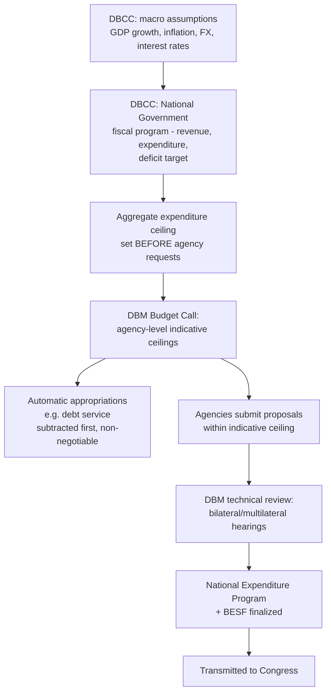

## Budget Formulation and the Medium-Term Macro-Fiscal Framework

### Formulation as the First Phase of the PFM Cycle

Recall that the standard public financial management cycle proceeds through four phases — formulation, legislative authorization, execution, and audit. **Budget formulation** is the first of these: the internal executive-branch process by which macroeconomic assumptions are set, an aggregate spending ceiling is derived, that ceiling is allocated across agencies, and the resulting proposal is finalized for transmission to the legislature. Formulation is entirely an executive-branch function in most systems — the legislature has no formal role until the proposal is transmitted — which makes the *quality and credibility* of the executive's internal formulation process the primary determinant of whether the eventual budget document represents a coherent fiscal plan or merely an aggregation of agency wish-lists.

### The Medium-Term Macro-Fiscal Framework: Definition and Function

A **medium-term fiscal framework (MTFF)** is a structured set of projections — typically spanning three to five years forward — for the government's aggregate revenue, expenditure, deficit, and debt path, built on a common set of macroeconomic assumptions (GDP growth, inflation, interest rates, exchange rate). Its function is to anchor the *single-year* budget being formulated within a multi-year fiscal trajectory, preventing the common failure mode of annual budgeting in isolation: a government can appear compliant with a given year's deficit target while structurally committing to spending growth or revenue erosion that makes future years' targets unreachable without a painful correction — a problem invisible in a strictly single-year lens but immediately visible once the same assumptions are projected forward.

The MTFF is distinct from, but feeds directly into, three other instruments already established in this fiscal architecture:

- It supplies the macroeconomic assumptions and multi-year deficit/debt targets that a **fiscal rule** (where one exists) is measured against — recall that fiscal rules constrain a specific aggregate (debt, deficit, expenditure, or revenue), and the MTFF is the vehicle through which compliance with a multi-year rule trajectory, rather than merely the current year's number, is assessed and communicated.
- It is the direct input to the **debt sustainability analysis (DSA)** — recall that a DSA projects the debt-to-GDP trajectory under baseline and stress scenarios using the identity $\Delta d_t = \frac{i_t - g_t}{1+g_t}d_{t-1} - pb_t$; the MTFF's growth, interest-rate, and primary-balance projections are precisely the baseline-scenario inputs a DSA requires, meaning MTFF quality directly determines DSA credibility.
- It sets the **aggregate expenditure ceiling** that constrains the "top-down" stage of the budget process before agency-level "bottom-up" requests are entertained — the specific institutional mechanism through which this occurs in the Philippine system is detailed below.

### The Philippine Medium-Term Fiscal Framework in Practice

The **Development Budget Coordination Committee (DBCC)** — the inter-agency body comprising the Department of Finance, Department of Budget and Management, the central bank (Bangko Sentral ng Pilipinas), and the National Economic and Development Authority (NEDA), with congressional representation — is the institutional vehicle through which the Philippine MTFF is produced and periodically revised. The DBCC's core output is the **Macroeconomic Assumptions and Fiscal Program**, published and updated at multiple points across the year (typically ahead of budget formulation, then revisited as the fiscal year progresses and actual outturns diverge from projection), specifying:

- Real GDP growth targets over a multi-year horizon.
- Inflation, foreign exchange rate, and (since these were folded into DBCC's expanded macro-assumption set) interest-rate assumptions.
- The **National Government fiscal program**: projected revenue, expenditure, deficit (as a percentage of GDP), and the resulting **financing program** — the mix of domestic and external borrowing the Bureau of the Treasury must execute to cover the projected deficit, connecting directly to the debt-issuance and cash-management architecture described under the Treasury Single Account.

This DBCC output is not merely advisory background material; it is the **binding ceiling constraint** that the DBM's subsequent Budget Call operationalizes into agency-level allocations. Recall that the DBM issues individual agency expenditure ceilings derived from the aggregate ceiling via historical baselines and negotiated increments — that aggregate ceiling *is* the DBCC's fiscal program figure for the relevant budget year, meaning the DBCC's macro-fiscal work product is the load-bearing constraint the entire annual formulation exercise is built around, not a separate parallel exercise.

### The Formulation Sequence: Top-Down Ceiling Before Bottom-Up Requests

The specific sequencing discipline worth naming precisely — because its absence is one of the most common formulation-quality failures across PFM systems generally — is **setting the aggregate ceiling before, not after, soliciting agency spending requests**. If agencies submit uncapped requests first and the aggregate ceiling is derived afterward as whatever sum seems politically defensible, the ceiling is not really constraining anything; it is simply describing the agencies' aggregate ask. The disciplined sequence is:

1. **DBCC sets macro-assumptions and the aggregate fiscal program** (revenue, expenditure ceiling, deficit target) *before* agency-level requests are solicited.
2. **DBM issues the Budget Call**, translating the aggregate ceiling into agency-specific indicative ceilings, using a mix of the prior year's baseline appropriation, policy priorities identified in the President's development agenda, and any legislated mandatory-spending growth (e.g., automatic appropriations for debt service, discussed under legislative appropriations authority, which are subtracted from the discretionary ceiling before agency allocations are determined, since they are not agency-negotiable).
3. **Agencies submit proposals within their indicative ceiling**, with any request above ceiling requiring separate justification and DBM approval as an exception rather than the default mode of negotiation.
4. **DBM technical review (bilateral/multilateral budget hearings)** validates agency submissions against the ceiling and programmatic criteria.
5. **Finalization into the National Expenditure Program (NEP)** for transmission to Congress, accompanied by the **Budget of Expenditures and Sources of Financing (BESF)**, which documents the underlying macro-fiscal assumptions transparently enough for legislative scrutiny of the assumptions themselves, not merely the resulting numbers.

### Forecasting Risk and the Optimism Bias Problem

Recall the structural tension identified under the finance ministry/budget office architecture: revenue-forecasting bodies have a latent incentive toward optimism, since higher projected revenue supports a higher spending ceiling without an immediate need to raise taxes or cut elsewhere, while the consequences of an over-optimistic forecast (a larger-than-planned deficit, or mid-year allotment throttling to compensate) materialize only later, in the execution phase. The DBCC's inter-agency structure — requiring joint sign-off from DOF, DBM, BSP, and NEDA on a single set of assumptions — is specifically designed to counteract this by forcing the revenue-optimistic and expenditure-control perspectives to reconcile on shared numbers before either agency can build its own downstream plans on divergent assumptions. [Inference] This inter-agency check is a partial but not complete substitute for the fully independent fiscal-council verification model (the CBO/OBR approach) discussed under fiscal rules architecture, since all DBCC members remain executive-branch (or executive-adjacent, in NEDA's case) actors with some shared institutional interest in the fiscal program appearing achievable — an independent external body with no stake in the program's political success would, in principle, apply a different and potentially more conservative standard of scrutiny to the same assumptions.

### Revision and the Rolling Nature of Medium-Term Frameworks

A critical structural feature distinguishing an MTFF from a one-time forecast: it is **rolling and iteratively revised**, not fixed at first publication. Each budget cycle's DBCC assumptions update the prior cycle's later-year projections in light of actual outturns and revised economic conditions, meaning the "out-years" (years two through five of any given MTFF vintage) are best understood as a **conditional planning trajectory** rather than a firm commitment — the multi-year targets discipline current-year decisions (by making visible the future consequences of today's choices) without functioning as legally binding multi-year appropriations, since (recall from legislative appropriations authority) the GAA itself remains a single fiscal-year legal instrument in the Philippine system, with only limited categories of continuing or automatic appropriations extending validity beyond one year.

**Key Points**

- Budget formulation is the executive-branch-internal first phase of the PFM cycle, and its quality depends on whether the aggregate ceiling is set before or after agency requests are solicited — the disciplined "top-down, bottom-up" sequence requires the former.
- A medium-term fiscal framework projects revenue, expenditure, deficit, and debt over a multi-year horizon on shared macroeconomic assumptions, feeding directly into fiscal-rule compliance assessment and debt sustainability analysis as the source of baseline-scenario inputs.
- The Philippine DBCC is the institutional vehicle producing the MTFF, and its inter-agency composition (DOF, DBM, BSP, NEDA) is a structural device to counteract the revenue-forecasting optimism bias inherent in single-agency projection.
- Automatic and standing appropriations (notably debt service) are subtracted from the discretionary ceiling before agency-level allocation, since they are not subject to the same negotiated Budget Call process as agency requests.
- An MTFF is a rolling, iteratively revised conditional planning trajectory rather than a legally binding multi-year appropriation — it disciplines current decisions through visibility of future consequences rather than through direct legal force on future budgets.

**Related Topics**

- Debt sustainability analysis methodology and the debt-dynamics identity
- Fiscal rules and numerical constraints on budget authority
- The DBM Budget Call and agency-level ceiling allocation mechanics
- Automatic appropriations for debt service and their exemption from annual negotiation
- The National Expenditure Program and Budget of Expenditures and Sources of Financing as formulation-phase deliverables
- Revenue forecasting methodology and optimism bias in fiscal projection