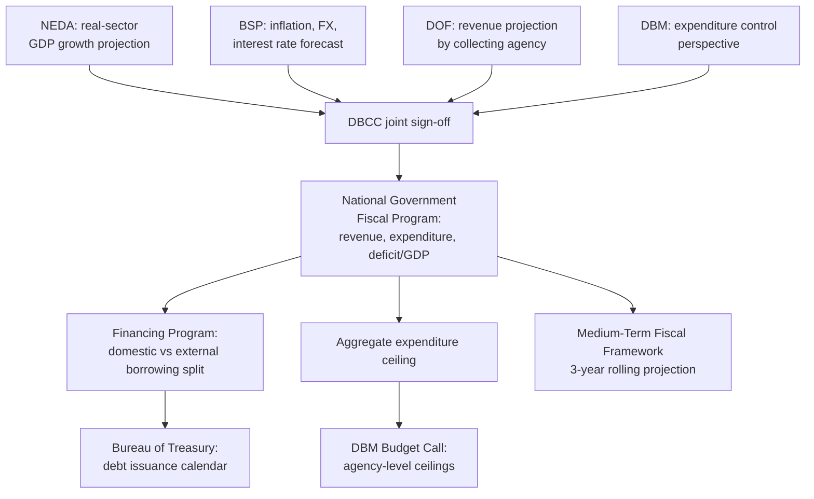

## The Development Budget Coordination Committee and Macroeconomic Assumption-Setting in the Philippines

### Institutional Composition and Legal Basis

The **Development Budget Coordination Committee (DBCC)** is an inter-agency body created to produce a single, reconciled set of macroeconomic and fiscal assumptions binding across all executive fiscal agencies, rather than allowing each agency to plan against its own independently derived forecast. Its institutional basis traces to reorganization measures under the Marcos-era administrative code framework (formalized through Executive Order provisions in the early period of the modern Philippine budget system) and it has continued as a standing inter-agency mechanism since. Its core membership comprises:

- **Department of Budget and Management (DBM)** — chairs the committee, given its role converting the DBCC's fiscal program into the operational Budget Call and agency ceilings.
- **Department of Finance (DOF)** — supplies revenue projections and debt/financing assumptions, given its mandate over revenue policy and the Bureau of the Treasury's borrowing program.
- **Bangko Sentral ng Pilipinas (BSP)** — supplies monetary and external-sector assumptions (inflation, exchange rate, interest rates), participating as the monetary authority while preserving the instrument-independence boundary discussed under central bank independence: the BSP contributes its own forecast of the policy path it intends to pursue, rather than being directed by the DBCC toward a fiscally convenient monetary stance.
- **National Economic and Development Authority (NEDA)** — the state's central planning agency, supplying real-sector growth projections (GDP, sectoral output) that anchor the revenue-base assumptions DOF and DBM build upon.
- **Office of the President**, represented via a designated representative, and **congressional representation** (typically through House and Senate finance/appropriations leadership), which distinguishes the DBCC from a purely executive-internal body and gives the legislature visibility into the assumption-setting process before the formal budget transmission — though this representation is consultative rather than altering the fundamentally executive-branch character of the committee's formulation function.

### The Function: Reconciling Divergent Institutional Incentives Into a Single Fiscal Program

Recall the structural tension already identified between the DOF and DBM: the DOF's revenue-forecasting role creates an incentive toward optimistic projections (since higher expected revenue supports a higher spending ceiling without immediate fiscal pain), while the DBM's expenditure-control role creates an incentive toward more conservative assumptions (since it is judged on deficit-target outcomes during execution). The DBCC's institutional design forces these two agencies — plus the BSP's independent monetary forecast and NEDA's real-sector projections — onto **one shared, jointly-approved set of numbers**, eliminating the possibility that DOF and DBM build downstream plans (the financing program and the expenditure ceiling, respectively) on inconsistent assumptions.

This joint-approval requirement is the specific institutional mechanism, not merely a general principle, through which the optimism-bias problem discussed under both the finance-ministry architecture and the fiscal-rules literature is operationally addressed in the Philippine system. It is worth being precise about what this mechanism does and does not achieve: **it enforces internal consistency across executive-branch actors', it does not supply the independent, extra-executive verification that a fiscal council in the CBO/OBR mold would provide**, since every DBCC member remains an executive (or executive-adjacent, in the BSP's case, and quasi-executive in NEDA's planning function) institution with some residual stake in the fiscal program's political viability.

### The DBCC's Core Work Product: The Macroeconomic Assumptions and Fiscal Program

The DBCC's output, updated at multiple points across the calendar year as new data and outturns become available, comprises:

1. **Macroeconomic assumptions** — real GDP growth (often presented as a target range rather than a point estimate, reflecting genuine forecast uncertainty), inflation, the peso-dollar exchange rate, and interest-rate assumptions (both the 91-day T-bill rate proxy for domestic short-term borrowing costs and relevant external benchmark rates for foreign-currency debt costed against the financing program).
2. **The National Government fiscal program** — projected revenue (disaggregated by major collecting agency: Bureau of Internal Revenue, Bureau of Customs, and non-tax revenue sources), projected expenditure, the resulting fiscal deficit as a percentage of GDP, and the **financing program**: the planned split between domestic borrowing (Treasury bill and bond issuance) and external borrowing (multilateral, bilateral, and commercial sources) needed to cover the deficit — the direct link to the Bureau of the Treasury's cash and debt management operations discussed under the Treasury Single Account architecture.
3. **Medium-term projections**, typically spanning three years forward from the current budget year, constituting the Philippine medium-term fiscal framework (MTFF) described in budget-formulation architecture — the DBCC is the institutional *producer* of the MTFF, not a separate body consuming an MTFF generated elsewhere.

### Position in the Formulation Sequence

The DBCC's fiscal program is not one input among several that DBM weighs when setting agency ceilings — it **is** the ceiling, transmitted operationally into the Budget Call. The sequencing discipline (setting the aggregate constraint before soliciting agency requests) depends entirely on the DBCC completing its assumption-setting and fiscal-program work *before* the DBM issues its annual Budget Call; a late or contested DBCC process directly delays or destabilizes the entire downstream formulation timeline, since the DBM has no independent basis for setting agency ceilings without the DBCC's aggregate figure.

### Revision Cycle and Responsiveness to Shocks

Because the DBCC's assumptions are rolling rather than fixed at a single annual publication, the committee reconvenes to revise its fiscal program when actual conditions diverge materially from the prior assumption set — a global commodity-price shock affecting inflation and import costs, an external monetary-policy shift affecting capital flows and the peso exchange rate, or a domestic revenue collection shortfall or windfall relative to projection. Each revision cascades through the same downstream chain: a revised growth or revenue assumption can necessitate a revised expenditure ceiling mid-formulation (if the revision occurs before the NEP is finalized) or, once the GAA is already enacted, can instead trigger the DBM's execution-stage allotment-throttling response described under executive fiscal architecture, since a legally enacted appropriation ceiling cannot itself be revised downward without new legislation — the DBCC's post-enactment revisions inform *execution-phase cash and allotment management* rather than the legal appropriation amount, which is why the distinction between the DBCC's macro-fiscal program (a planning and coordination instrument) and the GAA (a binding legal instrument) matters precisely at the moment forecasts turn out to be wrong.

### A Structural Limitation Worth Naming Precisely

[Inference] Because the DBCC operates by consensus among executive-branch principals rather than through a single independent forecasting authority with a mandate the other agencies must simply accept (the OBR's stronger delegation model, where the UK Treasury is bound to use the OBR's official forecast rather than negotiating its own), the DBCC's assumptions are, in principle, more exposed to negotiated compromise between institutional perspectives than a fully independent forecast would be — a jointly negotiated growth assumption that splits the difference between NEDA's and a more cautious member's view is not necessarily the same as the single most statistically defensible forecast. This is not a claim that DBCC assumptions are systematically biased in practice — the available evidence on this specific question is not something this analysis can verify — but it identifies the structural mechanism (consensus-based, all-executive membership) through which a bias, if present, would most plausibly enter the process, distinguishing the DBCC's design from the stronger independent-delegation model represented by the OBR.

**Key Points**

- The DBCC is a standing inter-agency body (DBM, DOF, BSP, NEDA, plus Office of the President and congressional representation) producing a single, jointly-approved set of macroeconomic assumptions and a National Government fiscal program.
- Its core function is forcing the DOF's revenue-optimism tendency and the DBM's expenditure-control tendency onto one reconciled set of numbers, addressing the optimism-bias problem through internal executive-branch consistency rather than external independent verification.
- The DBCC's fiscal program is not advisory background material — it operationally becomes the aggregate expenditure ceiling that the DBM's Budget Call allocates across agencies, making DBCC completion a hard prerequisite for the formulation timeline.
- The DBCC also produces the Philippine medium-term fiscal framework as a three-year rolling projection, and its financing-program output links directly to the Bureau of the Treasury's debt-issuance planning.
- As a consensus-based, all-executive-branch body, the DBCC's design differs structurally from stronger independent-delegation fiscal-council models (e.g., the UK OBR), where the finance ministry is bound to an externally produced forecast rather than a jointly negotiated one.

**Related Topics**

- Budget formulation and the medium-term macro-fiscal framework
- Debt sustainability analysis and its dependence on DBCC-sourced baseline assumptions
- The Bureau of the Treasury's financing program and debt issuance calendar
- Fiscal councils and independent forecasting models (CBO, OBR) as a comparative benchmark
- The DBM Budget Call and the top-down ceiling allocation mechanism
- Revenue forecasting by the Bureau of Internal Revenue and Bureau of Customs