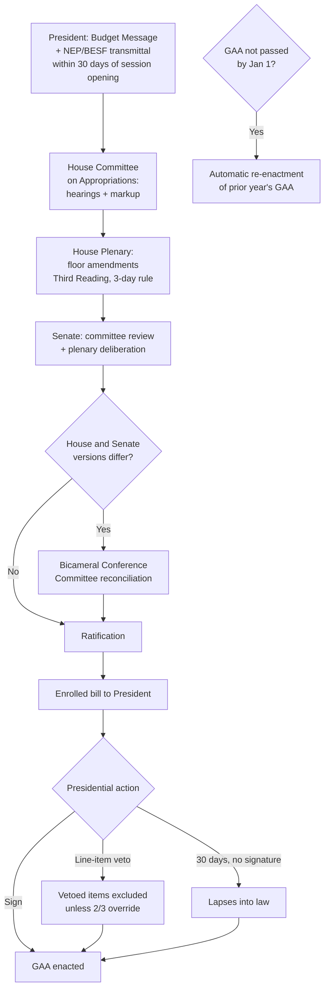

## Legislative Authorization from Budget Message to Enacted Appropriations Law

### Position in the PFM Cycle and Scope of This Item

Recall the four-phase public financial management cycle: formulation, legislative authorization, execution, and audit. Having covered formulation (the DBCC's macro-fiscal program and the DBM's ceiling-driven agency allocation process), this item addresses the second phase in procedural detail: the sequence of specific legal and procedural steps by which an executive's proposed budget travels through legislative deliberation to become a binding appropriations law. This is a **procedural deep-dive** into a phase whose constitutional powers (the legislature's amendment limits, the line-item veto, standing appropriations) were already established under the power-of-the-purse architecture — this item traces the *sequence* those powers operate within, rather than re-deriving the powers themselves.

### Step 1: Transmittal and the Budget Message

The formulation phase concludes when the President transmits the **National Expenditure Program (NEP)** and its accompanying **Budget of Expenditures and Sources of Financing (BESF)** to Congress, conventionally paired with a **Budget Message** — a presidential address (delivered to a joint session or transmitted as a formal document, depending on administration practice) articulating the fiscal policy priorities underlying the proposal. The Philippine Constitution requires this submission within thirty days from the opening of each regular session of Congress (Art. VII, Sec. 22), anchoring the legislative calendar to a fixed constitutional deadline rather than leaving transmittal timing to executive discretion.

The BESF's function at this stage is worth being precise about: it is the document through which the DBCC's macroeconomic assumptions (growth, inflation, exchange rate, interest rates) and the resulting fiscal program (revenue, expenditure, deficit, financing mix) are disclosed to the legislature in a form allowing scrutiny of the *assumptions underlying* the numbers, not merely the appropriation amounts themselves — a legislature that can only see proposed spending levels without the growth and revenue assumptions those levels depend on cannot meaningfully assess whether the proposal is fiscally coherent, only whether individual line items seem reasonable in isolation.

### Step 2: Committee Deliberation — House Origination

Consistent with the origination-chamber principle noted under appropriations authority (revenue bills, and by extension the general appropriations bill in Philippine practice, originate in the House of Representatives), the **House Committee on Appropriations** conducts the first substantive legislative review. This typically involves:

- **Department/agency budget hearings**, where individual agency heads defend their proposed allocations before the committee — a second, more explicitly political layer of scrutiny than the DBM's technical bilateral/multilateral hearings conducted during formulation, though covering overlapping substantive ground (programmatic justification, past utilization rates, performance against targets).
- **Committee-level markup**, where the committee may recommend reductions to specific NEP items — recall that the constitutional constraint (Art. VI, Sec. 25(2)) permits Congress to reduce or eliminate items but not increase them above the President's recommended amount, meaning committee markup at this stage is substantively a **reallocation and reduction exercise within a fixed ceiling**, not an exercise in expanding the aggregate budget.

### Step 3: General Appropriations Bill — Plenary Passage, House

Following committee approval, the bill — now styled the **General Appropriations Bill (GAB)** — proceeds to plenary deliberation in the House, where individual members may propose floor amendments (subject to the same constitutional no-increase constraint) before a vote on **Third Reading**, the constitutionally required final-passage stage requiring the bill's text to have been distributed to members in final form at least three days prior (Art. VI, Sec. 26(2)), a procedural safeguard against last-minute substantive changes being voted on without adequate review — a recurring point of political and legal contention in Philippine budget practice precisely because insertions made very late in the process (including so-called "midnight" or "unauthorized" insertions not reflecting committee-approved text) have historically triggered disputes over whether the constitutional three-day/final-form requirement was actually satisfied.

### Step 4: Senate Concurrent Process and Bicameral Reconciliation

The Senate conducts its own committee review and plenary deliberation, typically proceeding in parallel with (rather than strictly sequential to) House action once the House has transmitted its version, though formally the Senate's constitutional role in appropriations matters is to concur with or amend a House-originated bill rather than to independently originate one. Where the House and Senate versions differ — which is the general case given independent committee markups in each chamber — a **Bicameral Conference Committee (bicam)** reconciles the two versions into a single text.

The bicam stage is institutionally significant and worth flagging precisely: it is where much of the most consequential, least publicly visible reallocation occurs, since the conference committee's reconciled text requires only the two chambers' *ratification* (not a full re-run of committee and plenary deliberation) before proceeding to enrollment — a structural feature common to bicameral legislatures generally (the equivalent conference-committee mechanism exists in the U.S. Congress) and one that has drawn recurring accountability criticism in Philippine budget practice, since the bicam's reconciled provisions can introduce or alter special provisions and item-level allocations in ways not fully traceable to either chamber's own floor-debated version — precisely the kind of germaneness and transparency concern already noted regarding riders under legislative appropriations authority.

### Step 5: Enrollment and Presidential Action

The reconciled bill is enrolled and transmitted to the President, who has three available actions:

1. **Sign the GAB into the General Appropriations Act (GAA)** without modification.
2. **Exercise the line-item veto** (Art. VI, Sec. 27(2)) on specific items or provisos — recall that because Congress can only *reduce* the President's original NEP proposal, the veto's practical targets are typically (a) congressional insertions or reallocations the executive opposes, or (b) special provisions/riders attached to specific appropriations that the executive judges objectionable, rather than aggregate spending levels the executive itself proposed.
3. **Allow the bill to lapse into law without signature** after thirty days (Art. VI, Sec. 27(1)), a constitutional option distinct from a pocket veto, since Philippine constitutional design does not permit the President to kill a bill through inaction — non-signature after the constitutional period results in enactment, not death of the bill, a deliberate design choice limiting executive obstruction of a finally-passed appropriations bill.

A vetoed item, once vetoed, can be overridden by a two-thirds vote of both chambers (Art. VI, Sec. 27(1)) — the same override threshold applicable to ordinary legislation, meaning the line-item veto's practical strength depends heavily on whether the enacting majority that passed the GAB in the first instance also commands a supermajority willing to override, which is frequently not the case even for provisions a legislative majority initially favored, giving the veto real practical bite in Philippine budget politics.

### Step 6: The Re-Enactment Fallback

Recall from legislative appropriations authority that if the GAA is not enacted before the start of the fiscal year (January 1), the Constitution (Art. VI, Sec. 25(7)) provides for **automatic re-enactment of the prior year's GAA** until a new one is passed — a structural difference from systems (the U.S. being the most prominent example) lacking an equivalent default, where a lapse in appropriations produces a government shutdown rather than automatic continuity. Re-enactment is not without cost: a re-enacted budget carries forward the *prior* year's allocations and the (recall from budget formulation) prior year's now-outdated macro-fiscal assumptions, meaning new programs, updated agency priorities, and revised DBCC projections cannot take legal effect until the new GAA is actually passed — re-enactment is fiscal continuity, not fiscal currency.

### A Precise Distinction: Legislative Authorization vs. Executive Release Authority

A boundary worth restating with precision, since it recurs across this fiscal architecture: enactment of the GAA grants **legal authorization to obligate funds up to the appropriated ceiling**; it does not itself make cash available to any agency. That subsequent step — the DBM's issuance of Allotment Release Orders and the corresponding Notices of Cash Allocation — belongs to the *execution* phase of the PFM cycle, operationally and institutionally distinct from the legislative authorization phase this item addresses, even though the appropriations act is the legal precondition every allotment must trace back to.

**Key Points**

- Legislative authorization proceeds through a fixed constitutional sequence: transmittal within 30 days of session opening, House committee and plenary review, Senate concurrence, bicameral reconciliation where versions diverge, and presidential action (signature, line-item veto, or lapse into law).
- Because Congress may only reduce or eliminate NEP items, not increase them, committee and plenary deliberation function as reallocation-within-ceiling exercises, and the line-item veto's practical targets are typically congressional insertions or objectionable riders rather than the President's own proposed spending levels.
- The bicameral conference committee stage is a recurring site of accountability concern, since its reconciled text is ratified rather than independently re-debated by either chamber in full.
- Non-signature after 30 days results in automatic enactment (not a pocket veto), and failure to pass a new GAA before the fiscal year begins triggers automatic re-enactment of the prior year's GAA under the Philippine Constitution — a structural contrast with jurisdictions where an appropriations lapse produces a shutdown.
- Legislative enactment authorizes obligation up to a ceiling; it does not itself release cash, a function reserved to the DBM's execution-phase allotment and cash-allocation instruments.

**Related Topics**

- The finance ministry and budget office as the core executive fiscal institution
- The legislature's power of the purse and appropriations authority
- Budget execution: allotment release orders and the Notice of Cash Allocation
- Riders, special provisions, and germaneness challenges in appropriations law
- Comparative continuing-resolution and shutdown mechanisms across presidential systems
- Bicameral conference committee practice and appropriations transparency concerns