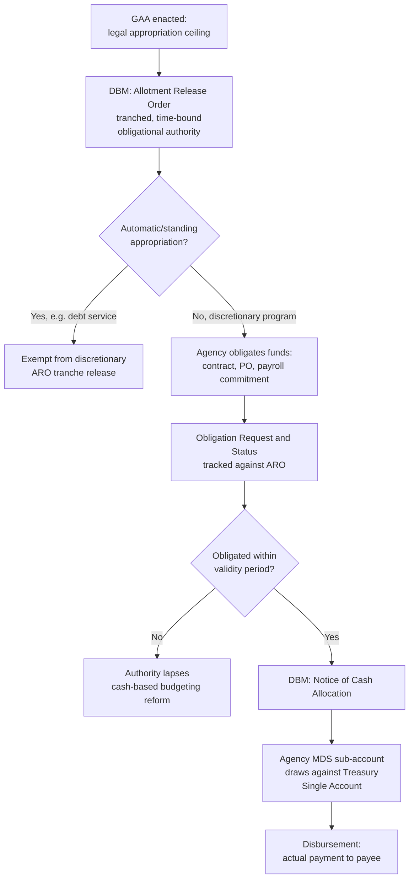

## Budget Execution: Allotment Release, Obligation, and Disbursement Stages

### Position in the PFM Cycle and the Central Distinction This Item Resolves

Recall the four-phase PFM cycle: formulation, legislative authorization, execution, and audit. The preceding item established a precise boundary at the transition from authorization to execution: **enactment of the General Appropriations Act (GAA) grants legal authority to obligate funds up to a ceiling; it does not itself make cash available to any agency.** This item addresses exactly what happens in the gap that boundary identifies — the sequence of distinct authorizations an agency must obtain, after the GAA is law, before it can actually spend money. That sequence has three legally and operationally distinct stages, frequently conflated in casual description but carrying materially different legal consequences: **allotment** (authority to incur obligations), **obligation** (the act of legally committing government funds against that authority), and **disbursement** (the actual outflow of cash). A given peso of appropriated funds must clear all three stages, in order, before it becomes an actual payment — and can be stopped, delayed, or reduced at any of the three points by a different actor with a different rationale.

### Stage 1: Allotment — Converting Legal Appropriation into Obligational Authority

An **allotment** is the Department of Budget and Management's authorization permitting a specific agency to incur obligations up to a specified amount, for a specified purpose, within a specified period — it is the mechanism that converts the GAA's *aggregate legal ceiling* into *agency-specific, time-bound spending authority*. In the Philippine system this instrument is the **Allotment Release Order (ARO)**, issued by the DBM against the appropriation the GAA has already authorized for that agency and program.

Three properties of the ARO are worth precise attention:

- **AROs are typically released in tranches, not as a single lump sum for the full fiscal year.** This is the specific execution-stage lever referenced in the executive fiscal architecture item on impoundment-equivalent authority: because the DBM controls the pace of ARO releases, it can slow the rate of allotment issuance mid-year if actual revenue collection is underperforming the DBCC's fiscal-program assumptions, protecting the deficit target without requiring new legislation to formally reduce the appropriation. This is functionally a form of **apportionment** in the terminology used across comparable PFM systems (the U.S. Antideficiency Act apportionment mechanism is the closest structural analogue), though the Philippine legal basis and instrument name differ.
- **Not all appropriations require an ARO to become obligation-ready.** Automatic and standing appropriations (recall debt service under legislative appropriations authority) are, by their automatic-appropriation legal status, generally exempt from the discretionary ARO release mechanism — the point of automatic appropriation is precisely that obligational authority does not depend on a DBM tranche-release decision each period, which is what makes the automatic-appropriation category a credibility device for creditors in the first place.
- **An ARO grants obligational authority, not cash.** This is the critical distinction the next two stages depend on: an agency holding a valid ARO for a given program can legally commit government funds against it, but that commitment does not itself move any cash — a frequent source of confusion in reading Philippine budget-execution reporting, where "released" (allotment released) and "disbursed" (cash actually paid out) describe different stages and are routinely different figures within the same fiscal year.

### Stage 2: Obligation — The Legal Commitment of Funds

**Obligation** is the act by which an agency, holding valid allotment authority, legally commits government funds to a specific transaction — signing a contract, issuing a purchase order, or otherwise creating a legal liability the government will be required to pay. This is the stage at which the government's *legal exposure* to a specific vendor, contractor, or employee is created, even though cash has not yet moved. Philippine budget-execution documents track this via the **Obligation Request and Status (ORS)** system, and the distinction between an agency's **allotment (authority granted)** and its **obligation (authority actually used)** produces the standard **utilization rate** metric used in agency performance review — an agency with a large unobligated allotment balance late in the fiscal year is generating a specific, trackable signal of execution weakness (whether from procurement delay, capacity constraints, or program design problems) that both the DBM during the current year and the legislature during the following year's budget hearings will scrutinize, precisely because it indicates that appropriated, allotted authority is not converting into actual government activity.

A further precision: obligation must occur **within the period of validity** the ARO and the underlying appropriation specify. Recall from legislative appropriations authority that most current Philippine appropriations operate under a **cash-based budgeting system** (following the 2019 reform embodied in the General Appropriations Act's shift to a cash-budgeting framework, replacing the older obligation-based system's more generous multi-year validity for capital and maintenance items) — under cash budgeting, both obligation *and* disbursement generally must occur within a substantially compressed window (the current fiscal year plus a short extended payment period), a structural tightening specifically intended to reduce the accumulation of unspent, multi-year-carried allotment balances that had been a recurring criticism of the pre-reform obligation-based system, where authority could sit unobligated or unpaid for up to two fiscal years.

### Stage 3: Disbursement — The Actual Cash Outflow

**Disbursement** is the final stage: the actual payment of cash to the vendor, contractor, employee, or other payee to whom the government has become legally obligated. In the Philippine system this requires the DBM's **Notice of Cash Allocation (NCA)** — recall from the Treasury Single Account architecture that the NCA is the specific instrument authorizing an agency's Modified Disbursement System (MDS) sub-account to draw down against the Bureau of the Treasury's consolidated cash position. An agency can therefore be in the position of holding valid obligational authority (an ARO, already obligated against a specific contract) while still lacking the cash-release authority (an NCA) needed to actually pay the resulting liability — a gap that, if prolonged, generates the recurring public-sector "delayed payment" complaints from contractors and suppliers dealing with government, and which is precisely the operational manifestation of the BTr's cash-position management (covered under the Treasury Single Account) interacting with the execution timeline: if the consolidated treasury cash position is tight relative to the pace of agency obligation, NCA issuance can lag ARO/obligation activity even where legal authority to spend is fully in place.

### The Three-Stage Distinction as an Accountability and Diagnostic Tool

The precise separation of allotment, obligation, and disbursement is not merely definitional housekeeping — it is the diagnostic structure that allows the specific *location* of an execution problem to be identified. A shortfall in disbursement relative to appropriation can originate at any of the three stages, each implying a different remedy:

- **Low allotment relative to appropriation** — indicates the DBM has deliberately throttled release, typically signaling a revenue shortfall relative to the DBCC's fiscal program, a deliberate deficit-protection measure rather than an agency-level execution failure.
- **Low obligation relative to allotment** — indicates an agency-level execution constraint: procurement delays (frequently linked to the Government Procurement Reform Act's bidding and approval timelines), staffing or capacity gaps, or program design issues preventing timely contracting — this is the category the Commission on Audit's performance/value-for-money audits (recall the SAI architecture) are specifically positioned to investigate, since it reflects agency-level management quality rather than a macro-fiscal or treasury-cash constraint.
- **Low disbursement relative to obligation** — indicates a cash-management constraint at the Bureau of the Treasury/DBM level (NCA issuance lagging behind legitimate obligated liabilities), pointing back to the TSA cash-forecasting quality discussed under Treasury Single Account architecture rather than to any failure at the agency level.

[Inference] This diagnostic separation is one of the more underappreciated design features of a well-specified execution-tracking system: aggregate "underspending" headline figures, reported without decomposition into which of the three stages the shortfall actually occurred at, conflate three analytically and institutionally distinct problems with three different responsible actors and three different remedies — a genuine limitation of execution reporting that presents only the final disbursement-versus-appropriation gap without the intermediate allotment and obligation figures needed to diagnose where in the chain the constraint actually binds.

**Key Points**

- Budget execution proceeds through three legally distinct stages — allotment (DBM authorizes obligation via the ARO), obligation (the agency legally commits funds against that authority), and disbursement (cash actually moves via the NCA) — each of which can independently constrain the pace of actual government spending.
- Allotment release is tranched and can be deliberately throttled by the DBM as a mid-year deficit-protection mechanism, distinct from any agency-level execution failure.
- The Philippines' post-2019 shift to cash-based budgeting compressed the obligation-and-disbursement validity window relative to the older obligation-based system, specifically to reduce multi-year carryover of unspent allotment.
- The three-stage distinction functions as a diagnostic tool: a disbursement shortfall's root cause (DBM-level cash-flow protection, agency-level procurement/capacity failure, or Treasury-level cash-management constraint) can only be identified by examining allotment, obligation, and disbursement figures separately rather than the aggregate underspending figure alone.
- Aggregate underspending reporting that omits the intermediate allotment and obligation breakdown obscures which institutional actor is actually responsible for a given execution shortfall.

**Related Topics**

- The Treasury Single Account and the Notice of Cash Allocation's role in disbursement authorization
- Automatic appropriations for debt service and their exemption from discretionary allotment release
- Government procurement law and its interaction with agency-level obligation timelines
- The cash-based budgeting reform and its effect on appropriation validity periods
- Commission on Audit performance audits and the diagnosis of agency-level execution failures
- Utilization-rate metrics and their role in legislative budget-hearing scrutiny