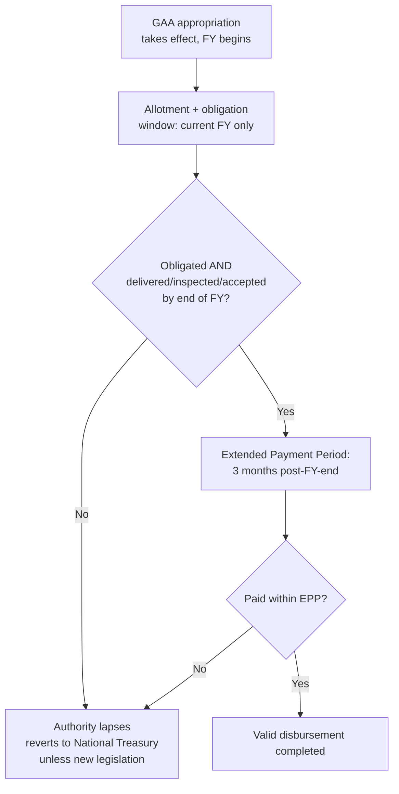

## The Philippine Shift to Annual Cash-Based Budgeting and the General Appropriations Act

### The Reform's Legal Origin and Core Design Change

The Philippine **cash-based budgeting system (CBS)** was adopted via **Executive Order No. 91, s. 2018**, signed by President Duterte, taking effect **1 January 2019**. This origin point is worth being precise about: the CBS did not begin as a standalone act of Congress but as an executive directive implementing what had already been embedded as policy in the **General Appropriations Act for FY 2019**'s general provisions — the executive order operationalized a design already reflected in that year's appropriations law, with subsequent legislative efforts (including various bills across the 19th and 20th Congresses, and provisions of the proposed "Budget Reform Act" / cash-budgeting-related bills) working to more permanently codify the framework in standing statute alongside the annually re-enacted GAA provisions that carry it forward each year.

The core design change CBS introduced, relative to the prior **obligation-based budgeting system**, is a fundamental redefinition of *when* the government's legal spending authority under a given year's appropriation expires. Recall from the budget-execution item that appropriated funds must clear three sequential stages — allotment, obligation, and disbursement — before becoming actual payments. The obligation-based system that CBS replaced measured a fiscal year's appropriation validity primarily by the **obligation** stage: once an agency had legally obligated funds (signed a contract, issued a purchase order) within the appropriation's validity window, the resulting liability could be paid down over an extended multi-year period even if actual cash disbursement occurred well after the original appropriation year had closed. CBS instead ties validity to the **full completion of goods and services delivery within the fiscal year itself**, compressing the timeline for all three execution stages into a much narrower window.

### The Specific Validity Rules Under EO 91

EO 91's operative provisions establish a precise sequence with three distinct temporal boundaries, each carrying a specific consequence if missed:

1. **Obligation and disbursement authority**: all authorized appropriations are available for **obligation and disbursement only until the end of each fiscal year (FY)** — a single-year window, replacing the prior system's more permissive multi-year (commonly two-year, current-year-plus-one) obligation validity for capital outlay and maintenance/operating expense items.
2. **Delivery and acceptance requirement**: obligations incurred within a fiscal year must correspond to goods or services that are **delivered or rendered, inspected, and accepted by the end of that same fiscal year** — meaning the reform does not merely compress the *legal commitment* window (obligation) but requires the underlying *physical performance* of the contract to complete within the same year, a materially tighter operational constraint than obligation-based budgeting imposed.
3. **Extended Payment Period (EPP)**: actual cash **payment** for validly incurred obligations may continue for a further **three months after the end of the appropriation's validity** — this is the sole grace period CBS provides, covering the administrative lag between accepted delivery and processed payment, not a window for new obligation or delivery activity.
4. **Reversion**: any **unreleased appropriations and unobligated allotments** at fiscal year-end, and any **unpaid obligations and undisbursed funds** at the end of the three-month EPP, **revert to the National Treasury** and become unavailable for further expenditure except through a new legislative enactment — a hard, automatic reversion rule with no administrative extension mechanism built into the base framework (in contrast to the pre-CBS system's greater tolerance for multi-year carryover).

A documented exception preserved outside this general rule: **financial subsidies to local government units** revert only after the end of the *succeeding* fiscal year, a longer window reflecting the practical realities of intergovernmental fund flow and LGU-level utilization timelines.

### Why This Reform Was Adopted: The Policy Rationale

The stated rationale, reflected in DBM's own reform communications, centers on converting appropriated authority into **actual, timely public service delivery** rather than allowing budget documents to show high "obligation rates" that mask slow real-world project completion — under the obligation-based system, an agency could report a high percentage of its appropriation "obligated" (contracts signed) while actual infrastructure or service delivery lagged years behind, since the legal accounting event (obligation) was decoupled from the physical completion event (delivery/acceptance). By tying validity to delivery and acceptance rather than merely to contract signature, CBS is designed to tighten controls on multi-year projects, ensuring only fully prepared and properly vetted programs are funded, and to reduce delays and abandoned infrastructure that had characterized the prior system. [Digest PH](https://www.digest.ph/blog/general-appropriations-act)

Complementary cash-management reforms accompanied the shift, including the DBM's move toward comprehensive, more front-loaded NCA releases and a shortening of Modified Disbursement System check validity — reforms that connect directly to the Treasury Single Account and disbursement architecture already covered, since compressing the obligation-to-disbursement window on the appropriations side only functions smoothly if the cash-release (NCA) side of the process is similarly accelerated; a compressed legal validity window paired with unreformed, slow NCA issuance would simply generate more reverted, unspent funds rather than faster actual delivery.

### The 2018–2019 Transition Friction: A Documented Implementation Case

The CBS rollout was not adopted smoothly on its first attempted implementation, and the friction is instructive as a concrete illustration of the reform's practical bite. President Duterte signed a joint congressional resolution in December 2018 extending the validity of the maintenance-and-other-operating-expense and capital-outlay components of the 2018 GAA through December 31, 2019, effectively granting a one-year reprieve from the tighter validity rules for that budget year's already-appropriated funds. This occurred against a backdrop in which the government initially delayed the FY2019 GAA's enactment and operated for a period under a re-enacted 2018 budget (recall the constitutional automatic re-enactment mechanism discussed under legislative authorization) — a House leadership figure indicated at the time that the cash-based system would not be pursued for that budget year given the extension. [Inference] This episode illustrates a structural tension inherent to any validity-tightening reform: the reform's benefit (forcing faster completion and reducing multi-year carryover) is realized only if the tighter deadlines are actually enforced without ad hoc legislative extension, and the very first budget cycle under the new system saw exactly this kind of extension granted — a reminder that a reform's legal design and its practical enforcement consistency are separate questions, paralleling the fiscal-rules literature's broader point (from the fiscal-rules-and-councils item) that rules are frequently circumvented rather than complied with when they become politically inconvenient. [inquirer](https://newsinfo.inquirer.net/?p=1069212)[inquirer](https://newsinfo.inquirer.net/?p=1069212)

### Subsequent Legislative Codification Efforts

Multiple bills in recent Congresses (including proposals sometimes referenced in public discussion as a prospective "Cash Budgeting Act") have sought to move the cash-budgeting framework from its current basis — annual GAA general provisions plus the underlying executive order — onto a permanent statutory footing, alongside broader public financial management reform proposals (sometimes bundled with or discussed alongside a proposed "Philippine Public Financial Accountability Act"). [Unverified] The precise current legislative status of standalone cash-budgeting codification legislation should be checked against the latest congressional record, since multiple related bills have been filed and refiled across successive Congresses without all of them reaching enactment, and the terminology used in public commentary (referring informally to a "Cash Budgeting Act") does not necessarily correspond to a single enacted law distinct from the GAA's own recurring general provisions.

**Key Points**

- The cash-based budgeting system, adopted via Executive Order No. 91 effective FY2019, redefines appropriation validity around full delivery, inspection, and acceptance of goods/services within the fiscal year, not merely contract obligation.
- The system replaced the prior obligation-based framework's more permissive multi-year validity for capital outlay and maintenance/operating expenses with a single-year obligation-and-delivery window plus a three-month Extended Payment Period for disbursement only.
- Unreleased appropriations, unobligated allotments, unpaid obligations, and undisbursed funds automatically revert to the National Treasury at the relevant deadline, absent new legislative enactment — with a specific longer exception for LGU financial subsidies.
- The reform's first implementation cycle (FY2018–2019) encountered a documented legislative extension of the prior system's validity rules, illustrating that a validity-tightening reform's practical effect depends on consistent enforcement rather than its legal design alone.
- Legislative efforts to codify cash budgeting on a permanent statutory basis, beyond its current footing in executive order and annual GAA general provisions, have been proposed across multiple Congresses without a single settled point of full statutory enactment as of the most recent available record.

**Related Topics**

- Budget execution: allotment release, obligation, and disbursement stages
- The Treasury Single Account and Notice of Cash Allocation timing
- Legislative authorization and the automatic re-enactment mechanism
- Government procurement law and multi-year project implementation controls
- Fiscal rule compliance and enforcement consistency over time
- Off-budget accounts and special purpose funds as adjacent PFM reform areas