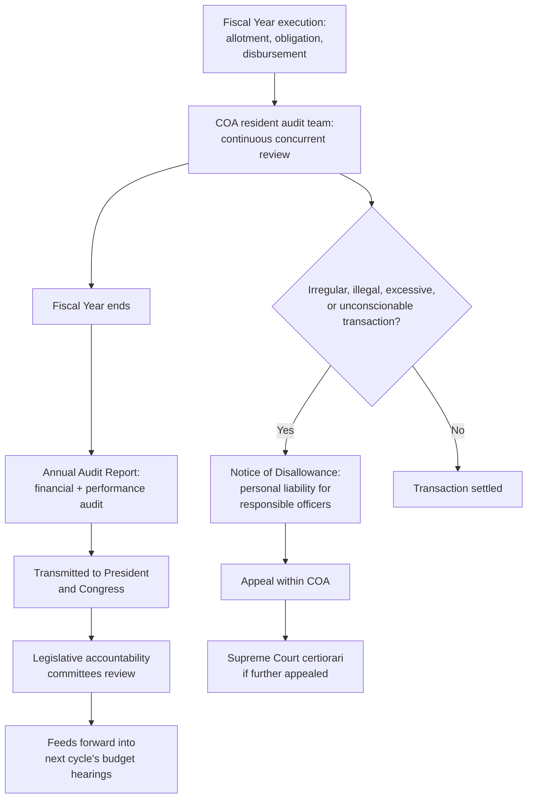

## Ex-Post Audit and the Commission on Audit's Role in Philippine Budget Accountability

### Position in the PFM Cycle: Closing the Loop

Recall the four-phase public financial management cycle established across this chapter: formulation (the DBCC's macro-fiscal program feeding the DBM's ceiling-driven agency allocation), legislative authorization (the NEP-to-GAA sequence through committee review, bicameral reconciliation, and presidential action), and execution (the allotment-obligation-disbursement chain, now further compressed under the cash-based budgeting system). This item addresses the fourth and final phase: **audit** — the ex-post verification that closes the cycle and, critically, feeds forward into the next cycle's formulation phase rather than terminating the process. The Commission on Audit (COA) was introduced structurally under the fiscal-institutions architecture as a "fourth branch" of fiscal accountability; this item traces its function specifically as it operates *within* the annual budget cycle, rather than restating its constitutional design.

### Why Audit Occurs After, Not During, Execution

A precise scope distinction worth restating: the COA does not intervene during the allotment, obligation, or disbursement stages to approve or block individual transactions in real time — that gatekeeping function belongs to the DBM (allotment release) and to each agency's own internal accounting and disbursement officers (obligation and disbursement, subject to internal control and internal-audit review distinct from COA's external function). The COA's constitutional role is **external, independent, and retrospective**: it examines transactions that have already occurred, against the appropriation, allotment, and legal authority that governed them at the time. This temporal positioning is deliberate rather than a design limitation — an external auditor embedded in real-time transaction approval would compromise the independence that makes its retrospective findings credible, since it would then share responsibility for the transactions it is meant to independently assess.

### The Annual Audit Cycle in Practice

COA's ex-post review of a given fiscal year's budget execution proceeds through a recognizable annual rhythm, distinct from but temporally following the execution-year activities already covered:

1. **Continuous/concurrent audit activity during the fiscal year** — COA auditors assigned to individual agencies (each major national government agency, GOCC, and LGU typically has a COA resident audit team) review transactions on an ongoing basis throughout the year, rather than waiting until year-end to begin work; this allows audit observations (though not final settlement) to surface while records and personnel are still readily available, improving the practical quality of the eventual audit relative to a purely after-the-fact review conducted long after the transaction trail has gone cold.
2. **Annual Audit Report (AAR) preparation** — following fiscal year-end, COA consolidates its findings into agency-specific Annual Audit Reports, covering both **financial audit** (accuracy and legality of the agency's financial statements and transactions) and, where conducted, **performance/value-for-money audit** (whether spending achieved its intended objectives economically and efficiently) — recall these as the two audit types distinguished under the fiscal-institutions treatment of COA's mandate.
3. **Transmittal to the President and Congress** — the AARs, along with COA's consolidated Annual Financial Report on the National Government, are submitted to the President and to Congress, directly linking back to the legislative accountability function noted under the legislative-authorization item: findings inform both retrospective accountability for the audited year and prospective scrutiny during the *following* year's budget hearings, when a flagged agency's new NEP request may receive closer legislative examination as a direct consequence of the prior year's audit findings.
4. **Notice of Disallowance issuance and the settlement process** — where COA identifies a specific transaction as illegal, irregular, unnecessary, excessive, extravagant, or unconscionable, it issues a **Notice of Disallowance (ND)**, which can attach personal financial liability to the responsible authorizing or certifying officers and, in some cases, to a payee who received an undue benefit. This is COA's most consequential accountability instrument precisely because its effect extends beyond the agency's institutional accounts to specific named individuals.

### The Notice of Disallowance Process in Detail

The ND mechanism carries a specific internal appeal structure, itself worth precision since it is frequently the subject of subsequent litigation:

- A **Notice of Suspension** may first be issued for a transaction with a deficiency capable of correction (missing documentation, for instance), giving the agency an opportunity to comply before an outright disallowance is issued — a distinction worth drawing, since not every audit finding immediately produces personal liability; the ND is reserved for transactions COA determines are substantively defective, not merely incompletely documented.
- Once an **ND** is issued, the responsible officers and/or payees may appeal within the COA's own internal hierarchy — first to the COA Adjudication and Settlement Board or equivalent internal review, and ultimately to the full three-member Commission.
- A party aggrieved by the Commission's final ruling may elevate the matter to the **Supreme Court on certiorari** under Rule 64 in relation to Rule 65 of the Rules of Court — not an ordinary appeal, but the specific extraordinary-remedy route the Constitution and procedural rules prescribe for challenging COA determinations, reflecting COA's quasi-judicial character.
- Philippine jurisprudence has developed a substantial body of case law on the good-faith defense to ND liability — public officers who acted in good faith, in the regular performance of official duties, and with the diligence of a good father of a family may, in specific circumstances the Supreme Court has articulated across a line of cases, be excused from personal refund liability even where the underlying disbursement is disallowed, distinguishing the *transaction's* illegality (which stands) from the *individual officer's* culpability (which depends on state of mind and diligence) — a nuance frequently significant in practice, since it means a disallowance does not automatically or uniformly translate into personal financial consequence for every officer who touched the transaction.

### The Feedback Loop Into Formulation: Why Audit Is Not a Terminal Stage

The structural point that distinguishes a well-functioning PFM cycle from a linear, one-directional process is that COA's findings are designed to **recur as an input into the subsequent formulation phase**, not merely to close the books on the audited year. This occurs through several concrete channels:

- **Legislative budget hearings** for the following year's NEP routinely reference prior-year COA findings when questioning an agency's request — an agency with a poor audit record (recurring disallowances, low fund-utilization rates flagged in performance audits) faces a materially different quality of legislative scrutiny than one with a clean audit history, even though the COA itself has no formal role in setting the following year's ceiling.
- **DBM's own agency performance assessment**, feeding into ceiling-setting judgments during formulation, can incorporate COA-documented execution weaknesses (recall from the budget-execution item that low obligation relative to allotment is a diagnostic signal of agency-level capacity constraints — precisely the kind of finding a COA performance audit is positioned to substantiate with documented evidence rather than the DBM's own execution-monitoring data alone).
- **Recurring or unresolved disallowances** across multiple fiscal years can escalate from an accountability matter into a broader institutional-capacity concern warranting more structural intervention (leadership change, capacity-building requirements attached to future allotment releases) rather than being treated as an isolated, one-time finding.

[Inference] The strength of this feedback loop is not, however, automatic or guaranteed by the mere existence of the audit function — it depends on whether the legislative committees, the DBM, and the agency's own leadership actually treat COA findings as materially informative for forward-looking decisions, rather than as a compliance exercise generating a report that is filed without changing subsequent budget allocation or ceiling-setting behavior. This mirrors the general point already established under the SAI architecture: audit strength is a necessary but not sufficient condition for accountability, since its practical value depends on the responsiveness of the downstream institutions that receive its findings.

### Distinguishing COA's Ex-Post Function from Ex-Ante and In-Year Controls

A final precision worth restating, since it is the organizing distinction across this entire budget-cycle chapter: the **DBM's allotment gatekeeping** (execution-phase, in-year, prospective — deciding whether to release authority to spend) and **COA's audit function** (post-execution, retrospective — assessing whether authority that was already used was used lawfully and appropriately) are complementary but categorically different accountability mechanisms operating at different points in the same cycle. A jurisdiction can have strong ex-ante controls and weak ex-post audit (transactions are well-authorized in advance but poorly reviewed afterward, allowing systemic issues to go undetected across cycles) or strong ex-post audit and weak ex-ante controls (irregularities are reliably caught and reported, but only after the money has already left the treasury, when the practical remedy is limited to disallowance and personal liability rather than prevention). [Inference] A well-functioning PFM architecture requires both functioning well simultaneously, since each addresses a different failure mode and neither can substitute for the other — ex-ante control prevents what it can anticipate, while ex-post audit catches what ex-ante control missed, but only after the fact.

**Key Points**

- COA's audit function is deliberately positioned as external, independent, and retrospective, distinct from the DBM's real-time allotment gatekeeping and from agencies' own internal disbursement controls, preserving the independence that gives its findings credibility.
- The annual audit cycle involves continuous concurrent review during the fiscal year, followed by Annual Audit Report preparation, transmittal to the President and Congress, and — where warranted — Notice of Disallowance issuance carrying potential personal financial liability for responsible officers.
- The Notice of Disallowance process includes an internal COA appeal hierarchy culminating in Supreme Court certiorari review, and Philippine jurisprudence recognizes a good-faith defense that can excuse individual officer liability even where the underlying transaction remains disallowed.
- COA findings are designed to feed forward into the next budget cycle's formulation phase via legislative hearing scrutiny and DBM performance assessment, not merely to close the books on the audited year — though this feedback loop's practical strength depends on downstream institutional responsiveness rather than being automatic.
- Ex-ante execution controls (DBM allotment gatekeeping) and ex-post audit (COA) are complementary, categorically distinct accountability mechanisms addressing different failure modes; robust PFM architecture requires both functioning together rather than treating either as a substitute for the other.

**Related Topics**

- Supreme audit institutions as a fourth branch of fiscal accountability
- Budget execution: allotment release, obligation, and disbursement stages
- Legislative authorization and the feedback of audit findings into budget hearings
- Government-owned and controlled corporations and COA's audit jurisdiction over them
- Good-faith defenses and personal liability standards in Philippine disallowance jurisprudence
- Internal control and internal audit functions as distinct from COA's external audit role