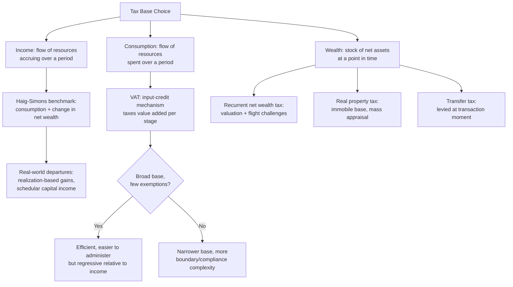

## Tax Base Design Across Income, Consumption, and Wealth Taxation

### The Central Design Choice: What to Tax

Every tax system must first answer a foundational base-selection question before any rate schedule or administrative mechanism can be designed: which economic quantity should bear the tax burden? The three canonical bases — **income**, **consumption**, and **wealth** — are not merely different labels for the same underlying tax capacity; they measure genuinely distinct economic flows and stocks, respond to different behavioral margins, and impose materially different burdens depending on a taxpayer's saving, spending, and asset-holding patterns over their lifetime. A precise definitional anchor: **income** is the flow of resources accruing to a person over a period (from labor, capital, or transfers); **consumption** is the flow of resources actually spent on goods and services over that same period; and **wealth** is the *stock* of accumulated net assets at a point in time. The relationship connecting them, in a simplified lifetime framework with no bequests, is that income equals consumption plus saving, and wealth is the accumulated stock of unconsumed past income (net of returns) — meaning the three bases are related but not interchangeable, since a base defined on the flow of income captures saving that a consumption base would not, while a wealth base captures the *stock* effect of accumulated saving that neither flow-based measure directly reaches.

### Income Taxation: The Comprehensive Income Base and Its Departures

The theoretical benchmark for income taxation is the **Haig-Simons comprehensive income definition**: income equals consumption plus the change in net wealth over the period, encompassing not only wages and realized capital gains but also unrealized accrued gains, imputed rent on owner-occupied housing, and in-kind employer benefits — a base broader than any real-world income tax system actually implements. Real-world departures from this benchmark are the primary source of income-tax base-design complexity:

- **Realization-based taxation of capital gains** — rather than taxing accrued (unrealized) gains as Haig-Simons would require, virtually all income tax systems tax gains only upon **realization** (sale or disposition of the asset), because taxing unrealized gains would require annual asset valuation for illiquid holdings and could force asset sales purely to fund a tax liability. This creates the well-documented **"lock-in effect"**: taxpayers holding appreciated assets have an incentive to defer sale indefinitely to defer tax liability, distorting portfolio-rebalancing decisions independent of underlying investment merit.
- **Schedular versus global income taxation** — a **global** system aggregates all income sources (labor, capital, business) into a single progressive rate schedule, while a **schedular** system applies separate rate schedules or separate final withholding taxes to different income categories (a common design for capital income specifically, discussed below). The Philippine National Internal Revenue Code, as amended by the **TRAIN Law (Republic Act No. 10963, 2017)**, operates a largely global system for compensation and business/professional income under the graduated rate schedule, while applying **schedular final withholding taxes** to specific passive income categories (interest, dividends, royalties) at fixed rates distinct from the graduated schedule — a hybrid design common across many jurisdictions rather than a pure global or pure schedular system in practice.
- **Dual income tax systems** — a distinct design, most associated with Nordic countries, that deliberately taxes labor income under a progressive schedule while taxing all capital income (interest, dividends, capital gains, business capital returns) at a single, typically lower, flat rate. The stated rationale is capital's higher cross-border mobility relative to labor: a high marginal rate on capital income in an open economy risks driving capital income (and potentially the underlying capital itself, or its formal tax residence) to lower-tax jurisdictions, an efficiency concern that does not apply with equal force to labor income, which is generally less mobile internationally than financial capital. The efficiency gain from a lower capital-income rate must be weighed against the equity cost of taxing capital income (which is more concentrated among higher-wealth households) more lightly than labor income.

### Consumption Taxation: VAT Architecture and the Base-Broadening Logic

A **consumption tax** falls on the flow of resources spent, not earned, and the dominant modern instrument is the **value-added tax (VAT)** — a multi-stage tax collected incrementally at each stage of production and distribution, with each registered business remitting tax only on the **value it adds** (output tax collected on sales, minus input tax credit for VAT already paid on purchased inputs), such that the cumulative tax burden falls on the final consumer regardless of how many production stages the good passed through. This **input-credit mechanism** is the specific structural feature distinguishing a VAT from a cruder cascading sales tax (which taxes the full price at each stage without crediting prior tax paid, compounding the effective rate as a good passes through more production stages) — VAT's self-enforcing credit-invoice structure (each business has an incentive to demand a proper VAT invoice from its suppliers to claim its own input credit) is also frequently cited as an administrative advantage over retail sales taxes, since it generates a documentary trail across the supply chain rather than relying on compliance only at the single final retail-sale point.

The Philippines operates a VAT under the National Internal Revenue Code as amended, with a standard rate of **12 percent**, applied on a destination basis (exports are zero-rated, meaning no VAT is charged on export sales while input VAT credits remain claimable, consistent with the international norm that VAT should not be embedded in the price of goods crossing into another jurisdiction's tax base) and with specific **exemptions and zero-rating** for defined categories (certain agricultural products, specific socially sensitive goods and services, and — reflecting the TRAIN Law's broader base-widening exercise — a restructured and narrowed list of VAT exemptions relative to the pre-TRAIN regime, which had accumulated a large number of special exemptions over time).

The central design tension in consumption-tax-base architecture is precisely this: **broader bases with fewer exemptions are more efficient and easier to administer** (each exemption or zero-rating carve-out creates a boundary that must be defined, monitored, and litigated, and creates opportunities for base erosion as taxpayers reclassify transactions to fall within an exempt category), **but a broad-based VAT is regressive relative to income** — because lower-income households spend a larger share of their income on consumption (saving little or none), a uniform-rate VAT on a broad consumption base extracts a proportionally larger share of a poor household's income than a rich household's, the standard equity critique of consumption taxation relative to progressive income taxation. TRAIN's approach to this tension is instructive as a worked example of a broader design pattern: it combined **VAT base broadening** (removing numerous prior exemptions) with **targeted compensating transfers** (the Unconditional Cash Transfer program directed at lower-income households) rather than preserving the original exemptions themselves — a design choice reflecting a growing consensus in public finance that **targeted cash transfers are a more efficient equity instrument than tax-base carve-outs**, since a transfer can be precisely means-tested to the intended beneficiary population, while a VAT exemption on a broad product category (say, all food) delivers its benefit to every consumer of that product regardless of income, including higher-income households who consume the same exempted goods.

### Wealth Taxation: Stock-Based Bases and Their Distinct Administrative Challenges

A **wealth tax** falls on the net stock of assets (total assets minus liabilities) held at a point in time, distinguishing it from both income tax (which falls on flows accruing during a period) and from taxes on specific asset *transactions* (transfer taxes, discussed below) which are levied only at the moment of a transaction rather than annually on the holding itself. Wealth taxation takes several structurally distinct forms worth separating precisely:

- **Recurrent net wealth taxes** — an annual levy on a taxpayer's total net worth above a threshold, historically implemented in several European countries (France's former *impôt de solidarité sur la fortune*, before its 2018 replacement with a narrower real-estate-only wealth tax, is a frequently cited case study in the literature on this instrument's practical difficulties) but abandoned by many OECD countries in recent decades, primarily due to **valuation difficulty for illiquid assets** (private business equity, art, and other non-traded holdings lack an observable market price, forcing costly and contestable administrative valuation) and **capital flight/avoidance responses**, which empirically proved large enough in several documented cases to substantially erode the revenue such taxes were projected to raise relative to their statutory base.
- **Real property taxes** — a recurrent tax on real estate specifically, which sidesteps much of the general wealth tax's valuation problem because real property is immobile (unlike financial capital, it cannot relocate to avoid the tax) and can be valued through established mass-appraisal methodologies, even if imperfectly. In the Philippines, the **real property tax (RPT)** is levied by local government units under the Local Government Code, based on assessed value derived from a fair market value schedule, and constitutes one of the largest own-source revenue instruments available to LGUs — a base-design point connecting directly to the fiscal-decentralization architecture of subnational finance, since RPT's administrative reliance on locally-maintained property assessment rolls makes assessment quality and update frequency a recurring subnational PFM capacity issue.
- **Transfer taxes** (estate/inheritance and gift taxes) — levied not annually on a wealth stock but at the specific moment wealth transfers between generations or individuals, structurally a hybrid between an income-flow tax (capturing a windfall accession to wealth) and a wealth-stock tax (measured against the value of the transferred estate). The Philippine estate tax, as restructured under TRAIN, moved from a progressive rate schedule to a **flat 6 percent rate** on the net estate value in excess of a specified standard deduction — a simplification exemplifying the broader consumption/income-tax base-broadening-with-rate-flattening pattern TRAIN applied across several tax categories simultaneously.

### Cross-Base Interactions and the Question of Optimal Base Mix

No real-world tax system relies on a single base exclusively; the Philippine system, like most, layers income taxation (BIR-administered, national), consumption taxation (VAT and excise taxes, also BIR/Bureau of Customs-administered, national), and property-based wealth taxation (RPT, LGU-administered, local) simultaneously — a diversified base-mix strategy that spreads reliance across bases with different behavioral-response elasticities, different administrative capacity requirements, and different revenue-stability properties across the business cycle (consumption tax revenue tends to be less cyclically volatile than corporate income tax revenue, for instance, since consumption smooths more than corporate profits do across a downturn).

The strongest empirical/normative case for **shifting base-mix weight toward consumption and away from income**, associated with the optimal-taxation literature building on the **Atkinson-Stiglitz theorem** and subsequent public-finance work: taxing capital income (a component of comprehensive income but not of consumption) effectively taxes future consumption more heavily than present consumption, distorting the saving decision in a way a consumption-based tax does not, and in an open economy with mobile capital, the efficiency cost of taxing capital income can be substantial since capital can relocate to avoid taxation in a way immobile bases (labor, consumption, real property) generally cannot.

The strongest counter-case, emphasizing distributional rather than purely efficiency considerations: consumption taxation's regressivity (documented above) means a pure base-mix shift toward consumption, absent robust compensating transfer mechanisms, redistributes the tax burden away from capital-income-earning higher-wealth households and toward lower-income households whose income is predominantly spent rather than saved — [Inference] the practical resolution many jurisdictions (the Philippines' TRAIN reform among them) have pursued is not choosing one base exclusively but pairing consumption-base broadening with explicit compensating transfers and maintaining progressive income taxation on labor income, treating base selection as a portfolio-design problem balancing efficiency, equity, and administrative feasibility simultaneously rather than a single dominant-base choice.

**Key Points**

- Income, consumption, and wealth are related but distinct tax bases — flows accruing, flows spent, and stocks held, respectively — each responding to different behavioral margins and each departing from theoretical benchmarks (Haig-Simons comprehensive income) for practical administrative reasons.
- VAT's input-credit mechanism is the structural feature distinguishing it from cascading sales taxes, and the central consumption-tax design tension is between base-broadening (efficiency, administrability) and regressivity (equity), a tension the Philippine TRAIN Law addressed through base broadening paired with targeted cash transfers rather than exemption preservation.
- Wealth taxation splits into recurrent net wealth taxes (largely abandoned in OECD practice due to valuation difficulty and capital flight), real property taxes (administratively favored due to the base's immobility), and transfer taxes levied at the point of intergenerational wealth transfer.
- Dual income tax systems deliberately tax capital income at a lower flat rate than progressively-taxed labor income, reflecting capital's greater cross-border mobility relative to labor as an efficiency rationale, at some cost to vertical equity given capital income's concentration among wealthier households.
- No real-world system relies on a single base; the Philippine system layers national income and consumption taxation with local property taxation, reflecting a diversified base-mix approach that balances efficiency, equity, administrative capacity, and revenue-cyclicality considerations across bases simultaneously.

**Related Topics**

- The TRAIN Law and comprehensive tax reform package design
- VAT exemptions, zero-rating, and destination-based taxation of exports
- Local government real property tax administration and assessment capacity
- Optimal taxation theory and the Atkinson-Stiglitz theorem
- Capital mobility and international tax competition
- Targeted cash transfers as a complement to tax base broadening