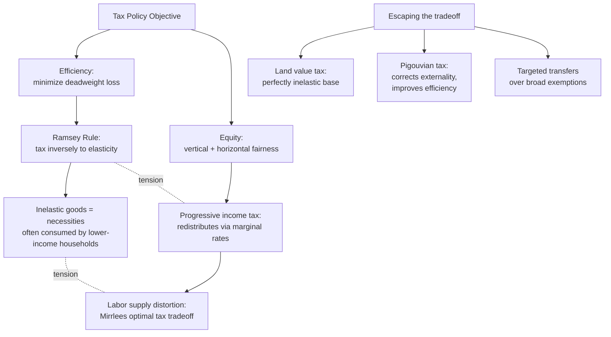

## Efficiency Versus Equity Tradeoffs in Tax Policy Design

### Framing the Tradeoff Precisely

The efficiency-equity tradeoff is the organizing tension of normative tax design: a tax system that minimizes distortion to economic decisions (the efficiency objective) frequently conflicts with a tax system that distributes the tax burden according to some fairness criterion across households of different means (the equity objective), and very few tax instruments achieve both objectives simultaneously without compromise. Before examining specific instruments, two terms require precise definition, since they are the analytical vocabulary the rest of this item depends on:

- **Deadweight loss (excess burden)** is the efficiency cost of taxation beyond the revenue actually transferred to government — it arises because a tax changes relative prices, inducing taxpayers to substitute away from the taxed activity toward untaxed alternatives, and this substitution response destroys value (the forgone activity would have occurred absent the tax, generating surplus for both parties) without generating offsetting government revenue. Deadweight loss rises, to a first approximation, with the **square of the tax rate** — meaning doubling a tax rate roughly quadruples the associated deadweight loss, a nonlinearity with a direct practical implication taken up below.
- **Vertical equity** concerns how the tax burden is distributed across taxpayers with different incomes or ability to pay (should higher-income households pay a higher *share* of income in tax — progressivity — or the same share — proportionality/flat taxation, or even a declining share — regressivity). **Horizontal equity** concerns whether taxpayers with the same ability to pay bear the same tax burden regardless of the source or form of their income — a norm frequently violated in practice by base-narrowing preferences (a tax break available to income from one source but not an economically identical amount from another source violates horizontal equity even if it does not affect the vertical distribution of the aggregate burden).

### The Excess Burden Triangle and the Elasticity Channel

The standard graphical/analytical device for excess burden — the "Harberger triangle," following Arnold Harberger's foundational public-finance work — demonstrates that deadweight loss depends critically on the **elasticity of the taxed behavior**: a tax on a good or activity with high elasticity of demand or supply (meaning quantity responds strongly to price) generates substantially more distortion per dollar of revenue raised than an equivalent tax on an inelastic base, because the elastic base's quantity response is precisely the behavioral substitution that constitutes deadweight loss. This yields the classic efficiency-oriented prescription associated with the **Ramsey rule** (Frank Ramsey, 1927, later developed into modern optimal-commodity-tax theory): to minimize aggregate deadweight loss for a given revenue requirement, tax rates should be **inversely related to elasticity** — taxing inelastic goods (necessities, addictive goods, goods with few substitutes) more heavily than elastic goods (luxuries with many substitutes), the opposite of what a pure equity-driven design (taxing luxuries more heavily, since they are consumed disproportionately by higher-income households) would recommend. This is the sharpest and most direct statement of the efficiency-equity tension available in public finance theory: **the efficiency-minimizing tax structure and the equity-maximizing tax structure point in opposite directions on the elasticity dimension**, since goods that are inelastic (and therefore efficient to tax heavily) are frequently necessities disproportionately consumed by lower-income households (food, basic utilities), while elastic goods more amenable to substitution (and therefore costly to tax heavily on efficiency grounds) are more often discretionary/luxury goods consumed disproportionately by higher-income households.

### Labor Supply Distortion and the Progressivity Channel

Progressive income taxation — the most direct vertical-equity instrument in most tax systems — imposes its own specific efficiency cost through the **labor supply margin**: a higher marginal tax rate on additional earnings reduces the after-tax return to working an additional hour, potentially reducing labor supply (the intensive margin: existing workers reducing hours) or labor force participation (the extensive margin: potential workers declining to enter or remain in formal employment) below what a lower or flat rate would produce. The empirical magnitude of this response — captured in the labor-economics and public-finance literature by the **elasticity of taxable income (ETI)**, a broader and more empirically tractable measure than the pure labor-supply elasticity since it captures not only hours-worked responses but also tax-avoidance, income-shifting, and effort-intensity responses to marginal rate changes — is a central empirical input to the modern optimal-progressivity literature, most closely associated with the **Mirrlees model of optimal income taxation** (James Mirrlees, 1971), which formalizes the tradeoff precisely: a social planner wanting to redistribute toward lower-income households must do so through a tax-and-transfer schedule that necessarily creates some disincentive to work at the margin for at least some segment of the income distribution, and the **optimal degree of progressivity balances the social welfare gain from redistribution against the efficiency cost of the resulting labor-supply distortion**, with the balance point depending critically on the empirically estimated ETI — a higher estimated ETI implies a *lower* optimal top marginal rate, since it indicates taxpayers respond more strongly (in ways that erode the tax base) to a given rate increase.

### The Corporate and Capital Income Case: Mobility as an Amplifying Factor

Recall from tax-base design that capital income faces a distinct efficiency consideration relative to labor income: capital's higher cross-border mobility means a tax on capital income (or on corporate profits, which are ultimately capital returns) can be substantially eroded by capital relocating its formal tax residence or investment location to lower-tax jurisdictions, a **tax competition** dynamic that has driven a well-documented multi-decade decline in statutory corporate income tax rates across OECD economies. This connects the efficiency-equity tradeoff to an international dimension not present in the purely domestic labor-taxation case: even a domestically equity-motivated high corporate tax rate can fail to achieve its distributional objective if capital simply relocates, meaning the *incidence* of a nominally capital-borne tax may shift substantially onto immobile factors (domestic labor, through reduced investment and lower wages) rather than falling on capital owners as the statutory design intended — the empirical magnitude of this **corporate tax incidence shifting onto labor** is an actively contested and elasticity-dependent question in the public-finance literature, with estimates varying considerably depending on the openness of the economy and capital mobility assumptions employed.

### Reconciling the Tradeoff: Instruments That Partially Escape It

Not every tax-design choice sits squarely on the efficiency-equity frontier with no possibility of improvement on both dimensions simultaneously — several instruments are specifically valued in public-finance theory and practice because they achieve equity gains at unusually low efficiency cost, or vice versa:

- **Land value taxation** — because the supply of land is fixed (perfectly inelastic), a tax on unimproved land value generates, in the theoretical limit, **zero deadweight loss**, since there is no behavioral margin (land cannot be produced or relocated in response to the tax) along which taxpayers can substitute away from the taxed base. This is the sharpest illustration of the Ramsey-rule logic taken to its limit: the most efficient possible tax targets the least elastic possible base, and land is the closest real-world approximation to a perfectly inelastic base available to policymakers — though administratively separating land value from improvement value (buildings, structures) is a genuine practical complication limiting pure land-value taxation's real-world adoption relative to its theoretical appeal.
- **Pigouvian (corrective) taxes** — a tax on an activity generating a negative externality (pollution, tobacco and alcohol consumption, sugar-sweetened beverages) can, under the right conditions, **improve** rather than merely cost efficiency, since it corrects a pre-existing market failure (the externality) rather than distorting an otherwise efficient market outcome — recall from the Ramsey-rule discussion above that inelastic goods are efficient to tax on pure revenue-raising grounds, and several Pigouvian-tax targets (tobacco, given addiction-driven inelastic demand) happen to combine low elasticity with a genuine corrective rationale, though this combination raises its own equity concern (addictive-good excise taxes are frequently regressive in incidence, since lower-income households may consume such goods at a similar or higher rate relative to income) that must be weighed against the efficiency and public-health corrective benefit.
- **Targeted transfers over broad exemptions** — recall from tax-base design that TRAIN's approach to VAT base-broadening paired exemption removal with targeted cash transfers rather than preserving broad-based carve-outs; this reflects a general public-finance principle that **using the tax base itself to pursue equity objectives (narrow exemptions, reduced rates on specific goods) is frequently a less efficient equity instrument than broadening the tax base for efficiency and using the resulting revenue to fund a precisely means-tested transfer** — the exemption approach delivers its benefit to every consumer of the exempted good regardless of income, while a targeted transfer can be calibrated to reach only the intended beneficiary population, achieving a given equity objective at lower aggregate efficiency cost.

### The Philippine TRAIN Law as a Worked Case of Tradeoff Management

Recall from tax-base design that TRAIN (Republic Act No. 10963, 2017) broadened the VAT base by removing numerous prior exemptions and restructured the estate tax into a flat rate — both efficiency-oriented, base-broadening moves consistent with the Ramsey-rule logic of preferring broad, low-distortion bases. Simultaneously, TRAIN restructured the personal income tax schedule to **raise the tax-exempt threshold substantially** (removing lower-income earners from income tax liability entirely) while funding the resulting revenue gap partly through the consumption-tax base broadening and partly through new or increased **excise taxes** on petroleum products, automobiles, tobacco, and sugar-sweetened beverages — several of which combine a genuine Pigouvian corrective rationale (tobacco, sugar-sweetened beverages) with revenue-raising motivation. The **Unconditional Cash Transfer program** was designed specifically to offset the regressive incidence of the petroleum excise increase and VAT base broadening on lower-income households who do not benefit from the income-tax threshold increase (since they were already below the prior taxable threshold), functioning as the targeted-transfer compensating mechanism described above rather than reintroducing narrower base exemptions. [Inference] TRAIN is a useful illustrative case precisely because it did not resolve the efficiency-equity tradeoff so much as **explicitly decompose it into separate instruments** — using the income tax schedule and targeted transfers for equity objectives, while using the VAT and excise base for revenue efficiency and (for the excise components) corrective purposes — rather than attempting to embed equity considerations directly into the consumption-tax base structure itself through exemptions.

### Empirical Debate: How Large Is the Efficiency Cost of Progressivity in Practice?

The strongest case for a meaningful, policy-relevant efficiency cost of high progressivity draws on ETI estimates from natural-experiment studies of major tax-reform episodes (frequently U.S. and European top-rate changes), which in several studies find economically significant taxable-income responses concentrated among high earners — self-employed and business-owner taxpayers in particular, who have more scope for income-shifting and timing responses than wage employees, suggesting the efficiency cost of top-rate increases may be substantially higher for these taxpayer categories than for typical wage earners with less discretion over the form and timing of their reported income.

The strongest counter-case, associated with Piketty, Saez, and Stantcheva's work on the composition of the ETI: a substantial portion of the observed taxable-income response to top marginal rate changes reflects **tax avoidance and income-shifting (a change in the *form* or *timing* of income reporting) rather than genuine reductions in real economic activity (labor supply or entrepreneurial effort)** — if this is the dominant channel, then a large observed ETI overstates the true efficiency cost of progressivity, since avoidance-driven responses could in principle be addressed by base-broadening and anti-avoidance enforcement (closing the specific avoidance channels) rather than accepted as an immutable behavioral constraint requiring a lower optimal top rate. [Inference] This decomposition question — how much of a measured ETI reflects real versus avoidance responses — is not fully resolved empirically and varies by country and tax-administration capacity, meaning the appropriate degree of progressivity implied by the Mirrlees framework is itself sensitive to a country's specific enforcement and base-design quality, not a universal constant transferable across tax administrations of differing capacity.

**Key Points**

- Deadweight loss rises roughly with the square of the tax rate and depends critically on the elasticity of the taxed behavior; the Ramsey rule's efficiency-minimizing prescription (tax inelastic goods more heavily) frequently points in the opposite direction from equity-driven design, since inelastic goods are often necessities consumed disproportionately by lower-income households.
- Progressive income taxation's efficiency cost operates through the labor-supply and broader elasticity-of-taxable-income margin, formalized in the Mirrlees optimal-taxation framework as a tradeoff between redistributive social welfare gains and labor-supply/reporting distortion.
- Capital and corporate income taxation face an additional efficiency consideration from cross-border mobility, which can shift a nominally capital-borne tax's actual economic incidence onto immobile domestic labor, potentially undermining the equity objective the tax was designed to achieve.
- Land value taxation and Pigouvian corrective taxes are notable exceptions that can achieve efficiency gains (near-zero deadweight loss for land; externality correction for Pigouvian taxes) without the standard tradeoff, though Pigouvian taxes on inelastic addictive goods can still raise separate regressivity concerns.
- The Philippine TRAIN Law illustrates tradeoff management through instrument decomposition: broadening the VAT and estate-tax base for efficiency, raising the income-tax exemption threshold and deploying targeted cash transfers for equity, rather than embedding equity objectives directly into the consumption-tax base through exemptions.

**Related Topics**

- Tax base design across income, consumption, and wealth taxation
- The Ramsey rule and optimal commodity taxation
- The Mirrlees model of optimal income taxation
- Corporate tax incidence and international tax competition
- Pigouvian taxation and externality correction
- The TRAIN Law's excise tax restructuring and Unconditional Cash Transfer program