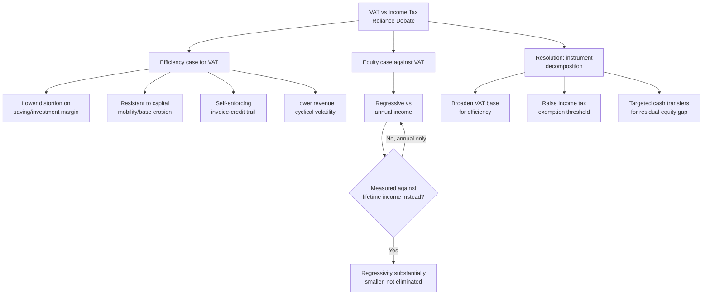

## VAT Design and the Debate Over VAT Versus Income Tax Reliance

### Recalling the VAT Mechanism and Its Structural Alternatives

Recall from tax-base design that a value-added tax collects revenue incrementally at each production stage through an **input-credit mechanism**: registered businesses remit output tax on sales minus a credit for input tax already paid on purchases, so the cumulative burden falls on the final consumer while the revenue is collected across the supply chain rather than solely at retail. Two structurally distinct methods exist for implementing this input-credit logic, worth distinguishing precisely since they carry different administrative properties:

- **Invoice-credit method** — the dominant global design (used in the Philippines and the large majority of VAT jurisdictions worldwide), where the credit a business claims is calculated directly from the VAT explicitly stated on purchase invoices received from suppliers. This method's principal administrative virtue is the **self-enforcing documentary trail** already noted under tax-base design: because a business's own tax liability is reduced only by invoices it can produce, each business has a private incentive to demand proper VAT invoicing from its suppliers, creating a cross-checkable paper trail that tax administrations can use to detect discrepancies between what one business claims as input credit and what its supplier reported as output tax.
- **Subtraction method** — a less common alternative, calculating value added as the simple arithmetic difference between a business's total sales and total purchases over a period, without relying on invoice-level detail. This method sacrifices the invoice-credit method's self-enforcing documentary trail in exchange for lower per-transaction compliance burden, and is consequently rarer in practice among jurisdictions with the administrative capacity to support invoice-level reporting.

### The VAT Refund Problem: A Recurring Administrative Fault Line

A structural feature of the invoice-credit VAT mechanism creates one of the most persistent administrative difficulties in VAT systems globally: a business whose **input tax credits exceed its output tax liability** in a given period — most commonly exporters, since exports are typically zero-rated (no output VAT charged) while the exporter still accumulates input VAT credits on domestic purchases used to produce the exported goods — is entitled to a **cash refund** of the excess credit rather than merely a carry-forward offset against future liability. This refund obligation creates an acute fiscal and administrative tension: from the government's cash-management perspective (recall the Treasury Single Account and Bureau of Treasury cash-forecasting architecture), VAT refund liabilities are a real, sometimes large and lumpy, cash outflow that must be forecast and funded; from the tax administration's fraud-control perspective, refund claims are a well-documented fraud vector internationally (fictitious export documentation or overstated input credits designed to extract a cash refund the claimant is not actually entitled to), creating pressure toward more rigorous — and therefore slower — refund verification processes. The Philippines has had a **recurring, well-documented history of VAT refund processing delays** for exporters, a friction point the Bureau of Internal Revenue has targeted through successive administrative reforms (including efforts to formalize processing timelines and, more recently, moving toward risk-based verification approaches distinguishing low-risk from high-risk claimants) precisely because delayed refunds function as a **de facto increase in exporters' working-capital cost** — a business owed a legitimate refund but not yet paid is effectively extending an interest-free loan to the government, which is economically equivalent to an unlegislated tax on export activity even though the statutory zero-rating is designed to ensure exports bear no domestic VAT burden at all.

### The Central Policy Debate: Should Revenue Systems Rely More on VAT or More on Income Tax?

This debate is a direct application of the efficiency-equity tradeoff already established, specialized to the choice between the two largest revenue instruments in most modern tax systems.

**The efficiency case for greater VAT reliance** rests on several distinguishable arguments:

- **Lower deadweight loss per dollar of revenue for saving/investment decisions** — recall from tax-base design that a consumption tax does not fall on the return to saving the way a comprehensive income tax does (which taxes capital income, the return generated by deferring consumption), meaning a revenue system weighted more toward consumption taxation imposes less distortion on the saving-versus-current-consumption margin than an equivalent-revenue system weighted more toward income taxation.
- **Greater resistance to base erosion from capital mobility** — recall from the efficiency-equity item that capital income taxation faces an international tax-competition dynamic absent from consumption taxation of domestic final sales, since a VAT is levied on consumption occurring within the taxing jurisdiction regardless of where the underlying capital or production occurred, making it structurally more robust to the base-erosion pressures that have driven statutory corporate income tax rate declines across OECD economies.
- **Administrative robustness via the self-enforcing invoice-credit mechanism** — as detailed above, the VAT's documentary cross-checking property is frequently cited as generating higher compliance rates relative to comparable-rate income or sales taxes in jurisdictions with weaker third-party information reporting for income (a consideration of particular relevance to tax administrations, including the Philippines', where informal-sector income and self-employment/professional income have historically presented greater verification challenges than a VAT's transaction-level documentary trail).
- **Revenue stability across the business cycle** — consumption tends to fluctuate less sharply than corporate profits or high-income capital gains realizations across a business cycle, meaning VAT revenue is generally less volatile than corporate income tax or top-bracket personal income tax revenue during a downturn, a fiscal-planning advantage connecting to the medium-term fiscal framework's need for reasonably predictable revenue projections.

**The equity case against greater VAT reliance** rests on the regressivity finding already established under tax-base design: because lower-income households consume a larger share of income (saving little or none) while higher-income households save a meaningful share, a uniform-rate VAT extracts a proportionally larger share of income from poorer households than richer ones when measured against **annual income** — though this regressivity finding is itself contested on a specific methodological point addressed below.

### The Lifetime-Income Reframing of VAT Regressivity

A significant methodological counter-argument in the public-finance literature holds that VAT regressivity is substantially **overstated when measured against annual income rather than lifetime income (or, equivalently, lifetime consumption)**. The argument proceeds as follows: a household's *annual* income can differ sharply from its *lifetime* or *permanent* income due to temporary fluctuations (a retiree drawing down savings has low current income but may have substantial lifetime resources; a young professional early in a high-earning career may have modest current income relative to lifetime earnings) — and because consumption tends to track *permanent* income more closely than current-year income (households smooth consumption relative to income volatility, a standard result from the permanent-income/life-cycle hypothesis in consumption theory), a tax on consumption is, from a lifetime perspective, closer to a proportional tax on lifetime resources than the sharply regressive annual-income-based measure suggests. [Inference] This reframing does not eliminate the equity concern entirely — it shifts the terms of the debate from "VAT is regressive, full stop" to "VAT's regressivity is substantially smaller when measured correctly against lifetime rather than annual income, though a residual equity concern persists for genuinely low-lifetime-income households who cannot smooth consumption via saving/borrowing the way the permanent-income framework assumes" — a nuance frequently omitted in popular-level discussion of VAT's distributional effects, but one that meaningfully changes the magnitude, if not the direction, of the standard regressivity critique.

### Reconciling the Debate: The Instrument-Decomposition Approach

Recall from the efficiency-equity item that the Philippine TRAIN reform's approach to this exact tension was **instrument decomposition** rather than choosing a single dominant base: broadening the VAT for efficiency and revenue-robustness reasons, while addressing the resulting regressivity concern through a combination of (a) a substantially raised personal income tax exemption threshold, removing lower-income earners from income tax liability entirely, and (b) the Unconditional Cash Transfer program, a targeted transfer calibrated to the specific households most exposed to the VAT base-broadening's regressive incidence. This decomposition strategy reflects a broader consensus position in modern public finance — associated with work following the **Mirrlees Review** (the comprehensive UK tax-system review led by Nobel laureate James Mirrlees, published 2011) — that the *tax system as a whole*, rather than any single instrument in isolation, should be evaluated against combined efficiency and equity criteria: a broad-based, efficient VAT paired with a well-targeted transfer system can achieve a given equity objective at lower aggregate efficiency cost than a narrower, exemption-riddled VAT attempting to embed equity considerations directly into the consumption-tax base structure itself.

### Comparative Reliance Patterns and the Philippine Position

Cross-country data on tax-mix composition (tracked in OECD Revenue Statistics and, for developing-economy comparison, IMF Government Finance Statistics) generally shows that **higher-income OECD economies tend to rely more heavily on personal income and social-security contributions relative to VAT** as a share of total revenue than middle-income developing economies, which frequently rely more heavily on VAT and other consumption/trade taxes — a pattern generally attributed to the greater administrative capacity required for effective personal income tax collection (particularly the third-party information reporting and audit capacity needed to tax self-employment and capital income effectively) relative to the comparatively simpler invoice-based VAT documentary mechanism. [Inference] The Philippines' revenue structure, with the BIR's continuing efforts to expand its ability to verify self-employed and professional income (an ongoing administrative-capacity challenge relative to VAT's stronger built-in documentary self-enforcement) alongside its relatively broad-based VAT following TRAIN, fits this general developing-economy pattern of comparatively greater practical reliance on consumption-tax administrability relative to income-tax verification capacity, though the specific current-year revenue-mix shares should be checked against the latest DOF/BIR revenue collection reports rather than assumed to be static, since successive reforms (TRAIN's own restructuring included) shift the mix over time.

**Key Points**

- The invoice-credit VAT method's self-enforcing documentary trail is its principal administrative advantage over the subtraction method and over cascading sales taxes, though it creates a structural refund obligation for exporters and other net-input-credit businesses that has been a recurring administrative friction point in Philippine VAT administration.
- The efficiency case for greater VAT reliance rests on lower distortion to saving/investment decisions, greater resistance to capital-mobility-driven base erosion, stronger documentary self-enforcement, and lower revenue cyclical volatility relative to income taxation.
- VAT's regressivity, the primary equity objection, is measured relative to annual income in its starkest form but is substantially — though not entirely — mitigated when reframed against lifetime income, since consumption tracks permanent income more closely than current-year income under standard life-cycle consumption theory.
- The Philippine TRAIN reform resolved this tension through instrument decomposition — broadening the VAT base for efficiency while raising the income-tax exemption threshold and deploying targeted cash transfers for equity — rather than embedding equity considerations directly into the VAT base through exemptions.
- Cross-country patterns generally show higher-income economies relying more on personal income taxation relative to VAT than developing economies, a pattern attributed to the differential administrative capacity required to verify income tax bases (particularly self-employment and capital income) relative to VAT's comparatively self-enforcing documentary structure.

**Related Topics**

- Tax base design across income, consumption, and wealth taxation
- Efficiency versus equity tradeoffs in tax policy design
- VAT refund administration and exporter working-capital effects
- The Mirrlees Review and comprehensive tax system evaluation
- Life-cycle and permanent-income theories of consumption smoothing
- Tax administration capacity and third-party information reporting for income verification