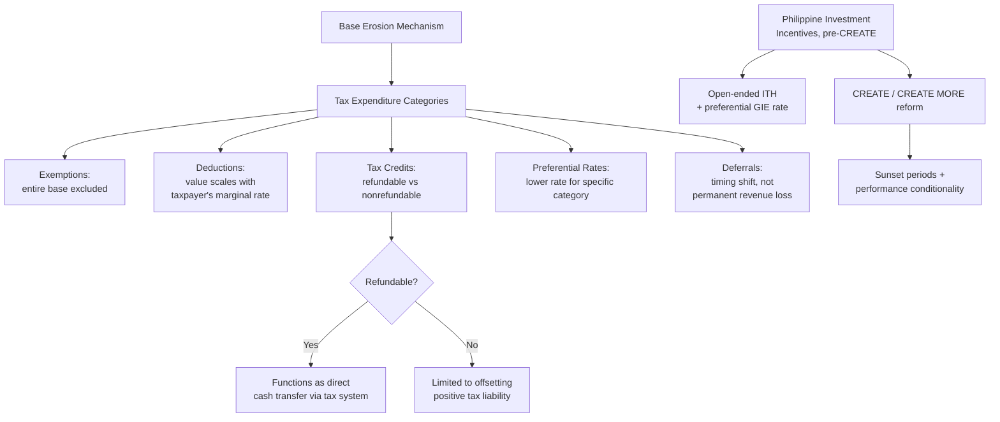

## Tax Expenditures, Exemptions, and the Erosion of the Tax Base

### Defining the Tax Expenditure Concept

A **tax expenditure** is a provision in the tax code — an exemption, deduction, credit, deferral, or preferential rate — that departs from the "normal" or benchmark tax structure to deliver a targeted benefit to a specific taxpayer group or activity, functioning economically as equivalent to a direct government spending program even though it appears nowhere in the appropriations side of the budget. The concept originates with economist Stanley Surrey's work at the U.S. Treasury in the late 1960s, built on a specific analytical insight: **a tax exemption worth ₱10,000 to a taxpayer and a direct cash grant of ₱10,000 to that same taxpayer are fiscally and economically equivalent** in their effect on government revenue and the taxpayer's after-tax resources — the only difference is which side of the budget records the cost, and tax expenditures, by construction, appear as *foregone revenue* rather than as a *budget line item*, meaning they escape the annual appropriations scrutiny, ceiling discipline, and legislative visibility that a comparable direct-spending program would face under the formulation and authorization architecture already established in this curriculum.

This equivalence is precisely why tax expenditures are frequently described as a form of **"spending through the tax code"** — a framing with direct implications for the fiscal-institutional architecture covered earlier: recall that the DBCC sets an aggregate expenditure ceiling and the DBM allocates it via the Budget Call, with legislative authorization proceeding through the appropriations process; a tax expenditure achieves a functionally identical fiscal outcome (transferring resources to a targeted beneficiary) **entirely outside this ceiling-and-appropriation architecture**, since it reduces revenue collected rather than authorizing an expenditure from revenue already collected, meaning it does not compete against other priorities for a place within the DBCC's fiscal-program ceiling the way a direct subsidy program would.

### The Benchmark Problem: What Counts as an "Expenditure" Versus a Structural Feature?

Identifying tax expenditures requires first specifying a **benchmark tax system** against which departures are measured — and this benchmark-setting exercise is itself a genuinely contested analytical step, not a mechanical classification. Consider the distinction precisely: a **personal exemption or standard deduction** that applies uniformly to all taxpayers is generally treated as a structural feature of a progressive tax system (part of defining the tax base itself, establishing where taxable capacity begins), while a **narrow exemption available only to a specific industry, income source, or transaction type** is more clearly a tax expenditure in the classic Surrey sense — a deliberate, targeted departure from the general base-defining rules applicable to comparable taxpayers. Recall from tax-base design the **Haig-Simons comprehensive income benchmark**: departures from comprehensive income specifically to encourage a targeted behavior (accelerated depreciation to encourage capital investment, a deduction for a particular category of expenditure not available to economically similar spending) are more readily classified as tax expenditures than departures made for administrative necessity (realization-based capital gains taxation, discussed under tax-base design, departs from Haig-Simons for practical valuation reasons rather than to subsidize a specific activity, and is accordingly treated differently in most tax-expenditure accounting frameworks despite also being a "departure from the comprehensive benchmark").

### Categories of Tax Expenditure and Their Base-Erosion Mechanisms

Tax expenditures take several structurally distinct forms, each eroding the tax base through a different mechanism:

- **Exemptions** — entire categories of income, transactions, or entities excluded from the tax base altogether (certain non-profit or cooperative income, specific VAT-exempt goods and services recall from tax-base design). An exemption's revenue cost is the tax rate applied to the entire excluded base.
- **Deductions** — reductions to the taxable base before the rate is applied, with a revenue cost proportional to the taxpayer's marginal rate — meaning a given peso of deduction is worth more, in after-tax terms, to a taxpayer in a higher tax bracket than to one in a lower bracket, an often-overlooked **regressivity embedded within deduction-based tax expenditures specifically** (distinct from the VAT regressivity discussed under VAT design, but analytically parallel: both concern how a nominally uniform tax-code feature delivers unequal proportional benefit across the income distribution).
- **Tax credits** — direct reductions to tax liability itself rather than to the base, and can be designed as either **nonrefundable** (limited to offsetting positive tax liability, delivering no benefit to a taxpayer whose liability is already zero) or **refundable** (paid out even where they exceed liability, functioning as a direct cash transfer delivered through the tax system) — refundable credits are the tax-expenditure category structurally closest to a direct spending program, since they can generate a net cash payment rather than merely reducing an existing liability.
- **Preferential rates** — a lower statutory rate applied to a specific income category or taxpayer class rather than the general schedule, exemplified by the schedular final withholding rates on passive income (interest, dividends, royalties) noted under tax-base design, or by investment-incentive regimes offering reduced corporate income tax rates to qualifying registered enterprises.
- **Deferrals** — provisions allowing tax liability to be postponed rather than eliminated (accelerated depreciation being the standard example: a business deducts an asset's cost faster than its true economic depreciation, reducing current tax liability while increasing future liability as the accelerated deductions are exhausted). A deferral's fiscal cost is properly measured as the **time value of the postponed revenue** — the government's foregone interest on the delayed collection — rather than as a permanent revenue loss, a distinction that matters considerably for accurate tax-expenditure cost estimation, since treating a pure timing deferral as equivalent in cost to a permanent exemption substantially overstates its true fiscal impact.

### The Philippine Investment Incentive Architecture as a Worked Case

The Philippines' fiscal (tax) incentive system for registered business enterprises — historically administered through multiple investment promotion agencies (the Philippine Economic Zone Authority and the Board of Investments being the most prominent) each with somewhat differing incentive menus — is a substantial, concrete illustration of tax-expenditure base erosion in practice. Incentives historically available included **income tax holidays** (a defined multi-year period of full corporate income tax exemption for qualifying new investments) followed by transition to either the regular corporate rate or a **special/preferential rate** (such as the 5 percent tax on gross income earned in lieu of all national and local taxes, a preferential-rate regime for PEZA-registered enterprises), alongside customs duty exemptions on imported capital equipment — each a distinct tax-expenditure category by the taxonomy above (a holiday is a temporary exemption, the 5% GIE rate is a preferential rate substituting for the standard corporate schedule).

The **CREATE Act (Republic Act No. 11534, 2021, and its subsequent amendment CREATE MORE, Republic Act No. 12066, 2024)** represents a deliberate legislative attempt to bring greater structure, sunset discipline, and cost-transparency to this incentive architecture — reducing the standard corporate income tax rate itself (a base-rate reform reducing the *need* for special preferential regimes to attract investment) while simultaneously **rationalizing incentive duration** (introducing defined maximum periods for income tax holidays and preferential rates, rather than incentives running indefinitely) and strengthening **performance-based and time-bound conditionality**, reflecting an underlying policy judgment — consistent with the general tax-expenditure literature's central critique — that **open-ended, non-sunset tax incentives accumulate as permanent base erosion long after their original investment-attraction rationale has been served**, since a firm already operating profitably under a preferential regime has every incentive to lobby for the regime's continuation regardless of whether continuing it still delivers a net positive incremental-investment return to the government relative to its revenue cost.

### Tax Expenditure Reporting as an Accountability Instrument

Recall from the supreme-audit-institution and legislative-authorization architecture that fiscal accountability depends on **visibility** — appropriated spending is subject to the BESF's transparency requirements, legislative hearing scrutiny, and eventual COA audit, precisely because it is visible as a discrete budget line item. Tax expenditures, by construction, lack this natural visibility, which is the core institutional rationale for a **Tax Expenditure Report/Budget** — a document, produced in various forms across many jurisdictions (a practice originating in the U.S. and now adopted with varying rigor by numerous tax administrations, including efforts in the Philippines through the DOF and National Tax Research Center to compile more systematic tax incentive cost data, especially following the CREATE Act's own reporting and monitoring provisions), that estimates the annual revenue foregone from each tax expenditure provision and presents this foregone-revenue estimate **alongside** the regular budget, restoring some of the visibility a comparable direct-spending program would automatically receive. [Inference] The quality and completeness of tax expenditure reporting varies considerably across tax administrations depending on data availability (estimating foregone VAT revenue from an exemption requires modeling the tax base that would have existed absent the exemption, a nontrivial estimation exercise relative to simply reading an appropriated line item's dollar figure), and incomplete tax expenditure reporting is itself a documented contributor to base erosion persisting longer than it otherwise would, since a cost that is not visibly quantified and periodically re-justified is less likely to face the same recurring scrutiny an appropriated program undergoes at each annual budget cycle.

### The Base-Erosion and Political-Economy Dynamic

A structural political-economy pattern distinguishes tax expenditures from direct spending in a way that matters for their persistence: because a tax expenditure requires **no annual appropriation action to continue** (recall from legislative appropriations authority that most annual appropriations must be re-enacted each fiscal year, or at minimum reviewed within the standard budget cycle), an exemption or preferential rate written into the tax code, once enacted, continues **indefinitely by default** unless affirmatively repealed — the opposite default from direct spending, which requires affirmative annual re-authorization to continue. This asymmetry means the **burden of legislative action falls on removing a tax expenditure rather than on renewing it**, a materially different political-economy dynamic than direct spending faces, since a concentrated beneficiary group has a strong incentive to resist repeal (a visible, immediate loss to a specific constituency) while the diffuse cost (foregone revenue spread across all other taxpayers, or an correspondingly higher tax rate needed elsewhere to make up the difference) generates comparatively weak organized opposition to the expenditure's continuation — a version of the concentrated-benefits/diffuse-costs political-economy pattern that recurs across public finance generally. [Inference] This asymmetric persistence dynamic is likely a significant part of why tax-expenditure reform efforts (CREATE's sunset provisions being a direct Philippine legislative response) specifically target **building automatic expiration into the tax expenditure's initial design**, rather than relying on future legislatures to muster the political will for an affirmative repeal once the beneficiary constituency is established and organized.

**Key Points**

- A tax expenditure is fiscally and economically equivalent to a direct spending program delivered through revenue foregone rather than an appropriated line item, escaping the ceiling discipline and legislative visibility that direct spending faces under the formulation and authorization architecture.
- Classifying a provision as a tax expenditure requires specifying a benchmark tax system first, and this benchmark-setting is a genuinely contested analytical exercise — distinguishing structural base-defining features (uniform standard deductions) from targeted departures (narrow industry exemptions) is not always a mechanical classification.
- Deductions embed a distinct regressivity (their after-tax value scales with the taxpayer's marginal rate) separate from VAT regressivity, while refundable tax credits are the category structurally closest to a genuine direct cash transfer delivered through the tax code.
- The Philippine CREATE Act and CREATE MORE amendment represent a deliberate legislative response to open-ended investment-incentive base erosion, introducing sunset periods and performance conditionality in place of previously indefinite tax holidays and preferential rate regimes.
- Tax expenditures face an asymmetric political-economy dynamic relative to direct spending: they persist by default absent affirmative repeal, while direct spending requires affirmative re-authorization to continue, meaning concentrated beneficiaries need only block repeal rather than actively defend annual renewal.

**Related Topics**

- Tax base design across income, consumption, and wealth taxation
- The CREATE Act and CREATE MORE investment incentive reform
- Efficiency versus equity tradeoffs in tax policy design
- Tax expenditure reporting and budget transparency practice
- Corporate tax incentive competition among investment promotion agencies
- Sunset clauses and performance-based conditionality in fiscal legislation