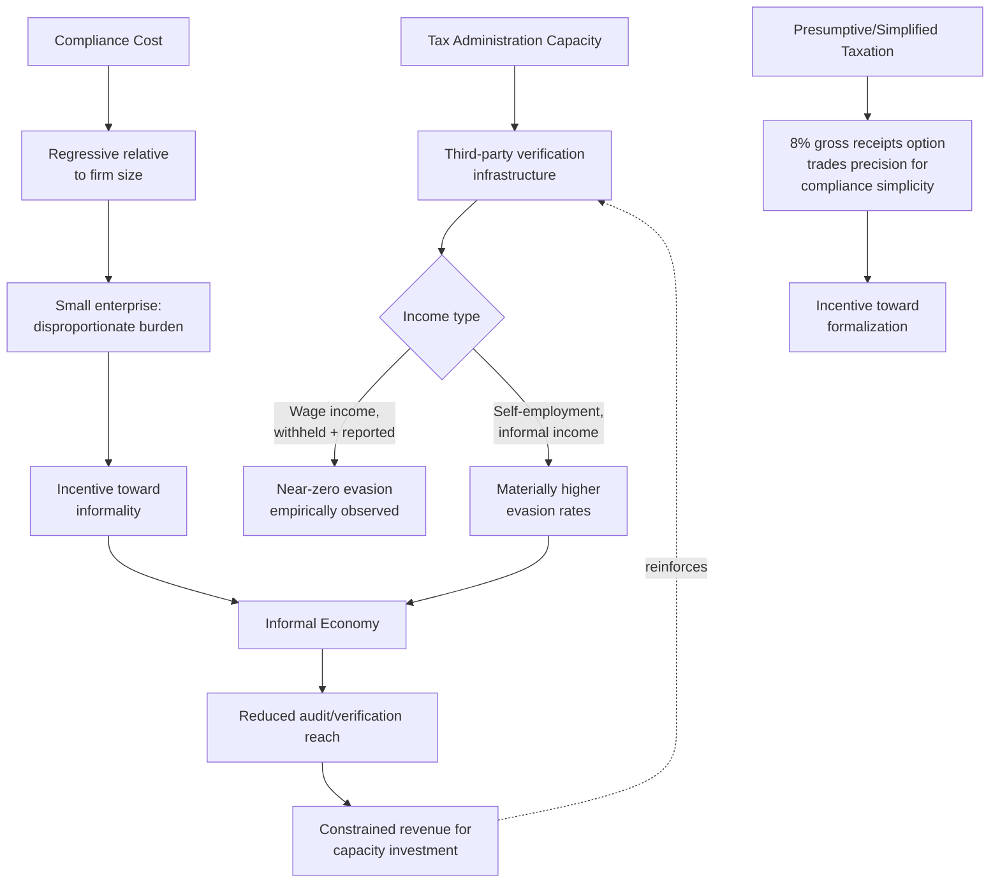

## Tax Administration Capacity, Compliance Costs, and the Informal Economy

### Administration as the Binding Constraint on Tax Policy Design

Every tax-design principle established in this chapter — the Ramsey rule's elasticity-based rate structure, the Mirrlees framework's optimal progressivity, the input-credit VAT mechanism's efficiency properties — presupposes that the tax administration can actually **observe, verify, and enforce** the base it is attempting to tax. This is not a minor implementation detail appended after policy design; it is frequently the *binding constraint* that determines which theoretically optimal design a real tax administration can actually implement. A public-finance principle worth stating precisely at the outset: **the theoretically optimal tax system and the administratively feasible tax system are different objects**, and a substantial body of applied public-finance work (associated with economists including Nicholas Kaldor and, more recently, Joel Slemrod's extensive work on tax administration and enforcement) treats **administrative and compliance costs as a genuine, first-order component of a tax's total economic cost** — not a secondary implementation footnote to be minimized after the "real" policy design work of choosing rates and bases is complete.

### Two Distinct Cost Categories: Administrative Cost and Compliance Cost

These two cost categories are frequently conflated but fall on different parties and respond to different design levers:

- **Administrative costs** are the resources the tax authority itself expends to assess, collect, and enforce the tax — staffing, information systems, audit capacity, taxpayer service infrastructure. In the Philippines, this cost is borne primarily by the **Bureau of Internal Revenue (BIR)** for national internal revenue taxes and the **Bureau of Customs (BOC)** for import-related taxes and duties, both operating under the Department of Finance.
- **Compliance costs** are the resources *taxpayers* expend to satisfy their tax obligations — recordkeeping, filing preparation, professional tax advisory fees, and the time cost of the compliance process itself. A well-documented empirical regularity across tax systems is that compliance costs are **regressive relative to firm size**: a large corporation can spread the fixed cost of a tax department, accounting systems, and specialized advisory services across a large revenue base, while a small or micro-enterprise faces a similar *absolute* compliance burden (basic bookkeeping, filing requirements) that represents a far larger *proportional* burden relative to its revenue — a structural finding with direct relevance to the informal-economy discussion below, since compliance-cost regressivity is one of the specific mechanisms pushing small enterprises toward informality rather than formal registration.

### The Elasticity of Reported Income to Third-Party Verification

The single most consistent empirical finding in modern tax-administration economics — established through Scandinavian randomized tax-audit studies (notably work by Henrik Kleven and coauthors using Danish administrative data) and replicated in various forms across other jurisdictions — is that **the accuracy of self-reported income depends overwhelmingly on whether that income is subject to third-party information reporting**. Wage income subject to employer withholding and third-party reporting shows evasion rates close to zero in these studies, while self-employment and business income *not* subject to equivalent third-party verification shows dramatically higher evasion rates, even for taxpayers reporting other income types accurately. This finding has a direct and important implication for tax-base design choices covered earlier in this chapter: **a tax system's practical progressivity and revenue yield depend not only on its statutory rate schedule but on the composition of income by verifiability** — a jurisdiction with a large share of income earned through wage employment (subject to withholding) can sustain effective enforcement of a progressive schedule far more readily than one with a large share of self-employment, agricultural, or informal-sector income lacking equivalent third-party verification, **independent of the statutory rate schedule's design quality**.

### The Informal Economy: Definition and Its Relationship to Tax Administration

The **informal economy** — economic activity not registered with, or not fully reported to, tax and regulatory authorities — is simultaneously a *cause* and a *consequence* of tax administration capacity limitations, a bidirectional relationship worth disentangling precisely:

- **Administration capacity as a cause of informality**: where third-party verification infrastructure (banking penetration, digital payment adoption, employer withholding systems) is limited, a larger share of economic activity is *structurally* difficult to observe and tax even where the underlying activity is not deliberately concealed — informality here is partly a byproduct of an economy's verification infrastructure rather than solely a matter of enterprise choice.
- **Compliance cost as a cause of informality**: recall the compliance-cost regressivity finding above — a small enterprise facing a compliance burden disproportionate to its scale has a direct incentive to remain unregistered or underreport, since the fixed compliance cost of formal registration may exceed the enterprise's capacity to absorb it profitably, particularly where formalization also triggers other regulatory obligations (labor law compliance, social security contributions) beyond the tax obligation itself.
- **Informality as a cause of narrower effective administration capacity**: a large informal sector reduces the tax administration's practical audit and verification reach (informal enterprises generate no third-party information trail for auditors to cross-reference against), which in turn constrains the revenue available to fund the very administrative capacity investments (staffing, systems, enforcement infrastructure) that would improve future verification capability — a potential **low-capacity trap** in which weak administration and high informality can be mutually reinforcing rather than one being a straightforward downstream consequence of the other.

### Presumptive and Simplified Taxation as an Administrative Response

Where full income-verification-based taxation is administratively infeasible for a specific taxpayer segment, tax administrations frequently deploy **presumptive taxation** — assessing tax liability based on observable proxies for income (business turnover, physical indicators of business scale, sector-average profitability ratios) rather than on audited actual profit — trading some precision and vertical-equity accuracy for administrative feasibility and, often, a lower compliance burden that can itself encourage formalization. The Philippine tax system's treatment of small taxpayers illustrates this trade-off directly: the **8% gross receipts tax option** available to qualifying self-employed individuals and professionals under the TRAIN Law (in lieu of the graduated income tax schedule plus percentage tax) is a simplified, presumptive-style alternative specifically designed to reduce compliance complexity for smaller taxpayers relative to full itemized-deduction income tax computation — a design choice trading some precision in matching tax liability to actual net income for a substantially simpler compliance pathway, reflecting the general principle that **a simpler, somewhat less precisely targeted tax that is actually complied with can outperform, in practical revenue-yield terms, a more theoretically precise tax that faces widespread evasion** among the same taxpayer population.

### Digitalization as an Administrative-Capacity Lever

Contemporary tax-administration reform across developing and middle-income economies has increasingly centered on **digital infrastructure as a direct substitute for, or complement to, traditional third-party information reporting**: electronic invoicing systems (requiring real-time or near-real-time transaction reporting to the tax authority, an approach pioneered at scale in several Latin American tax administrations and increasingly adopted elsewhere), mandatory digital payment integration for specific transaction categories, and pre-filled or pre-populated tax returns generated from data the tax authority already holds from third-party sources — each aiming to replicate, for previously unverifiable income categories, the same near-automatic verification that wage withholding already provides for employment income. The Philippine BIR's own modernization efforts (including electronic invoicing/receipting requirements phased in for specified taxpayer categories under TRAIN Law provisions, and various digitalization initiatives improving return-filing and payment infrastructure) represent an application of this general administrative-capacity-building strategy, directly targeting the specific mechanism — absence of third-party verification — identified above as the dominant empirical driver of the compliance gap between wage and non-wage income. [Inference] The practical revenue impact of such digitalization investments depends heavily on implementation quality and the pace of adoption across the taxpayer base, particularly for smaller enterprises operating with limited digital infrastructure of their own — meaning digitalization's theoretical potential to close the wage/non-wage verification gap does not translate automatically or immediately into a proportional narrowing of the informal sector, especially in segments where the underlying binding constraint is enterprise-level capacity to adopt digital systems rather than tax-authority-side system readiness alone.

### The Interaction With Tax-Base and Rate Design Choices

Recall from the efficiency-equity and VAT-versus-income-tax items that administrative considerations were repeatedly identified as a factor favoring greater reliance on VAT relative to income taxation in lower-administrative-capacity settings, given VAT's self-enforcing invoice-credit documentary trail relative to income tax's dependence on third-party reporting for non-wage income. This chapter's administration-capacity discussion supplies the underlying mechanism for that earlier claim: it is precisely the differential exposure to third-party verification — strong for VAT's invoice-credit chain, weaker for self-employment and informal-sector income under income taxation — that explains the empirical cross-country pattern (noted under VAT design) of developing economies relying more heavily on consumption taxation relative to income taxation than higher-income, higher-administrative-capacity economies. [Inference] This suggests administrative capacity should be treated not as an afterthought to optimal tax design but as a **primary input determining which base-and-rate combination is actually achievable** in a given jurisdiction — a country's realistic tax-mix choice set is bounded by its verification infrastructure in a way the Ramsey rule and Mirrlees framework's pure efficiency-equity calculus, taken in isolation, do not capture.

**Key Points**

- Administrative and compliance costs are a first-order component of a tax's total economic cost, not a secondary implementation detail — the theoretically optimal tax design and the administratively feasible one are frequently different objects, particularly in lower-capacity tax administrations.
- Third-party information reporting is the dominant empirical determinant of accurate income reporting; wage income subject to withholding shows near-zero evasion in leading empirical studies, while self-employment and informal income lacking equivalent verification shows materially higher evasion regardless of the statutory rate schedule's design.
- Compliance costs are regressive relative to firm size, creating a direct structural incentive for small enterprises toward informality, while informality itself constrains the tax administration's audit reach and the revenue available to fund capacity improvements — a potential mutually reinforcing low-capacity trap.
- Presumptive and simplified taxation approaches (the Philippine 8% gross receipts tax option for qualifying self-employed taxpayers) trade some precision in matching liability to actual income for administrative feasibility and reduced compliance burden, on the principle that a simpler, complied-with tax can outperform a more precise but evaded one.
- Administrative capacity, and specifically the extent of third-party verification infrastructure, is a primary input determining which tax base-and-rate combination is realistically achievable in a given jurisdiction, directly explaining the empirical cross-country pattern of developing economies relying more heavily on VAT relative to income taxation than higher-capacity economies.

**Related Topics**

- VAT design and the debate over VAT versus income tax reliance
- Tax expenditures, exemptions, and the erosion of the tax base
- Digital tax administration and electronic invoicing infrastructure
- The 8% gross receipts tax option and presumptive taxation for small taxpayers
- Third-party information reporting and the elasticity of taxable income
- Efficiency versus equity tradeoffs in tax policy design