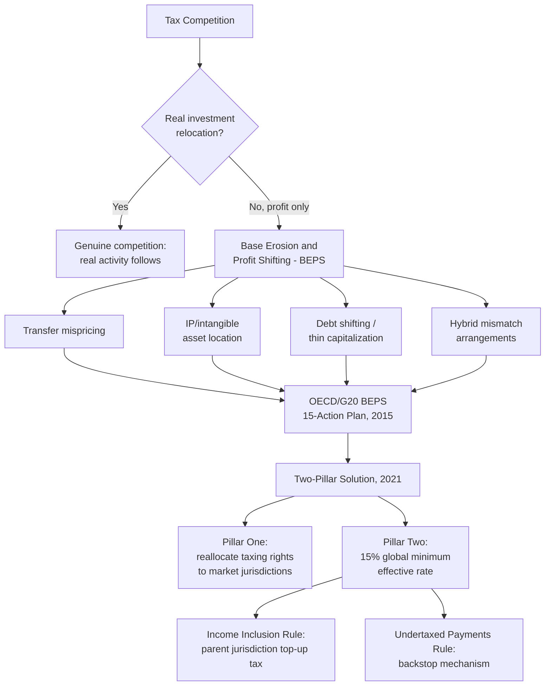

## International Tax Competition and Base Erosion and Profit Shifting

### From Domestic Administration Capacity to the International Dimension

Recall from tax administration capacity that a jurisdiction's practical ability to tax a given base depends heavily on verifiability — and recall from tax-base design and the VAT-versus-income-tax debate that capital income specifically faces an additional erosion channel beyond domestic verification difficulty: **cross-border mobility**. This item extends that mobility concern to its full international dimension, addressing the specific mechanisms by which multinational enterprises (MNEs) and mobile capital reduce the effective tax base available to any single sovereign, and the coordinated multilateral response that has emerged over the past decade to address it.

### Tax Competition: The Baseline Mechanism

**International tax competition** refers to sovereign states competing for mobile investment, corporate headquarters location, and reported profit by offering lower statutory or effective corporate tax rates, preferential regimes, or other tax-related inducements. The baseline economic logic is a standard race-to-the-bottom concern in public finance: because corporate capital and reported profit are more internationally mobile than labor or immobile domestic consumption (recall this asymmetry from the dual-income-tax discussion under tax-base design), any single jurisdiction acting unilaterally to raise its corporate tax rate risks losing investment and reported profit to lower-tax competitors, creating a **collective-action problem** structurally analogous to the fiscal-rules and central-bank-independence commitment problems already covered in this curriculum: each individual jurisdiction has an incentive to undercut others, but the aggregate result of every jurisdiction acting on that individual incentive is a lower equilibrium corporate tax rate globally than any government would collectively prefer if coordination were possible — a dynamic well documented in the multi-decade decline in average statutory corporate income tax rates across OECD and non-OECD economies alike since the 1980s.

A precise distinction worth drawing: tax competition for **genuine, real investment** (a firm actually locating factories, employment, and productive capital in a lower-tax jurisdiction) is a different phenomenon, with different welfare implications, from tax competition for **reported profit alone**, where an MNE's real economic activity remains largely unchanged in location but its *booked* profit is shifted to a low-tax jurisdiction through internal accounting and transaction structuring — the latter is the specific phenomenon **base erosion and profit shifting (BEPS)** addresses, and it generates no offsetting real-investment benefit to the jurisdiction whose tax base is eroded, unlike genuine investment-location competition which at least delivers real economic activity in exchange for the foregone tax revenue.

### The BEPS Mechanisms: How Profit Is Shifted Without Moving Real Activity

Several specific, well-documented mechanisms allow MNEs to shift reported profit to low-tax jurisdictions independent of where real economic activity (production, sales, employment) actually occurs:

- **Transfer mispricing** — MNEs conduct substantial intra-group transactions (one subsidiary selling goods, services, or intellectual property rights to another subsidiary in a different jurisdiction), and the **transfer price** assigned to these internal transactions determines how much profit is booked in each jurisdiction. The international standard governing what transfer price should be used — the **arm's-length principle**, requiring intra-group transaction prices to approximate what unrelated parties would have agreed to in a comparable transaction — is administratively difficult to enforce precisely because many intra-group transactions (particularly involving intangible assets, discussed next) have no directly comparable arm's-length market transaction to benchmark against, creating substantial latitude for profit-shifting through aggressive transfer-price positioning.
- **Intellectual property (IP) and intangible asset location** — intangible assets (patents, trademarks, brand value, proprietary algorithms) are especially prone to profit-shifting because, unlike a factory or retail outlet, an intangible asset's *legal ownership* can be assigned to a subsidiary in a low-tax jurisdiction with minimal physical relocation cost, after which the group's other subsidiaries pay royalties or licensing fees to that low-tax subsidiary for the IP's use — booking substantial profit in the low-tax jurisdiction that legally "owns" the intangible, regardless of where the IP was actually developed or where the products/services using it are actually sold.
- **Debt shifting (thin capitalization)** — because interest expense is typically tax-deductible while dividend payments are not, an MNE has an incentive to **over-leverage subsidiaries in high-tax jurisdictions** (loading them with intra-group debt, generating large deductible interest payments that reduce taxable profit in the high-tax jurisdiction) while the corresponding interest *income* is booked in a low-tax jurisdiction where the internal lending subsidiary is located — shifting taxable profit from high-tax to low-tax jurisdictions purely through the capital structure of intra-group financing, again without any change in real economic activity.
- **Hybrid mismatch arrangements** — exploiting differences between two countries' tax treatment of the same entity or instrument (an instrument treated as debt in one jurisdiction, generating a deductible interest payment, but treated as equity in the counterparty jurisdiction, generating tax-exempt dividend income) to achieve a deduction in one jurisdiction with no corresponding taxable inclusion anywhere — a "double non-taxation" outcome specifically exploiting the lack of coordination between two countries' independently designed tax codes rather than either code being individually flawed.

### The OECD/G20 BEPS Project and Pillar Two: The Multilateral Response

Recognizing that no single jurisdiction acting alone can effectively counter mechanisms specifically designed to exploit gaps *between* national tax systems, the **OECD/G20 BEPS Project**, launched in 2013, produced a **15-Action Plan** (finalized 2015) addressing specific mechanisms including transfer pricing documentation requirements, hybrid mismatch neutralization, interest-deduction limitation rules (directly targeting the debt-shifting mechanism above), and country-by-country reporting requirements obligating large MNEs to disclose profit, tax paid, and economic activity indicators (employees, tangible assets) on a jurisdiction-by-jurisdiction basis — directly improving tax authorities' ability to detect misalignment between where an MNE reports profit and where it has genuine economic substance, a transparency measure targeting precisely the profit-shifting-without-real-activity phenomenon BEPS is concerned with.

The most structurally significant subsequent development is the **Two-Pillar Solution**, agreed by the OECD/G20 Inclusive Framework (over 140 member jurisdictions) in 2021:

- **Pillar One** reallocates a portion of the largest and most profitable MNEs' taxing rights toward **market jurisdictions** — countries where the MNE has customers and sales but may lack the traditional "permanent establishment" physical presence that conventional international tax rules require before a jurisdiction can tax an MNE's profit, a rule modernization specifically responding to the rise of highly digitalized business models capable of generating substantial revenue in a market jurisdiction with minimal physical footprint there.
- **Pillar Two** establishes a **global minimum effective corporate tax rate of 15 percent** for large MNEs (those above a specified revenue threshold), implemented primarily through the **Income Inclusion Rule (IIR)**, allowing a parent company's home jurisdiction to impose a "top-up tax" on any subsidiary's profit taxed below the 15 percent minimum in its host jurisdiction, and the backstop **Undertaxed Payments Rule (UTPR)**, allowing other jurisdictions to deny deductions or impose an equivalent adjustment where the top-up tax is not otherwise collected. The design logic directly addresses the race-to-the-bottom collective-action problem identified above: Pillar Two does not force any jurisdiction to raise its own statutory rate, but it substantially reduces the incentive for MNEs to shift profit to very-low-tax jurisdictions in the first place, since profit taxed below 15 percent simply becomes subject to top-up taxation elsewhere in the group structure — reducing, though not eliminating, the collective-action payoff that drove the original race to the bottom.

### The Philippine Position: Investment Incentives Meeting a Global Minimum

Recall from tax expenditures that the Philippine CREATE Act and CREATE MORE amendment restructured the country's investment incentive architecture — including reducing the standard corporate income tax rate and introducing sunset periods and performance conditionality for preferential regimes previously available to registered enterprises (income tax holidays, the preferential gross-income-earned rate for PEZA-registered enterprises). Pillar Two's global minimum tax creates a direct interaction with this incentive architecture worth stating precisely: **a preferential rate that reduces an MNE subsidiary's effective tax rate below 15 percent no longer delivers its intended net benefit to the MNE** if the MNE's home (or another group) jurisdiction has implemented Pillar Two's Income Inclusion Rule, since the difference between the subsidiary's low effective rate and the 15 percent minimum is simply collected as top-up tax elsewhere in the corporate group — meaning the Philippine treasury's foregone revenue from a below-15%-effective-rate incentive may, in the Pillar Two era, transfer not to the investing MNE (the incentive's intended beneficiary) but to whichever other jurisdiction in the MNE's structure applies the top-up tax, a genuinely adverse outcome from the incentive-granting jurisdiction's perspective: it loses the revenue without the investing firm actually retaining the corresponding benefit. [Inference] This dynamic has prompted a broader reconsideration among jurisdictions offering investment-incentive regimes below the 15 percent threshold — including active Philippine policy discussion connected to CREATE MORE's design — of whether traditional profit-based tax holidays remain an effective investment-attraction tool in a Pillar Two world, or whether jurisdictions should shift toward **non-income-tax-based incentives** (qualified refundable tax credits, which under Pillar Two's specific technical treatment can be structured to avoid reducing the effective-rate calculation in the same way a straightforward tax exemption would, or direct grants/subsidies delivered outside the tax system entirely) to preserve genuine investment-attraction value without the revenue simply being captured by a top-up tax elsewhere. [Unverified] The precise extent and current status of Philippine adoption or adaptation of Pillar Two rules, and the specific design adjustments made to CREATE MORE's incentive menu in direct response to Pillar Two considerations, should be checked against the latest DOF and BIR issuances, since this is an actively evolving area of both domestic and international tax policy.

### Empirical Debate: Has BEPS Reform Actually Reduced Profit Shifting?

The strongest case for meaningful progress draws on the country-by-country reporting data BEPS Action 13 generated, which has allowed researchers (notably work associated with economists Gabriel Zucman and Thomas Tørsløv, among others, estimating the scale of global profit shifting using exactly this newly available disclosure data) to document the magnitude of profit misalignment more precisely than was possible before BEPS transparency measures existed — the mere existence of this improved measurement capability is itself counted as a genuine BEPS success, since effective policy response to a phenomenon this diffuse first required better visibility into its actual scale and location.

The strongest counter-case: the Two-Pillar Solution's implementation has proceeded unevenly across jurisdictions, with the United States — home to many of the largest global MNEs — not having adopted Pillar Two through domestic legislation in the same form as the OECD-negotiated framework, and Pillar One's implementation has faced significant delay relative to its original timeline due to unresolved disagreements over its interaction with existing unilateral digital services taxes several jurisdictions had adopted in the interim. [Inference] Given this uneven and still-evolving implementation picture, whether the Two-Pillar Solution ultimately delivers a durable reduction in profit shifting comparable to its designed intent, or whether continued jurisdictional non-adoption and technical carve-outs preserve substantial residual base-erosion opportunity, remains an open empirical question that will only be resolvable with several more years of post-implementation data — a genuinely unsettled matter at the time of this analysis rather than a settled policy success.

**Key Points**

- Tax competition for genuine real investment differs fundamentally from base erosion and profit shifting, where reported profit moves to low-tax jurisdictions through transfer mispricing, intangible-asset location, debt shifting, or hybrid mismatches without corresponding real economic activity relocating.
- The OECD/G20 BEPS Project's 15-Action Plan and subsequent country-by-country reporting requirements directly improved tax authorities' ability to detect misalignment between where MNEs report profit and where they have genuine economic substance.
- The 2021 Two-Pillar Solution's Pillar Two establishes a 15 percent global minimum effective tax rate via the Income Inclusion Rule and Undertaxed Payments Rule, specifically designed to blunt the race-to-the-bottom incentive without requiring any jurisdiction to raise its own statutory rate.
- Pillar Two directly interacts with the Philippine CREATE/CREATE MORE investment incentive architecture: a preferential rate below 15 percent risks having its foregone revenue captured as top-up tax elsewhere in an MNE's group structure rather than retained as intended benefit by the investing firm, prompting reconsideration of income-tax-based incentives in favor of alternatives like qualified refundable tax credits.
- Two-Pillar Solution implementation remains uneven across major jurisdictions, including notable non-adoption by the United States in the OECD-negotiated form, leaving the framework's ultimate effectiveness in durably reducing profit shifting an open empirical question.

**Related Topics**

- Tax expenditures, exemptions, and the erosion of the tax base
- The CREATE Act and CREATE MORE investment incentive reform
- Transfer pricing documentation and the arm's-length principle
- Country-by-country reporting and MNE tax transparency
- Digital services taxes and the taxation of highly digitalized business models
- Qualified refundable tax credits as Pillar Two-compatible incentive design