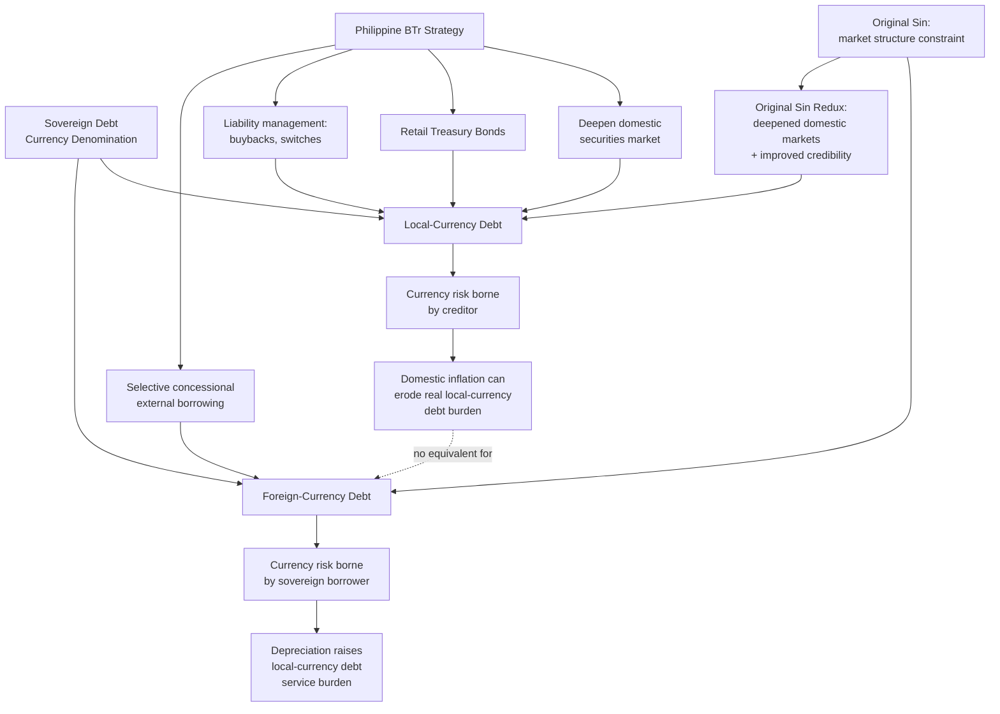

## Local-Currency Versus Foreign-Currency Sovereign Debt Issuance

### The Central Currency-Denomination Choice

Every sovereign debt issuance decision requires specifying the currency in which principal and interest will be repaid, and this choice carries consequences that extend well beyond the immediate financing transaction — it determines which economic risks the borrowing government bears, which investor base can be accessed, and how a debt crisis, if one occurs, actually unfolds. Recall from the debt-dynamics identity established under central bank independence, $\Delta d_t = \frac{i_t - g_t}{1+g_t}d_{t-1} - pb_t$, that the effective interest rate $i_t$ and, implicitly, exchange-rate movements are core determinants of a sovereign's debt trajectory — currency denomination is precisely the variable that determines *how* exchange-rate movements enter that equation, making this choice a first-order input to any debt sustainability analysis rather than a mere technical detail of instrument design.

### The Core Asymmetry: Who Bears Currency Risk

**Local-currency (domestic-currency) debt** is denominated in the issuing sovereign's own currency, meaning principal and interest obligations are fixed in nominal domestic-currency terms regardless of subsequent exchange-rate movements. **Foreign-currency (external) debt** is denominated in a currency other than the issuer's own — overwhelmingly the U.S. dollar in practice, though the euro, Japanese yen, and a small but growing volume of other currencies also feature in sovereign external debt portfolios. The critical asymmetry this denomination choice creates:

- **Local-currency debt shifts currency risk onto the creditor.** If the domestic currency depreciates against major reserve currencies, a foreign holder of local-currency debt suffers a loss when converting interest and principal payments back into their own currency, while the government's debt-service burden in domestic-currency terms is unaffected by the depreciation.
- **Foreign-currency debt shifts currency risk onto the sovereign borrower.** If the domestic currency depreciates, the government's local-currency-equivalent cost of servicing foreign-currency debt rises mechanically — the same dollar-denominated interest and principal payment now requires more units of local currency to acquire, worsening the debt burden in domestic-currency (and debt-to-GDP) terms even though the dollar-denominated debt stock itself has not increased.

This asymmetry is the specific mechanism connecting currency denomination directly to central bank independence, already covered in the fiscal-institutions chapter: recall that a domestically fiscally dominant regime facing inflation risk can, in principle, partially erode the *real* burden of local-currency debt through unanticipated inflation, since local-currency debt's nominal value is fixed regardless of the domestic price level — **but this inflation channel does nothing to reduce foreign-currency debt's burden**, since foreign-currency obligations are unaffected by domestic inflation and are instead affected by the nominal exchange rate, which inflation differentials influence only indirectly and imperfectly (and often adversely, since higher domestic inflation frequently accompanies currency depreciation rather than offsetting it). This is precisely the asymmetry flagged under the central-bank-independence discussion: monetary accommodation "helps" domestic-currency debt but does nothing for foreign-currency debt, making a sovereign's currency-composition profile a direct determinant of how much relief, if any, monetary policy could theoretically provide during a fiscal stress episode.

### "Original Sin": The Historical Constraint on Emerging-Market Local-Currency Borrowing

A specific and influential concept in the sovereign debt literature — the **"original sin"** hypothesis, developed by economists Barry Eichengreen, Ricardo Hausmann, and Ugo Panizza in the early 2000s — describes the historical inability of most emerging-market and developing sovereigns to borrow internationally in their own currency, forcing them into foreign-currency-denominated external debt even when domestic policymakers would have preferred the currency-risk-shifting benefits of local-currency issuance. The original-sin literature attributes this constraint not to weak domestic policy in any single borrowing country but to a **structural feature of global capital markets**: international investors, holding globally diversified portfolios, have historically been reluctant to bear the currency risk of a large number of distinct emerging-market currencies, preferring instead that borrowers absorb that risk by issuing in a small number of major reserve currencies — meaning even a sovereign with strong domestic fiscal and monetary credibility could face limited *international* investor appetite for local-currency-denominated debt, a market-structure constraint external to that sovereign's own policy choices.

### The "Original Sin Redux" and the Rise of Local-Currency Markets

A significant empirical development, documented in subsequent research (notably Carmen Reinhart, Kenneth Rogoff, and coauthors' later work, alongside continued Eichengreen-Hausmann-Panizza-adjacent scholarship terming this evolution **"original sin redux"**), is that many emerging-market sovereigns substantially **increased their local-currency borrowing share from domestic and, increasingly, international investors** from the early 2000s onward, partly reflecting deepened domestic institutional investor bases (pension funds, insurance companies, local banks with balance-sheet demand for local-currency government securities) and improved domestic macroeconomic credibility (recall central bank independence's role in anchoring inflation expectations, a precondition for investors — domestic and eventually foreign — to accept local-currency-denominated long-dated obligations without demanding an excessive inflation-risk premium). The "redux" framing specifically flags an important nuance: even where local-currency debt is nominally held by *foreign* investors (an increasingly common pattern as global fund managers added emerging-market local-currency bonds to diversified portfolios), the **currency-risk-shifting benefit to the sovereign borrower remains intact** — what changed was simply that foreign capital became willing to bear currency risk it had previously avoided, rather than the borrowing sovereign itself no longer needing to issue in foreign currency to access international capital.

### The Philippine Debt Portfolio: Composition and Policy Management

The Philippine Bureau of the Treasury (BTr), recall its role from the Treasury Single Account and executive fiscal architecture discussion, actively manages the currency composition of the National Government's debt portfolio as a core component of its debt-management strategy, pursuing a deliberate policy objective of **increasing the domestic-currency share of total outstanding debt** over time — a strategy explicitly reducing the government's foreign-exchange risk exposure documented above. This has been pursued through several concrete instruments and practices:

- **Deepening the domestic government securities market** — regular, predictable issuance of peso-denominated Treasury bills and Treasury bonds across the yield curve, supported by a domestic institutional investor base including banks (which hold government securities partly to meet regulatory liquidity requirements) and government financial institutions.
- **Retail Treasury Bonds (RTBs)** — peso-denominated bonds specifically marketed to individual retail investors rather than only institutional players, broadening the domestic investor base and channeling domestic household savings directly into government financing, simultaneously advancing financial-inclusion objectives alongside the debt-management currency-composition goal.
- **Liability management operations** — periodic bond exchanges, buybacks, and switches that allow the BTr to retire more expensive or foreign-currency-denominated obligations and replace them with peso-denominated issuance on more favorable terms, actively reshaping the existing debt stock's currency composition rather than only influencing composition through new-issuance flow decisions.
- **Continued but more selective external borrowing** — the Philippines continues to access foreign-currency financing, particularly through **multilateral and bilateral concessional sources** (the World Bank, Asian Development Bank, and bilateral official development assistance), which typically carry below-market interest rates and longer maturities than commercial external borrowing would offer, meaning the foreign-currency-risk cost of this specific category of external debt is at least partially offset by a genuine concessional-financing-cost benefit not available through domestic peso issuance — a distinct rationale from commercial external borrowing, where the foreign-currency risk is taken on primarily for market-access or cost-arbitrage reasons rather than to capture concessional terms.

### The Debt Sustainability Analysis Implication: Why Currency Composition Is a Core DSA Input

Recall the standard debt-dynamics identity from central bank independence: $\Delta d_t = \frac{i_t - g_t}{1+g_t}d_{t-1} - pb_t$. A **currency-composition-aware debt sustainability analysis** decomposes this single aggregate identity into separate local-currency and foreign-currency components, since each faces a distinct effective interest rate and a distinct exposure to exchange-rate shocks:

$$\Delta d_t = \left(\frac{i_t^{LC} - g_t}{1+g_t}\right) d_{t-1}^{LC} + \left(\frac{i_t^{FC} - g_t + \Delta e_t}{1+g_t}\right) d_{t-1}^{FC} - pb_t$$

where $d_{t-1}^{LC}$ and $d_{t-1}^{FC}$ are the local- and foreign-currency debt shares, and $\Delta e_t$ is the percentage change in the exchange rate (depreciation positive). This decomposition makes explicit why the standard IMF/World Bank DSA methodology treats currency composition as a distinct **stress-test dimension**: a DSA's exchange-rate shock scenario (typically a specified large one-time depreciation) mechanically worsens the debt trajectory through the $d_{t-1}^{FC}$ term in direct proportion to the foreign-currency debt share — meaning **two sovereigns with identical aggregate debt-to-GDP ratios can face materially different debt sustainability risk profiles purely because of differing currency composition**, a genuinely important qualification to any debt-sustainability assessment that examines the aggregate debt ratio alone without decomposing it by currency exposure.

### Empirical Debate: Should Emerging Markets Actively Pursue Local-Currency Debt Even at Higher Nominal Cost?

The strongest case for prioritizing local-currency issuance, even where it carries a higher nominal interest rate than comparable foreign-currency issuance (local-currency debt typically demands a higher coupon reflecting inflation-risk and, historically, less-developed-market liquidity premiums): the currency-risk-shifting benefit reduces the *tail risk* of a sudden, severe debt crisis triggered by exchange-rate collapse — a risk-reduction benefit that a simple nominal-cost comparison between local- and foreign-currency borrowing rates does not capture, since it manifests specifically in stress states rather than in the expected, central-scenario cost comparison.

The strongest counter-case: **a domestic-currency debt-management strategy that becomes too aggressive can itself generate financial-stability risk if it relies on a shallow domestic investor base** — if domestic banks and institutional investors are required or induced to absorb a disproportionately large share of government securities relative to their balance-sheet capacity, this creates a **sovereign-bank nexus** (a term prominent in the post-2010 European sovereign debt crisis literature) in which banking-sector and sovereign-debt risk become mutually reinforcing: a sovereign stress event that depresses government bond prices simultaneously damages bank balance sheets holding those bonds, while a banking-sector stress event reduces the domestic market's capacity to absorb continued government issuance, precisely the channel through which the strategy meant to reduce currency risk can inadvertently concentrate a different form of systemic risk. [Inference] This suggests the optimal currency-composition strategy is not simply "maximize the local-currency share" but rather a portfolio-diversification problem genuinely balancing currency risk (favoring local-currency issuance), domestic financial-stability concentration risk (favoring a broader, more diversified investor base including foreign local-currency-bond holders per the original-sin-redux pattern, rather than domestic-institution concentration alone), and financing-cost considerations (favoring at least some concessional foreign-currency borrowing where available) simultaneously, rather than any single dimension dominating debt-management strategy in isolation.

**Key Points**

- Local-currency debt shifts currency risk onto the creditor while foreign-currency debt shifts it onto the sovereign borrower; this asymmetry directly determines whether domestic monetary accommodation can provide any relief during fiscal stress, since inflation erodes the real burden of local-currency debt but has no equivalent effect on foreign-currency obligations.
- The "original sin" hypothesis identifies a historical global-capital-market structural constraint preventing most emerging-market sovereigns from borrowing internationally in their own currency, while "original sin redux" documents the subsequent deepening of local-currency sovereign debt markets, including growing foreign investor willingness to hold local-currency-denominated emerging-market debt.
- The Philippine Bureau of the Treasury pursues active currency-composition management through domestic market deepening, Retail Treasury Bonds, liability management operations, and continued but more selective external borrowing weighted toward concessional multilateral and bilateral sources.
- A currency-composition-aware debt sustainability analysis decomposes the standard debt-dynamics identity into local- and foreign-currency components, since each faces a distinct effective interest rate and exchange-rate exposure — meaning two sovereigns with identical aggregate debt-to-GDP ratios can face materially different sustainability risk purely from differing currency composition.
- Aggressive pursuit of local-currency debt reliant on a shallow domestic investor base risks generating a sovereign-bank nexus, concentrating financial-stability risk even while reducing currency risk, suggesting optimal currency-composition strategy requires balancing multiple risk dimensions rather than maximizing any single one.

**Related Topics**

- Central bank independence and the separation of fiscal and monetary authority
- Debt sustainability analysis methodology and exchange-rate stress-testing
- The Bureau of the Treasury's financing program and debt issuance calendar
- Retail Treasury Bonds and domestic investor base development
- The sovereign-bank nexus and financial-stability risk concentration
- Concessional multilateral and bilateral external financing terms