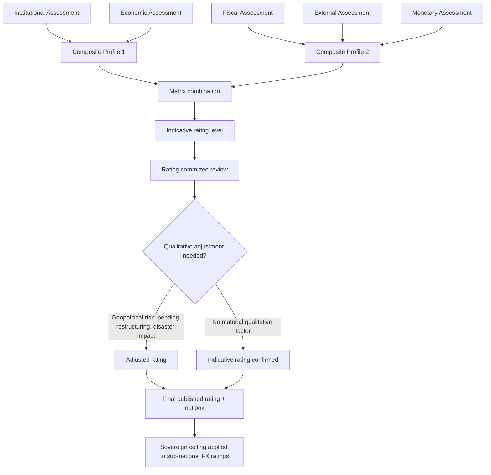

## Credit Rating Agency Methodology and the Determinants of Sovereign Ratings

### Definition and Function in Fiscal Statecraft

A **sovereign credit rating** is an opinion, issued by a credit rating agency (CRA), on a government's relative capacity and willingness to service its debt obligations in full and on time. The three dominant agencies — **S&P Global Ratings, Moody's Investors Service, and Fitch Ratings** — each publish letter-grade scales (e.g., S&P/Fitch: AAA down to D; Moody's: Aaa down to C) that map to an ordinal default-risk ranking, not a probability forecast in the strict actuarial sense, though each agency does publish historical default-rate studies by rating category.

For a borrower-side finance ministry, the rating is not merely a scorecard — it is a **structural determinant of the cost and composition of market access**. A rating downgrade below "investment grade" (BBB-/Baa3, the boundary between the last investment-grade notch and the first speculative-grade notch) can trigger forced divestment by institutional investors whose mandates restrict holdings to investment-grade paper, widening spreads mechanically rather than purely through repriced credit risk. This is why debt management offices treat rating-agency engagement as a continuous element of fiscal statecraft rather than a passive, occasional event.

### The Rating Scale and Notch Structure

Ratings are expressed in **notches**, with the three major agencies broadly aligned but not identical in scale granularity:

| S&P / Fitch | Moody's | Category |
| --- | --- | --- |
| AAA | Aaa | Prime |
| AA+, AA, AA- | Aa1, Aa2, Aa3 | High grade |
| A+, A, A- | A1, A2, A3 | Upper medium grade |
| BBB+, BBB, BBB- | Baa1, Baa2, Baa3 | Lower medium grade (investment grade floor) |
| BB+, BB, BB- | Ba1, Ba2, Ba3 | Speculative (non-investment grade) |
| B+, B, B- | B1, B2, B3 | Highly speculative |
| CCC and below | Caa and below | Substantial risk to default |

Each agency also assigns an **outlook** (Positive, Stable, Negative, Developing) signaling the likely direction of the *next* rating action over roughly a 12–24 month horizon, and may place a sovereign on **CreditWatch/Review** (S&P/Moody's terminology) or **Rating Watch** (Fitch) when a specific, near-term event could trigger an immediate change — a pending debt restructuring announcement, an election result, or a currency crisis, for example.

### Core Methodological Framework: The Five-Pillar Structure

While each agency's published criteria differ in exact weighting and labeling, sovereign methodologies converge on a broadly common analytical architecture, most transparently documented in S&P's public sovereign rating methodology. The analysis organizes around five core pillars:

**1. Institutional Assessment**

This pillar evaluates the *effectiveness, predictability, and transparency* of a state's policymaking institutions, independent of any single administration's current stance. Sub-factors include: the track record of fiscal and monetary policy consistency across political transitions; the transparency and timeliness of public financial data disclosure; the rule of law and contract enforcement quality; and the perceived risk of political interference in debt-service prioritization. A sovereign with weak institutional scores is judged more likely to face a sudden, discretionary policy reversal — such as selective default or exchange controls — even if its numerical fiscal metrics are otherwise sound. [Inference: the specific institutional sub-indicators and their exact weighting vary by agency and are periodically revised; the general institutional-assessment concept is consistently documented across all three major agencies' published criteria.]

**2. Economic Assessment**

This pillar assesses the **growth prospects, income levels, and economic diversification** of the sovereign, based on the reasoning that a larger, more diversified, higher-income economy has a broader and more resilient tax base to draw upon for debt service, and is less vulnerable to a single sectoral or commodity shock. Key metrics include GDP per capita relative to peer sovereigns, real GDP growth volatility, and economic diversification (a narrow, commodity-dependent economy is penalized relative to a diversified one at the same income level).

**3. External Assessment**

This pillar evaluates a sovereign's **external liquidity and vulnerability to balance-of-payments stress**, particularly relevant for emerging-market issuers with foreign-currency-denominated debt. Core metrics include the **current account balance** as a share of GDP, the **net external debt position**, **gross external financing needs** (current account deficit plus maturing external debt due within the coming year, relative to reserves plus current account receipts), and the status of the currency as a **reserve currency** (a status effectively unique to a handful of issuers — principally the US dollar, euro, yen, and a small set of others — that grants those sovereigns exceptional external financing flexibility unavailable to other issuers).

**4. Fiscal Assessment**

Split into two sub-components:

- **Fiscal performance and flexibility**: the general government budget balance (including or excluding one-off items), the primary balance (the budget balance excluding interest payments — the key metric for assessing whether *current* policy is stabilizing or destabilizing the debt trajectory, since it isolates the discretionary fiscal stance from the inherited interest burden), and the revenue-raising flexibility of the state (tax base breadth, collection efficiency, and the political feasibility of raising additional revenue if needed).
- **Debt burden**: general government debt-to-GDP, net debt-to-GDP (gross debt minus liquid financial assets), interest expense as a share of revenue, and the **debt structure** — average maturity, currency composition (local- versus foreign-currency), and the share held by non-resident versus resident investors, since a foreign-currency-heavy, short-maturity, non-resident-dominated debt stock is judged structurally more fragile than a long-dated, domestic-currency, resident-held one, even at an identical debt-to-GDP ratio.

**5. Monetary Assessment**

This pillar evaluates the **credibility and flexibility of monetary policy**, primarily relevant to how much room the central bank has to respond to shocks without triggering inflation or currency instability. Sub-factors include central bank independence, the track record of inflation control, the exchange rate regime (a freely floating, market-determined currency is generally viewed as providing a shock-absorbing mechanism that a rigid peg does not), and the depth and liquidity of domestic capital markets (a deep local-currency government bond market with domestic institutional investor demand — such as pension funds and banks — reduces reliance on foreign-currency borrowing and its associated currency-mismatch risk).

### From Pillar Scores to Final Rating

Agencies do not publish a fully mechanical formula that maps pillar scores to a specific letter grade — sovereign ratings retain an explicit qualitative, committee-based overlay. The published methodology (again, most transparently in S&P's case) typically combines the institutional and economic assessments into one composite profile, and the fiscal, monetary, and external assessments into a second composite profile, and then combines the two composite profiles via a **matrix** that produces an *indicative* rating level. A **rating committee** — not a single analyst — then reviews this indicative outcome and can adjust it based on qualitative factors not fully captured in the quantitative framework (geopolitical risk, a pending debt restructuring, a natural disaster's fiscal impact) before the final rating is voted on and published. This committee-based, judgment-inclusive final step is a deliberate design feature, not an implementation gap — agencies state that sovereign creditworthiness involves qualitative judgments that a pure scorecard cannot fully capture.

### Worked Case: The Philippines' Rating Trajectory

The Philippines provides a useful borrower-side illustration of the pillar framework in practice. The sovereign held sub-investment-grade ratings through the early 2000s, reflecting weak fiscal performance (persistent deficits, a debt-to-GDP ratio that had climbed above 70% following the Asian Financial Crisis) and institutional concerns. Through the 2010s, sustained fiscal consolidation — narrowing the deficit, improving tax administration (notably through reforms such as the 2012 Sin Tax Reform Law expanding excise revenue), and reducing debt-to-GDP into the low-to-mid 40s — combined with strong, diversified GDP growth (underpinned by business process outsourcing revenue and resilient remittance inflows providing external-account stability) drove successive upgrades, reaching investment-grade status (BBB-/Baa3 equivalent range and above across the three agencies) by the mid-2010s. [Verify current specific letter grades and outlooks directly against each agency's latest published sovereign action before using in a specific memo or brief; agency actions are event-driven and this synthesis reflects the general trajectory and mechanism, not a real-time rating level.]

The COVID-19 pandemic illustrates the external-shock stress-test dimension of the framework directly: the sharp GDP contraction and fiscal deficit widening (debt-to-GDP rising into the low-60s range) tested the fiscal-assessment pillar, while the underlying institutional and monetary-policy credibility built up over the preceding decade provided the buffer that avoided a downgrade below investment grade — an outcome consistent with the framework's emphasis on *trajectory and buffers*, not only the point-in-time debt ratio.

### The "Sovereign Ceiling" Concept

A related methodological feature directly relevant to borrower-side debt strategy is the **sovereign ceiling** (or **country ceiling**): the principle, applied by all three major agencies, that a sub-sovereign entity — a local government unit (LGU), a government-owned and controlled corporation (GOCC), or a domestic corporate issuer — generally cannot receive a foreign-currency rating *higher* than the sovereign's own foreign-currency rating, on the reasoning that a sovereign in severe distress is likely to impose transfer and convertibility restrictions (capital controls) that would impair even a fundamentally sound sub-national entity's ability to service foreign-currency debt. This is directly consequential for any LGU or GOCC financing structure benchmarked against sovereign risk, since the national government's own rating trajectory sets a hard ceiling on how favorably a sub-national entity can be priced in foreign-currency markets, independent of that entity's own balance sheet quality.

### Points of Genuine Methodological Debate

**Procyclicality critique**: A substantial body of academic and policy literature — notably work associated with economists such as Carmen Reinhart and researchers at institutions including the IMF — argues that sovereign ratings are **procyclical**: agencies tend to downgrade during a crisis, precisely when a sovereign is already under external financing stress, mechanically worsening that stress by triggering forced-seller divestment and raising borrowing costs at the worst possible moment, rather than providing forward-looking, through-the-cycle risk assessment. The agencies' counterargument is that a rating is explicitly a *point-in-time* opinion on current creditworthiness, not a cycle-smoothed forecast, and that failing to downgrade a genuinely deteriorating credit would itself be a methodological and reputational failure following the agencies' widely criticized pre-2008 performance on structured-credit ratings.

**Home-bias and data-availability critique**: A separate line of criticism, including from some emerging-market policymakers and multilateral bodies, argues that sovereign methodologies structurally disadvantage lower-income and emerging-market issuers through greater reliance on qualitative institutional judgment where data transparency is weaker, potentially embedding a degree of subjectivity that correlates with issuer characteristics (income level, region) beyond what "hard" fiscal and external metrics alone would justify — a claim agencies dispute by pointing to the consistency of their published, cross-country-applied criteria frameworks. [Speculation: the magnitude of any such systematic bias, if it exists, is an actively contested empirical question in the sovereign-ratings literature rather than a settled finding.]

### Mermaid Diagram: Sovereign Rating Determination Pipeline

### SVG Illustration: The Five-Pillar Framework (svg_diagram)

<svg xmlns="http://www.w3.org/2000/svg" viewBox="0 0 700 420">
\<style\>
.box{fill:#eef3fb;stroke:#2c5c99;stroke-width:2;}
.core{fill:#2c5c99;stroke:#183a5e;stroke-width:2;}
.lbl{font-family:sans-serif;font-size:13px;fill:#183a5e;text-anchor:middle;}
.corelbl{font-family:sans-serif;font-size:14px;fill:#fff;text-anchor:middle;font-weight:bold;}
.ttl{font-family:sans-serif;font-size:16px;fill:#111;font-weight:bold;}
.arrow{stroke:#555;stroke-width:1.5;marker-end:url(#ah);}
\</style\>
<text x="20" y="25" class="ttl">Five-Pillar Sovereign Rating Framework (svg_diagram)</text>
<rect x="30" y="60" width="130" height="60" rx="8" class="box" />
<text x="95" y="85" class="lbl">Institutional</text>
<text x="95" y="102" class="lbl">Assessment</text>
<rect x="185" y="60" width="130" height="60" rx="8" class="box" />
<text x="250" y="85" class="lbl">Economic</text>
<text x="250" y="102" class="lbl">Assessment</text>
<rect x="340" y="60" width="130" height="60" rx="8" class="box" />
<text x="405" y="85" class="lbl">Fiscal</text>
<text x="405" y="102" class="lbl">Assessment</text>
<rect x="495" y="60" width="80" height="60" rx="8" class="box" />
<text x="535" y="85" class="lbl">External</text>
<text x="535" y="102" class="lbl">Assessment</text>
<rect x="590" y="60" width="90" height="60" rx="8" class="box" />
<text x="635" y="85" class="lbl">Monetary</text>
<text x="635" y="102" class="lbl">Assessment</text>
<line x1="95" y1="120" x2="300" y2="190" class="arrow" />
<line x1="250" y1="120" x2="320" y2="190" class="arrow" />
<line x1="405" y1="120" x2="380" y2="190" class="arrow" />
<line x1="535" y1="120" x2="400" y2="190" class="arrow" />
<line x1="635" y1="120" x2="420" y2="190" class="arrow" />
<rect x="270" y="195" width="160" height="55" rx="8" class="core" />
<text x="350" y="218" class="corelbl">Matrix</text>
<text x="350" y="236" class="corelbl">Combination</text>
<line x1="350" y1="250" x2="350" y2="290" class="arrow" />
<rect x="245" y="295" width="210" height="55" rx="8" class="box" />
<text x="350" y="318" class="lbl">Rating Committee Review</text>
<text x="350" y="335" class="lbl">(qualitative overlay)</text>
<line x1="350" y1="350" x2="350" y2="390" class="arrow" />
<rect x="245" y="393" width="210" height="20" rx="6" class="core" />
<text x="350" y="408" class="corelbl">Final Rating + Outlook</text>
</svg>

### Practical Implications for a Finance Ministry

Debt management offices typically maintain a formal, continuous **investor relations and rating agency engagement** function — regular briefings, data disclosure, and pre-review meetings with each agency's sovereign analyst team — precisely because the qualitative, committee-based portion of the methodology means that transparency, timeliness, and the clarity of a state's own fiscal narrative materially affect the final rating outcome, not only the underlying hard metrics. A downgrade below investment grade additionally raises borrowing costs beyond the pure credit-risk repricing, through forced institutional divestment (many pension funds, insurers, and index-tracking funds operate under mandates that exclude sub-investment-grade paper), making the investment-grade threshold a genuine structural cliff-edge rather than merely one more notch on a continuous scale. [Inference: the magnitude of any specific "cliff-edge" cost jump at the investment-grade threshold varies by market and issuer and would require empirical event-study evidence for a specific claim.]

**Related Topics**

- Debt sustainability analysis (DSA) methodology and its relationship to rating-agency fiscal metrics
- The sovereign ceiling and its effect on GOCC / LGU foreign-currency borrowing costs
- Rating-agency procyclicality and the 2008 structured-credit ratings controversy
- Credit default swap (CDS) spreads as a market-based alternative signal to agency ratings
- Debt sustainability and the primary balance as a policy-stance indicator
- Local-currency versus foreign-currency debt composition and its rating-methodology treatment