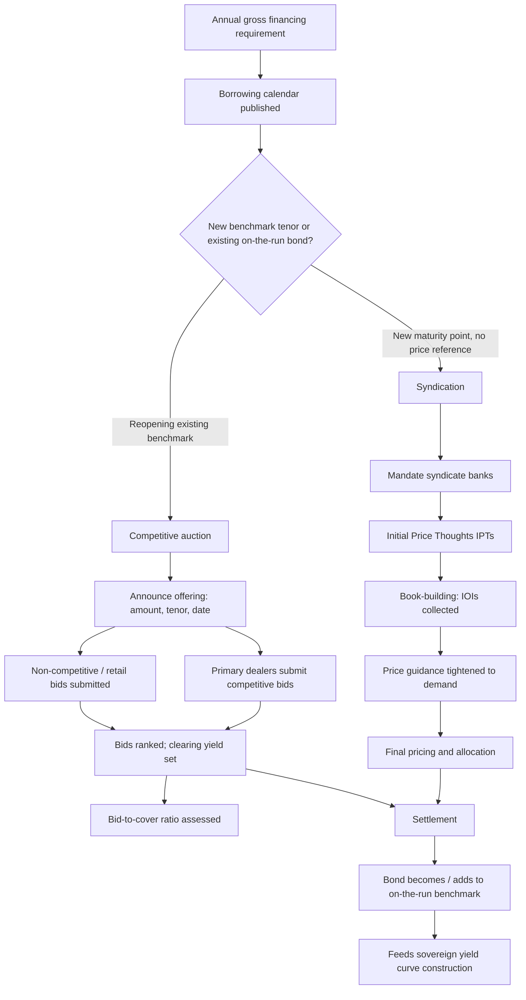

## Primary Issuance Mechanics: Auctions, Syndications, and Benchmark Bonds

### Definition and Function

**Primary issuance** is the process by which a sovereign sells newly created debt securities directly to investors for the first time, as distinct from **secondary market** trading of already-outstanding bonds between investors. For a debt management office (DMO), primary issuance is the operational mechanism through which the entire annual borrowing program — set by the budget's financing requirement — is actually executed. The two dominant primary issuance techniques are the **competitive auction** and the **syndicated deal**, each suited to different tranche sizes, investor bases, and market conditions, supplemented in many sovereigns by non-competitive allotment channels and, less commonly today, direct private placements.

### Recall: The Financing Requirement as the Starting Point

Recall that the government's **fiscal deficit** (or, more precisely, the **gross financing requirement**, which adds maturing debt due for refinancing to the deficit) determines the total volume that must be raised in a given fiscal year. The DMO translates this aggregate financing requirement into a **borrowing calendar** — a pre-announced schedule of auction dates, target instruments, and indicative volumes — published in advance (commonly quarterly, as with the U.S. Treasury's Quarterly Refunding, or on a rolling basis as with the Philippine Bureau of the Treasury's (BTr) weekly auction calendar) to maximize market predictability, reduce uncertainty premia, and allow primary dealers and institutional investors to plan liquidity accordingly.

### Method 1: The Competitive Auction

The auction is the workhorse mechanism for regular, recurring issuance across the maturity spectrum — T-bills and on-the-run benchmark bonds alike. Two auction formats dominate globally:

**Uniform-price (Dutch) auction**: All winning bidders pay the same **clearing price** (equivalently, receive the same clearing yield), determined as the price at which cumulative competitive bids exactly absorb the announced offering amount. Bidders submit price-yield pairs; bids are ranked from the most aggressive (lowest yield/highest price) downward until the offering amount is exhausted; the yield of the marginal (last accepted) bid becomes the single clearing yield paid by *all* successful bidders, including those who bid more aggressively than the clearing level.

**Multiple-price (discriminatory) auction**: Each winning bidder pays the price/yield they individually bid, rather than a common clearing price. This method was historically more common but has been progressively abandoned by major sovereign issuers (the U.S. Treasury moved fully to uniform-price auctions for all marketable securities by the mid-1990s) because it is understood to encourage more conservative (higher-yield) bidding — the **winner's curse** dynamic, where the discriminatory-price format punishes precise pricing and rewards bidding away from one's true valuation, which can raise the sovereign's average funding cost relative to the uniform-price alternative. [Inference: the empirical magnitude of the winner's-curse cost differential is model- and market-dependent; the *directional* preference for uniform-price format among major DMOs is well documented in the debt-management literature.]

**Auction mechanics, step by step:**

1. **Announcement**: The DMO publishes the offering amount, instrument (tenor, whether reopening an existing bond or launching a new one), and auction date — typically several days in advance per the pre-published calendar.
2. **Bidding window**: **Primary dealers** (a formally designated group of banks and broker-dealers granted exclusive or privileged access to bid directly at auction, in exchange for market-making obligations in the secondary market) and, depending on the market's rules, other eligible institutional bidders submit **competitive bids** (specifying both price/yield and quantity) and, in many systems, retail or smaller investors submit **non-competitive bids** (agreeing to accept the auction's clearing yield regardless of level, subject to a maximum quantity cap, guaranteeing allotment without price risk).
3. **Bid ranking and clearing**: Competitive bids are stack-ranked from most to least aggressive; the offering amount is allocated starting from the most aggressive bid downward until exhausted, non-competitive bids are typically satisfied first (deducted off the top of the offering amount) since they place no downward pressure on the clearing price.
4. **Settlement**: Winning bidders pay for and receive the securities on a pre-announced **settlement date**, typically a few business days after the auction (T+1 to T+3 depending on the market).

**The bid-to-cover ratio** — total bids submitted divided by the amount actually offered — is the standard real-time gauge of auction demand strength; a ratio below roughly 2.0x is often read as weak demand, while ratios above 3x signal strong oversubscription, though the "normal" range is instrument- and market-specific and should be benchmarked against that specific security's own historical auction pattern rather than a universal threshold. A weak, undersubscribed auction (a so-called "**tailing**" auction, where the clearing yield comes in higher than the pre-auction secondary-market yield, or "**when-issued**" yield, implied) is read by markets as a signal of waning investor appetite and can itself trigger a broader sell-off in outstanding bonds of similar tenor.

### Method 2: Syndication

**Syndication** is the alternative primary issuance channel in which the sovereign engages a small group of investment banks (a **syndicate**, typically led by several **bookrunners** or **lead managers**) to jointly market, price, and place a new bond issue directly with investors through direct order-taking, rather than via an open competitive auction. Syndication is the standard method for:

- **Launching an entirely new benchmark bond** at a maturity where no existing bond can simply be "reopened" via auction (a genuinely new point on the curve, as opposed to adding volume to an already-outstanding issue).
- **Foreign-currency sovereign bonds** (e.g., the Republic of the Philippines' US-dollar-denominated global bonds), where the issuer is tapping an international investor base with less standardized auction infrastructure than the domestic market.
- **Large, one-off, or unusually structured issuance** — a jumbo benchmark size, a novel instrument (e.g., a sustainability-linked or green bond, discussed further below), or issuance timed opportunistically around a favorable market window rather than a fixed calendar date.

**Syndication mechanics, step by step:**

1. **Mandate**: The sovereign selects (mandates) a syndicate of banks, typically 3–6 joint bookrunners for a benchmark-sized deal, based on distribution capability, balance-sheet commitment, and relationship considerations.
2. **Announcement and Initial Price Thoughts (IPTs)**: The syndicate publicly announces the mandate and issues **IPTs** — a deliberately wide, conservative initial yield/spread indication (e.g., "mid-swaps plus 150bp area") designed to attract initial investor interest without committing to a final level.
3. **Book-building**: Over a compressed window (often a single trading day for a well-telegraphed, liquid-currency deal), the syndicate collects **indications of interest (IOIs)** from institutional investors, building a real-time order book. As demand becomes visible, **price guidance** is typically revised tighter (lower yield/spread) from the initial IPTs, reflecting observed demand strength — investors who indicated interest at the wider initial level are not penalized, but the deal is priced to the level the final book supports.
4. **Final pricing and allocation**: Once the book closes, the final yield/spread and size are set, and bonds are allocated across the order book — typically favoring larger, more "sticky" long-term institutional accounts (pension funds, insurers, central banks holding reserves) over short-term, flip-prone accounts, since post-issuance secondary-market stability is itself a reputational concern for future deals.
5. **Settlement**: Similar to auctions, settlement occurs on a pre-agreed date, with the syndicate banks (not the sovereign directly) handling the mechanics of investor settlement instructions.

A key structural difference from the auction format: syndication gives the issuer far greater control over the *investor allocation* (rewarding relationship investors, managing geographic and investor-type diversification) at the cost of paying underwriting fees to the syndicate banks and accepting a modest **new-issue concession** — a small yield premium over where the bond is expected to trade in secondary markets immediately after issuance, compensating investors for taking on a new, initially less liquid security.

### The Benchmark Bond Concept

A **benchmark bond** is a specific, large-volume issue at a standard maturity point (2, 5, 10, 30 years being the most common global convention) that is deliberately built up — through repeated **reopenings** (auctioning additional volume of an *already-outstanding* bond, rather than creating a new CUSIP/ISIN each time) — to a size sufficient to support deep, liquid secondary-market trading. Reopening is the primary mechanical link between the auction process and benchmark-bond construction: rather than issuing a fresh 10-year bond at every single auction (which would fragment outstanding volume across many small, illiquid issues), a DMO typically designates one 10-year bond as the **current benchmark** ("on-the-run") and reopens it at successive auctions over a period (often 3–12 months) until it reaches a target outstanding size, at which point a new benchmark is launched and the process repeats, with the previous benchmark becoming "off-the-run."

This concentration serves two purposes directly relevant to the sovereign's cost of funds: first, a deep, liquid benchmark commands a **liquidity premium** discount — investors accept a *lower* yield on a security they know they can exit easily, relative to a fragmented, illiquid equivalent — directly lowering the government's borrowing cost; second, benchmark bonds anchor the **sovereign yield curve** construction (recall that the zero-coupon curve is built from observed on-the-run instrument prices), so benchmark liquidity quality directly affects the reliability of the pricing signal used for the DMO's own future issuance decisions and for pricing GOCC/LGU debt benchmarked off the sovereign curve.

### Non-Competitive and Retail Channels

Many DMOs run a parallel **non-competitive bidding** or **retail tranche** channel alongside the main competitive auction, allowing smaller investors — and, in some jurisdictions, retail savers directly — guaranteed allotment at the auction-determined clearing yield, without needing to submit a price bid themselves. This channel serves a financial-inclusion and domestic-savings-mobilization function distinct from pure cost-minimization: broadening the domestic resident investor base reduces reliance on foreign-currency or non-resident financing (recall that non-resident-dominated, foreign-currency-heavy debt structures are viewed by rating agencies as structurally more fragile). The Philippine BTr's **Retail Treasury Bonds (RTBs)** program is a direct example of this mechanism, periodically issuing tranches specifically structured and marketed for retail/individual investor participation, often via bank branch networks and digital platforms, distinct from the standard wholesale auction calendar.

### Worked Example: A Hypothetical BTr 10-Year Benchmark Bond Lifecycle

1. **Launch (Month 0)**: BTr syndicates a new 10-year peso benchmark bond, raising ₱30 billion in the initial launch via a syndicate of local universal banks acting as joint lead managers, setting the coupon at the final book-clearing yield.
2. **Reopening 1 (Month 2)**: A regular weekly/biweekly auction reopens the same bond (identical coupon and maturity date, incrementally shorter remaining tenor), adding ₱15 billion, using the uniform-price competitive auction format among primary dealers.
3. **Reopening 2–4 (Months 4, 6, 8)**: Successive reopenings continue via auction, building outstanding volume toward a target benchmark size (e.g., ₱120–150 billion), at which point the issue is considered to have reached adequate secondary-market liquidity depth.
4. **New benchmark (Month 10)**: BTr launches a fresh 10-year bond (via syndication or a larger inaugural auction), and the prior bond becomes off-the-run, continuing to trade but progressively less actively as investor and dealer attention shifts to the new on-the-run issue.

This lifecycle illustrates the auction–syndication complementarity directly: syndication handles the harder problem of *price discovery for an entirely new instrument* with no existing secondary-market reference point, while the auction format efficiently handles *repeated, standardized reopenings* of an already-priced, already-trading security.

### Mermaid Diagram: Primary Issuance Decision and Process Flow

### SVG Illustration: Uniform-Price Auction Clearing Mechanism (svg_diagram)

<svg xmlns="http://www.w3.org/2000/svg" viewBox="0 0 700 420">
\<style\>
.ax{stroke:#333;stroke-width:2;}
.bar{fill:#3a6ea5;stroke:#1e3a5f;stroke-width:1;}
.barclear{fill:#c0392b;stroke:#7a1f14;stroke-width:1;}
.lbl{font-family:sans-serif;font-size:12px;fill:#222;}
.ttl{font-family:sans-serif;font-size:15px;fill:#111;font-weight:bold;}
.dash{stroke:#c0392b;stroke-width:1.5;stroke-dasharray:5,4;}
\</style\>
<text x="20" y="25" class="ttl">Uniform-Price Auction: Bid Stack and Clearing Yield (svg_diagram)</text>
<line x1="70" y1="360" x2="650" y2="360" class="ax" />
<line x1="70" y1="360" x2="70" y2="50" class="ax" />
<text x="340" y="400" class="lbl">Cumulative quantity bid (₱ billion) →</text>
<text x="20" y="210" class="lbl" transform="rotate(-90 20 210)">Yield bid (%)</text>
<rect x="80" y="300" width="60" height="60" class="bar" />
<rect x="140" y="270" width="60" height="90" class="bar" />
<rect x="200" y="240" width="60" height="120" class="bar" />
<rect x="260" y="210" width="60" height="150" class="barclear" />
<rect x="320" y="185" width="60" height="20" fill="#eee" stroke="#999" stroke-dasharray="3,3" />
<text x="350" y="198" class="lbl">Unfilled (below clearing)</text>
<line x1="70" y1="210" x2="320" y2="210" class="dash" />
<text x="330" y="215" class="lbl" fill="#c0392b">Clearing yield (marginal bid)</text>
<text x="110" y="380" class="lbl">Most</text>
<text x="100" y="392" class="lbl">aggressive</text>
<text x="270" y="380" class="lbl">Marginal</text>
<text x="270" y="392" class="lbl">(clearing)</text>
<text x="480" y="30" class="lbl" fill="#3a6ea5">All accepted bids ●</text>
<text x="480" y="46" class="lbl" fill="#c0392b">pay the SAME clearing yield</text>
</svg>

### Practical Implications for the Debt Management Office

The choice between auction and syndication for any given tranche is a direct cost-risk trade-off familiar to any DMO's issuance strategy: auctions offer lower explicit fees and a transparent, rules-based process well suited to routine, predictable volume, while syndication offers superior price discovery and allocation control for large, new, or complex issuance — at the cost of underwriting fees and a new-issue concession. A well-functioning primary market additionally depends on a credible **primary dealer system**, since dealers' market-making obligations in the secondary market are what sustains the liquidity that, in turn, supports tight, low-concession pricing at the *next* primary auction — a virtuous cycle that a DMO actively cultivates through dealer performance metrics, dealer-exclusive bidding privileges, and regular market consultation, rather than treating primary and secondary market functioning as separate concerns.

**Related Topics**

- The sovereign yield curve and its construction across maturities
- Primary dealer systems: obligations, privileges, and market-making incentives
- Medium-Term Debt Management Strategy (MTDS) and the cost-risk trade-off in tenor selection
- Foreign-currency sovereign bond issuance and international investor base diversification
- Retail Treasury Bond programs and domestic savings mobilization
- Debt sustainability analysis and its link to the annual gross financing requirement