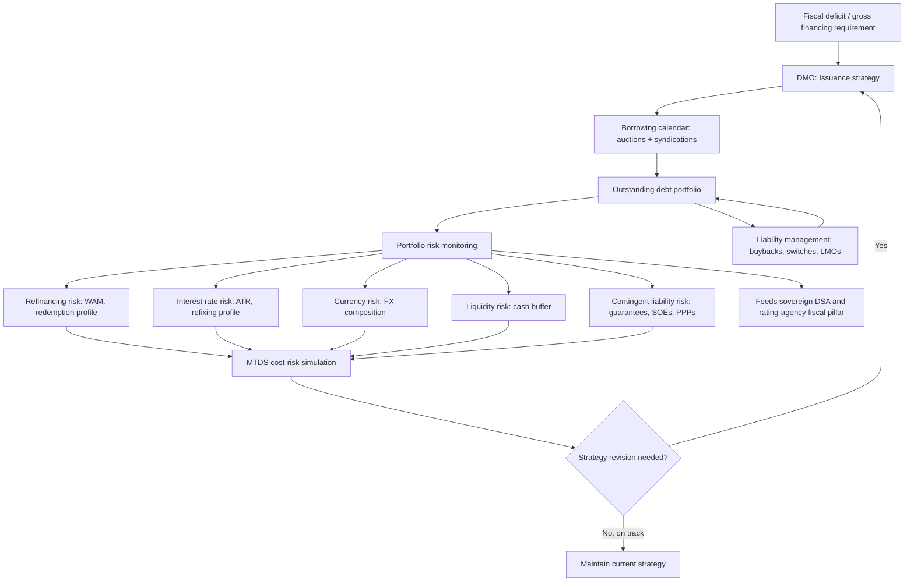

## Debt Management Office Functions and Sovereign Portfolio Risk

### Definition and Institutional Placement

A **debt management office (DMO)** is the institutional unit — sometimes a dedicated agency, sometimes a bureau within the finance ministry or treasury — responsible for executing the sovereign's borrowing program, managing the government's outstanding debt portfolio, and, in many mandates, managing associated cash and, occasionally, contingent-liability and guarantee exposures. The Philippine **Bureau of the Treasury (BTr)**, operating under the Department of Finance, performs this function domestically; internationally comparable examples include the UK Debt Management Office, the German Finanzagentur, and Indonesia's Directorate General of Budget Financing and Risk Management (DJPPR).

A recurring institutional-design question — extensively studied by the IMF and World Bank in their joint *Guidelines for Public Debt Management* and *Debt Management Performance Assessment (DeMPA)* frameworks — is the degree of **separation** between the DMO and both fiscal policymaking (the budget office) and monetary policy (the central bank). The core rationale for separation, particularly from monetary policy, is that a central bank simultaneously acting as debt manager faces a structural conflict of interest: it could be tempted to keep interest rates artificially low to reduce the government's own debt-service cost, undermining its inflation-control mandate — the classic **fiscal dominance** problem. Most modern DMOs therefore operate with an explicit mandate boundary: the DMO decides *how* to finance a given deficit (instrument mix, tenor, currency), while the deficit's *size* remains a fiscal-policy decision made elsewhere in government, and the policy interest rate remains the central bank's independent decision.

### Core DMO Functions

**1. Issuance strategy and execution**

Recall that the annual **gross financing requirement** (the fiscal deficit plus maturing debt due for refinancing) sets the total volume the DMO must raise. The DMO translates this into an actual **borrowing calendar** and executes it through competitive auctions and syndications (the specific mechanics of which — bid formats, book-building, benchmark-bond construction via reopening — constitute a distinct operational competency), continuously balancing the cost-risk trade-off across instrument choice.

**2. Portfolio (liability) management**

Beyond raising new financing, the DMO actively manages the composition of the *existing* debt stock through instruments such as **debt buybacks** (repurchasing outstanding bonds before maturity, often to retire an illiquid off-the-run issue or manage a maturity concentration), **bond exchanges/switches** (offering holders of a maturing or off-the-run bond the option to swap into a new benchmark issue, smoothing refinancing bunching), and **liability management operations (LMOs)** more broadly — a catch-all term for any transaction that reshapes the outstanding portfolio's maturity, currency, or interest-rate profile without changing the net financing raised.

**3. Cash management**

Many DMOs also manage the government's **Treasury Single Account (TSA)** or equivalent short-term cash position, smoothing the mismatch between lumpy tax-revenue inflows and continuous expenditure outflows, often through short-term instruments (T-bills, repo operations, or a dedicated cash buffer) distinct from long-term debt issuance strategy, but closely coordinated with it since short-term cash needs directly influence T-bill issuance volume.

**4. Risk monitoring and reporting**

The DMO maintains the analytical infrastructure — debt sustainability analysis (DSA) modeling, portfolio risk metrics, contingent-liability registers — that informs both its own strategy and the broader fiscal-policy and rating-agency-facing narrative (recall that transparent, timely DMO data disclosure is itself an input to the institutional-assessment pillar of sovereign credit ratings).

**5. Contingent liability and guarantee management (where mandated)**

In many sovereigns, the DMO or an adjacent unit tracks **contingent liabilities** — government guarantees extended to state-owned enterprises (SOEs) or GOCCs, public-private partnership (PPP) exposure, and other obligations that are not part of the recognized debt stock but could crystallize into actual fiscal costs under adverse conditions (an SOE default triggering a sovereign guarantee call, for instance).

### The Medium-Term Debt Management Strategy (MTDS) Framework

The **Medium-Term Debt Management Strategy (MTDS)** — a joint IMF-World Bank analytical framework widely adopted by DMOs, including the Philippines' — is the primary tool through which the cost-risk trade-off across candidate financing strategies is formally quantified and compared before a strategy is adopted. The MTDS process typically proceeds through the following stages:

1. **Baseline debt portfolio analysis**: characterizing the *current* outstanding debt stock's cost and risk profile using the metrics detailed below (WAM, currency composition, refixing profile).
2. **Macroeconomic and market assumptions**: projecting the financing envelope (linked to the fiscal deficit path) and future interest-rate and exchange-rate scenarios.
3. **Candidate strategy specification**: defining several alternative financing mixes (e.g., "Strategy A: maximize domestic peso issuance," "Strategy B: front-load short-tenor issuance to minimize near-term cost," "Strategy C: extend average maturity via longer-tenor foreign-currency issuance") over the 3–5 year horizon.
4. **Cost-risk simulation**: projecting each candidate strategy's expected cost (e.g., weighted average interest cost, or debt-service-to-revenue ratio) under a baseline scenario *and* under stress scenarios (an interest-rate shock, a currency depreciation shock) to reveal the risk each strategy embeds, not only its expected-case cost.
5. **Strategy selection and implementation**: the selected strategy becomes the reference framework guiding the DMO's actual annual borrowing calendar and instrument mix decisions.

### Core Portfolio Risk Dimensions

**Refinancing (rollover) risk**

The risk that debt maturing in a given period cannot be refinanced on acceptable terms — or, in an extreme case, at all — due to a market access disruption at precisely the moment refinancing is required. The primary metric is the **redemption profile**: the schedule of principal amounts falling due by year, ideally smoothed to avoid a "wall" of concentrated maturities in any single year that would force a disproportionately large refinancing operation into potentially unfavorable market conditions. **Weighted average maturity (WAM)** — the face-value-weighted average time to maturity across the entire debt stock — is the single most common summary statistic for this risk dimension; a longer WAM indicates a more gradually refinanced, lower-rollover-risk portfolio, generally at the cost of a higher average coupon (recall the normal upward-sloping yield curve, under which longer tenors typically carry higher yields).

**Interest rate risk**

The risk that debt-service costs rise because debt must be refinanced or re-priced at higher prevailing rates. This is distinct from pure rollover risk (market access) and is measured via the **refixing profile** — the share of the debt stock whose interest rate will reset within a given period, which includes not only maturing fixed-rate debt (refinanced at the then-prevailing rate) but also any floating-rate debt directly indexed to a reference rate. **Average time to refixing (ATR)** is the corresponding summary statistic, analogous to WAM but specifically tracking rate-reset exposure rather than principal-repayment timing; ATR is shorter than WAM whenever floating-rate debt is present, since floating-rate principal may not mature for years but still refixes its coupon on a short cycle (often quarterly or semi-annually).

**Currency (exchange rate) risk**

The risk that local-currency-equivalent debt-service costs rise due to depreciation against the currencies in which foreign-currency debt is denominated. This is tracked via the **currency composition** of the debt stock — the share denominated in local currency versus foreign currency (further broken down by specific currency: US dollar, yen, euro, and multilateral special drawing rights (SDR)-denominated concessional loans, for a typical emerging-market sovereign). A depreciation directly and mechanically raises the local-currency debt-to-GDP ratio and debt-service burden on the foreign-currency share, independent of any change in the underlying foreign-currency-denominated obligation itself — a channel distinct from, and additive to, pure interest-rate risk.

**Liquidity risk**

The risk that the sovereign cannot meet a near-term cash obligation despite solvency over a longer horizon, typically managed through maintaining a **cash buffer** (a minimum Treasury Single Account balance, or a committed contingency credit line) sized to cover a defined number of months of debt-service and critical expenditure needs without relying on fresh market issuance — a direct insurance mechanism against a temporary market-access disruption becoming an actual default event.

**Contingent liability risk**

As introduced above, the risk that guarantees, PPP exposures, or SOE-related obligations crystallize into direct fiscal costs, expanding the *effective* debt burden beyond the officially recognized figure. This risk dimension is structurally harder to quantify than the market-price-based risks above, since it depends on the probability of a triggering event (an SOE's own operational or financial distress) rather than an observable market price, and is frequently flagged by the IMF and rating agencies as a source of **fiscal risk understatement** in headline debt statistics when contingent-liability registers are incomplete or non-transparent.

### Worked Example: A Stylized Philippine Portfolio Risk Snapshot

Consider a simplified, illustrative national government debt portfolio for exposition (not a claim about actual current BTr published figures, which should be verified directly against the latest BTr Bureau of the Treasury debt statistics bulletin):

| Risk dimension | Metric | Illustrative value | Interpretation |
| --- | --- | --- | --- |
| Refinancing risk | WAM | ~7.5 years | Moderate; longer than a purely T-bill-funded portfolio, shorter than a long-dated-bond-heavy one |
| Refinancing risk | Debt maturing within 1 year | ~12% of stock | Gauges near-term rollover concentration |
| Interest rate risk | ATR | ~6.8 years | Close to WAM, indicating limited floating-rate exposure |
| Currency risk | FX share of total debt | ~30% | Residual exposure to depreciation-driven cost increases |
| Currency risk | FX composition | USD-heavy, some JPY/EUR, some multilateral SDR | Diversification within the FX share itself matters |
| Liquidity risk | Cash buffer | ~3 months of debt service | Buffer against a temporary market-access disruption |

A DMO running an MTDS exercise on this stylized portfolio would test, for instance, how a 200 basis-point domestic interest-rate shock combined with a 15% peso depreciation would affect the debt-to-GDP trajectory and debt-service-to-revenue ratio over the following 3–5 years — precisely the stress-testing exercise that also underpins the DSA methodology used by both the sovereign itself and by rating agencies' fiscal-assessment pillar.

### The Domestic-Foreign and Fixed-Floating Trade-Off Matrix

DMO strategy formulation is frequently organized around a simplified two-by-two conceptual trade-off, even though actual MTDS modeling is more granular:

- **Domestic fixed-rate**: typically the "safest" instrument from the DMO's own risk perspective (no currency risk, no rate-reset risk), but often the *most expensive* on a nominal coupon basis in an emerging-market context, since domestic investors demand a premium reflecting local inflation expectations and the depth (or shallowness) of the domestic investor base.
- **Foreign-currency fixed-rate**: often nominally cheaper (lower coupon, reflecting the lower risk-free base rate of a reserve currency like the US dollar), but introduces currency risk that can more than offset the nominal coupon saving if the currency depreciates over the bond's life — a trade-off that has driven several documented emerging-market debt crises where foreign-currency-denominated debt service became unsustainable following a sharp depreciation, independent of the government's underlying fiscal stance.
- **Domestic floating-rate**: avoids currency risk but introduces interest-rate risk, transmitting future monetary-policy tightening directly and rapidly into the government's own debt-service cost — a channel of particular concern where domestic floating-rate debt is large relative to the overall stock.
- **Foreign-currency floating-rate**: combines both currency and interest-rate risk, generally the riskiest quadrant from a pure portfolio-risk standpoint, though occasionally used tactically (e.g., certain multilateral loan structures) where the absolute cost saving is judged to outweigh the combined risk, or where the borrowing is naturally hedged by foreign-currency revenue streams.

### Mermaid Diagram: DMO Functions and the MTDS Feedback Loop

### SVG Illustration: The Portfolio Risk Trade-Off Matrix (svg_diagram)

<svg xmlns="http://www.w3.org/2000/svg" viewBox="0 0 700 420">
\<style\>
.box{stroke:#333;stroke-width:1.5;}
.low{fill:#d6ecd2;}
.med{fill:#fdf3c4;}
.high{fill:#f7cfc7;}
.lbl{font-family:sans-serif;font-size:13px;fill:#222;text-anchor:middle;}
.axlbl{font-family:sans-serif;font-size:13px;fill:#111;font-weight:bold;text-anchor:middle;}
.ttl{font-family:sans-serif;font-size:15px;fill:#111;font-weight:bold;}
\</style\>
<text x="20" y="25" class="ttl">Currency / Rate-Structure Risk Trade-Off Matrix (svg_diagram)</text>
<rect x="150" y="70" width="200" height="130" class="box low" />
<text x="250" y="130" class="lbl">Domestic</text>
<text x="250" y="148" class="lbl">Fixed-Rate</text>
<text x="250" y="168" class="lbl">Lowest portfolio risk,</text>
<text x="250" y="184" class="lbl">often higher nominal cost</text>
<rect x="350" y="70" width="200" height="130" class="box med" />
<text x="450" y="130" class="lbl">Foreign-Currency</text>
<text x="450" y="148" class="lbl">Fixed-Rate</text>
<text x="450" y="168" class="lbl">Currency risk,</text>
<text x="450" y="184" class="lbl">often lower nominal coupon</text>
<rect x="150" y="200" width="200" height="130" class="box med" />
<text x="250" y="260" class="lbl">Domestic</text>
<text x="250" y="278" class="lbl">Floating-Rate</text>
<text x="250" y="298" class="lbl">Interest rate risk,</text>
<text x="250" y="314" class="lbl">no currency risk</text>
<rect x="350" y="200" width="200" height="130" class="box high" />
<text x="450" y="260" class="lbl">Foreign-Currency</text>
<text x="450" y="278" class="lbl">Floating-Rate</text>
<text x="450" y="298" class="lbl">Combined currency +</text>
<text x="450" y="314" class="lbl">interest rate risk</text>
<text x="250" y="60" class="axlbl">Fixed Rate</text>
<text x="450" y="60" class="axlbl">Floating Rate</text>
<text x="70" y="140" class="axlbl" transform="rotate(-90 70 140)">Domestic</text>
<text x="70" y="270" class="axlbl" transform="rotate(-90 70 270)">Foreign-Currency</text>
</svg>

### Practical Implications and the Central Tension

The DMO's central operational tension, running through every function described above, is between **cost minimization** and **risk minimization**, and these two objectives are frequently in direct opposition given a normal upward-sloping yield curve and typically cheaper foreign-currency financing terms: the lowest expected-cost strategy in any given year is usually also the highest-risk strategy (short-tenor, foreign-currency-heavy borrowing), while the lowest-risk strategy (long-tenor, domestic-currency, fixed-rate) usually carries the highest expected nominal cost. The MTDS framework's core institutional value is forcing this trade-off to be made *explicitly and quantitatively*, against a defined risk tolerance set by the finance ministry, rather than allowing it to be decided implicitly, auction by auction, by whichever instrument happens to look cheapest on any given issuance date — a pattern that, absent an explicit strategy, tends to systematically under-price rollover and currency risk precisely because those costs are deferred and probabilistic rather than immediately visible in the current year's budget.

**Related Topics**

- Debt sustainability analysis (DSA) methodology and stress-testing frameworks
- Primary issuance mechanics: auctions, syndications, and benchmark bonds
- Contingent liabilities: SOE guarantees, PPP exposure, and fiscal risk registers
- Currency mismatch and emerging-market debt crisis mechanics
- Credit rating agency methodology and the determinants of sovereign ratings
- Treasury Single Account architecture and government cash management