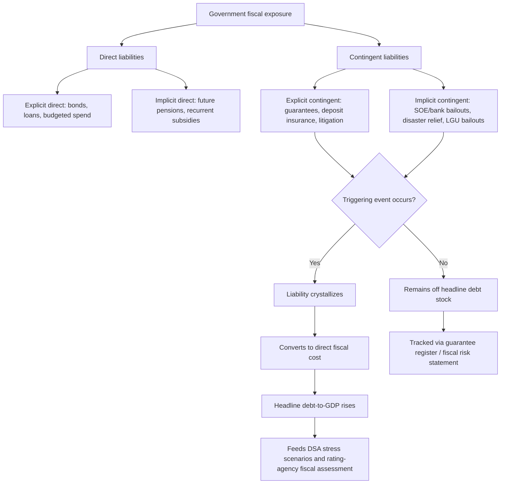

## Contingent Liabilities, Guarantees, and Off-Balance-Sheet Fiscal Risk

### Definition and Function

A **contingent liability** is a potential government financial obligation that depends on the occurrence of a future, uncertain event — as opposed to **direct liabilities**, which are unconditional obligations recognized in the debt stock regardless of any future contingency (a maturing bond's principal, for instance, is owed with certainty). A contingent liability only converts into an actual cash outflow, and only becomes a direct fiscal cost, if the triggering event materializes: a state-owned enterprise (SOE) defaulting on a guaranteed loan, a natural disaster triggering a disaster-relief commitment, or a public-private partnership (PPP) concessionaire invoking a minimum-revenue guarantee. For a finance ministry, contingent liabilities matter precisely because they are **off the headline debt statistic** — a sovereign's officially reported debt-to-GDP ratio typically captures only direct liabilities — yet they represent real, quantifiable fiscal exposure that can crystallize suddenly and at scale, a dynamic that has driven several of the most severe emerging-market fiscal crises in recent decades.

### The Standard Taxonomy: Explicit vs. Implicit, Direct vs. Contingent

The IMF's canonical analytical framework, most fully developed in its *Fiscal Risks* toolkit and the associated **Fiscal Transparency Code**, organizes government obligations along two crossed dimensions, producing a four-quadrant matrix:

|  | **Direct** (certain, regardless of event) | **Contingent** (dependent on uncertain event) |
| --- | --- | --- |
| **Explicit** (legally/contractually recognized) | Sovereign bonds, loans, budgeted expenditure | Government guarantees on SOE/PPP debt, deposit insurance, legal claims/litigation |
| **Implicit** (moral/political obligation, no legal claim) | Future public pension payments, expected recurrent subsidies | Bailouts of "too big to fail" SOEs or systemically important banks, natural disaster relief, sub-national government bailouts |

The lower-right quadrant — **implicit contingent liabilities** — is the most analytically difficult and the most consequential in practice: there is no contract creating a legal obligation, yet governments have repeatedly demonstrated a strong political and economic incentive to honor these obligations when the triggering event occurs, because *failing* to do so risks a broader systemic or reputational cost (a banking-sector collapse, a strategically important SOE's operational failure, or a sub-national government's own default triggering national contagion). This quadrant is why fiscal-risk analysts and rating agencies scrutinize a sovereign's institutional track record and SOE-sector structure even in the *absence* of any formal, contractually recognized guarantee.

### Explicit Guarantees: Mechanics and Structure

An **explicit government guarantee** is a formal, legally binding commitment by the sovereign to assume a specified obligation — typically debt service — of another entity (an SOE, a PPP concessionaire, a local government unit, or occasionally a private entity in a strategically prioritized sector) if that entity fails to meet the obligation itself. Guarantees are structured along several dimensions relevant to fiscal-risk quantification:

- **Full vs. partial guarantee**: a full guarantee covers 100% of the underlying obligation; a partial guarantee covers only a specified share or specified risk layer (e.g., a **partial credit guarantee**, common in multilateral-supported infrastructure financing, which covers a defined portion of debt service, leaving the remainder as genuine credit risk for lenders — deliberately preserving some market discipline on the underlying borrower rather than fully substituting sovereign credit for project credit).
- **Payment guarantee vs. performance guarantee**: a payment guarantee covers financial debt-service obligations specifically; a performance guarantee (more common in PPP structures) covers non-financial contractual commitments — a minimum-traffic or minimum-revenue guarantee on a toll road, for instance, where the government commits to a top-up payment if actual usage falls below a contracted threshold, converting demand risk that would otherwise sit with the private concessionaire into a contingent fiscal exposure.
- **Called vs. uncalled guarantee**: the guarantee only becomes an actual cash disbursement (a "called" guarantee) upon the underlying entity's default or triggering event; prior to that, it remains an off-balance-sheet contingent exposure, tracked (where a DMO or finance ministry maintains adequate systems) in a **guarantee register** or **fiscal risk statement**, but not counted in the headline debt stock.

### Public-Private Partnerships and Fiscal Risk Transfer

**Public-private partnerships (PPPs)** are a structurally important source of contingent liability because their entire value proposition rests on *transferring* certain risks (construction risk, operational efficiency risk) to a private concessionaire while the government typically retains — explicitly or implicitly — certain other risks, most commonly demand risk (via minimum-revenue guarantees) and, in some structures, exchange-rate risk on concessionaire foreign-currency financing. A poorly structured PPP that nominally moves a large infrastructure project "off government books" (avoiding a direct debt increase) while retaining substantial guaranteed downside exposure produces exactly the off-balance-sheet fiscal risk this topic addresses: government debt statistics show no increase, while true fiscal exposure has risen materially. The IMF's **PPP Fiscal Risk Assessment Model (PFRAM)** is the standard analytical tool developed specifically to quantify this gap — modeling a PPP's expected fiscal cost and contingent-liability exposure under the specific contractual guarantee structure, rather than relying on the project's classification (on- or off-balance-sheet under national accounting standards) as a proxy for its actual fiscal risk.

### State-Owned Enterprises as a Contingent Liability Source

SOEs and GOCCs represent a particularly significant contingent-liability channel in many emerging-market sovereigns, including the Philippines, because they combine several risk-amplifying characteristics: SOEs frequently borrow with an explicit sovereign guarantee (converting SOE credit risk directly into sovereign contingent liability by contract) or with an *implicit* guarantee (no formal contract, but strong market and political expectation of a bailout given the SOE's strategic role — power generation, water utilities, national airlines, and similar "systemically important" sectors are recurring examples across sovereigns globally); SOEs often operate with weaker corporate governance, financial transparency, and commercial discipline than private-sector borrowers, elevating the underlying probability of financial distress; and SOE debt is frequently excluded from the general government debt perimeter under standard fiscal-reporting conventions (which typically capture "general government" but not the broader "public sector," a boundary the IMF's *Government Finance Statistics Manual* explicitly documents as a known transparency gap), meaning SOE liabilities can accumulate largely outside the headline debt-to-GDP figure that rating agencies and markets primarily track.

### Quantification Approaches

Because contingent liabilities by definition have not yet crystallized, quantifying their fiscal risk requires probabilistic or scenario-based methods rather than the straightforward accounting used for direct debt:

- **Guarantee registers and stock-of-guarantees reporting**: the baseline transparency practice — maintaining a comprehensive inventory of all outstanding explicit guarantees, their face value, beneficiary entity, and expiry, published as a standard component of fiscal risk statements (a practice the IMF's Fiscal Transparency Code explicitly scores sovereigns against).
- **Expected loss / actuarial modeling**: applying an estimated default or triggering probability to the guaranteed exposure to derive an expected fiscal cost, analogous to loan-loss provisioning in banking — methodologically demanding because reliable default-probability estimates for guaranteed SOE or PPP exposure are often unavailable, forcing reliance on comparator-based or judgment-based probability assumptions.
- **Stress-testing and scenario analysis**: rather than (or alongside) a single expected-value estimate, modeling the fiscal impact of specific adverse scenarios — a systemically important SOE's simultaneous financial distress, a broad PPP-portfolio demand shortfall during a recession — directly analogous to the stress-scenario methodology used in debt sustainability analysis (DSA), and increasingly integrated into DSA frameworks themselves as an explicit contingent-liability shock, following IMF methodological revisions after the global financial crisis and successive emerging-market debt episodes exposed the cost of omitting this channel.
- **Fiscal risk statements**: a growing number of finance ministries, including under IMF Fiscal Transparency Code encouragement, now publish a dedicated annual fiscal risk statement alongside the budget, consolidating guarantee registers, SOE financial summaries, PPP exposure, and natural-disaster risk exposure into a single disclosure document intended to give legislators, markets, and rating agencies a fuller picture of exposure beyond the headline debt figure.

### Worked Case: The 1997–98 Asian Financial Crisis as a Contingent-Liability Crystallization Event

The Asian Financial Crisis provides a canonical, well-documented illustration of the mechanism by which implicit contingent liabilities crystallize suddenly and at scale. In several affected economies, private-sector and financial-sector foreign-currency debt was not formally guaranteed by the sovereign — it sat, in principle, entirely outside government direct or explicit contingent liability. Yet as currency depreciation and banking-sector distress spread, governments across the region undertook large-scale bank recapitalizations and, in some cases, broader financial-sector bailouts, converting what had been *implicit* contingent exposure (no contract, but a systemic stability concern) into substantial *direct* fiscal costs and correspondingly large increases in headline public debt-to-GDP within a very short period. The Philippines' own debt-to-GDP ratio, alongside those of its regional peers, rose materially in the crisis's aftermath, reflecting exactly this "hidden-debt-becomes-real-debt" mechanism that formal debt statistics, absent robust contingent-liability tracking and disclosure, had not fully captured in advance. [Verify specific country-level fiscal-cost figures against IMF Article IV or historical DSA archive documentation directly before citing a specific percentage-of-GDP crystallization cost; this synthesis describes the well-documented general mechanism rather than a specific verified statistic.]

### Mermaid Diagram: Contingent Liability Taxonomy and Crystallization Pathway

### SVG Illustration: The IMF Fiscal Risk Matrix (svg_diagram)

<svg xmlns="http://www.w3.org/2000/svg" viewBox="0 0 700 380">
\<style\>
.box{stroke:#333;stroke-width:1.5;}
.q1{fill:#d6ecd2;}
.q2{fill:#fdf3c4;}
.q3{fill:#fdf3c4;}
.q4{fill:#f7cfc7;}
.lbl{font-family:sans-serif;font-size:12px;fill:#222;text-anchor:middle;}
.hd{font-family:sans-serif;font-size:13px;fill:#111;font-weight:bold;text-anchor:middle;}
.ttl{font-family:sans-serif;font-size:15px;fill:#111;font-weight:bold;}
\</style\>
<text x="20" y="25" class="ttl">IMF Fiscal Risk Matrix: Direct/Contingent x Explicit/Implicit (svg_diagram)</text>
<rect x="180" y="70" width="220" height="130" class="box q1" />
<text x="290" y="100" class="hd">Explicit Direct</text>
<text x="290" y="125" class="lbl">Sovereign bonds and loans</text>
<text x="290" y="142" class="lbl">Budgeted expenditure</text>
<text x="290" y="159" class="lbl">Lowest analytical uncertainty</text>
<rect x="400" y="70" width="220" height="130" class="box q2" />
<text x="510" y="100" class="hd">Explicit Contingent</text>
<text x="510" y="125" class="lbl">Government guarantees</text>
<text x="510" y="142" class="lbl">Deposit insurance</text>
<text x="510" y="159" class="lbl">Litigation exposure</text>
<rect x="180" y="200" width="220" height="130" class="box q3" />
<text x="290" y="230" class="hd">Implicit Direct</text>
<text x="290" y="255" class="lbl">Future pension obligations</text>
<text x="290" y="272" class="lbl">Expected recurrent subsidies</text>
<rect x="400" y="200" width="220" height="130" class="box q4" />
<text x="510" y="230" class="hd">Implicit Contingent</text>
<text x="510" y="255" class="lbl">SOE / bank bailouts</text>
<text x="510" y="272" class="lbl">Disaster relief</text>
<text x="510" y="289" class="lbl">Hardest to quantify, largest historical crystallizations</text>
</svg>

### Practical Implications for Fiscal Statecraft

A finance ministry's genuine fiscal risk exposure is systematically understated by the headline debt-to-GDP figure alone whenever guarantee registers are incomplete, SOE financial reporting is opaque, or PPP contracts embed unquantified demand or currency guarantees — a gap that both the IMF Fiscal Transparency Code assessments and rating-agency institutional-assessment methodology (recall the institutional pillar's emphasis on data transparency) explicitly penalize. Building robust contingent-liability tracking infrastructure — comprehensive guarantee registers, mandatory SOE financial disclosure to the finance ministry, PPP contract risk-quantification at project approval stage via tools like PFRAM, and a published annual fiscal risk statement — is therefore not merely a transparency best practice but a direct component of sovereign creditworthiness management, since markets and rating agencies increasingly price in *perceived* off-balance-sheet risk even where it has not yet crystallized, particularly for sovereigns with a documented history of large SOE or financial-sector exposure.

**Related Topics**

- Debt sustainability analysis (DSA) methodology and contingent-liability stress scenarios
- State-owned enterprise (SOE) governance and fiscal risk from GOCC borrowing
- Public-private partnership (PPP) contract structuring and risk allocation
- Credit rating agency methodology and the determinants of sovereign ratings
- Debt management office functions and sovereign portfolio risk
- The IMF Fiscal Transparency Code and fiscal risk statement disclosure practice