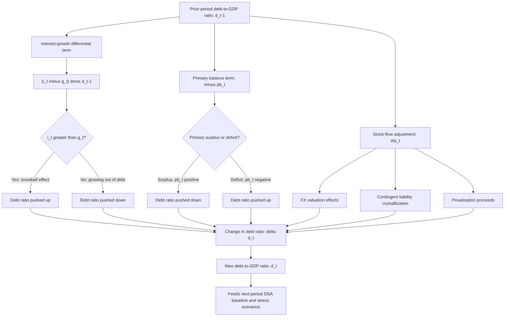

## The Debt Dynamics Equation: Primary Balance, Growth, and Interest-Rate Differentials

### Definition and Function

The **debt dynamics equation** is the algebraic identity that decomposes the change in a sovereign's debt-to-GDP ratio from one period to the next into its constituent drivers: the **primary balance** (the budget balance excluding interest payments — recall that isolating this from the interest-inclusive overall balance separates the discretionary fiscal stance from the inherited debt-service burden), the **interest-growth differential** (the gap between the effective interest rate paid on debt and the nominal GDP growth rate), and any **stock-flow adjustments** (valuation effects, contingent-liability crystallization, and similar factors not captured by the flow budget balance itself). This equation is the analytical core of every **debt sustainability analysis (DSA)**, since it is the mechanical law governing how today's fiscal choices, growth outcomes, and financing costs translate into tomorrow's debt burden.

### Deriving the Equation

Start from the basic accounting identity linking one period's debt stock to the next:

$$D_t = D_{t-1} + i_t D_{t-1} - PB_t + SFA_t$$

where $D_t$ is the nominal debt stock at the end of period $t$, $i_t$ is the effective nominal interest rate paid on the debt stock, $PB_t$ is the primary balance (positive when a surplus, reducing debt), and $SFA_t$ is the stock-flow adjustment (discussed below). This says, in words: this year's debt equals last year's debt, plus the interest accrued on it, minus whatever primary surplus was generated to pay it down, plus any other stock-changing factor outside the budget balance itself.

To make this policy-relevant, convert to a **ratio to GDP**, since debt sustainability is conventionally assessed relative to the economy's capacity to service it, not in absolute currency terms. Let $d_t = D_t / Y_t$ (debt-to-GDP ratio) and $pb_t = PB_t / Y_t$ (primary balance-to-GDP ratio), where $Y_t$ is nominal GDP. Dividing the identity through by $Y_t$ and rearranging (using $Y_t = Y_{t-1}(1+g_t)$, where $g_t$ is the nominal GDP growth rate) yields the standard **debt dynamics equation**:

$$d_t = \frac{1+i_t}{1+g_t} d_{t-1} - pb_t + sfa_t$$

A widely used first-order approximation, valid when $i_t$ and $g_t$ are both small relative to 1, simplifies this to:

$$d_t \approx d_{t-1} + (i_t - g_t) \, d_{t-1} - pb_t + sfa_t$$

or, isolating the change in the debt ratio, $\Delta d_t = d_t - d_{t-1}$:

$$\Delta d_t \approx (i_t - g_t)\, d_{t-1} - pb_t + sfa_t$$

This final form is the one most commonly presented in DSA reports and policy analysis, because it directly isolates the three distinct channels through which the debt ratio moves.

### Interpreting Each Term

**The interest-growth differential, $(i_t - g_t)$**

This term captures the **snowball effect**: even with a primary balance of exactly zero (revenue exactly covers non-interest spending), the debt ratio will still rise if the effective interest rate on the debt exceeds the nominal growth rate of the economy ($i_t > g_t$), because the debt stock compounds at $i_t$ while the denominator (GDP) it is measured against grows only at $g_t$. Conversely, if $g_t > i_t$ — often loosely summarized as **"growing out of debt"** — the debt ratio *mechanically declines* even absent any primary surplus, purely because the economy is expanding faster than the debt burden compounds. This single differential is arguably the single most consequential number in sovereign debt sustainability analysis, since a persistently favorable differential ($g > i$) can sustain a stable or falling debt ratio even under moderate primary deficits, while a persistently adverse differential ($i > g$) requires an offsetting primary surplus merely to keep the ratio from rising — and requires successively *larger* primary surpluses to actually reduce it, a dynamic explored further below.

**The primary balance, $pb_t$**

This is the direct, discretionary fiscal-policy lever: the government's *current* choice about revenue collection and non-interest expenditure. A primary surplus ($pb_t > 0$) directly reduces the debt ratio; a primary deficit ($pb_t < 0$) directly increases it. Because it is the one term of the three that finance ministry fiscal policy controls most directly (interest rates and growth are influenced by, but not purely determined by, government policy), the primary balance is the standard object of fiscal consolidation programs and IMF program conditionality, and the **debt-stabilizing primary balance** — the specific primary balance level that would hold the debt ratio exactly constant given the prevailing interest-growth differential — is a frequently cited benchmark, derived by setting $\Delta d_t = 0$ (and $sfa_t = 0$) and solving:

$$pb_t^{*} = (i_t - g_t)\, d_{t-1}$$

**Stock-flow adjustments, $sfa_t$**

This residual term captures debt-ratio changes that arise from factors *outside* the flow budget balance — most commonly: **exchange-rate valuation effects** (a depreciation increases the local-currency value of outstanding foreign-currency debt, raising the debt ratio without any new borrowing having occurred — recall this is precisely the currency-risk channel in sovereign portfolio risk management); the **crystallization of contingent liabilities** (a called guarantee or SOE bailout, recall, converts an off-balance-sheet exposure into a sudden direct addition to the debt stock, entering here rather than through the budget balance); privatization proceeds used to retire debt (a negative SFA, reducing the ratio); and below-the-line financing operations or statistical discrepancies between fiscal accounts and debt records. A large, volatile, or poorly explained SFA term in a country's historical debt data is itself a red flag DSA analysts and rating agencies scrutinize, since it can indicate either genuine hidden fiscal risk (undisclosed contingent liabilities materializing) or, less charitably, statistical or governance weaknesses in debt recording.

### The Nominal vs. Real Interest-Growth Differential

The equation above uses nominal terms throughout ($i_t$ the nominal effective interest rate, $g_t$ nominal GDP growth), which is the standard DSA convention since actual debt-service payments and GDP are both observed in nominal currency terms. It is nonetheless useful to decompose the nominal differential into its real components, since the underlying economic drivers of $i_t$ and $g_t$ operate partly through separate channels. Using the Fisher relation approximation $i_t \approx r_t + \pi_t$ (nominal rate ≈ real rate plus expected inflation) and $g_t \approx \gamma_t + \pi_t$ (nominal growth ≈ real growth plus GDP deflator inflation), the nominal differential reduces approximately to $(i_t - g_t) \approx (r_t - \gamma_t)$ when inflation affects the interest rate and growth rate symmetrically — meaning that, to a first approximation, unexpected inflation *erodes* the real value of fixed-rate, local-currency-denominated debt (a debt-ratio-reducing effect operating through the SFA or through $i_t$ depending on modeling convention), while real growth $\gamma_t$ is the more fundamentally sustainable channel through which the differential can be favorably influenced by structural policy, as opposed to relying on inflation surprises, which carry their own well-known costs and are not a repeatable or credible sustainability strategy. [Inference: the exact decomposition and its precision depends on the specific inflation-indexation structure of a given debt portfolio — e.g., whether debt is fixed-rate, inflation-linked, or foreign-currency-denominated — and this simplified Fisher-relation approximation is a standard pedagogical device rather than a precise identity for any specific real-world portfolio.]

### Worked Example: A Stylized Philippine Debt Dynamics Calculation

Assume a hypothetical starting position for illustration, not a claim about verified current BTr or DBCC published figures:

- $d_{t-1} = 60\%$ of GDP (prior-year debt-to-GDP ratio)
- $i_t = 6.0\%$ (effective nominal interest rate on the debt stock)
- $g_t = 7.5\%$ (nominal GDP growth: assume ~5.5% real growth plus ~2% GDP deflator inflation)
- $pb_t = -1.0\%$ of GDP (a modest primary deficit)
- $sfa_t = 0$ (no valuation effects or contingent-liability crystallization this period)

Applying the approximate debt dynamics equation:

$$\Delta d_t \approx (0.060 - 0.075)(0.60) - (-0.010) = (-0.015)(0.60) + 0.010 = -0.009 + 0.010 = +0.001$$

The debt ratio rises by approximately 0.1 percentage point of GDP — very slightly, because the *favorable* interest-growth differential ($g_t > i_t$, contributing $-0.9$ percentage points, i.e., debt-ratio-reducing) is almost, but not quite, offset by the primary deficit's debt-ratio-increasing contribution ($+1.0$ percentage point). This illustrates directly why a sovereign with strong nominal growth and moderate interest costs can run a modest primary deficit while still holding its debt ratio roughly stable — precisely the dynamic that characterized the Philippines' debt trajectory through periods of strong real GDP growth in the 2010s, before the COVID-19 shock simultaneously depressed $g_t$ (via the growth contraction) and widened $pb_t$ into deficit (via pandemic fiscal response), pushing the debt ratio up through *both* channels simultaneously — the textbook "adverse scenario" combination DSA stress tests are specifically designed to capture.

Now consider the **debt-stabilizing primary balance** for this same starting position: with $i_t - g_t = -1.5\%$ and $d_{t-1} = 60\%$, $pb_t^{*} = (-0.015)(0.60) = -0.9\%$ of GDP — meaning any primary balance *less negative* than a 0.9%-of-GDP deficit (including the actual $-1.0\%$ assumed above, which is why the ratio still rose slightly) would need to be *at least* $-0.9\%$ to hold the ratio exactly flat, illustrating how a favorable growth-interest differential meaningfully relaxes the primary-balance requirement for stability relative to a scenario where $i_t > g_t$.

### The Compounding Danger of an Adverse Differential

The debt dynamics equation also explains the well-documented, empirically observed phenomenon of **debt spirals**: when $i_t > g_t$ persistently and by a wide margin (a scenario common during a sovereign debt crisis, where market-perceived risk itself drives $i_t$ sharply higher, which in turn *worsens* the fiscal position, which in turn can further raise perceived risk — a genuine feedback loop, not merely an additive one), the debt-stabilizing primary balance $pb_t^{*}$ rises with each period's higher starting debt stock $d_{t-1}$, requiring successively larger and more politically and economically costly primary surpluses merely to prevent further deterioration, let alone to reduce the ratio. This mechanism — rather than any single year's fiscal deficit in isolation — is the core analytical explanation for why sovereign debt crises, once a sufficiently adverse interest-growth differential takes hold, can become self-reinforcing and require either an unusually large sustained fiscal adjustment, a debt restructuring (recall this reduces $D_{t-1}$ directly, resetting the compounding base), or an improvement in growth prospects sufficient to reverse the differential's sign.

### Mermaid Diagram: The Debt Dynamics Decomposition

### SVG Illustration: Debt-Stabilizing Primary Balance vs. Interest-Growth Differential (svg_diagram)

<svg viewBox="0 0 700 420" xmlns="http://www.w3.org/2000/svg">
\<style\>
.ax{stroke:#333;stroke-width:2;}
.line{stroke:#2c5c99;stroke-width:3;fill:none;}
.zero{stroke:#888;stroke-width:1;stroke-dasharray:4,3;}
.lbl{font-family:sans-serif;font-size:12px;fill:#222;}
.ttl{font-family:sans-serif;font-size:15px;fill:#111;font-weight:bold;}
.pt{fill:#c0392b;}
\</style\>
<text x="20" y="25" class="ttl">Debt-Stabilizing Primary Balance as (i - g) Varies (svg_diagram)</text>
<line x1="70" y1="200" x2="650" y2="200" class="ax"/>
<line x1="360" y1="360" x2="360" y2="50" class="ax"/>
<text x="500" y="220" class="lbl">(i − g), positive →</text>
<text x="130" y="220" class="lbl">← (i − g), negative</text>
<text x="370" y="60" class="lbl">Required primary</text>
<text x="370" y="75" class="lbl">surplus (pb*) ↑</text>
<text x="370" y="345" class="lbl">Primary deficit</text>
<text x="370" y="360" class="lbl">affordable ↓</text>
<line x1="150" y1="330" x2="570" y2="90" class="line"/>
<line x1="70" y1="200" x2="650" y2="200" class="zero"/>
<circle cx="360" cy="200" r="5" class="pt"/>
<text x="370" y="195" class="lbl">i = g: pb* = 0 (debt ratio self-stabilizing)</text>
<circle cx="500" cy="130" r="5" class="pt"/>
<text x="510" y="125" class="lbl">i > g: surplus required</text>
<circle cx="220" cy="270" r="5" class="pt"/>
<text x="90" y="295" class="lbl">i < g: deficit still stable</text>
</svg>

### Practical Implications for DSA and Fiscal Policy Design

The debt dynamics equation is the direct mechanical foundation of every debt sustainability analysis baseline and stress-test projection: a DSA baseline scenario is, at its core, a multi-year projection of $i_t$, $g_t$, $pb_t$, and expected $sfa_t$, iterated forward through this equation, while DSA stress scenarios systematically shock one or more of these inputs (a growth shock lowering $g_t$, an interest-rate shock raising $i_t$, a contingent-liability shock adding a one-off $sfa_t$) to test the debt ratio's resilience. For fiscal policy design specifically, the equation clarifies that debt sustainability is never solely a function of the primary balance in isolation — a finance ministry pursuing fiscal consolidation while growth is simultaneously weakening may find the debt ratio still rising, because the primary-balance improvement is being offset or overwhelmed by an adverse interest-growth differential, which is precisely why structural, growth-enhancing reform is frequently emphasized alongside primary-balance targets in credible medium-term fiscal frameworks, rather than treating fiscal consolidation as a sufficient condition for debt sustainability on its own.

**Related Topics**

- Debt sustainability analysis (DSA) baseline and stress-test scenario design
- Fiscal space: definition, measurement, and policy applications
- The primary balance as a fiscal-policy stance indicator and MTDS input
- Sovereign debt restructuring and the mechanics of debt-stock reduction
- Debt management office functions and sovereign portfolio risk
- Real versus nominal interest rates and the role of inflation in debt erosion