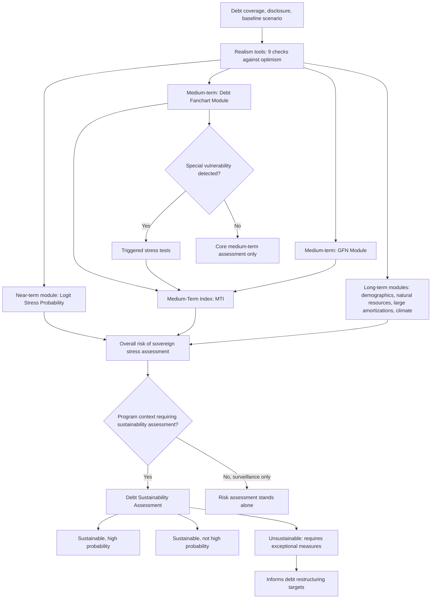

## The IMF Sovereign Risk and Debt Sustainability Framework for Market-Access Countries

### Definition and Institutional Placement

The **Sovereign Risk and Debt Sustainability Framework (SRDSF)** is the IMF's standardized analytical tool for assessing sovereign debt risk and sustainability in **market access countries (MACs)** — countries that are not eligible for the Fund's Poverty Reduction and Growth Trust (PRGT) facilities, encompassing all advanced economies and most emerging market economies, with the IMF-World Bank **Debt Sustainability Framework for Low-Income Countries (LIC DSF)** serving as the parallel tool for PRGT-eligible countries. Approved by the IMF's Executive Board in January 2021, the SRDSF replaced its predecessor, the Debt Sustainability Analysis for Market Access Countries (MAC DSA), following a comprehensive review that identified methodological reform areas, with phased adoption beginning in June 2022. [Staff Guidance Note on the Sovereign Risk and Debt ... +2](https://www.imf.org/-/media/files/publications/pp/2022/english/ppea2022039.pdf)

For a borrower-side finance ministry, the SRDSF matters because it is the operational lens through which the IMF — and, by extension, much of the market that tracks IMF assessments — evaluates whether a sovereign's current fiscal trajectory is sustainable, whether new financing or fiscal adjustment can resolve emerging stress, or whether debt restructuring is unavoidable. The framework supports the Fund's surveillance and lending functions: in surveillance, it acts as an early warning system gauging debt-related risks and can help identify policy recommendations to prevent stress from materializing; in the context of precautionary arrangements, it additionally helps verify compliance with debt sustainability qualification requirements; and in nonprecautionary Fund-supported programs, it helps determine whether stress can be resolved through adjustment and new financing, or whether exceptional measures such as debt restructuring are needed. [International Monetary Fund](https://www.imf.org/-/media/files/publications/pp/2022/english/ppea2022039.pdf)

### Core Conceptual Distinctions

The framework rests on three distinct concepts that are frequently conflated in looser public discussion but carry precise, separate meanings within the SRDSF:

**Sovereign stress**: An event where market and/or fiscal pressures related to public debt become acute, with no presumption as to whether those pressures can be resolved through fiscal adjustment and economic reform, some combination of adjustment and financing, or exceptional measures like debt restructuring. [International Monetary Fund](https://www.imf.org/-/media/files/publications/pp/2022/english/ppea2022039.pdf)

**Unsustainable debt**: A situation where there are no politically and economically feasible policies that stabilize the debt-to-GDP ratio and deliver acceptably low rollover risk without restructuring and/or exceptional bilateral support, even in the presence of Fund financing. The IMF's definition deliberately extends beyond the academic definition of sustainability (which typically emphasizes debt stabilization alone as sufficient to rule out a Ponzi-like debt dynamic) by also incorporating rollover risk directly, since a debt path can be arithmetically stabilizable yet still expose the sovereign to a market-access disruption that a narrower solvency-only definition would miss. [International Monetary Fund](https://www.imf.org/-/media/files/publications/pp/2022/english/ppea2022039.pdf)

**Debt non-stabilization under the baseline**: A situation in which a country's debt-to-GDP ratio is not expected to stabilize under the best prediction of policies by the end of the projection horizon — a distinct, narrower concept from unsustainability, since non-stabilization does not always indicate sovereign stress or unsustainable debt: temporary fiscal relaxations followed by adjustment, an infrastructure scale-up that ends when projects finish, or exceptional official financing can all produce non-stabilization in the baseline without the debt being genuinely unsustainable. [International Monetary Fund](https://www.imf.org/-/media/files/publications/pp/2022/english/ppea2022039.pdf)[International Monetary Fund](https://www.imf.org/-/media/files/publications/pp/2022/english/ppea2022039.pdf)

### The Modular, Multi-Horizon Architecture

The SRDSF is a collection of modules organized around three time horizons, aiming to be comprehensive across a range of subjects. The core framework, applied to all MACs, consists of three modules: the near-term early warning system (a logit model), the Debt Fanchart Module, and the Gross Financing Needs (GFN) Module. Beyond this core, additional specialized long-term modules apply where relevant to a specific country's circumstances. [International Monetary Fund](https://www.imf.org/-/media/files/publications/pp/2022/english/ppea2022039.pdf)

**Near-term horizon (1–2 years)**: An Early Warning System that predicts sovereign stress events using reported data outturns on indicators of a country's quality of institutions and stress history, cyclical position, debt burden and buffers, and global conditions. [International Monetary Fund](https://www.imf.org/-/media/files/publications/pp/2022/english/ppea2022039.pdf)

**Medium-term horizon (5 years)**: Combines two modules capturing solvency and liquidity risks respectively. The Debt Fanchart Module focuses on solvency risks stemming from a country's debt burden over the next 5 years, while the Gross Financing Needs Module handles liquidity risks and a country's ability to meet its gross financing needs — its "financeability" — over the medium term. Additional stress tests can be triggered for some countries to assess a specific vulnerability. [International Monetary Fund](https://www.imf.org/-/media/files/publications/pp/2022/english/ppea2022039.pdf)[International Monetary Fund](https://www.imf.org/-/media/files/publications/pp/2022/english/ppea2022039.pdf)

**Long-term horizon**: Optional specialized modules covering climate change, long-run fiscal costs from demographics, large debt amortizations, and the development or exhaustion of natural resources — tools which may not be applicable to all countries. [International Monetary Fund](https://www.imf.org/-/media/files/publications/pp/2022/english/ppea2022039.pdf)

### The Debt Dynamics Identity Underlying the Framework

The SRDSF's baseline projections rest on the same fundamental debt dynamics identity described generally in the primary-balance/growth/interest-rate framework, but the SRDSF's own formal derivation (set out in the guidance note's Box 3) makes explicit an additional term relevant to sovereigns carrying meaningful foreign-currency debt: the **real exchange rate contribution**. The framework's full decomposition of the change in the debt ratio is:

$$\Delta d_t = \frac{z_t d_{t-1}^{f}}{(1+g_t)(1+\pi_t^{f})} + \frac{r_t - g_t}{1+g_t}d_{t-1} + \frac{\pi_t^{d} - \pi_t^{f}}{(1+\pi_t^{f})\rho_t}d_{t-1}^{f} - pb_t + sfa_t$$

where the first (purple) term captures the **real exchange rate effect** on the foreign-currency debt share $d_{t-1}^f$, the second (blue) term is the familiar **real interest-growth differential** applied to total debt $d_{t-1}$, the third (red) term captures a **relative inflation** effect specific to the foreign-currency share, and $sfa_t$ remains the stock-flow adjustment residual (recall this captures valuation effects, contingent-liability crystallization, and other factors outside the flow budget balance). Setting the change in debt to zero and assuming no change in the real exchange rate and no stock-flow adjustments yields the debt-stabilizing primary balance, generalizing the simpler formula to explicitly account for the foreign-currency debt share $\alpha_t^f$: [International Monetary Fund](https://www.imf.org/-/media/files/publications/pp/2022/english/ppea2022039.pdf)

$$pb_t^{*} = \frac{d_{t-1}}{1+g_t}\left(\frac{\pi_t^d - \pi_t^f}{1+\pi_t^d}\alpha_t^f + r_t - g_t\right)$$

Consistent with the predecessor MAC DSA and the World Economic Outlook, the SRDSF's primary deficit measure is defined as noninterest expenditures less noninterest revenues, with interest revenue accounted for separately in the calculation of debt issuance and gross financing needs — a definitional nuance distinct from the GFSM 2014 standard primary balance concept, worth flagging precisely because it affects direct comparability with a country's own domestically published primary balance figures. [International Monetary Fund](https://www.imf.org/-/media/files/publications/pp/2022/english/ppea2022039.pdf)

### Debt Coverage: The Public Sector Perimeter

A methodologically consequential SRDSF design choice is its treatment of **debt coverage** — precisely which government-related entities' liabilities count toward the debt stock analyzed. The SRDSF identifies four nested perimeters, each a superset of the previous: central government (CG), consisting of institutional units with political authority over the entire territory; general government (GG), adding state, provincial, regional, and local government units plus nonmarket nonprofit institutions they control; the nonfinancial public sector (NFPS), adding nonfinancial public corporations such as SOEs; and the consolidated public sector (CPS), adding financial public corporations including, notably, the central bank. The default institutional perimeter for gross public debt in the SRDSF is the general government, reflecting GFSM 2014 standards, though narrower central-government coverage may be appropriate for small island states or highly centralized economies lacking significant subnational governments, and broader NFPS or CPS coverage may be used where it better anchors a country's own fiscal policy discussion — a direct, practically important consideration for a sovereign like the Philippines, where GOCC and SOE debt dynamics (recall the discussion of SOE-related contingent liabilities) can materially diverge from the narrower central-government figure typically reported in headline statistics. [Staff Guidance Note on the Sovereign Risk and Debt ... +2](https://www.imf.org/-/media/files/publications/pp/2022/english/ppea2022039.pdf)

Notably, the debt (and deficits) of SOEs, special-purpose vehicles, and other largely government-controlled entities operating on a nonmarket basis should be included in the DSA as part of general government even if the authorities' own official definitions exclude them — a direct instruction to look through domestic accounting conventions toward economic substance, precisely the transparency discipline that the contingent-liability literature's "off-balance-sheet risk" critique targets. [International Monetary Fund](https://www.imf.org/-/media/files/publications/pp/2022/english/ppea2022039.pdf)

### Realism Tools: Guarding Against Optimistic Projections

The SRDSF includes a suite of nine realism tools designed to detect and discourage overly optimistic debt, fiscal, and macroeconomic projections, addressing a well-documented historical failure mode in sovereign debt analysis: DSAs that assumed unrealistically favorable growth, fiscal-adjustment, or exchange-rate paths, producing sustainability conclusions that subsequent events did not bear out. Key tools include: [International Monetary Fund](https://www.imf.org/-/media/files/publications/pp/2022/english/ppea2022039.pdf)

- **Forecast track record**: a color-coded table showing forecast errors for debt drivers — the primary deficit, the real interest-growth differential, exchange rate depreciation, and stock-flow adjustments — at one-, three-, and five-year horizons against a relevant peer comparator group. [International Monetary Fund](https://www.imf.org/-/media/files/publications/pp/2022/english/ppea2022039.pdf)
- **Debt-driver decomposition and cross-country distribution tools**: comparing a country's projected debt-to-GDP reduction and fiscal adjustment magnitude against both its own historical experience and the cross-country distribution of market access countries from 1990–2019, flagging a projection above the 75th percentile of either distribution as a potential sign of over-optimism. [International Monetary Fund](https://www.imf.org/-/media/files/publications/pp/2022/english/ppea2022039.pdf)
- **REER gap, growth, fiscal-multiplier, and financing-terms tools**: checking, respectively, whether an initial real effective exchange rate misalignment is realistically projected to unwind; whether growth projections stay consistent with potential output and historical averages; whether the growth path implied by a planned fiscal consolidation (using plausible fiscal multipliers of 0.5, 1, and 1.5) is internally consistent with the baseline growth assumption; and whether projected borrowing-cost compression is consistent with the **Laubach rule** (which states that bond spreads increase linearly by about 4 basis points in response to a 1 percentage-point increase in the projected debt-to-GDP ratio). [International Monetary Fund](https://www.imf.org/-/media/files/publications/pp/2022/english/ppea2022039.pdf)[International Monetary Fund](https://www.imf.org/-/media/files/publications/pp/2022/english/ppea2022039.pdf)

### Near-Term Risk Assessment: The Logit Model

The SRDSF's multivariate logistic regression model is the workhorse tool for standardized near-term risk analysis, producing a fitted Logit Stress Probability (LSP) measuring the chance of a stress event materializing within 1–2 years, using observed (not projected) data across four variable categories: structural characteristics (institutional quality and stress history), cyclical position (current account balance, credit-to-GDP gap, and REER change), debt burden and buffers (public debt-to-GDP change, public debt-to-revenue, foreign-currency debt-to-GDP, and international reserves-to-GDP), and global conditions (the change in the VIX volatility index). Because the LSP relies only on realized values rather than projections, it cannot suffer from the optimism bias that can affect forward-looking scenario work — a deliberate design safeguard. [Staff Guidance Note on the Sovereign Risk and Debt ... +2](https://www.imf.org/-/media/files/publications/pp/2022/english/ppea2022039.pdf)

**Defining sovereign stress empirically**: the model is calibrated against a historical dataset of actual stress episodes, defined via concrete quantitative criteria spanning large IMF-supported and other exceptional financing, sovereign default (external arrears exceeding 5 percent of public external debt and rising, or domestic debt default), debt restructuring, chronic excessive inflation (inflation doubling year-on-year and exceeding 25 percent, or any episode exceeding 100 percent), market-indicator stress (spreads at least 1.5 standard deviations above the 10-year mean and above 150 basis points for advanced economies, or EMBIG spreads doubling and exceeding 500 basis points for emerging markets), loss of market access, and financial repression indicators. [International Monetary Fund](https://www.imf.org/-/media/files/publications/pp/2022/english/ppea2022039.pdf)

### Medium-Term Risk Assessment: Fanchart and GFN Modules

The **Debt Fanchart Module** addresses **solvency risk** — whether the debt-to-GDP trajectory itself is likely to spiral upward — by simulating a probabilistic distribution ("fan") of future debt paths around the baseline projection, reflecting the historical variance and correlation structure of the underlying debt-driver shocks (growth, interest rate, exchange rate, primary balance surprises), rather than relying on a single deterministic path.

The **Gross Financing Needs (GFN) Module** addresses **liquidity risk** — whether the sovereign can actually roll over and finance its near-term obligations even if the longer-run debt trajectory is fundamentally solvent — recognizing directly that a solvent sovereign can still face acute stress if it cannot meet a concentrated near-term financing requirement (recall this is precisely the rollover-risk dimension of sovereign portfolio risk management, and the GFN metric is the direct medium-term analytical counterpart to the redemption-profile and WAM metrics a debt management office monitors operationally).

Each module transforms its input variables into a single numerical risk index, defined such that a higher value represents higher risk, and the Debt Fanchart and GFN Module indices are then combined into an aggregate Medium-Term Index (MTI) using simple averaging. [International Monetary Fund](https://www.imf.org/-/media/files/publications/pp/2022/english/ppea2022039.pdf)

### The Three-Zone Signal Methodology

A distinctive SRDSF design feature — common across the near-term logit model and the medium-term indices — is its **calibrated three-zone risk signal**, deliberately avoiding a single binary crisis/no-crisis cutoff. The framework divides each risk index into low, moderate, and high risk zones, defined by calibrating two thresholds based on the empirical probabilities of "false alarms" (predicting stress that does not materialize, a Type I error) and "missed crises" (failing to predict stress that does materialize, a Type II error). The low-risk threshold is set such that predicting "no stress" below it implies a missed-crisis probability of 10 percent; the high-risk threshold is set such that predicting "stress" above it implies a false-alarm probability of 10 percent. For the near-term tool, the average stress probability associated with a high-risk signal is 0.40, versus 0.02 for a low-risk signal; for the medium-term index, the corresponding figures are 0.43 and 0.04 — figures that make explicit an important interpretive caveat: "high risk" does not mean a stress event is necessarily the most likely outcome, only that the risk is high enough to warrant serious attention. [Staff Guidance Note on the Sovereign Risk and Debt ... +2](https://www.imf.org/-/media/files/publications/pp/2022/english/ppea2022039.pdf)

### Long-Term Modules and the Role of Judgment

Beyond the core near- and medium-term modules, the SRDSF's optional long-term tools — the demographics module (pension and healthcare cost trajectories under population aging), the natural resources module (relevant to resource-dependent sovereigns facing eventual reserve depletion), the large debt amortizations module, and the climate change module — extend the analytical horizon well beyond the standard 5-year medium-term window, addressing structural fiscal pressures that compound slowly but can eventually dominate a sovereign's fiscal trajectory.

Critically, informed judgment is an integral, explicitly sanctioned component of SRDSF assessments, since models cannot capture every circumstance. Users must rely on a judgment-based final assessment whenever a mechanical signal is counterintuitive or when the standard tools provide no mechanical signal at all, as is the case for the long-term and overall risk assessments — meaning the long-term modules feed a synthesized narrative judgment rather than a further mechanical index, and while there are no hard ex-ante constraints on this judgment, it is scrutinized during the IMF's interdepartmental review process, with IMF Management arbitrating disagreements across departments when SRDSAs are prepared by Fund staff. [Staff Guidance Note on the Sovereign Risk and Debt ... +2](https://www.imf.org/-/media/files/publications/pp/2022/english/ppea2022039.pdf)

### From Risk Assessment to Sustainability Assessment

The SRDSF's risk-assessment tools (near-term, medium-term, long-term) feed into two distinct final outputs. The **overall risk of sovereign stress assessment** synthesizes signals across all horizons into a single narrative judgment. Separately, a **debt sustainability assessment** — required for all IMF-supported programs, optional in pure surveillance — parallels the core modules of the risk framework but with differences in design and calibration: rather than producing a low/moderate/high risk signal, its output is a single mechanical signal indicating whether debt is sustainable with high probability, sustainable but not with high probability, or unsustainable. This distinction is directly consequential in a program context: where debt is assessed as unsustainable, this indicates that fiscal adjustment and new financing alone are insufficient and exceptional measures — including debt restructuring — will be necessary, since (with rare exceptions where markets grossly misprice risk) unsustainable debt is normally accompanied by sovereign stress, while a "sustainable but not with high probability" finding permits continued program engagement without necessarily triggering restructuring. [International Monetary Fund](https://www.imf.org/-/media/files/publications/pp/2022/english/ppea2022039.pdf)[International Monetary Fund](https://www.imf.org/-/media/files/publications/pp/2022/english/ppea2022039.pdf)

### Mermaid Diagram: The SRDSF Modular Architecture

### SVG Illustration: The Three-Zone Signal Threshold Calibration (svg_diagram)

<svg xmlns="http://www.w3.org/2000/svg" viewBox="0 0 700 400">
\<style\>
.ax{stroke:#333;stroke-width:2;}
.low{fill:#d6ecd2;}
.mod{fill:#fdf3c4;}
.high{fill:#f7cfc7;}
.lbl{font-family:sans-serif;font-size:12px;fill:#222;}
.ttl{font-family:sans-serif;font-size:15px;fill:#111;font-weight:bold;}
.line1{stroke:#2c5c99;stroke-width:2;fill:none;}
.line2{stroke:#c0392b;stroke-width:2;fill:none;}
\</style\>
<text x="20" y="25" class="ttl">SRDSF Risk Zone Calibration (svg_diagram)</text>
<rect x="70" y="60" width="150" height="260" class="low" />
<rect x="220" y="60" width="200" height="260" class="mod" />
<rect x="420" y="60" width="230" height="260" class="high" />
<line x1="70" y1="320" x2="650" y2="320" class="ax" />
<text x="120" y="340" class="lbl">Low risk zone</text>
<text x="280" y="340" class="lbl">Moderate risk zone</text>
<text x="500" y="340" class="lbl">High risk zone</text>
<line x1="220" y1="60" x2="220" y2="320" stroke="#555" stroke-width="1.5" stroke-dasharray="4,3" />
<text x="140" y="55" class="lbl">τ_low</text>
<line x1="420" y1="60" x2="420" y2="320" stroke="#555" stroke-width="1.5" stroke-dasharray="4,3" />
<text x="380" y="55" class="lbl">τ_high</text>
<text x="130" y="120" class="lbl">Missed crisis</text>
<text x="130" y="136" class="lbl">probability = 10%</text>
<text x="470" y="120" class="lbl">False alarm</text>
<text x="470" y="136" class="lbl">probability = 10%</text>
<text x="260" y="200" class="lbl">Posterior stress probability:</text>
<text x="260" y="216" class="lbl">~0.02–0.04 (low) vs ~0.40–0.43 (high)</text>
<text x="150" y="370" class="lbl">Risk index value increases →</text>
</svg>

### Practical Implications for Fiscal Statecraft

For a finance ministry or debt management office, the SRDSF's methodology carries a direct operational lesson beyond its use as an external IMF assessment tool: its structure — separating **solvency risk** (fanchart), **liquidity risk** (GFN), and **near-term triggering risk** (logit model) into distinct, separately monitored channels, each with its own calibrated warning threshold — is itself a template worth internalizing for domestic debt-risk monitoring, since it makes explicit that a sovereign can be fundamentally solvent on a medium-term debt trajectory while still facing acute near-term stress from a financing-need concentration or an adverse global sentiment shift, precisely the distinction that a headline debt-to-GDP figure alone cannot convey. The framework's emphasis on debt coverage completeness (looking through narrow central-government reporting to the broader general-government or NFPS perimeter) and its systematic realism-tool discipline against optimistic projections both directly reinforce, from the multilateral-surveillance side, the same transparency and contingent-liability-disclosure practices that a well-functioning domestic debt management office and fiscal risk statement should independently maintain.

**Related Topics**

- The debt dynamics equation: primary balance, growth, and interest-rate differentials
- Debt management office functions and sovereign portfolio risk
- Contingent liabilities, guarantees, and off-balance-sheet fiscal risk
- Credit rating agency methodology and the determinants of sovereign ratings
- Sovereign debt restructuring: collective action clauses and the Paris Club/private creditor process
- The LIC DSF and its distinctions from the SRDSF for concessional-finance-dependent sovereigns