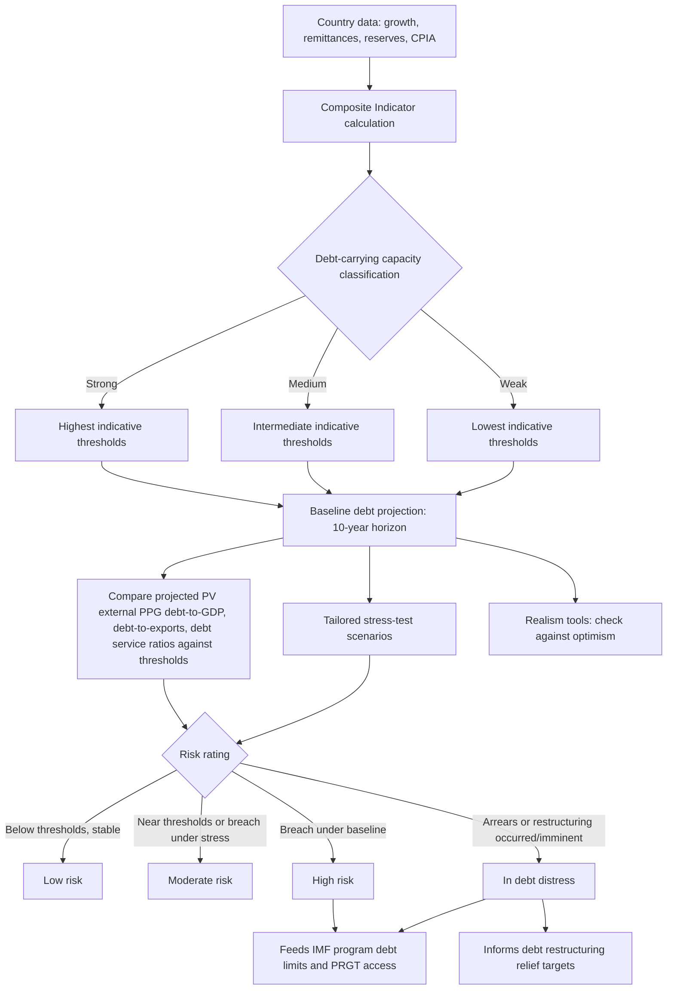

## The IMF-World Bank Debt Sustainability Framework for Low-Income Countries

### Definition and Institutional Placement

The **Debt Sustainability Framework for Low-Income Countries (LIC DSF)** is the joint IMF-World Bank analytical tool for assessing debt-related vulnerabilities in low-income countries — the counterpart to the SRDSF for the borrower category on the other side of the market-access divide. Recall that market access countries (MACs) are assessed under the SRDSF; LICs, by contrast, are countries eligible for the IMF's concessional **Poverty Reduction and Growth Trust (PRGT)** financing and, correspondingly, for the World Bank's **International Development Association (IDA)** zero-interest concessional lending window — meaning the LIC DSF applies specifically to sovereigns whose financing structure is dominated by concessional, official-sector lending rather than by market-priced bond issuance, a structural difference from MACs that shapes the framework's entire design philosophy.

First introduced in 2005 and most recently comprehensively revised in 2017 (becoming operational in 2018), the LIC DSF's design philosophy differs fundamentally from the SRDSF's in one key respect worth stating explicitly at the outset: because LICs typically lack deep, liquid domestic and international bond markets and therefore cannot be assessed primarily through market-signal-based risk indicators (spreads, market access loss, and similar variables central to the SRDSF's near-term logit model), the LIC DSF instead anchors its risk assessment around **policy-dependent indicative debt-burden thresholds** — the idea that the debt level a country can safely sustain depends systematically on the quality of that country's policies and institutions, since countries with stronger policy frameworks and institutions have historically demonstrated the capacity to service higher debt burdens reliably than those with weaker frameworks at the same nominal debt level.

### Function Within Fiscal Statecraft and Multilateral Lending Architecture

For a borrower-side finance ministry operating under this framework, the LIC DSF is not merely diagnostic — it is directly load-bearing within the operational architecture of concessional lending access. Debt sustainability assessments produced under the LIC DSF directly determine access to IMF financing and are used for the design of **debt limits** in IMF-supported programs (contractual ceilings restricting how much and what type of new debt a program country may contract while under a Fund arrangement), and the framework is embedded directly in the operational rules of the World Bank's IDA financing — meaning a country's LIC DSF risk rating has immediate, mechanical consequences for its access to the cheapest tier of available sovereign financing, not merely an advisory or surveillance function.

### The Composite Indicator and Debt-Carrying Capacity Classification

The core methodological innovation of the 2017 reform was the introduction of a **Composite Indicator (CI)** to classify each country's debt-carrying capacity into one of three categories: **strong**, **medium**, or **weak**. Rather than relying solely on the World Bank's **Country Policy and Institutional Assessment (CPIA)** index — the sole classification input under the pre-2017 framework — the Composite Indicator draws on a broader set of variables including a country's historical growth performance, the outlook for real GDP growth, remittance inflows, international reserves, and world growth, alongside the CPIA itself, on the underlying rationale that countries with strong institutions should be able to take on and service more debt reliably than countries with weaker institutional capacity, even at an identical nominal debt-to-GDP level. This composite-indicator classification step is the direct LIC DSF analog to the SRDSF's near-term logit model's institutional-quality variable and to the sovereign credit rating agencies' institutional-assessment pillar (recall this shared reliance on institutional quality as a debt-carrying-capacity proxy across all three major sovereign risk frameworks — rating agencies, SRDSF, and LIC DSF — is not coincidental, but reflects a broadly convergent view across institutions that debt sustainability cannot be assessed on debt-burden numbers alone, independent of the policymaking environment generating and servicing that debt).

### Indicative Debt-Burden Thresholds

Once a country is classified into the strong, medium, or weak debt-carrying-capacity category, the LIC DSF applies a corresponding, pre-calibrated set of **indicative thresholds** for several external and total public debt-burden indicators, with thresholds for strong performers set highest — reflecting the finding that countries with better macroeconomic performance and policies can generally sustain greater debt accumulation before facing elevated distress risk. The standard indicators against which projected debt paths are compared include the present value (PV) of external public and publicly guaranteed (PPG) debt-to-GDP ratio, the PV of external PPG debt-to-exports ratio, the external debt service-to-exports ratio, the external debt service-to-revenue ratio, and — following the 2017 reform's expansion to total public debt — the PV of total PPG debt-to-GDP ratio, which combines the external PPG debt with nominal domestic public debt to give a fuller picture of a country's total repayment burden rather than focusing on external debt alone. These thresholds are derived through a **probit regression model** estimating the probability of debt distress as a function of a debt-burden indicator, the country's own growth rate, world growth, foreign exchange reserves, and the CPIA rating; the probit regression is then inverted to back out threshold levels for each debt-burden indicator, differentiated by the strong/medium/weak country grouping, calibrated using evenly spaced percentiles of the composite indicator distribution — with the specific calibration explicitly chosen to balance **Type I errors** (missed crises: failing to flag a country that subsequently experiences distress) against **Type II errors** (false alarms: flagging a country that does not subsequently experience distress), the same fundamental missed-crisis/false-alarm trade-off methodology underlying the SRDSF's threshold calibration (recall the SRDSF's explicit 10-percent target for each error type at its low- and high-risk threshold boundaries).

### Identifying Debt Distress Episodes

A methodologically important, if less prominently discussed, component of the framework is its empirical definition of what actually constitutes a historical **debt distress episode** for calibration purposes — the LIC DSF identifies these based on the occurrence of external payment arrears or a commercial debt restructuring, a narrower and more mechanically observable definition than the SRDSF's broader, multi-category sovereign stress criteria (recall the SRDSF's stress definition spans large IMF/IFI financing, default, restructuring, chronic inflation, market-indicator stress, loss of market access, and financial repression) — reflecting the LIC DSF's focus specifically on external payment-capacity failure as the relevant crisis concept for a concessional-financing-dependent borrower population, where market-based stress indicators (spreads, market access loss) are frequently unavailable or uninformative given the limited depth of LIC sovereign bond markets.

### Risk Rating Categories

Based on the comparison of projected debt-burden indicators against the calibrated thresholds, combined with baseline projections and stress-test scenario results, the LIC DSF assigns risk ratings across four categories for both external debt distress and overall (total public) debt distress: **low risk**, **moderate risk**, **high risk**, and **in debt distress** — this last category applied when an actual distress event, such as arrears or a restructuring, has already occurred or is assessed as imminent, distinguishing it from the three preceding forward-looking risk categories. This four-category structure differs from the SRDSF's three-zone (low/moderate/high) signal methodology precisely because the LIC DSF needs to accommodate the "already in distress" state directly within its standard output categories, reflecting the framework's practical use case of assessing countries that are frequently already experiencing, or very close to, a payment crisis at the point of assessment — a scenario the near-term SRDSF module explicitly excludes from its own signal (recall that the SRDSF's near-term assessment is explicitly not produced once a country is already in stress).

### Realism Tools and Tailored Scenario Tests

Paralleling the SRDSF's realism-tool suite, the 2017 LIC DSF reform introduced its own set of **realism tools** designed to detect overly optimistic baseline projections, alongside **tailored stress-test scenarios** that can be triggered for country-specific vulnerabilities — for instance, a natural-disaster shock scenario for small island states with high climate exposure, or a commodity-price shock scenario for resource-dependent exporters, mirroring the SRDSF's own triggered-stress-test mechanism for country-specific risk factors such as banking-crisis or contingent-liability shocks.

### Application to Debt Restructuring

In the context of a sovereign debt restructuring involving a LIC borrower, the LIC DSF analysis directly determines the scale of debt reduction creditors must concede to restore sustainability and thereby unlock continued institutional financing — precisely the same restructuring-target-setting function the SRDSF performs for market access countries reaching an unsustainable-debt determination, but operating through the LIC DSF's threshold-comparison methodology rather than the SRDSF's fanchart/GFN probabilistic risk-index approach.

### Worked Illustration: The Threshold Mechanics in Practice

Consider a stylized illustration of how the classification and threshold system interacts, using indicative structure rather than current specific country data (any actual current classification or threshold levels for a specific country should be verified directly against the latest published IMF/World Bank LIC DSF country document, since composite-indicator classifications and threshold levels are periodically recalibrated and vary by country and time):

| Debt-carrying capacity | Illustrative PV of external PPG debt-to-GDP threshold | Illustrative PV of external PPG debt-to-exports threshold |
| --- | --- | --- |
| Weak | ~30% | ~140% |
| Medium | ~40% | ~180% |
| Strong | ~55% | ~240% |

A country classified as "medium" capacity with a projected PV of external PPG debt-to-GDP ratio of 35% would sit below its applicable 40% threshold — consistent with a lower risk signal on that particular indicator — while the same 35% ratio for a country classified "weak" would exceed its lower 30% threshold, triggering an elevated risk signal on the identical nominal debt level, directly illustrating the framework's central design principle: debt sustainability is fundamentally assessed *relative to* institutional and policy capacity, not against a single universal numerical ceiling. [Inference: these specific illustrative percentages are stylized for pedagogical clarity based on the general threshold-tiering structure documented in the LIC DSF literature; actual current threshold values for each capacity category should be verified against the IMF's latest published DSF guidance note before use in any specific country analysis.]

### Documented Critiques and Reform Debate

The LIC DSF has attracted sustained methodological criticism from academic and policy analysts, most prominently a critique associated with Brookings Institution and Carnegie Endowment analysis, centering on several specific points worth presenting as a genuine, actively contested debate rather than a settled matter:

**Omission of debt dynamics fundamentals**: A central critique holds that the 2017 LIC DSF's probit model omits direct indicators of public debt dynamics — specifically the primary fiscal balance and the interest rate-growth differential (recall these are precisely the core drivers of the debt dynamics equation) — from its distress-probability estimation, relying instead on debt-burden ratios, growth, reserves, and the CPIA rating, which critics argue means the framework does not directly capture the fundamental fiscal-policy mechanism through which unsustainable public finances typically drive debt distress in the first place, in contrast to the SRDSF's explicit fanchart and GFN modules, which are built directly around simulated debt-dynamics paths.

**Threshold rigidity and "too little too late" restructurings**: Analysis has noted that recent debt restructurings guided by LIC DSF assessments have, in several documented cases, reduced a country's risk rating only to "moderate" rather than "low," leaving little buffer to absorb a subsequent shock — with Zambia's post-restructuring debt trajectory cited as an example where projected present-value debt-to-GDP and debt-service-to-revenue indicators remained at or above DSF thresholds even after the restructuring process, implying limited shock-absorption space and vulnerability to returning to "high risk" status after a single additional adverse shock. Proponents of the framework's current calibration would counter that restructuring negotiations inherently balance debt relief against creditor participation constraints and that assessing the framework's sufficiency requires comparing outcomes against the counterfactual of no framework-guided restructuring target at all, a comparison that is inherently difficult to construct empirically. [Speculation: whether the observed pattern reflects a genuine LIC DSF calibration shortfall versus an inherent limitation of restructuring negotiations that any debt sustainability framework would face is an actively disputed empirical and policy question rather than a settled finding.]

**Institutional governance asymmetry**: A related critique observes that within the joint IMF-World Bank institutional process, the IMF has historically taken the operational lead on LIC DSF assessments, with the World Bank's Executive Board rarely interjecting on staff work compared to occasional challenges from IMF Executive Directors — attributed to the IMF's more immediate and typically larger near-term financial exposure relative to the Bank's — a governance-structure observation relevant to understanding whose institutional priorities most directly shape a given country's DSF assessment output in practice.

### Mermaid Diagram: LIC DSF Assessment Pipeline

### SVG Illustration: Policy-Dependent Threshold Tiering (svg_diagram)

<svg xmlns="http://www.w3.org/2000/svg" viewBox="0 0 700 400">
\<style\>
.ax{stroke:#333;stroke-width:2;}
.bar1{fill:#f7cfc7;stroke:#a33;stroke-width:1;}
.bar2{fill:#fdf3c4;stroke:#a88;stroke-width:1;}
.bar3{fill:#d6ecd2;stroke:#3a3;stroke-width:1;}
.lbl{font-family:sans-serif;font-size:12px;fill:#222;}
.ttl{font-family:sans-serif;font-size:15px;fill:#111;font-weight:bold;}
\</style\>
<text x="20" y="25" class="ttl">Indicative Thresholds by Debt-Carrying Capacity (svg_diagram)</text>
<line x1="80" y1="340" x2="620" y2="340" class="ax" />
<line x1="80" y1="340" x2="80" y2="50" class="ax" />
<text x="30" y="200" class="lbl" transform="rotate(-90 30 200)">PV ext. PPG debt / GDP threshold (%)</text>
<rect x="130" y="280" width="100" height="60" class="bar1" />
<text x="145" y="270" class="lbl">Weak: ~30%</text>
<rect x="290" y="240" width="100" height="100" class="bar2" />
<text x="305" y="230" class="lbl">Medium: ~40%</text>
<rect x="450" y="180" width="100" height="160" class="bar3" />
<text x="465" y="170" class="lbl">Strong: ~55%</text>
<text x="150" y="365" class="lbl">Weak capacity</text>
<text x="310" y="365" class="lbl">Medium capacity</text>
<text x="470" y="365" class="lbl">Strong capacity</text>
<text x="130" y="45" class="lbl">Higher institutional/policy quality → higher sustainable debt threshold</text>
</svg>

### Practical Implications and Comparison with the SRDSF

The LIC DSF and SRDSF, taken together, illustrate a deliberate bifurcation in multilateral debt sustainability methodology, calibrated to the fundamentally different financing structures faced by concessional-finance-dependent LICs versus market-access sovereigns: where the SRDSF leans heavily on market-observable signals (spreads, the VIX, market access loss) precisely because MACs actually transact in observable capital markets, the LIC DSF instead relies on policy-and-institution-dependent indicative thresholds precisely because LIC financing is structurally different — dominated by official bilateral and multilateral concessional lending, where market price signals are frequently unavailable or uninformative. For a sovereign transitioning between these categories — a scenario explicitly addressed in the SRDSF's own eligibility rules, under which some PRGT-eligible countries demonstrating substantial and durable market access may qualify to use the SRDSF instead of the LIC DSF — understanding both frameworks' distinct methodological logic is directly relevant to anticipating how a country's debt sustainability assessment, and consequently its financing access terms, would shift as its own market-access profile evolves over a development trajectory.

**Related Topics**

- The IMF Sovereign Risk and Debt Sustainability Framework for market-access countries
- The debt dynamics equation: primary balance, growth, and interest-rate differentials
- Sovereign debt restructuring: collective action clauses and the Paris Club/private creditor process
- Credit rating agency methodology and the determinants of sovereign ratings
- Concessional financing: IDA, PRGT, and the graduation from low-income to market-access status
- Debt limits and conditionality design in IMF-supported programs